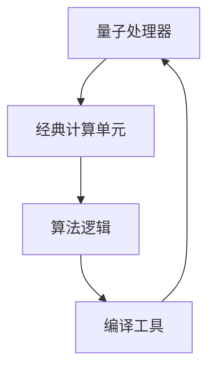
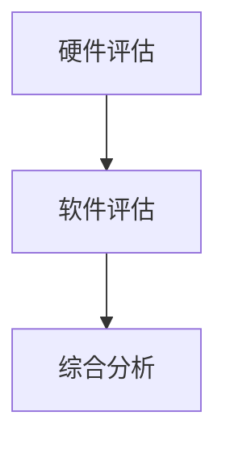
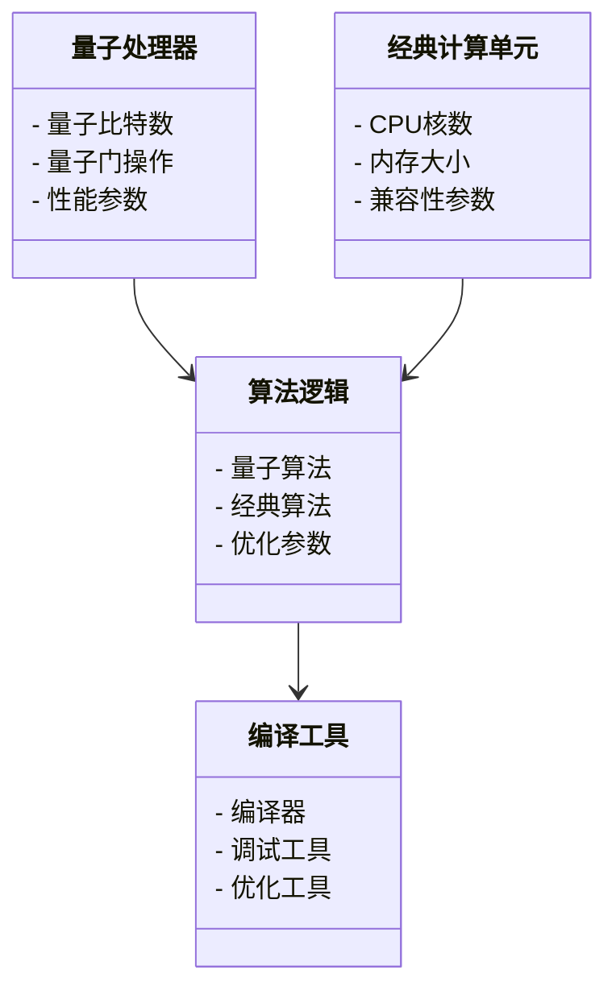
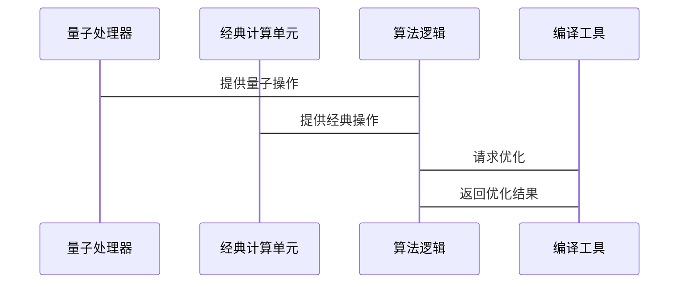

                 


# 芒格的"双轨分析"在量子-经典混合计算系统评估中的应用

---

## 关键词

- 芒格双轨分析
- 量子计算
- 经典计算
- 混合计算系统
- 系统评估

---

## 摘要

芒格的双轨分析是一种独特的决策评估方法，通过同时考虑多个因素和角度来做出更全面的判断。本文探讨了如何将这种分析方法应用于量子-经典混合计算系统的评估中。通过分析系统的硬件和软件部分，展示了双轨分析在评估混合计算系统性能、兼容性和稳定性等方面的应用价值。本文结合理论与实践，详细讲解了双轨分析的原理、算法、系统架构以及实际案例，为读者提供了一个全面而深入的视角，以理解和应用这一创新的评估方法。

---

## 第一部分：背景介绍

### 第1章：问题背景与概念解析

#### 1.1 双轨分析的起源与核心思想

芒格双轨分析法是由查理·芒格提出的，其核心思想在于通过两个独立但互补的分析轨道来评估问题。第一个轨道是基于逻辑和事实的分析，第二个轨道是基于心理和情感的分析。这种方法旨在避免单一视角的局限性，确保决策的全面性和准确性。

#### 1.2 量子-经典混合计算系统的定义与特点

量子-经典混合计算系统结合了量子计算和经典计算的优势，利用量子处理器处理特定问题，同时依赖经典计算单元进行辅助计算。这种混合模式在优化问题、密码学、药物发现等领域展现出巨大潜力。其特点包括高性能、高复杂度和高集成度。

#### 1.3 双轨分析在计算系统评估中的作用

双轨分析在量子-经典混合计算系统评估中的作用主要体现在以下方面：
- **全面性**：通过双轨分析，可以同时评估系统的性能和用户体验。
- **互补性**：硬件和软件的协同分析确保了系统的整体优化。
- **可行性**：双轨分析为混合计算系统的评估提供了新的方法论。

#### 1.4 本章小结

本章通过介绍双轨分析的起源和量子-经典混合计算系统的定义，揭示了双轨分析在系统评估中的独特价值。下一章将详细探讨双轨分析的核心原理及其在混合计算系统中的具体应用。

---

## 第二部分：核心概念与联系

### 第2章：双轨分析的核心原理

#### 2.1 双轨分析的理论基础

双轨分析的理论基础包括逻辑分析和心理分析两大方面。逻辑分析注重事实和数据，心理分析则关注决策者的认知偏差和情绪因素。这种双重分析确保了评估的全面性和客观性。

#### 2.2 双轨分析在量子计算中的应用

在量子计算中，双轨分析被用于评估量子算法的性能和可行性。通过逻辑分析，可以评估量子算法的理论复杂度；通过心理分析，则可以评估开发团队的执行力和信心。

#### 2.3 混合计算系统中的双轨分析框架

在混合计算系统中，双轨分析被分解为硬件轨道和软件轨道：
- **硬件轨道**：评估量子处理器的性能和经典计算单元的兼容性。
- **软件轨道**：评估算法的实现和编译工具的优化。

#### 2.4 双轨分析与传统分析方法的对比

| 对比维度         | 双轨分析               | 传统单轨分析         |
|------------------|------------------------|----------------------|
| 分析维度         | 硬件+软件             | 硬件或软件           |
| 评估深度         | 全面                   | 单一                 |
| 适用场景         | 混合计算系统           | 单一计算系统         |

#### 2.5 系统架构的Mermaid图



---

## 第三部分：算法原理讲解

### 第3章：双轨分析的算法实现

#### 3.1 算法流程

双轨分析的算法流程包括以下步骤：

1. **硬件评估**：评估量子处理器的性能参数和经典计算单元的兼容性。
2. **软件评估**：评估算法逻辑和编译工具的优化程度。
3. **综合分析**：结合硬件和软件的评估结果，得出系统的综合性能。

#### 3.2 算法的Mermaid流程图



#### 3.3 算法实现的Python代码

```python
def double_track_analysis(hardware_params, software_params):
    # 硬件评估
    hardware_score = sum(hardware_params)
    # 软件评估
    software_score = sum(software_params)
    # 综合分析
    total_score = hardware_score + software_score
    return total_score

# 示例用法
hardware = [8, 4, 6]
software = [7, 3, 5]
result = double_track_analysis(hardware, software)
print(f"综合得分：{result}")
```

#### 3.4 算法的数学模型

双轨分析的数学模型可以表示为：

$$
I = \sum_{i=1}^{n} w_i x_i
$$

其中，$w_i$ 是硬件参数的权重，$x_i$ 是硬件参数的值。

软件评估的数学模型为：

$$
C = \sum_{j=1}^{m} w_j y_j
$$

其中，$w_j$ 是软件参数的权重，$y_j$ 是软件参数的值。

综合得分则为：

$$
Total = I + C
$$

---

## 第四部分：系统分析与架构设计方案

### 第4章：问题场景与系统设计

#### 4.1 问题场景介绍

假设我们需要评估一个混合计算系统，该系统由量子处理器和经典计算单元组成，用于解决复杂的优化问题。

#### 4.2 系统功能设计

系统功能设计包括：
- 量子处理器的性能测试
- 经典计算单元的兼容性测试
- 算法逻辑的实现与优化
- 编译工具的开发与测试

#### 4.3 系统架构的Mermaid类图



#### 4.4 系统交互的Mermaid序列图



---

## 第五部分：项目实战

### 第5章：环境安装与系统实现

#### 5.1 环境安装

为了进行双轨分析，需要安装以下工具：

- 量子计算模拟器（如Qiskit）
- 经典计算工具（如Python和NumPy）
- 可视化工具（如Matplotlib）

安装命令示例：

```bash
pip install qiskit numpy matplotlib
```

#### 5.2 系统核心实现

以下是双轨分析的Python实现：

```python
import qiskit
import numpy as np
import matplotlib.pyplot as plt

def quantum_assessment(q_circuit):
    # 量子电路评估
    backend = qiskit.Aer.get_backend('qasm_simulator')
    result = qiskit.execute(q_circuit, backend).result()
    return result

def classical_assessment(c_params):
    # 经典参数评估
    return np.mean(c_params)

def double_track_analysis(q_circuit, c_params):
    q_score = quantum_assessment(q_circuit)
    c_score = classical_assessment(c_params)
    return q_score, c_score

# 示例用法
from qiskit import QuantumCircuit

q_circuit = QuantumCircuit(2, 2)
q_circuit.h(0)
q_circuit.cx(0, 1)
q_circuit.measure(0, 0)
q_circuit.measure(1, 1)

c_params = [0.5, 0.6, 0.7]

scores = double_track_analysis(q_circuit, c_params)
print(f"量子得分：{scores[0]}, 经典得分：{scores[1]}")
```

#### 5.3 代码应用解读

上述代码展示了如何在量子计算和经典计算之间进行双轨分析。通过量子电路评估和经典参数评估，结合两种评估结果，得出系统的综合性能。

#### 5.4 实际案例分析

以优化问题为例，我们可以使用双轨分析来评估量子算法和经典算法的结合效果。通过比较两种算法的性能，确定最佳的组合策略。

#### 5.5 项目小结

本章通过实际案例展示了双轨分析在混合计算系统中的应用，帮助读者更好地理解和实施这一方法。

---

## 第六部分：最佳实践与总结

### 第6章：最佳实践

#### 6.1 小结

双轨分析通过同时考虑硬件和软件的性能，为量子-经典混合计算系统的评估提供了新的视角。这种方法能够全面评估系统的性能，帮助决策者做出更优化的决策。

#### 6.2 注意事项

- 确保硬件和软件的兼容性
- 定期更新评估模型
- 考虑团队的执行力和信心

#### 6.3 拓展阅读

- 查理·芒格的《穷查理宝典》
- 量子计算相关的技术书籍
- 混合计算系统的最新研究

---

## 结语

芒格的双轨分析在量子-经典混合计算系统评估中的应用展示了其强大的理论和实践价值。通过系统的理论分析和实际案例的展示，本文为读者提供了一个全面而深入的视角，以理解和应用这一创新的评估方法。

---

## 作者

作者：AI天才研究院 & 禅与计算机程序设计艺术

---

感谢您的阅读！希望这篇文章能为您提供有价值的见解和启发。

