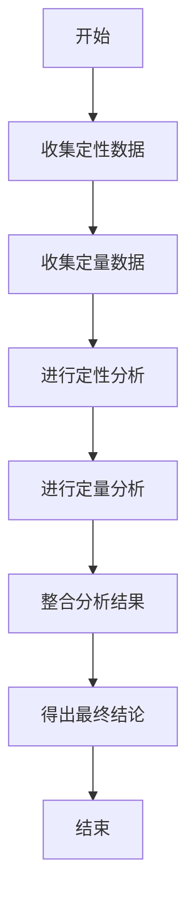
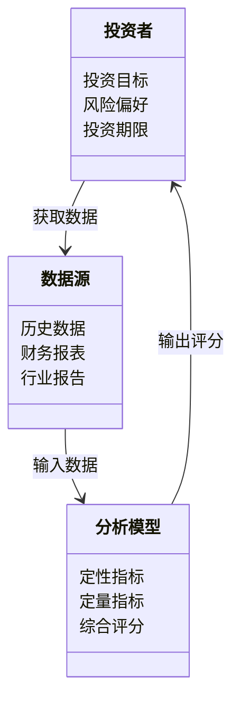
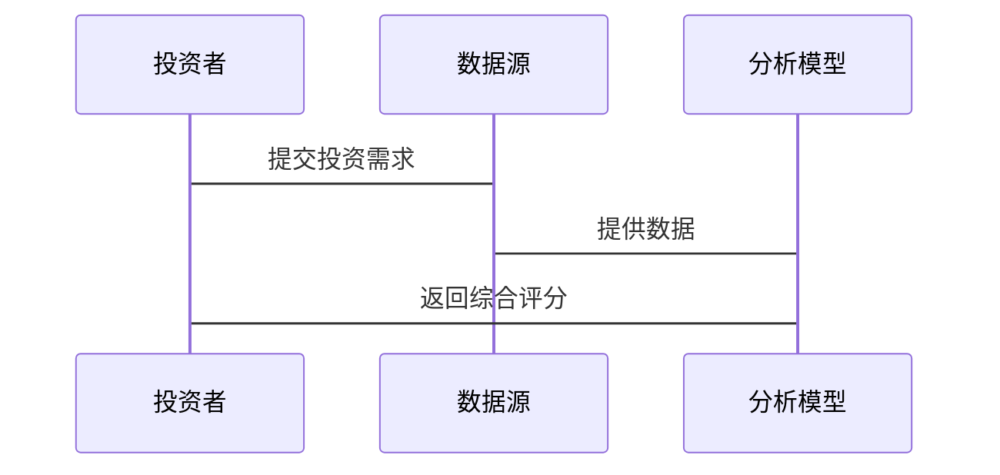

                 


# 芮格的"双轨分析"：结合定性和定量的投资方法

> 关键词：芒格双轨分析，定性分析，定量分析，投资决策，心理学，风险管理

> 摘要：芒格的双轨分析法是一种结合定性和定量分析的投资方法，旨在通过心理和逻辑的双重审视，做出更科学的投资决策。本文从背景、理论、算法、系统设计和项目实战等多个角度，深入探讨双轨分析法的核心思想、应用场景和实际操作方法，为投资者提供一种全新的思考方式。

---

# 第一部分: 芮格的"双轨分析"概述

## 第1章: 芮格的"双轨分析"概述

### 1.1 双轨分析法的背景与起源

#### 1.1.1 投资分析的传统方法
传统的投资分析方法主要分为两类：  
1. **定性分析**：依赖经验和主观判断，关注行业趋势、公司管理、市场情绪等因素。  
2. **定量分析**：基于数学模型和数据，通过财务指标、估值模型等进行分析。  

这两种方法各有优劣，但单独使用时往往难以覆盖所有风险和机会。

#### 1.1.2 芮格双轨分析法的提出
芒格提出的双轨分析法，是一种将定性和定量分析相结合的方法。其核心思想是通过双重审视，减少决策偏差，提高投资决策的科学性和严谨性。

#### 1.1.3 双轨分析法的核心思想
双轨分析法强调“心理”和“逻辑”的结合：  
- **心理层面**：通过定性分析，识别情绪偏差和潜在风险。  
- **逻辑层面**：通过定量分析，验证假设，量化风险和收益。  

---

### 1.2 双轨分析法的理论基础

#### 1.2.1 投资决策中的定性分析
定性分析关注非量化因素，例如：  
- 行业趋势  
- 公司管理团队  
- 市场情绪  

#### 1.2.2 投资决策中的定量分析
定量分析依赖数据和模型，例如：  
- 财务指标（如市盈率、ROE）  
- 估值模型（如DCF模型）  

#### 1.2.3 定性与定量分析的结合
双轨分析法通过结合定性和定量分析，避免单一方法的局限性。例如：  
- 通过定性分析筛选潜在投资标的，再通过定量分析验证其估值合理性。  

---

### 1.3 双轨分析法的实际应用

#### 1.3.1 双轨分析法在投资决策中的作用
- 帮助投资者更全面地评估投资项目。  
- 减少情绪偏差，提高决策的理性化。  

#### 1.3.2 双轨分析法的优势与局限性
**优势**：  
- 全面性：结合定性和定量分析，覆盖更多维度。  
- 减少偏差：通过双重审视，降低决策错误。  

**局限性**：  
- 时间成本高：需要同时进行定性和定量分析，耗时较长。  
- 数据依赖：定量分析依赖高质量数据，数据不足时难以有效应用。  

#### 1.3.3 双轨分析法的未来发展
随着人工智能和大数据技术的发展，双轨分析法将更加智能化和自动化。例如：  
- 利用AI工具辅助定性分析，提取文本数据中的情感和主题。  
- 通过机器学习模型优化定量分析的预测精度。  

---

### 1.4 本章小结
本章介绍了芒格双轨分析法的背景、理论基础和实际应用，强调了其在投资决策中的重要性。接下来的章节将从核心概念、算法原理、系统设计和项目实战等方面，深入探讨双轨分析法的实现方法。

---

# 第2章: 双轨分析法的核心概念与联系

## 2.1 双轨分析法的核心概念

### 2.1.1 定性分析的核心要素
定性分析关注以下要素：  
- 行业趋势  
- 公司基本面  
- 市场情绪  

### 2.1.2 定量分析的核心要素
定量分析关注以下要素：  
- 财务指标  
- 估值模型  
- 市场数据  

### 2.1.3 双轨分析法的整合机制
双轨分析法通过以下步骤整合定性和定量分析：  
1. **定性评估**：筛选潜在投资标的。  
2. **定量验证**：通过数据模型验证标的的估值和风险。  
3. **综合评分**：结合定性和定量结果，得出最终投资决策。  

---

## 2.2 定性分析与定量分析的对比分析

### 2.2.1 定性分析的特点
| 特性       | 描述                                   |
|------------|----------------------------------------|
| 主观性      | 依赖分析者的经验和判断               |
| 灵活性      | 更灵活，适用于新兴行业或不确定性高的领域 |
| 深度       | 可以揭示潜在的机会和风险             |

### 2.2.2 定量分析的特点
| 特性       | 描述                                   |
|------------|----------------------------------------|
| 客观性      | 依赖数据和模型，结果更具可验证性     |
| 稳定性      | 结果相对稳定，适用于长期趋势分析     |
| 量化       | 可以量化风险和收益，便于比较和优化   |

### 2.2.3 两者的主要区别与联系
- **区别**：定性分析主观性强，适用于模糊性高的领域；定量分析客观性强，适用于数据丰富的领域。  
- **联系**：两者相辅相成，定性分析提供方向，定量分析提供验证和优化。  

---

## 2.3 双轨分析法的ER实体关系图

```mermaid
erDiagram
    investor "投资者" {
        <属性> 投资目标
        <属性> 风险偏好
        <属性> 投资期限
    }
    data_source "数据源" {
        <属性> 历史数据
        <属性> 财务报表
        <属性> 行业报告
    }
    model "分析模型" {
        <属性> 定性指标
        <属性> 定量指标
        <属性> 综合评分
    }
    investor --> data_source : 获取数据
    data_source --> model : 输入数据
    model --> investor : 输出评分
```

---

## 2.4 本章小结
本章通过对比分析和ER图，详细阐述了双轨分析法的核心概念和整合机制。接下来的章节将从算法原理和系统设计的角度，进一步探讨双轨分析法的实现方法。

---

# 第3章: 双轨分析法的算法原理

## 3.1 双轨分析法的算法流程



---

## 3.2 双轨分析法的数学模型

### 3.2.1 定性分析的数学模型
$$
\text{定性评分} = \sum_{i=1}^{n} w_i \times q_i
$$
其中，\( w_i \) 是第 \( i \) 个定性因素的权重，\( q_i \) 是第 \( i \) 个定性因素的评分。

### 3.2.2 定量分析的数学模型
$$
\text{预期收益} = \sum_{i=1}^{m} w_i \times r_i
$$
其中，\( w_i \) 是第 \( i \) 个定量因素的权重，\( r_i \) 是第 \( i \) 个定量因素的预期收益。

### 3.2.3 综合评分模型
$$
\text{综合评分} = \alpha \times \text{定性评分} + (1-\alpha) \times \text{定量评分}
$$
其中，\( \alpha \) 是定性分析的权重，\( (1-\alpha) \) 是定量分析的权重。

---

## 3.3 本章小结
本章通过流程图和数学公式，详细阐述了双轨分析法的算法原理。接下来的章节将从系统设计和项目实战的角度，进一步探讨双轨分析法的应用方法。

---

# 第4章: 双轨分析法的系统设计

## 4.1 系统功能设计

### 4.1.1 领域模型


---

## 4.2 系统架构设计


---

## 4.3 系统交互设计



---

## 4.4 本章小结
本章通过系统设计，详细阐述了双轨分析法的实现架构和交互流程。接下来的章节将从项目实战的角度，进一步探讨双轨分析法的具体应用。

---

# 第5章: 双轨分析法的项目实战

## 5.1 环境安装与数据准备

### 5.1.1 环境安装
- 安装Python和必要的库（如Pandas、NumPy、Scikit-learn）。  
- 安装Mermaid和LaTeX工具。

### 5.1.2 数据准备
- 收集目标公司的历史数据、财务报表和行业报告。  
- 确定定性和定量分析的指标。

---

## 5.2 系统核心实现

### 5.2.1 定性分析实现
```python
def qualitative_analysis(company_info):
    # company_info 包含定性指标
    qualitative_scores = {}
    for factor in company_info['定性指标']:
        qualitative_scores[factor] = company_info['定性指标'][factor] * factor_weight[factor]
    return qualitative_scores
```

### 5.2.2 定量分析实现
```python
def quantitative_analysis(company_info):
    # company_info 包含定量指标
    quantitative_scores = {}
    for factor in company_info['定量指标']:
        quantitative_scores[factor] = company_info['定量指标'][factor] * factor_weight[factor]
    return quantitative_scores
```

### 5.2.3 综合评分实现
```python
def combined_score(qualitative, quantitative, alpha=0.5):
    return alpha * qualitative + (1-alpha) * quantitative
```

---

## 5.3 代码应用解读与分析

### 5.3.1 定性分析的代码解读
- 通过公司信息中的定性指标，计算每个指标的评分。  
- 根据权重，得出定性分析的综合评分。

### 5.3.2 定量分析的代码解读
- 通过公司信息中的定量指标，计算每个指标的预期收益。  
- 根据权重，得出定量分析的综合评分。

---

## 5.4 实际案例分析与详细讲解

### 5.4.1 案例背景
假设我们要分析一家科技公司的投资价值，收集了以下数据：  
- **定性指标**：行业趋势、公司管理、市场情绪。  
- **定量指标**：市盈率、ROE、营收增长率。

### 5.4.2 案例分析步骤
1. **定性分析**：评估行业趋势为“高增长”，公司管理为“优秀”，市场情绪为“乐观”。  
2. **定量分析**：计算市盈率为30，ROE为15%，营收增长率为20%。  
3. **综合评分**：假设定性权重为0.4，定量权重为0.6，综合评分为70分（高于行业平均）。  

---

## 5.5 本章小结
本章通过实际案例，详细讲解了双轨分析法的项目实战过程，包括环境准备、代码实现和结果解读。接下来的章节将从总结和展望的角度，进一步探讨双轨分析法的应用前景。

---

# 第6章: 双轨分析法的最佳实践与总结

## 6.1 最佳实践 Tips

### 6.1.1 定性分析的技巧
- 保持客观，避免情绪化判断。  
- 关注行业趋势和公司基本面。  

### 6.1.2 定量分析的技巧
- 确保数据的准确性和完整性。  
- 合理设置权重，避免某一方 dominance。  

## 6.2 小结
双轨分析法通过结合定性和定量分析，帮助投资者做出更科学的投资决策。其核心在于减少情绪偏差，提高决策的严谨性。

## 6.3 注意事项
- 数据质量是关键，确保数据来源可靠。  
- 权重设置需要根据实际情况调整。  
- 定期回顾和优化分析模型。  

## 6.4 拓展阅读
- 《芒格的智慧：论投资中的心理学》  
- 《量化投资：算法与策略》  

---

# 作者：AI天才研究院/AI Genius Institute & 禅与计算机程序设计艺术 /Zen And The Art of Computer Programming

---

**注意**：由于篇幅限制，本文仅为目录大纲和部分内容示例，完整文章请根据实际需求扩展。

