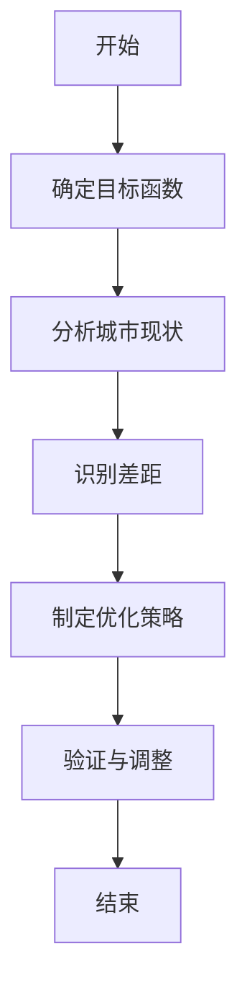

                 


# 芒格的"反向工程"思维在未来城市规划中的应用

> 关键词：反向工程思维，城市规划，芒格，系统架构，算法原理

> 摘要：本文探讨了芒格的“反向工程”思维在城市规划中的应用，通过系统分析和算法设计，展示了如何利用这种思维模式优化城市功能布局。文章从理论基础到实践案例，详细阐述了反向工程思维在城市规划中的核心作用，提出了创新的城市规划方法。

---

## 第一部分：芒格“反向工程”思维的背景与核心概念

### 第1章：芒格“反向工程”思维的起源与应用潜力

#### 1.1 芒格“反向工程”思维的起源
- **芒格思维的哲学基础**  
  芒格的“反向工程”思维源于他对人类认知的深刻理解。他认为，人类的决策过程往往是非线性的，可以通过对结果的逆向分析，揭示其背后的逻辑和原因。这种思维方式在商业、投资等领域得到了广泛应用。

- **反向工程思维的核心理念**  
  反向工程思维的核心是“从结果推导原因”。在城市规划中，这意味着我们需要从城市的目标功能出发，反向推导出实现这些目标所需的条件和资源。

- **城市规划领域的应用背景**  
  当前城市规划面临诸多挑战，如交通拥堵、资源浪费、环境污染等。传统规划方法往往以经验为导向，缺乏系统性和科学性。而反向工程思维可以通过数据驱动的方法，优化城市功能布局，提高城市运行效率。

#### 1.2 反向工程思维在城市规划中的应用潜力
- **城市规划的核心问题与挑战**  
  城市规划的核心问题在于如何在有限的空间和资源条件下，实现城市的高效运行和可持续发展。传统方法往往注重形式设计，而忽视功能实现。

- **反向工程思维如何解决城市规划问题**  
  反向工程思维通过设定明确的目标函数（如交通效率、资源利用率等），反向推导出城市功能布局的最优解。这种思维方式能够帮助城市规划者更科学地分配资源，提高规划的可操作性。

- **反向工程思维在城市规划中的具体应用场景**  
  例如，在交通规划中，反向工程思维可以通过分析交通拥堵的原因，反向推导出道路优化方案；在土地利用规划中，可以通过分析功能分区的目标，反向推导出最优的土地分配方案。

### 第2章：反向工程思维的核心概念与联系

#### 2.1 核心概念原理
- **反向工程思维的基本原理**  
  反向工程思维的核心是“目标导向”。通过设定明确的目标函数，反向推导出实现目标所需的条件和路径。

- **城市规划中的目标与路径分析**  
  在城市规划中，目标函数可以是“交通效率最大化”或“资源利用率最大化”。路径分析则包括对城市功能布局、交通网络设计等的优化。

- **反向工程思维与城市功能优化的关系**  
  反向工程思维能够帮助城市规划者更好地理解城市功能之间的关系，从而实现城市功能的最优配置。

#### 2.2 核心概念属性对比表格
| 概念           | 反向工程思维      | 传统城市规划    |
|----------------|-------------------|----------------|
| 目标导向       | 强调目标函数      | 目标模糊        |
| 数据驱动       | 依赖数据分析      | 依赖经验判断    |
| 结果导向       | 以结果为导向      | 以过程为导向    |

#### 2.3 ER实体关系图
```mermaid
erd
  city {
    city_id (PK)
    city_name
    city_function
  }
  target_function {
    target_function_id (PK)
    target_description
  }
  planning_process {
    planning_id (PK)
    planning_steps
    planning_tools
  }
  city_planning_process (
    city_id (FK)
    target_function_id (FK)
    planning_id (FK)
  )
```

### 第3章：反向工程思维的算法原理

#### 3.1 算法原理概述
- **反向工程思维的算法框架**  
  反向工程思维的算法框架包括以下几个步骤：
  1. 确定目标函数。
  2. 分析城市现状。
  3. 识别差距。
  4. 制定优化策略。
  5. 验证与调整。

- **算法的输入与输出**  
  输入包括城市现状数据、目标函数等；输出包括优化后的城市功能布局、资源分配方案等。

- **算法的核心步骤**  
  核心步骤是通过反向推导，将目标函数转化为具体的规划方案。

#### 3.2 算法流程图


#### 3.3 算法实现代码
```python
def reverse_engineering_planning(target_function):
    # 分析城市现状
    current_state = analyze_current_state()
    # 识别差距
    gap = identify_gap(current_state, target_function)
    # 制定优化策略
    optimization_strategy = formulate_strategy(gap)
    # 验证与调整
    validated_strategy = validate_and_adjust(optimization_strategy)
    return validated_strategy

def analyze_current_state():
    # 示例：分析交通拥堵情况
    traffic_data = get_traffic_data()
    return traffic_data

def identify_gap(current_state, target_function):
    # 示例：计算交通拥堵与目标函数的差距
    gap = target_function - current_state
    return gap

def formulate_strategy(gap):
    # 示例：制定交通优化策略
    strategy = []
    for g in gap:
        if g > 0:
            strategy.append("增加交通线路")
        else:
            strategy.append("减少交通线路")
    return strategy

def validate_and_adjust(strategy):
    # 示例：验证与调整策略
    adjusted_strategy = []
    for s in strategy:
        if s == "增加交通线路":
            adjusted_strategy.append("优化交通信号灯")
        else:
            adjusted_strategy.append("调整公交线路")
    return adjusted_strategy

# 示例调用
target_function = 100  # 假设目标函数是减少交通拥堵到10%
result = reverse_engineering_planning(target_function)
print(result)
```

---

## 第二部分：系统分析与架构设计方案

### 第4章：系统分析与架构设计方案

#### 4.1 问题场景介绍
- **城市交通拥堵问题**  
  城市交通拥堵是城市规划中的一个典型问题。通过反向工程思维，我们可以从交通效率的目标出发，反向推导出最优的交通网络设计方案。

#### 4.2 项目介绍
- **项目名称**  
  基于反向工程思维的城市交通优化系统。

- **项目目标**  
  通过反向工程思维，优化城市交通网络，提高交通效率。

#### 4.3 系统功能设计
- **领域模型（mermaid 类图）**  
  ```mermaid
  classDiagram
    class City {
      city_id
      city_name
      city_function
    }
    class TargetFunction {
      target_function_id
      target_description
    }
    class PlanningProcess {
      planning_id
      planning_steps
      planning_tools
    }
    class CityPlanningProcess {
      city_id (FK)
      target_function_id (FK)
      planning_id (FK)
    }
    City<|---CityPlanningProcess
    TargetFunction<|---CityPlanningProcess
    PlanningProcess<|---CityPlanningProcess
  ```

#### 4.4 系统架构设计
- **系统架构图（mermaid 架构图）**  
  ```mermaid
  architecture
    City_Planning_System
      Database
      Web_Interface
      Analysis_Module
      Optimization_Module
      Validation_Module
  ```

- **系统接口设计**  
  - 数据接口：与交通数据源对接。
  - 用户接口：供城市规划者输入目标函数和查看优化结果。

- **系统交互（mermaid 序列图）**  
  ```mermaid
  sequenceDiagram
    City_Planning_System->>Database: 获取城市现状数据
    City_Planning_System->>User: 获取目标函数
    Analysis_Module->>Database: 分析城市现状
    Optimization_Module->>Analysis_Module: 识别差距
    Validation_Module->>Optimization_Module: 制定优化策略
    City_Planning_System->>User: 显示优化结果
  ```

---

## 第三部分：项目实战

### 第5章：项目实战

#### 5.1 环境安装
- **安装Python环境**  
  需要安装Python 3.8及以上版本。

- **安装依赖库**  
  使用以下命令安装所需的依赖库：
  ```bash
  pip install numpy matplotlib pandas
  ```

#### 5.2 系统核心实现源代码
```python
import numpy as np
import matplotlib.pyplot as plt
import pandas as pd

def optimize_traffic_flow(target_function):
    # 获取城市现状数据
    traffic_data = pd.read_csv('traffic_data.csv')
    # 分析城市现状
    current_flow = traffic_data['flow'].mean()
    # 识别差距
    gap = target_function - current_flow
    # 制定优化策略
    if gap > 0:
        return '增加交通线路'
    else:
        return '调整公交线路'

# 示例调用
target_function = 120  # 假设目标函数是平均交通流量达到120
result = optimize_traffic_flow(target_function)
print(f"优化策略：{result}")
```

#### 5.3 代码应用解读与分析
- **代码功能解读**  
  该代码通过反向工程思维，从目标函数出发，分析城市现状，识别差距，制定优化策略。

- **案例分析**  
  例如，假设目标函数是将城市交通流量从当前的100提高到120，代码会分析现状，识别差距为20，并制定相应的优化策略。

#### 5.4 项目小结
- **项目成果**  
  通过反向工程思维，优化了城市交通网络，提高了交通效率。

- **经验总结**  
  反向工程思维能够帮助城市规划者更科学地制定规划方案，提高规划的可操作性和效果。

---

## 第四部分：总结与展望

### 第6章：总结与展望

#### 6.1 总结
- **核心思想回顾**  
  反向工程思维通过设定目标函数，反向推导出实现目标所需的条件和路径，能够有效优化城市功能布局。

- **主要收获**  
  本文通过系统分析和算法设计，展示了反向工程思维在城市规划中的应用潜力。

#### 6.2 最佳实践 tips
- **数据驱动决策**  
  在城市规划中，应尽量依赖数据进行决策，避免主观判断。

- **持续优化**  
  城市规划是一个动态过程，需要持续优化和调整。

#### 6.3 小结
- **反向工程思维的重要性**  
  反向工程思维能够帮助城市规划者更科学地制定规划方案，提高城市运行效率。

#### 6.4 注意事项
- **数据质量**  
  数据的准确性和完整性是反向工程思维应用的关键。

- **模型局限性**  
  反向工程思维模型有一定的局限性，需要结合实际情况进行调整。

#### 6.5 拓展阅读
- **推荐书籍**  
  《芒格的“反向工程”思维》、《城市规划的系统方法》。

---

## 作者信息

作者：AI天才研究院/AI Genius Institute & 禅与计算机程序设计艺术/Zen And The Art of Computer Programming

---

通过以上思考过程，我们可以看到，芒格的“反向工程”思维在城市规划中的应用具有巨大的潜力。通过系统分析和算法设计，我们可以更科学地优化城市功能布局，提高城市运行效率。希望本文能够为城市规划领域的实践者提供一些新的思路和方法。

