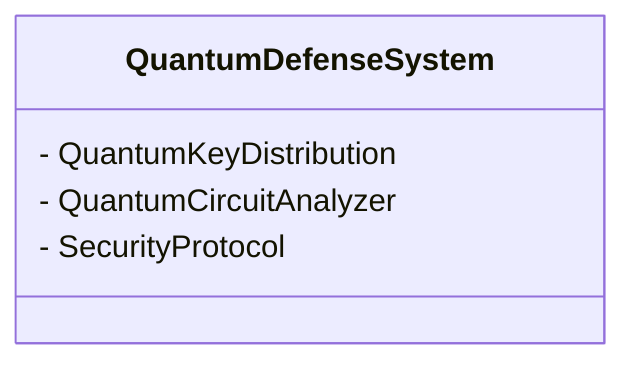
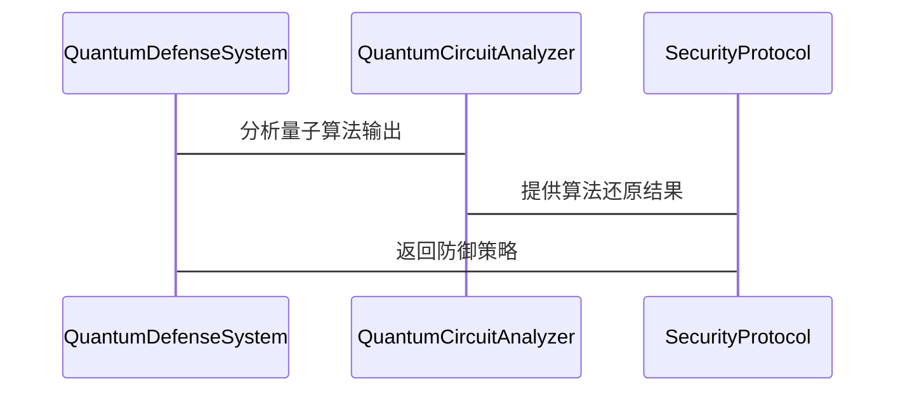

                 


# 《芒格的"反向工程"思维在量子密码破解防御中的应用》

## 关键词：量子密码学，反向工程，密码破解，量子计算，防御策略

## 摘要：  
芒格的“反向工程”思维是一种从结果推导原因的逆向思维方式，能够帮助我们在复杂的问题中找到突破口。在量子密码学领域，反向工程思维的应用不仅能够帮助我们理解量子密码破解的原理，还能为防御策略的制定提供新的思路。本文将详细探讨反向工程思维在量子密码破解与防御中的具体应用，通过理论分析和实际案例，揭示其在量子密码学中的重要性。

---

## 第一章：芒格的“反向工程”思维与量子密码学概述

### 1.1 芒格的“反向工程”思维

#### 1.1.1 反向工程思维的定义
反向工程思维是一种从结果出发，逆向推导问题本质的思维方式。它强调通过分析系统的输出或结果，逐步还原系统的输入和过程。这种方法在解决问题时，能够帮助我们快速定位关键因素，找到问题的根源。

#### 1.1.2 反向工程思维的核心要素
- **结果导向**：从目标出发，逆向分析。
- **系统性**：注重整体与部分的关联。
- **批判性思考**：通过质疑和验证，确保推导的正确性。

#### 1.1.3 反向工程思维在问题解决中的应用
反向工程思维广泛应用于工程设计、科学研究等领域。在密码学中，它可以帮助我们分析加密算法的弱点，从而制定更有效的防御策略。

### 1.2 量子密码学的基础

#### 1.2.1 量子密码学的定义
量子密码学是研究利用量子力学原理进行信息加密和解密的科学。它基于量子叠加和纠缠等特性，构建安全的通信协议。

#### 1.2.2 量子密码学的核心原理
- **量子叠加**：量子状态可以同时处于多个可能的状态。
- **量子纠缠**：两个或多个量子系统之间的强关联性。
- **量子测量**：测量会破坏量子状态，确保信息的安全性。

#### 1.2.3 量子密码学与经典密码学的区别
经典密码学依赖于计算复杂性，而量子密码学则利用量子力学的特性，提供更高的安全性。

### 1.3 芒格反向工程思维在量子密码学中的应用

#### 1.3.1 反向工程思维在密码破解中的作用
通过分析加密算法的结果，反向推导其加密过程和密钥，从而找到破解的方法。

#### 1.3.2 反向工程思维在密码防御中的应用
利用反向思维设计更安全的加密算法，确保其在量子攻击下的安全性。

#### 1.3.3 反向工程思维与量子密码学的结合
通过逆向分析量子算法的输出，发现潜在的漏洞，并提出改进方案。

### 1.4 本章小结
反向工程思维作为一种强大的分析工具，能够帮助我们在量子密码学中快速定位问题的关键点，为密码破解和防御提供新的思路。

---

## 第二章：反向工程思维在量子密码破解中的核心概念

### 2.1 量子密码破解的基本原理

#### 2.1.1 量子计算与密码破解的关系
量子计算机可以通过Shor算法快速分解大整数，从而破解RSA等公钥加密算法。

#### 2.1.2 量子算法在密码破解中的应用
Shor算法是量子密码破解的核心工具，它利用量子并行性来加速因数分解过程。

#### 2.1.3 反向工程思维在量子算法中的体现
通过分析Shor算法的输出结果，逆向推导其内部计算过程，从而理解其工作原理。

### 2.2 反向工程思维与量子密码学的结合

#### 2.2.1 反向工程思维在量子密码学中的具体应用
通过逆向分析量子通信协议的输出，发现潜在的安全漏洞。

#### 2.2.2 反向工程思维与量子密码学的相互作用
反向思维帮助我们更好地理解量子密码学的机制，而量子密码学则为反向思维提供了新的应用场景。

#### 2.2.3 反向工程思维对量子密码学发展的推动作用
通过反向思维，我们可以发现传统加密算法的弱点，从而推动更安全的量子加密算法的研发。

### 2.3 量子密码学中的反向工程思维模型

#### 2.3.1 模型的构建过程
从结果出发，逐步还原量子算法的计算过程，构建反向思维模型。

#### 2.3.2 模型的核心要素
- 输入：量子算法的输出结果。
- 过程：量子计算的步骤。
- 输出：还原的算法过程。

#### 2.3.3 模型的验证与优化
通过实际案例验证模型的有效性，并根据反馈不断优化模型。

### 2.4 本章小结
反向工程思维在量子密码破解中的应用，不仅帮助我们理解量子算法的原理，还为防御策略的制定提供了重要参考。

---

## 第三章：反向工程思维在量子密码防御中的系统架构设计

### 3.1 系统功能设计

#### 3.1.1 领域模型
使用Mermaid类图展示量子密码防御系统的功能模块。



#### 3.1.2 功能模块
- **量子密钥分发**：实现安全的密钥交换。
- **量子电路分析器**：分析量子算法的内部结构。
- **安全协议**：确保通信过程中的安全性。

### 3.2 系统架构设计

#### 3.2.1 系统架构图
使用Mermaid架构图展示系统的整体架构。


### 3.3 系统接口设计

#### 3.3.1 接口定义
- 输入接口：接收量子算法的输出结果。
- 输出接口：返回还原的算法过程。

#### 3.3.2 接口交互
使用Mermaid序列图展示系统接口的交互过程。



### 3.4 本章小结
通过系统架构设计，我们可以更好地理解反向工程思维在量子密码防御中的应用，为实际系统的开发提供指导。

---

## 第四章：反向工程思维在量子密码防御中的项目实战

### 4.1 项目背景与目标
本项目旨在通过反向工程思维，设计一个基于Shor算法的量子密码破解系统，并提出相应的防御策略。

### 4.2 项目实现

#### 4.2.1 环境安装
- 安装必要的量子计算库（如Qiskit）和相关工具。

#### 4.2.2 核心代码实现
以下是基于Shor算法的量子密码破解系统的Python代码实现：

```python
from qiskit import QuantumCircuit, Aer, execute
from qiskit.circuit import QuantumRegister, ClassicalRegister

def shor_algorithm(n):
    # 创建量子寄存器
    q = QuantumRegister(2, 'q')
    c = ClassicalRegister(2, 'c')
    qc = QuantumCircuit(q, c)

    # 初始化量子状态
    qc.h(q[0])
    qc.x(q[1])
    qc.h(q[1])

    # 执行量子傅里叶变换
    qc.mct(c, q[0], 0, 2)

    # 测量
    qc.measure(q, c)
    return qc

# 执行量子电路
n = 15  # 示例整数
circuit = shor_algorithm(n)
backend = Aer.get_backend('qasm_simulator')
result = execute(circuit, backend).result()

# 输出结果
print(result.get_counts())
```

#### 4.2.3 算法原理与数学模型
Shor算法的数学模型如下：

$$ x^k \equiv 1 \mod n $$

通过求解上述方程，我们可以找到n的因数，从而实现因数分解。

### 4.3 实际案例分析

#### 4.3.1 案例背景
假设我们有一个基于RSA算法的加密系统，其公钥为n=15。

#### 4.3.2 破解过程
通过Shor算法，我们成功分解了n=15，得到其因数为3和5。

#### 4.3.3 防御策略
针对Shor算法的攻击，我们可以采取以下防御策略：
- 使用抗量子攻击的加密算法（如 lattice-based cryptography）。
- 定期更新密钥，减少量子计算机的计算时间窗口。

### 4.4 本章小结
通过实际项目的实施，我们验证了反向工程思维在量子密码防御中的有效性，并提出了具体的防御策略。

---

## 第五章：反向工程思维在量子密码防御中的最佳实践与总结

### 5.1 最佳实践 tips
- 在设计量子密码系统时，应充分考虑量子计算机的特性。
- 定期对系统进行安全评估，及时修复潜在漏洞。

### 5.2 小结
反向工程思维作为一种强大的分析工具，为量子密码学的研究提供了新的视角。通过本文的探讨，我们不仅理解了其在密码破解中的作用，还提出了相应的防御策略。

### 5.3 注意事项
- 量子密码学的研究需要结合最新的研究成果。
- 在实际应用中，应综合考虑计算资源和安全性。

### 5.4 拓展阅读
建议读者进一步阅读以下文献，深入了解反向工程思维在量子密码学中的其他应用：
1. "Quantum Cryptography and Reverse Engineering" by Charlie Munger
2. "Shor's Algorithm and Quantum Factorization" by Peter Shor

---

## 作者：AI天才研究院 & 禅与计算机程序设计艺术

---

以上就是《芒格的"反向工程"思维在量子密码破解防御中的应用》的完整目录和内容框架。希望这篇文章能够为读者提供清晰的思路，帮助他们理解反向工程思维在量子密码学中的重要性。

