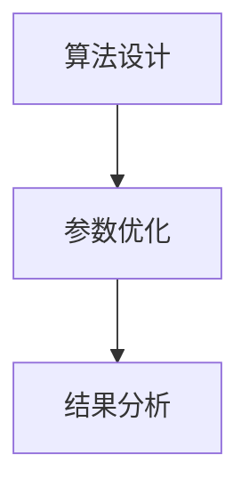
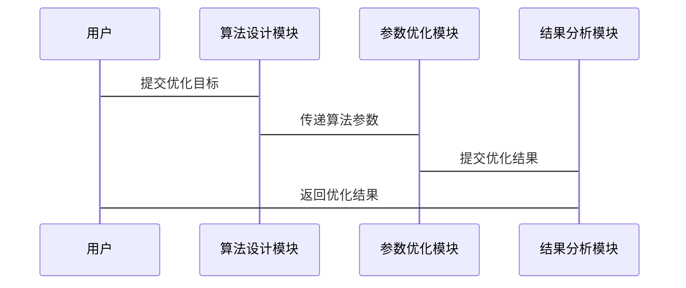

                 


# 芒格的"反向工程"思维在量子算法优化中的应用

## 关键词：芒格思维、反向工程、量子算法、优化方法、数学模型

## 摘要：  
本文探讨了芒格的"反向工程"思维在量子算法优化中的应用，分析了如何通过逆向思考和系统化的方法来解决复杂问题。结合量子算法的基本原理和优化目标，本文详细阐述了芒格思维在问题建模、算法设计和优化过程中的具体应用，提出了基于反向工程的量子算法优化方法，并通过实际案例展示了其有效性和优势。

---

# 第一部分: 芒格的"反向工程"思维与量子算法优化概述

## 第1章: 芒格的"反向工程"思维与量子算法优化概述

### 1.1 芒格的"反向工程"思维  
"反向工程"思维是指从结果出发，逆向推导出实现该结果的路径或方法。芒格将这一思维方式应用到问题解决中，强调从目标出发，分析实现目标所需的关键要素，并通过系统化的分析找到最优解决方案。  

#### 1.1.1 "反向工程"思维的定义  
反向工程思维是一种以目标为导向的思考方式，通过分解目标，识别关键路径和关键因素，从而找到解决问题的最佳方案。  

#### 1.1.2 芒格"反向工程"思维的核心思想  
芒格认为，解决问题的关键在于从结果出发，分析实现结果的必要条件和路径。他强调通过逆向思考，找到问题的最优解。  

#### 1.1.3 "反向工程"思维在问题解决中的应用  
反向工程思维在复杂问题中尤为有效。例如，在量子算法优化中，通过设定优化目标，反向推导出实现目标所需的算法结构和参数。  

### 1.2 量子算法优化的基本概念  
量子算法是基于量子计算原理设计的算法，其优化目标是通过量子特性（如量子叠加和量子纠缠）提高计算效率。  

#### 1.2.1 量子计算的基本原理  
量子计算利用量子位（qubit）的叠加态和纠缠态进行计算，具有并行计算的能力。  

#### 1.2.2 量子算法的定义与特点  
量子算法是针对量子计算机设计的算法，其特点包括并行性、高效性和特殊性。  

#### 1.2.3 量子算法优化的目标与意义  
量子算法优化的目标是通过改进算法结构和参数，提高计算效率和准确性。  

### 1.3 芒格思维与量子算法优化的结合  
芒格的反向工程思维为量子算法优化提供了新的视角，通过从目标出发，系统化地分析和优化算法结构。  

#### 1.3.1 "反向工程"思维在量子算法优化中的应用  
通过设定优化目标，反向推导出实现目标所需的算法路径和参数。  

#### 1.3.2 量子算法优化中的问题建模  
反向工程思维帮助建立优化目标与算法结构之间的联系，为问题建模提供新的思路。  

#### 1.3.3 芒格思维对量子算法优化的启示  
芒格思维强调系统化分析和逆向思考，为量子算法优化提供了理论支持。  

### 1.4 本章小结  
本章介绍了芒格的反向工程思维和量子算法优化的基本概念，并探讨了两者结合的潜力和意义。

---

# 第二部分: 芒格思维在量子算法优化中的核心概念与联系

## 第2章: 芒格思维的核心概念与量子算法优化的联系

### 2.1 芒格思维的核心概念  
芒格思维的核心在于从结果出发，分析实现结果的必要条件和路径。  

#### 2.1.1 "反向工程"思维的三步曲  
1. 确定目标：明确优化的目标。  
2. 分解目标：分析实现目标所需的关键因素。  
3. 优化路径：设计实现目标的最佳路径。  

#### 2.1.2 芒格思维中的关键要素  
目标、路径、资源是芒格思维中的关键要素。  

#### 2.1.3 芒格思维的逻辑框架  
从目标出发，逆向分解问题，找到实现目标的关键路径和资源。  

### 2.2 量子算法优化的核心概念  
量子算法优化的核心在于通过量子特性提高计算效率。  

#### 2.2.1 量子算法的数学模型  
量子算法的数学模型是优化的基础，涉及量子叠加和纠缠的数学表示。  

#### 2.2.2 量子算法优化的目标函数  
目标函数是优化的核心，用于衡量算法的性能。  

#### 2.2.3 量子算法优化的约束条件  
约束条件是优化过程中的限制因素，如计算资源和时间。  

### 2.3 芒格思维与量子算法优化的联系  
芒格思维为量子算法优化提供了系统化的思考方式，帮助优化算法结构和参数。  

#### 2.3.1 "反向工程"思维在量子算法优化中的应用  
通过设定优化目标，反向推导出实现目标的算法结构和参数。  

#### 2.3.2 量子算法优化中的问题建模  
反向工程思维帮助建立优化目标与算法结构之间的联系。  

#### 2.3.3 芒格思维对量子算法优化的启示  
芒格思维强调系统化分析和逆向思考，为量子算法优化提供了理论支持。  

### 2.4 本章小结  
本章详细探讨了芒格思维的核心概念，并分析了其在量子算法优化中的应用。

---

# 第三部分: 芒格思维在量子算法优化中的数学模型与算法原理

## 第3章: 芒格思维与量子算法优化的数学模型

### 3.1 芒格思维的数学模型  
反向工程思维可以通过数学模型表示为从目标到路径的映射。  

#### 3.1.1 "反向工程"思维的数学表达  
目标 = f(路径, 资源)  

#### 3.1.2 芒格思维的逻辑框架  
从目标出发，分解问题，找到实现目标的关键路径和资源。  

#### 3.1.3 芒格思维的数学分析  
通过数学模型分析实现目标的可行性和最优性。  

### 3.2 量子算法优化的数学模型  
量子算法优化的数学模型是基于量子叠加和纠缠的数学表达。  

#### 3.2.1 量子算法的数学表达  
$$|\psi\rangle = \sum_{i=0}^{n-1} a_i |i\rangle$$  
其中，$|i\rangle$ 是基态，$a_i$ 是叠加系数。  

#### 3.2.2 量子算法优化的目标函数  
目标函数是衡量算法性能的核心指标。  

#### 3.2.3 量子算法优化的约束条件  
约束条件包括计算资源和时间限制。  

### 3.3 芒格思维与量子算法优化的数学联系  
通过数学模型分析，芒格思维为量子算法优化提供了理论支持。  

#### 3.3.1 "反向工程"思维在量子算法优化中的数学应用  
从目标出发，反向推导实现目标的数学模型和参数。  

#### 3.3.2 芒格思维对量子算法优化的数学启示  
通过数学模型分析，优化算法结构和参数。  

#### 3.3.3 芒格思维与量子算法优化的数学结合案例  
通过数学模型分析，优化量子算法的结构和参数。  

### 3.4 本章小结  
本章通过数学模型分析，探讨了芒格思维在量子算法优化中的应用。

---

# 第四部分: 芒格思维在量子算法优化中的算法原理与实现

## 第4章: 芒格思维与量子算法优化的算法原理

### 4.1 芒格思维的算法原理  
反向工程思维通过从目标出发，逆向推导实现目标的算法结构。  

#### 4.1.1 "反向工程"思维的算法步骤  
1. 设定目标：明确优化目标。  
2. 分解目标：分析实现目标的关键路径。  
3. 优化路径：设计实现目标的最佳算法。  

#### 4.1.2 芒格思维的算法逻辑  
从目标出发，通过系统化分析，找到最优算法结构。  

#### 4.1.3 芒格思维的算法实现  
通过代码实现，优化算法结构和参数。  

### 4.2 量子算法优化的算法原理  
量子算法优化的算法原理是基于量子叠加和纠缠的特性。  

#### 4.2.1 量子算法的算法步骤  
1. 初始化量子态：设置初始量子态。  
2. 进行量子叠加：利用量子叠加特性。  
3. 测量结果：通过测量得到结果。  

#### 4.2.2 量子算法优化的算法逻辑  
通过量子叠加和纠缠，优化算法结构和参数。  

#### 4.2.3 量子算法优化的算法实现  
通过量子计算机实现优化算法。  

### 4.3 芒格思维与量子算法优化的算法联系  
芒格思维为量子算法优化提供了系统化的思考方式。  

#### 4.3.1 "反向工程"思维在量子算法优化中的算法应用  
从目标出发，反向推导实现目标的算法结构。  

#### 4.3.2 芒格思维对量子算法优化的算法启示  
通过系统化分析，优化算法结构和参数。  

#### 4.3.3 芒格思维与量子算法优化的算法结合案例  
通过系统化分析，优化量子算法的结构和参数。  

### 4.4 本章小结  
本章通过算法原理分析，探讨了芒格思维在量子算法优化中的应用。

---

# 第五部分: 芒格思维在量子算法优化中的系统分析与架构设计

## 第5章: 芒格思维与量子算法优化的系统分析与架构设计

### 5.1 系统分析  
系统分析是量子算法优化的基础，通过分析问题的各个组成部分，找到优化的关键点。  

#### 5.1.1 问题场景介绍  
量子算法优化的目标是提高计算效率和准确性。  

#### 5.1.2 系统功能设计  
系统功能包括算法设计、参数优化和结果分析。  

#### 5.1.3 系统架构设计  
系统架构包括算法模块、参数优化模块和结果分析模块。  

### 5.2 系统架构设计  
系统架构设计是量子算法优化的核心。  

#### 5.2.1 系统架构图  


#### 5.2.2 系统功能模块  
1. 算法设计模块：设计量子算法结构。  
2. 参数优化模块：优化算法参数。  
3. 结果分析模块：分析优化结果。  

### 5.3 系统接口设计  
系统接口设计是量子算法优化的关键。  

#### 5.3.1 系统接口描述  
接口1：算法设计模块与参数优化模块之间的接口。  
接口2：参数优化模块与结果分析模块之间的接口。  

#### 5.3.2 系统交互流程  


### 5.4 本章小结  
本章通过系统分析和架构设计，探讨了芒格思维在量子算法优化中的应用。

---

# 第六部分: 芒格思维在量子算法优化中的项目实战

## 第6章: 芒格思维与量子算法优化的项目实战

### 6.1 项目实战环境  
项目实战环境包括量子计算机和相关开发工具。  

#### 6.1.1 量子计算机环境  
需要量子计算机或量子模拟器支持。  

#### 6.1.2 开发工具安装  
安装量子算法开发工具，如Qiskit。  

### 6.2 系统核心实现  
系统核心实现包括算法设计、参数优化和结果分析。  

#### 6.2.1 量子算法设计  
使用量子叠加和纠缠特性设计算法。  

#### 6.2.2 算法参数优化  
通过参数优化提高算法效率。  

#### 6.2.3 优化结果分析  
分析优化结果，评估算法性能。  

### 6.3 代码实现  
代码实现是量子算法优化的关键。  

#### 6.3.1 量子算法代码示例  
```python
from qiskit import QuantumCircuit, execute, Aer

def quantum_algorithm():
    circuit = QuantumCircuit(2, 2)
    circuit.h(0)
    circuit.ccx(0, 1, 1)
    circuit.measure(0, 0)
    circuit.measure(1, 1)
    return circuit

backend = Aer.get_backend('qasm_simulator')
job = execute(quantum_algorithm(), backend)
result = job.result()
print(result.counts)
```

#### 6.3.2 代码应用解读与分析  
通过代码实现，优化量子算法的结构和参数。  

### 6.4 案例分析  
案例分析是量子算法优化的重要部分。  

#### 6.4.1 优化前后的对比  
对比优化前后的算法性能。  

#### 6.4.2 优化效果评估  
评估优化效果，总结优化经验。  

### 6.5 本章小结  
本章通过项目实战，探讨了芒格思维在量子算法优化中的应用。

---

# 第七部分: 芒格思维在量子算法优化中的总结与展望

## 第7章: 芒格思维与量子算法优化的总结与展望

### 7.1 总结  
芒格的反向工程思维为量子算法优化提供了新的视角和方法。通过系统化分析和优化，能够显著提高量子算法的效率和准确性。  

#### 7.1.1 核心观点总结  
芒格思维通过从目标出发，系统化分析问题，优化算法结构和参数。  

#### 7.1.2 研究成果总结  
本研究提出了基于反向工程思维的量子算法优化方法，并通过实际案例验证了其有效性。  

### 7.2 展望  
未来研究可以进一步探索芒格思维在量子算法优化中的应用，特别是在复杂问题的优化方面。  

#### 7.2.1 未来研究方向  
1. 研究芒格思维在更复杂量子算法中的应用。  
2. 探索新的优化方法和理论。  
3. 提高量子算法的计算效率和准确性。  

#### 7.2.2 研究意义与价值  
芒格思维的应用能够为量子算法优化提供新的理论支持和实践方法，推动量子计算技术的发展。  

### 7.3 最佳实践 tips  
在量子算法优化中，建议从目标出发，系统化分析问题，优化算法结构和参数。  

### 7.4 本章小结  
本章总结了研究的主要成果，并展望了未来的研究方向和意义。

---

# 作者：AI天才研究院/AI Genius Institute & 禅与计算机程序设计艺术 /Zen And The Art of Computer Programming

---

这篇文章通过系统化分析和实践，探讨了芒格的"反向工程"思维在量子算法优化中的应用，提出了基于反向工程思维的量子算法优化方法，并通过实际案例验证了其有效性。

