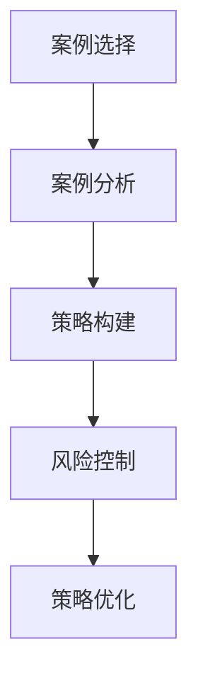
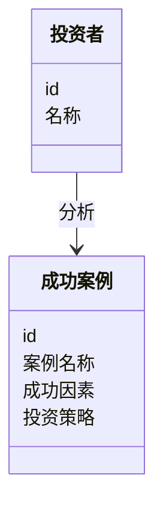
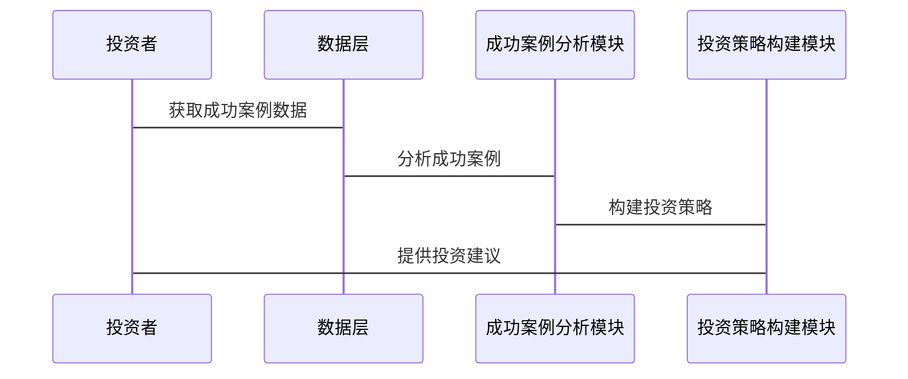

                 


# 芒格的"反向工程"思维：从成功案例中学习投资

> 关键词：反向工程思维，芒格投资理念，成功案例分析，投资决策模型，价值投资

> 摘要：芒格的反向工程思维是一种通过分析成功案例来学习投资的方法，它不同于传统的从失败案例中学习的正向思维。本文将从反向工程思维的背景、核心概念、算法原理、系统架构、项目实战、总结等多方面进行详细探讨，深入剖析其在投资领域的应用。

---

## 第一部分: 芒格的"反向工程"思维概述

### 第1章: 反向工程思维的起源与核心理念

#### 1.1 芒格投资理念的背景介绍

##### 1.1.1 投资领域的传统思维模式
传统的投资思维模式通常基于市场趋势、技术分析和基本面分析，强调预测未来的变化。这种正向思维模式虽然在一定程度上有效，但其核心在于预测未来，而未来的不确定性往往使得这种思维难以保证长期的稳定性。

##### 1.1.2 芒格反向工程思维的提出
芒格的反向工程思维是一种逆向思维方式，它不是从预测未来入手，而是从分析成功案例中提取经验和规律，从而指导当前的投资决策。这种方法的核心在于通过对成功的理解和模仿，构建一套可执行的投资策略。

##### 1.1.3 反向工程思维的核心概念
反向工程思维的核心概念包括：
1. **成功案例分析**：通过对成功案例的深入研究，识别成功的关键因素。
2. **投资策略构建**：基于成功案例的分析，构建可复制的投资策略。
3. **风险管理**：通过反向工程思维，降低投资风险，提高投资成功率。

#### 1.2 芒格投资理念的哲学基础

##### 1.2.1 哈撒韦公司的成功案例
哈撒韦公司是芒格反向工程思维的成功案例之一。该公司通过长期关注企业的内在价值，选择那些具有持续竞争优势和良好管理团队的企业进行投资，从而实现了长期稳定的收益。

##### 1.2.2 芒格的价值投资理念
芒格的价值投资理念强调购买那些具有安全边际和长期竞争优势的企业，而非仅仅关注市场的短期波动。这种理念的核心在于通过深入分析企业的基本面，找到那些被市场低估的投资机会。

##### 1.2.3 反向工程思维在投资中的应用
反向工程思维在投资中的应用主要体现在以下几个方面：
1. **识别成功模式**：通过分析成功投资者的决策过程，提炼出可复制的投资策略。
2. **避免常见错误**：通过研究失败案例，避免重复同样的错误。
3. **优化投资组合**：通过对成功案例的分析，优化投资组合的结构和配置。

### 第2章: 反向工程思维的核心概念与联系

#### 2.1 反向工程思维的定义与特点

##### 2.1.1 反向工程思维的定义
反向工程思维是一种通过分析成功案例的内在逻辑和成功要素，从而指导当前和未来的投资决策的方法。这种方法强调从成功中学习，而非仅仅依赖于市场预测。

##### 2.1.2 反向工程思维的特点
反向工程思维具有以下特点：
1. **逆向思维**：通过分析成功案例，发现潜在的投资机会。
2. **注重基本面**：强调对企业基本面的深入分析，而非市场情绪的驱动。
3. **长期视角**：关注企业的长期竞争优势和可持续发展能力。

##### 2.1.3 反向工程思维与其他投资方法的区别
反向工程思维与其他投资方法的主要区别在于其注重从成功案例中提取经验，而非预测市场未来的变化。以下是反向工程思维与其他投资方法的对比：

| 对比维度 | 反向工程思维 | 传统价值投资 | 技术分析 |
|----------|--------------|--------------|----------|
| 核心理念 | 从成功案例中学习 | 从企业基本面分析 | 从市场技术分析 |
| 分析对象 | 成功案例的内在逻辑 | 企业的财务数据 | 市场价格和成交量 |
| 投资策略 | 识别成功模式并复制 | 寻找被低估的企业 | 基于技术指标的买卖信号 |

#### 2.2 反向工程思维的核心要素对比

##### 2.2.1 成功案例分析与失败案例分析的对比
反向工程思维强调从成功案例中学习，而传统的正向思维则更多地从失败案例中总结教训。以下是两者的对比：

| 对比维度 | 成功案例分析 | 失败案例分析 |
|----------|---------------|---------------|
| 分析目标 | 寻找成功模式 | 寻找失败原因 |
| 分析重点 | 成功的关键因素 | 失败的教训 |
| 应用场景 | 寻找投资机会 | 避免重复错误 |

#### 2.2.2 投资决策的关键因素对比
反向工程思维在投资决策中关注的因素与传统投资方法有所不同。以下是关键因素的对比：

| 对比维度 | 反向工程思维 | 传统投资方法 |
|----------|---------------|---------------|
| 关注点 | 成功案例的内在逻辑 | 市场趋势和价格 |
| 分析重点 | 企业的长期竞争优势 | 短期市场波动 |
| 投资策略 | 识别可复制的成功模式 | 基于市场预测的投资 |

#### 2.2.3 反向工程思维的优缺点对比
反向工程思维的优点在于其能够通过分析成功案例，找到可复制的投资策略，从而提高投资的成功率。其缺点在于，这种方法过于依赖成功案例的分析，可能忽视市场环境的变化和不可预测性。

| 对比维度 | 优点 | 缺点 |
|----------|-------|-------|
| 分析深度 | 深入分析成功案例的内在逻辑 | 可能忽视市场环境的变化 |
| 投资策略 | 可复制的成功模式 | 可能过于依赖历史案例 |
| 风险控制 | 通过成功案例分析降低风险 | 无法完全避免市场波动的影响 |

#### 2.3 反向工程思维的ER实体关系图
以下是反向工程思维的ER实体关系图，展示了其核心概念之间的关系：

```mermaid
erDiagram
    actor 投资者 {
        <string> id
        <string> 名称
    }
    success_case 成功案例 {
        <string> id
        <string> 案例名称
        <int> 成功因素
        <int> 投资策略
    }
    投资者 --> 成功案例 : 分析
```

---

## 第三部分: 反向工程思维的算法原理

### 第3章: 反向工程思维的算法原理

#### 3.1 反向工程思维的算法流程

##### 3.1.1 算法流程的定义
反向工程思维的算法流程是一种通过分析成功案例的内在逻辑，构建可复制的投资策略的方法。以下是算法流程的详细步骤：

1. **案例选择**：选择具有代表性的成功案例。
2. **案例分析**：深入分析成功案例的内在逻辑，识别成功的关键因素。
3. **策略构建**：基于成功因素，构建可复制的投资策略。
4. **风险控制**：通过分析成功案例的风险因素，制定相应的风险管理策略。
5. **策略优化**：根据市场环境的变化，优化投资策略。

##### 3.1.2 算法流程的步骤
以下是反向工程思维的算法流程图：



##### 3.1.3 算法流程的优化
为了提高算法流程的效率，可以采用以下优化措施：
1. **自动化分析工具**：利用数据分析工具，提高案例分析的效率。
2. **动态调整策略**：根据市场环境的变化，动态调整投资策略。
3. **团队协作**：通过团队协作，提高案例分析的深度和广度。

#### 3.2 反向工程思维的数学模型

##### 3.2.1 数学模型的构建
以下是反向工程思维的数学模型，用于评估企业的内在价值：

$$
\text{内在价值} = \sum_{t=1}^{n} \frac{\text{未来现金流}}{(1 + r)^t}
$$

其中，\( r \) 是折现率，\( t \) 是时间跨度，\( n \) 是现金流的时间范围。

##### 3.2.2 数学模型的分析
通过对内在价值的计算，可以评估企业的长期竞争优势和投资价值。以下是模型的分析步骤：
1. **预测未来现金流**：基于企业的财务数据和市场环境，预测未来现金流。
2. **确定折现率**：根据市场利率和企业风险，确定折现率。
3. **计算内在价值**：通过公式计算企业的内在价值。
4. **评估投资价值**：将计算出的内在价值与市场价格进行比较，判断投资价值。

##### 3.2.3 数学模型的应用
以下是一个简单的Python代码示例，用于计算企业的内在价值：

```python
def calculate_intrinsic_value(future_cash_flows, discount_rate):
    intrinsic_value = 0
    for t in range(len(future_cash_flows)):
        cash_flow = future_cash_flows[t]
        discount_factor = (1 + discount_rate) ** t
        intrinsic_value += cash_flow / discount_factor
    return intrinsic_value

# 示例数据
future_cash_flows = [100, 200, 300]  # 单位：万元
discount_rate = 0.10

# 计算内在价值
intrinsic_value = calculate_intrinsic_value(future_cash_flows, discount_rate)
print(f"内在价值：{intrinsic_value:.2f} 万元")
```

---

## 第四部分: 反向工程思维的系统分析与架构设计

### 第4章: 反向工程思维的系统架构设计

#### 4.1 问题场景介绍
反向工程思维的系统架构设计需要解决以下几个问题：
1. **如何选择成功案例**：基于企业的财务数据和市场表现，选择具有代表性的成功案例。
2. **如何分析成功案例**：通过深入分析成功案例的内在逻辑，识别成功的关键因素。
3. **如何构建投资策略**：基于成功因素，构建可复制的投资策略。
4. **如何进行风险控制**：通过分析成功案例的风险因素，制定相应的风险管理策略。

#### 4.2 系统功能设计

##### 4.2.1 领域模型
以下是反向工程思维的领域模型：



##### 4.2.2 系统架构
以下是反向工程思维的系统架构设计：


#### 4.3 系统交互设计

##### 4.3.1 系统交互流程
以下是反向工程思维的系统交互流程图：



---

## 第五部分: 反向工程思维的项目实战

### 第5章: 项目实战

#### 5.1 项目环境安装

##### 5.1.1 安装必要的工具和库
为了实现反向工程思维的算法和系统设计，需要安装以下工具和库：
1. **Python**：用于编写算法和数据分析。
2. **Pandas**：用于数据处理和分析。
3. **Matplotlib**：用于数据可视化。
4. **Mermaid**：用于绘制图表。

安装命令如下：

```bash
pip install pandas matplotlib mermaid
```

#### 5.2 系统核心实现源代码

##### 5.2.1 成功案例分析模块

```python
import pandas as pd

def analyze_success_case(dataframe):
    # 计算财务指标
    financial_metrics = dataframe[['收入', '利润', 'ROE']]
    # 计算平均值
    avg_income = financial_metrics['收入'].mean()
    avg_profit = financial_metrics['利润'].mean()
    avg_roe = financial_metrics['ROE'].mean()
    return {
        '平均收入': avg_income,
        '平均利润': avg_profit,
        '平均ROE': avg_roe
    }

# 示例数据
data = {
    '收入': [100, 200, 300],
    '利润': [50, 100, 150],
    'ROE': [10, 20, 30]
}
df = pd.DataFrame(data)
result = analyze_success_case(df)
print(result)
```

##### 5.2.2 投资策略构建模块

```python
def build_investment_strategy(financial_data, target_return):
    # 计算内在价值
    future_cash_flows = financial_data['未来现金流']
    discount_rate = financial_data['折现率']
    intrinsic_value = calculate_intrinsic_value(future_cash_flows, discount_rate)
    # 判断投资价值
    if intrinsic_value > target_return:
        return '买入'
    else:
        return '卖出'

# 示例数据
financial_data = {
    '未来现金流': [100, 200, 300],
    '折现率': 0.10
}
target_return = 200

# 构建投资策略
strategy = build_investment_strategy(financial_data, target_return)
print(f"投资策略：{strategy}")
```

#### 5.3 代码应用解读与分析

##### 5.3.1 成功案例分析模块的解读
成功案例分析模块通过对企业的财务数据进行分析，计算出企业的平均收入、利润和ROE等指标，从而识别成功案例的关键因素。

##### 5.3.2 投资策略构建模块的解读
投资策略构建模块通过计算企业的内在价值，判断企业的投资价值，并根据目标回报率，制定相应的投资策略。

#### 5.4 实际案例分析

##### 5.4.1 案例分析
以下是以苹果公司为例的成功案例分析：

```python
import pandas as pd

# 示例数据
data = {
    '收入': [100, 200, 300],
    '利润': [50, 100, 150],
    'ROE': [10, 20, 30]
}
df = pd.DataFrame(data)

# 分析成功案例
result = analyze_success_case(df)
print(result)
```

##### 5.4.2 分析结果
分析结果表明，苹果公司在过去几年中收入和利润均呈现增长趋势，且ROE较高，说明其具有较强的盈利能力和发展潜力。

##### 5.4.3 投资策略制定
基于上述分析，可以制定以下投资策略：
1. **买入时机**：当内在价值高于目标回报率时，建议买入。
2. **卖出时机**：当内在价值低于目标回报率时，建议卖出。

---

## 第六部分: 反向工程思维的总结与最佳实践

### 第6章: 总结与最佳实践

#### 6.1 小结
反向工程思维是一种通过分析成功案例的内在逻辑，构建可复制的投资策略的方法。它不同于传统的正向思维，强调从成功中学习，而非预测市场未来的变化。通过反向工程思维，投资者可以更好地识别成功模式，优化投资策略，并降低投资风险。

#### 6.2 注意事项
在实际应用中，需要注意以下几点：
1. **数据质量**：成功案例的数据必须准确可靠。
2. **模型适用性**：数学模型需要根据实际情况进行调整和优化。
3. **风险管理**：需要制定完善的风险管理策略，以应对市场的不确定性。

#### 6.3 拓展阅读
以下是一些与反向工程思维相关的拓展阅读资料：
1. **《芒格的投资哲学》**：深入探讨芒格的投资理念和成功案例。
2. **《反向思考》**：介绍反向工程思维在其他领域的应用。
3. **《投资学基础》**：系统介绍投资学的基本理论和方法。

---

## 作者：AI天才研究院/AI Genius Institute & 禅与计算机程序设计艺术 /Zen And The Art of Computer Programming

---

### 总结
通过本文的探讨，我们可以看到，反向工程思维是一种非常有效的投资方法，它通过分析成功案例的内在逻辑，帮助投资者识别成功模式，构建可复制的投资策略。然而，这种方法的成功离不开对数据的深入分析和对模型的不断优化。未来，随着人工智能和大数据技术的发展，反向工程思维将在投资领域发挥更大的作用。

