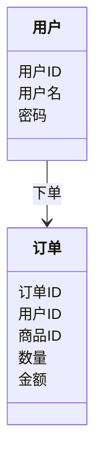

                 


# 《芒格的"反向工程"思维：从结果倒推原因》

> 关键词：反向工程思维，芒格，投资决策，系统分析，算法原理，项目实战

> 摘要：本文深入探讨了芒格的反向工程思维，从结果倒推原因的思维方式在投资、决策和系统设计中的应用。通过分析核心概念、算法原理、系统架构和实际案例，本文为读者提供了从理论到实践的全面指导。

---

## 第1章：引言

### 1.1 什么是反向工程思维
反向工程思维是一种从结果出发，逆向推导原因的思维方式。其核心在于通过分析已知的结果，推测其背后的逻辑和原因。这种方法在投资、决策和系统设计等领域具有重要意义。

### 1.2 芫格的背景与思想体系
芒格作为投资大师，其思想体系强调通过反向思维来寻找投资机会。他的方法不仅适用于投资，也可应用于更广泛的决策过程。

### 1.3 反向工程思维的重要性
在复杂系统中，反向工程思维帮助我们识别关键因素，优化决策过程，提升解决问题的效率。

---

## 第2章：反向工程思维的核心概念

### 2.1 反向工程思维的定义与特点
- **定义**：反向工程思维是一种从结果推导原因的思维方式。
- **特点**：逆向性、系统性、简洁性。

### 2.2 反向工程思维的关键特征
| 特征 | 描述 |
|------|------|
| 逆向性 | 从结果出发，寻找原因。 |
| 系统性 | 强调整体分析，而非单一因素。 |
| 简洁性 | 通过简化问题，找到核心因素。 |

### 2.3 反向工程思维与其他思维方法的区别
- **正向思维**：从原因推导结果。
- **反向思维**：从结果推导原因。
- **差异**：反向工程思维更注重系统性和整体性。

---

## 第3章：反向工程思维的算法原理

### 3.1 反向推理算法的实现步骤
1. **确定目标结果**：明确需要推导的原因。
2. **分解结果因素**：将结果分解为多个可能的因素。
3. **验证因果关系**：通过数据和逻辑验证因果关系。
4. **优化算法**：根据验证结果，优化推理过程。

### 3.2 反向推理算法的优化
- **减少无关因素**：聚焦关键因素。
- **动态调整**：根据新数据动态优化。

### 3.3 反向推理算法的数学模型
反向推理算法的数学模型如下：
$$ P(A|B) = \frac{P(B|A)P(A)}{P(B)} $$
其中，$P(A|B)$ 表示在结果 $B$ 下原因 $A$ 的概率。

---

## 第4章：反向工程思维在投资中的应用

### 4.1 价值投资与反向工程思维
- **价值投资**：寻找被市场低估的企业。
- **反向工程思维的应用**：通过分析企业价值，寻找投资机会。

### 4.2 如何通过反向工程思维分析企业价值
1. **确定目标企业**：选择具有潜力的企业。
2. **分析财务数据**：通过财务指标评估企业价值。
3. **评估竞争优势**：分析企业的核心竞争力。

### 4.3 反向工程思维在投资组合中的应用
- **分散投资**：通过反向思维选择多元化的投资组合。
- **风险管理**：识别潜在风险，优化投资策略。

---

## 第5章：反向工程思维在决策中的应用

### 5.1 如何通过反向工程思维优化决策过程
1. **明确决策目标**：确定决策的核心目标。
2. **分析可能结果**：预测决策的可能结果。
3. **反向推导原因**：找出影响结果的关键因素。
4. **优化决策方案**：根据分析结果，调整决策方案。

### 5.2 反向工程思维在风险管理中的作用
- **风险识别**：通过反向思维识别潜在风险。
- **风险评估**：分析风险的可能影响。
- **风险应对**：制定应对策略。

### 5.3 反向工程思维在战略规划中的应用
- **战略目标设定**：通过反向思维确定战略目标。
- **战略实施步骤**：制定实现目标的具体步骤。

---

## 第6章：反向工程思维的系统分析与架构设计

### 6.1 系统分析与需求分析
1. **问题场景介绍**：描述系统的功能需求。
2. **系统功能需求提取**：通过反向思维提取关键功能。
3. **系统架构设计**：设计系统的整体架构。

### 6.2 系统功能设计（领域模型）


### 6.3 系统架构设计


### 6.4 系统接口设计
- **接口定义**：明确系统各模块之间的接口。
- **接口实现**：通过反向思维优化接口设计。

---

## 第7章：反向工程思维的项目实战

### 7.1 环境安装与配置
- **工具安装**：安装必要的开发工具。
- **环境配置**：配置开发环境。

### 7.2 核心功能实现
```python
def reverse_engineer(result):
    factors = decompose_result(result)
    causal_relations = validate_factors(factors)
    return causal_relations

def decompose_result(result):
    # 分解结果为可能的因素
    pass

def validate_factors(factors):
    # 验证因果关系
    pass
```

### 7.3 代码实现与测试
- **代码实现**：编写反向推理算法的代码。
- **测试验证**：通过测试用例验证算法的正确性。

### 7.4 案例分析与总结
- **案例分析**：通过实际案例展示反向工程思维的应用。
- **总结经验**：总结项目中的经验和教训。

---

## 第8章：总结与展望

### 8.1 全文总结
反向工程思维是一种强大的思维方式，能够帮助我们在复杂系统中找到解决问题的关键因素。

### 8.2 经验与教训
- **经验**：反向思维在投资和决策中的有效性。
- **教训**：忽视系统性分析可能导致的错误。

### 8.3 未来展望
随着技术的发展，反向工程思维将在更多领域得到应用，未来的研究方向包括算法优化和多领域应用的结合。

---

## 作者信息

作者：AI天才研究院 & 禅与计算机程序设计艺术

---

本文通过详细阐述反向工程思维的核心概念、算法原理、系统分析和项目实战，为读者提供了从理论到实践的全面指导。通过实际案例和系统架构设计，展示了反向工程思维在投资、决策和系统设计中的广泛应用。希望本文能帮助读者更好地理解和应用这种思维方式。

