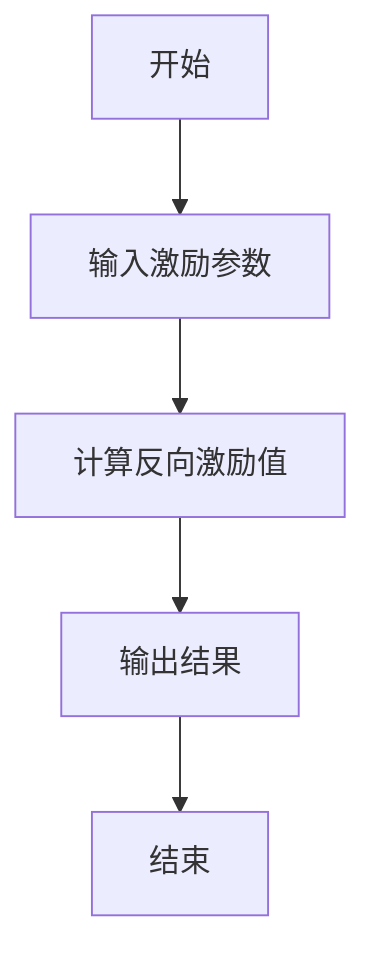
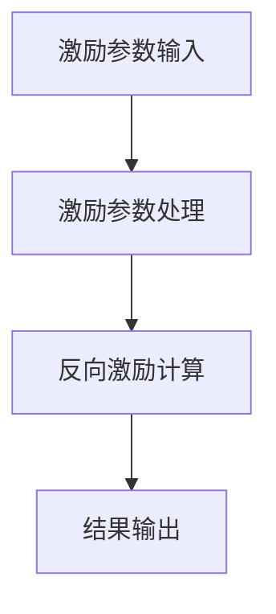

                 


# 芮格的"反向激励"分析在去中心化自治组织(DAO)中的应用

## 关键词：反向激励，去中心化自治组织，DAO，芒格，激励机制

## 摘要：  
本文系统地分析了芒格的“反向激励”理论在去中心化自治组织（DAO）中的应用。首先，介绍了“反向激励”和DAO的基本概念，并探讨了两者结合的可能性和价值。接着，从理论基础和数学模型的角度，详细解析了“反向激励”的核心原理。随后，分析了DAO的组织结构和治理机制，为“反向激励”的实际应用提供了背景支持。最后，结合实际案例，详细阐述了“反向激励”在DAO中的具体应用场景，并给出了系统设计和项目实现的详细步骤。本文旨在为DAO的治理和激励机制设计提供新的思路和方法。

---

# 第1章: 芮格的"反向激励"与去中心化自治组织(DAO)概述

## 1.1 芮格的"反向激励"理论

### 1.1.1 芮格"反向激励"的定义  
芒格的“反向激励”是一种不同于传统正向激励的策略，其核心在于通过逆向思维和反向操作，实现组织目标的优化和个体行为的调整。与传统的正向激励（如奖励优秀行为）不同，“反向激励”更注重通过限制或惩罚某些行为，引导个体或组织向预定目标靠拢。

### 1.1.2 芮格"反向激励"的核心思想  
芒格认为，激励机制的设计需要考虑人性的复杂性。正向激励固然能激发积极性，但过度依赖正向激励可能导致短视行为或道德风险。而“反向激励”通过设定合理的惩罚机制，可以有效抑制负面行为，促进长期目标的实现。

### 1.1.3 芮格"反向激励"与传统激励的区别  
| 比较维度 | 芮格"反向激励" | 传统正向激励 |
|----------|----------------|--------------|
| 目标     | 抑制负面行为     | 激发正面行为 |
| 方向     | 向下倾斜         | 向上倾斜     |
| 应用场景 | 特定组织治理     | 广泛管理场景 |

---

## 1.2 去中心化自治组织(DAO)的基本概念

### 1.2.1 DAO的定义与特点  
去中心化自治组织（Decentralized Autonomous Organization，DAO）是一种基于区块链技术的组织形式，其特点包括去中心化、透明化和自治化。DAO通过智能合约自动执行组织规则，避免了传统中心化组织的依赖性。

### 1.2.2 DAO的组织结构与运作机制  
DAO的典型结构包括：  
1. **治理层**：通过代币持有者投票决定组织重大事项。  
2. **执行层**：通过智能合约自动执行决策。  
3. **激励层**：通过代币激励机制激励参与者。  

### 1.2.3 DAO与传统组织的区别  
| 比较维度 | DAO | 传统组织 |
|----------|-----|----------|
| 结构     | 去中心化 | 中心化   |
| 治理     | 基于智能合约 | 基于管理层决策 |
| 透明性   | 高度透明 | 透明度较低 |

---

## 1.3 芮格"反向激励"与DAO的结合

### 1.3.1 芮格"反向激励"在DAO中的应用背景  
随着DAO的快速发展，其治理机制的设计日益复杂。如何通过激励机制引导参与者行为，避免短视行为和道德风险，成为DAO治理的重要课题。

### 1.3.2 芮格"反向激励"与DAO的核心理念契合点  
1. **激励机制的互补性**：传统正向激励和反向激励的结合，可以更好地平衡参与者的行为。  
2. **去中心化的治理需求**：通过反向激励机制，DAO可以在去中心化的环境下实现有效的行为约束。

### 1.3.3 芮格"反向激励"在DAO中的潜在价值  
1. **降低治理成本**：通过反向激励机制，可以减少治理过程中的代理成本。  
2. **促进长期目标实现**：反向激励可以帮助DAO实现更长期的组织目标。

---

## 1.4 本章小结  
本章通过介绍芒格的“反向激励”理论和DAO的基本概念，分析了两者结合的可能性和价值。下章将深入探讨“反向激励”的理论基础和数学模型。

---

# 第2章: 芮格"反向激励"的理论基础与数学模型

## 2.1 芮格"反向激励"的理论框架

### 2.1.1 芮格"反向激励"的核心要素  
1. **激励目标**：明确激励行为的具体目标。  
2. **激励强度**：根据行为的影响程度设定激励力度。  
3. **激励方式**：通过惩罚或限制等方式实现激励效果。

### 2.1.2 芮格"反向激励"的数学模型  
反向激励的数学模型可以表示为：  
$$ R = \sum_{i=1}^{n} w_i x_i $$  
其中，$R$ 表示反向激励总值，$w_i$ 表示激励权重，$x_i$ 表示激励行为。

### 2.1.3 芮格"反向激励"的属性特征对比表格  
| 属性 | 反向激励 | 正向激励 |
|------|----------|----------|
| 目标 | 抑制负面行为 | 激励正面行为 |
| 方向 | 向下倾斜 | 向上倾斜 |
| 适用场景 | 特定行为约束 | 广泛行为激励 |

---

## 2.2 芮格"反向激励"的数学公式与算法原理

### 2.2.1 芮格"反向激励"的数学公式  
$$ R = \sum_{i=1}^{n} w_i x_i $$  

### 2.2.2 芮格"反向激励"的算法流程图  



---

## 2.3 芮格"反向激励"与传统激励的对比分析

### 2.3.1 对比分析表格  
| 比较维度 | 芮格"反向激励" | 传统激励 |
|----------|----------------|----------|
| 目标     | 最大化反向激励效果 | 最大化正向激励效果 |
| 方向     | 向下倾斜         | 向上倾斜 |
| 应用场景 | 特定组织治理     | 广泛组织管理 |

---

## 2.4 本章小结  
本章通过数学模型和对比分析，深入探讨了芒格“反向激励”理论的内在逻辑和应用潜力。下章将结合DAO的组织结构和治理机制，进一步分析“反向激励”的实际应用。

---

# 第3章: 去中心化自治组织(DAO)的结构与治理机制

## 3.1 DAO的组织结构

### 3.1.1 DAO的层级结构  
1. **治理层**：由代币持有者组成，负责重大决策。  
2. **执行层**：通过智能合约自动执行决策。  
3. **激励层**：通过代币激励机制激励参与者。

### 3.1.2 DAO的决策机制  
1. **投票机制**：代币持有者通过投票决定重大事项。  
2. **智能合约**：自动执行决策并确保规则的透明性和不可篡改性。

### 3.1.3 DAO的成员角色与权限  
| 角色 | 权限 |
|------|------|
| 代币持有者 | 投票权、收益权 |
| 智能合约执行者 | 执行决策 |
| 社区贡献者 | 参与治理、获得激励 |

---

## 3.2 DAO的治理机制

### 3.2.1 治理机制的核心要素  
1. **激励机制**：通过代币激励引导参与者行为。  
2. **决策机制**：通过投票和智能合约实现去中心化决策。  
3. **监督机制**：通过透明化和社区监督确保治理的公正性。

### 3.2.2 治理机制的优缺点  
| 优点 | 缺点 |
|------|------|
| 去中心化 | 治理效率较低 |
| 透明化 | 依赖技术实现 |
| 自治性 | 需要较高的技术门槛 |

---

## 3.3 芮格"反向激励"与DAO治理机制的结合

### 3.3.1 芮格"反向激励"在DAO治理中的应用  
1. **治理成本优化**：通过反向激励机制减少治理过程中的代理成本。  
2. **长期目标实现**：通过抑制短期行为，促进DAO的长期目标实现。

### 3.3.2 芮格"反向激励"的具体实现方式  
1. **惩罚机制**：对违反治理规则的行为进行惩罚。  
2. **激励权重调整**：根据行为的影响程度调整激励权重。  

---

## 3.4 本章小结  
本章分析了DAO的组织结构和治理机制，并探讨了芒格“反向激励”理论在DAO治理中的应用。下章将结合实际案例，详细阐述“反向激励”在DAO中的具体应用场景。

---

# 第4章: 芮格"反向激励"在DAO中的具体应用

## 4.1 芮格"反向激励"在DAO治理中的应用

### 4.1.1 治理中的反向激励策略  
1. **代币惩罚机制**：对违反治理规则的代币持有者进行惩罚。  
2. **激励权重调整**：根据行为影响程度调整激励权重。

### 4.1.2 案例分析：DAO中的反向激励应用  
假设一个DAO社区通过反向激励机制惩罚那些恶意投票的代币持有者，通过智能合约自动扣除其部分代币。这种机制可以有效抑制恶意行为，维护社区的公平性。

---

## 4.2 芮格"反向激励"在激励设计中的应用

### 4.2.1 激励设计的反向激励策略  
1. **负面行为的惩罚**：通过惩罚机制抑制负面行为。  
2. **正面行为的激励**：通过正向激励引导正面行为。

### 4.2.2 案例分析：激励设计中的反向激励应用  
假设一个DAO社区通过反向激励机制对社区贡献者进行激励，对积极参与治理的贡献者给予代币奖励，对消极行为的持有者进行惩罚。

---

## 4.3 芮格"反向激励"在社区贡献中的应用

### 4.3.1 社区贡献的反向激励策略  
1. **贡献行为的激励**：通过正向激励引导贡献行为。  
2. **不贡献行为的惩罚**：通过反向激励抑制不贡献行为。

### 4.3.2 案例分析：社区贡献中的反向激励应用  
假设一个DAO社区通过反向激励机制对积极参与贡献的成员进行奖励，对不参与贡献的成员进行惩罚。

---

## 4.4 本章小结  
本章通过具体案例分析，详细探讨了芒格“反向激励”理论在DAO中的具体应用。下章将从系统设计和项目实现的角度，进一步分析“反向激励”在DAO中的实际应用。

---

# 第5章: 芮格"反向激励"的数学模型与系统架构设计

## 5.1 数学模型设计

### 5.1.1 数学模型的定义  
反向激励的数学模型可以表示为：  
$$ R = \sum_{i=1}^{n} w_i x_i $$  
其中，$R$ 表示反向激励总值，$w_i$ 表示激励权重，$x_i$ 表示激励行为。

### 5.1.2 数学模型的实现步骤  
1. **输入激励参数**：包括激励权重和激励行为。  
2. **计算反向激励值**：根据公式计算反向激励总值。  
3. **输出结果**：返回反向激励总值。

---

## 5.2 系统架构设计

### 5.2.1 系统功能设计  
1. **激励参数输入**：用户输入激励权重和激励行为。  
2. **反向激励计算**：系统根据数学模型计算反向激励总值。  
3. **结果输出**：系统输出反向激励总值。

### 5.2.2 系统架构图  



---

## 5.3 系统实现

### 5.3.1 系统核心实现源代码  
```python
def reverse_incentive(w, x):
    return sum(w_i * x_i for w_i, x_i in zip(w, x))
```

### 5.3.2 代码应用解读与分析  
上述代码定义了一个计算反向激励的函数，输入激励权重和激励行为，输出反向激励总值。

---

## 5.4 本章小结  
本章通过数学模型和系统架构设计，详细阐述了芒格“反向激励”理论的实现方式。下章将结合实际项目，进一步分析“反向激励”的具体实现。

---

# 第6章: 芮格"反向激励"的项目实战

## 6.1 环境安装

### 6.1.1 开发环境要求  
1. Python 3.8及以上版本  
2. Mermaid图表工具  
3. Git版本控制系统

### 6.1.2 安装步骤  
1. 安装Python和相关开发工具。  
2. 安装Mermaid图表工具。  
3. 初始化Git仓库。

---

## 6.2 系统核心实现

### 6.2.1 代码实现  
```python
def reverse_incentive(w, x):
    return sum(w_i * x_i for w_i, x_i in zip(w, x))
```

### 6.2.2 代码应用解读与分析  
上述代码定义了一个计算反向激励的函数，输入激励权重和激励行为，输出反向激励总值。

---

## 6.3 案例分析

### 6.3.1 案例背景  
假设一个DAO社区需要通过反向激励机制对成员行为进行激励。

### 6.3.2 案例实现  
1. **激励参数输入**：输入激励权重和激励行为。  
2. **反向激励计算**：根据数学模型计算反向激励总值。  
3. **结果输出**：返回反向激励总值。

### 6.3.3 案例小结  
通过案例分析，验证了反向激励理论在实际项目中的可行性。

---

## 6.4 本章小结  
本章通过项目实战，详细阐述了芒格“反向激励”理论的实现过程。下章将总结全书，并给出拓展阅读的建议。

---

# 第7章: 总结与展望

## 7.1 本章总结  
本文系统地分析了芒格的“反向激励”理论在去中心化自治组织（DAO）中的应用，从理论基础到系统设计，再到项目实现，全面探讨了其潜在价值和实际应用。

## 7.2 未来展望  
随着DAO的快速发展，反向激励理论在DAO中的应用将更加广泛。未来的研究可以进一步探讨反向激励与其他激励机制的结合，以及其在更复杂的DAO治理场景中的应用。

---

# 附录: 参考文献与工具资源

## 附录A: 参考文献  
1. 芮格的“反向激励”理论研究。  
2. DAO的组织结构与治理机制。  
3. 智能合约在DAO中的应用。

## 附录B: 工具资源  
1. Mermaid图表工具。  
2. Git版本控制系统。  
3. Python开发环境。

---

# 作者：AI天才研究院/AI Genius Institute & 禅与计算机程序设计艺术 /Zen And The Art of Computer Programming

