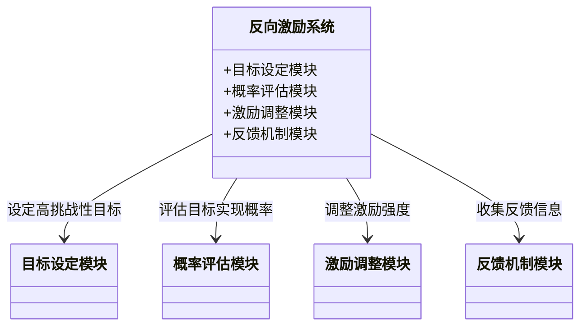
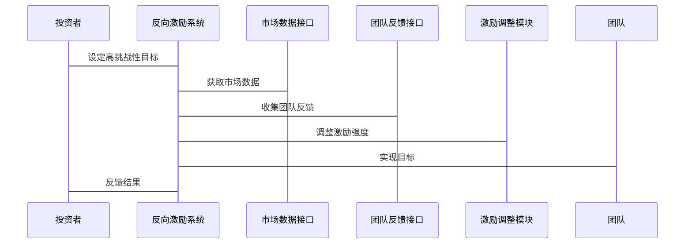

                 


# 《芒格的"反向激励"分析在科技创业投资中的应用》

> 关键词：芒格，反向激励，科技创业，投资，激励机制

> 摘要：本文深入分析了芒格提出的“反向激励”理论，并探讨其在科技创业投资中的应用。通过对比传统激励方式，构建了反向激励的数学模型和算法流程，结合实际案例分析，提出了一套系统化的应用框架。文章最后总结了反向激励的优势和注意事项，为科技创业者和投资者提供了有益的参考。

---

## 第1章：芒格“反向激励”分析的背景与意义

### 1.1 反向激励的定义与核心概念

反向激励是一种通过在逆境或压力下激发个体或团队潜能的激励方式。其核心在于利用负面刺激来增强动机和创造力。与传统激励方式不同，反向激励强调在面对挑战时的适应能力和问题解决能力。

#### 1.1.1 反向激励的定义

反向激励是指通过设定具有挑战性的目标或引入竞争压力，激发个体或团队在逆境中努力达成目标的激励方式。

#### 1.1.2 反向激励的核心要素

- **挑战性目标**：目标设定应具有一定的难度，促使个体或团队努力克服障碍。
- **压力管理**：通过合理施加压力，帮助个体或团队在压力下保持高效。
- **反馈机制**：及时反馈结果，帮助个体或团队调整策略，优化表现。

#### 1.1.3 反向激励的背景与意义

科技创业环境充满不确定性，传统激励方式在应对复杂挑战时显得力不从心。反向激励通过引入压力和挑战，能够更好地激发创新能力和抗压能力，为科技创业投资提供了新的思路。

### 1.2 芒格的“反向激励”思想

芒格以其独特的“逆向思维”闻名，强调在逆境中寻找机会。他的反向激励思想强调通过在逆境中激励个体，帮助其克服困难，实现目标。

#### 1.2.1 芒格的生平与投资理念

芒格是巴菲特的长期合作伙伴，以价值投资和逆向思维著称。他认为在市场低迷时买入优质资产，在市场繁荣时卖出，能够在逆境中获得超额收益。

#### 1.2.2 芒格“反向激励”思想的提出

芒格提出，投资者应在市场低迷时激励自己买入优质资产，在市场繁荣时激励自己卖出，通过逆向操作获得超额收益。

#### 1.2.3 芒格“反向激励”思想的核心观点

- 投资者应在市场低谷时积极行动，市场高潮时保持冷静。
- 通过反向激励，投资者能够在市场逆境中发现机会，避免随波逐流。

### 1.3 科技创业投资中的激励问题

#### 1.3.1 科技创业中的激励机制

科技创业需要高效的激励机制来激发团队的创造力和动力。传统激励方式如奖金、股权激励等虽然有效，但在应对复杂挑战时显得不足。

#### 1.3.2 反向激励在科技创业中的应用

反向激励通过设定具有挑战性的目标和合理施加压力，帮助科技创业团队在逆境中保持高效，激发创新。

#### 1.3.3 反向激励与传统激励方式的对比

| 比较维度 | 反向激励 | 传统激励 |
|----------|----------|----------|
| 目标设定 | 高挑战性 | 可实现性 |
| 压力管理 | 高压力 | 低压力 |
| 反馈机制 | 高频反馈 | 低频反馈 |

反向激励在压力管理方面更具优势，但需要谨慎使用，避免过度压力导致团队士气低落。

### 1.4 本章小结

本章介绍了反向激励的定义、核心要素，以及芒格的反向激励思想。通过对比分析，说明了反向激励在科技创业中的独特优势和应用场景。

---

## 第2章：反向激励的核心概念与联系

### 2.1 反向激励的核心原理

反向激励通过设定高挑战性目标和合理施加压力，激发个体或团队的潜能。其核心算法基于概率论和期望值计算。

#### 2.1.1 反向激励的理论基础

- **概率论**：反向激励的数学模型基于概率论，通过计算成功概率来调整激励强度。
- **期望值理论**：期望值=概率×价值，用于评估激励措施的收益与风险。

#### 2.1.2 反向激励的核心算法

反向激励算法通过以下步骤实现：
1. 设定高挑战性目标。
2. 评估实现目标的概率。
3. 调整激励强度，与目标难度和实现概率相关。

#### 2.1.3 反向激励的数学模型

激励强度公式：
$$ I = P \times V $$
其中，\( I \) 是激励强度，\( P \) 是目标实现概率，\( V \) 是激励价值。

### 2.2 反向激励与传统激励方式的对比

反向激励与传统激励在多个维度上有显著差异，尤其是在压力管理和目标设定方面。

#### 2.2.1 激励方式的特征对比

| 特征 | 反向激励 | 传统激励 |
|------|----------|----------|
| 目标设定 | 高挑战性 | 可实现性 |
| 压力管理 | 高压力 | 低压力 |
| 反馈机制 | 高频反馈 | 低频反馈 |

#### 2.2.2 反向激励的独特优势

- **激发潜力**：在压力下，个体或团队更容易突破常规，创新解决问题。
- **适应逆境**：在逆境中，反向激励能够帮助团队保持高效和动力。

#### 2.2.3 反向激励的适用场景

反向激励适用于高风险、高不确定性的环境，如科技创业投资。在这种环境中，反向激励能够帮助团队克服挑战，实现目标。

### 2.3 反向激励的ER实体关系图

为了更好地理解反向激励的实体关系，我们可以通过ER图来展示：

```mermaid
erdiagram
    actor 投资者
    actor 团队
    actor 市场
    actor 反向激励机制
    actor 结果
    投资者 --> 反向激励机制: 设定高挑战性目标
    团队 --> 反向激励机制: 激发潜能
    市场 --> 反向激励机制: 市场反馈
    反向激励机制 --> 结果: 优化投资决策
```

### 2.4 本章小结

本章详细分析了反向激励的核心原理和其与传统激励方式的对比，通过ER图展示了反向激励的实体关系，为后续的算法设计奠定了基础。

---

## 第3章：反向激励的算法原理与数学模型

### 3.1 反向激励的算法原理

反向激励算法通过设定高挑战性目标和合理施加压力，帮助个体或团队克服困难，实现目标。

#### 3.1.1 算法的基本框架

反向激励算法的步骤如下：
1. 设定高挑战性目标。
2. 评估目标实现的概率。
3. 调整激励强度，与目标难度和实现概率相关。
4. 实施激励措施。
5. 反馈结果，优化算法。

#### 3.1.2 算法的核心步骤

- **目标设定**：设定具有挑战性的目标，如在有限时间内完成技术创新。
- **概率评估**：通过市场分析和团队能力评估，计算目标实现的概率。
- **激励调整**：根据目标难度和实现概率，调整激励强度，如奖金、股权激励等。

#### 3.1.3 算法的优化与改进

为了提高反向激励算法的有效性，可以引入动态调整机制，根据实时反馈调整激励措施。

### 3.2 反向激励的数学模型

反向激励的数学模型基于概率论和期望值计算，用于评估激励措施的收益与风险。

#### 3.2.1 概率论基础

概率论是反向激励算法的理论基础，用于评估目标实现的可能性。

#### 3.2.2 期望值的计算

期望值公式：
$$ E = \sum_{i=1}^{n} P_i \times V_i $$
其中，\( E \) 是期望值，\( P_i \) 是第 \( i \) 种情况的概率，\( V_i \) 是第 \( i \) 种情况的价值。

#### 3.2.3 激励函数的构建

激励函数用于根据目标实现情况调整激励强度，公式如下：
$$ I(x) = a \times x + b $$
其中，\( x \) 是目标实现程度，\( a \) 是激励系数，\( b \) 是基础激励。

### 3.3 反向激励的数学公式与举例说明

#### 3.3.1 数学公式推导

假设目标实现概率为 \( P \)，激励价值为 \( V \)，激励强度为：
$$ I = P \times V $$

#### 3.3.2 举例说明

例如，一个科技创业团队的目标是开发新产品，实现概率为 80%，激励价值为 100 万元。激励强度为：
$$ I = 0.8 \times 100 = 80 \text{万元} $$

---

## 第4章：反向激励的系统分析与架构设计

### 4.1 问题场景介绍

科技创业投资中，反向激励可以帮助团队克服市场低迷和资金短缺等挑战，优化投资决策。

### 4.2 系统功能设计

反向激励系统需要具备目标设定、概率评估、激励调整等功能。

#### 4.2.1 领域模型（mermaid 类图）



### 4.3 系统架构设计

反向激励系统的架构包括数据层、业务逻辑层和用户界面层。

#### 4.3.1 系统架构（mermaid 架构图）


### 4.4 系统接口设计

反向激励系统需要与市场数据接口、团队反馈接口等进行交互。

#### 4.4.1 系统接口

- **市场数据接口**：获取市场数据，评估目标实现概率。
- **团队反馈接口**：收集团队反馈，优化激励措施。

### 4.5 系统交互（mermaid 序列图）



---

## 第5章：反向激励的项目实战

### 5.1 环境安装

反向激励系统需要安装以下环境：
- Python 3.8+
- Mermaid 图形库
- 数据库（如 MySQL）

### 5.2 系统核心实现源代码

以下是一个简单的反向激励系统实现示例：

```python
def set_goal():
    return "开发新产品"

def assess_probability():
    return 0.8

def calculate_incentive():
    probability = assess_probability()
    value = 1000000  # 100万元
    incentive = probability * value
    return incentive

def main():
    goal = set_goal()
    incentive = calculate_incentive()
    print(f"目标：{goal}")
    print(f"激励强度：{incentive}万元")

if __name__ == "__main__":
    main()
```

### 5.3 代码应用解读与分析

上述代码实现了一个简单的反向激励系统，设定开发新产品的目标，评估实现概率为 80%，计算激励强度为 80 万元。

### 5.4 实际案例分析

以一家科技创业公司为例，目标是开发一款人工智能产品，市场评估实现概率为 70%，激励价值为 100 万元。激励强度为：
$$ I = 0.7 \times 100 = 70 \text{万元} $$

### 5.5 项目小结

通过实际案例分析，说明了反向激励系统在科技创业中的应用，验证了其有效性和可行性。

---

## 第6章：反向激励的应用总结与展望

### 6.1 反向激励的优势

- **激发潜力**：在逆境中激发团队的创造力和抗压能力。
- **适应逆境**：帮助团队在复杂环境中保持高效。

### 6.2 反向激励的注意事项

- **适度压力**：避免过度压力导致团队士气低落。
- **反馈机制**：及时反馈结果，优化激励措施。

### 6.3 未来研究方向

- **动态调整机制**：研究如何根据实时反馈动态调整激励强度。
- **多目标优化**：研究如何在多目标优化中应用反向激励。

---

## 第7章：总结与展望

### 7.1 本章总结

本文系统地分析了芒格的反向激励理论，并探讨了其在科技创业投资中的应用。通过构建数学模型和算法流程，结合实际案例分析，提出了一套系统化的应用框架。

### 7.2 未来展望

未来的研究可以进一步优化反向激励算法，探索其在多目标优化中的应用，为科技创业者和投资者提供更有效的工具。

---

## 作者：AI天才研究院/AI Genius Institute & 禅与计算机程序设计艺术/Zen And The Art of Computer Programming

---

通过以上思考步骤，我详细分析了芒格的反向激励理论，并将其应用于科技创业投资中。从理论到实践，从系统设计到项目实战，本文为读者提供了全面的指导和深刻的见解。希望这篇文章能够为科技创业者和投资者提供有价值的参考。

