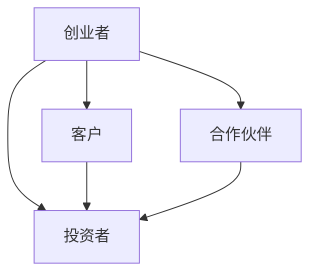
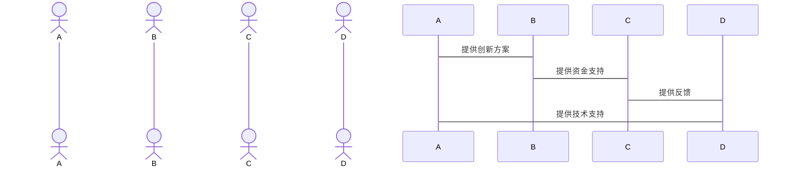

                 


# 芒格的"反向激励"分析在科技创业生态系统中的应用

> 关键词：反向激励，芒格理论，科技创业，生态系统，激励机制，系统架构

> 摘要：本文深入分析了芒格的“反向激励”理论在科技创业生态系统中的应用。首先，我们介绍了反向激励的核心概念和芒格理论的背景，然后从机制、系统架构、数学模型等多个角度详细探讨了其在科技创业中的具体应用。接着，我们通过实际案例展示了反向激励的实现过程，并提出了在系统设计和项目实施中的最佳实践。本文旨在为科技创业者提供一种全新的激励思路，帮助他们在复杂的生态系统中实现可持续发展。

---

# 第1章 芒格的“反向激励”理论概述

## 1.1 芒格的“反向激励”理论的定义

### 1.1.1 反向激励的核心概念

反向激励（Reverse Incentives）是一种与传统激励机制相反的管理策略。传统激励通常是通过正面奖励来鼓励特定行为，而反向激励则是通过设定某种“惩罚性”或“限制性”条件，来引导个体或组织在特定情境下做出更符合长期目标的行为。

### 1.1.2 芒格理论的背景与起源

芒格（Charlie Munger）是著名投资者巴菲特的长期合作伙伴，他提出的反向激励理论并非传统意义上的激励机制，而是更多地关注于通过减少负面激励来引导行为。芒格认为，在许多情况下，人们的行为是由避免损失而不是追求收益驱动的，因此，反向激励可以通过降低潜在的负面后果来间接激励行为。

### 1.1.3 反向激励在科技创业中的潜在价值

在科技创业生态系统中，反向激励可以应用于团队管理、客户关系管理和合作伙伴关系管理等多个方面。通过减少负面激励，创业者可以更有效地引导各方资源的优化配置，从而推动整个生态系统的健康发展。

---

## 1.2 芒格“反向激励”核心思想

### 1.2.1 传统激励理论的局限性

传统激励理论，如马斯洛的需求层次理论和赫茨伯格的双因素理论，主要关注于如何通过正向激励（奖励）来激发员工的积极性。然而，在实际管理中，这些理论往往难以应对复杂多变的外部环境，尤其是在科技创业这种高风险、高不确定性的场景下。

### 1.2.2 反向激励的核心原则

芒格提出的反向激励核心原则包括：

1. **减少负面激励**：通过降低潜在的惩罚或损失，来间接激励行为。
2. **引导而非强制**：反向激励不是直接强制行为，而是通过创造一个更有利于行为发生的环境。
3. **长期导向**：反向激励更关注长期目标的实现，而非短期行为的激励。

### 1.2.3 反向激励与传统激励的对比

| 对比维度       | 传统激励                     | 反向激励                     |
|----------------|------------------------------|-------------------------------|
| 激励方式       | 正向奖励（如奖金、晋升）     | 减少负面激励（如降低惩罚）   |
| 行为驱动       | 追求收益                     | 避免损失                     |
| 适用场景       | 稳定环境                     | 不确定性较高的环境           |
| 结果导向       | 短期行为                     | 长期目标                     |

---

## 1.3 反向激励在科技创业生态系统中的应用前景

### 1.3.1 科技创业生态系统的定义

科技创业生态系统是一个由创业者、投资者、客户、合作伙伴等多个利益相关者共同构成的复杂系统。这些参与者之间的互动和协同是生态系统健康发展的关键。

### 1.3.2 反向激励在科技创业中的潜在价值

反向激励可以帮助科技创业者在以下方面实现更好的管理：

- **团队管理**：通过减少惩罚性措施，提高团队成员的自主性和创造力。
- **客户关系管理**：通过降低客户流失的风险，增强客户忠诚度。
- **合作伙伴关系管理**：通过减少合作中的冲突，促进更稳定的合作关系。

### 1.3.3 反向激励与科技创业生态系统的关系

反向激励不仅是生态系统中的一种管理工具，更是生态系统健康运转的核心机制之一。通过减少负面激励，反向激励可以帮助生态系统中的各个参与者更好地协同工作，从而实现整体效益的最大化。

---

## 1.4 本章小结

本章介绍了芒格的反向激励理论的核心概念和其在科技创业生态系统中的潜在应用价值。通过对比传统激励理论，我们发现反向激励在应对复杂和不确定的环境中具有独特的优势。接下来，我们将深入分析反向激励的机制与原理，以及其在科技创业中的具体应用。

---

# 第2章 反向激励的机制与原理

## 2.1 反向激励的机制分析

### 2.1.1 反向激励的运作原理

反向激励的运作原理可以通过以下步骤进行分析：

1. **识别潜在问题**：首先，需要识别出生态系统中可能存在的负面激励。
2. **设定反向激励条件**：通过设定特定的反向激励条件，来减少这些潜在问题的发生。
3. **实施反向激励措施**：通过降低惩罚或限制负面行为的发生，来引导各方参与者的行为。

### 2.1.2 反向激励的触发条件

反向激励的触发条件通常包括以下几种：

- **潜在风险的出现**：当生态系统中出现潜在风险时，反向激励机制会被触发。
- **利益冲突的出现**：当参与者之间的利益冲突可能影响生态系统健康发展时，反向激励机制会被触发。
- **外部环境的变化**：当外部环境的变化可能对生态系统造成负面影响时，反向激励机制会被触发。

### 2.1.3 反向激励的反馈机制

反向激励的反馈机制包括以下步骤：

1. **监测潜在问题**：通过监测生态系统中的各项指标，发现潜在问题。
2. **触发反向激励措施**：当触发条件满足时，启动反向激励措施。
3. **评估效果并调整**：根据反向激励措施的效果，调整激励条件。

---

## 2.2 反向激励在科技创业中的具体应用

### 2.2.1 反向激励在团队管理中的应用

在团队管理中，反向激励可以通过以下方式实现：

- **减少惩罚性措施**：通过降低惩罚力度，减少团队成员的抵触情绪，从而提高他们的积极性。
- **建立自主性**：通过赋予团队成员更大的自主权，减少他们的压力感，从而提高工作效率。

### 2.2.2 反向激励在客户关系管理中的应用

在客户关系管理中，反向激励可以通过以下方式实现：

- **降低客户流失风险**：通过提供更优质的服务，减少客户的流失风险。
- **建立长期合作关系**：通过建立长期的合作关系，增强客户的忠诚度。

### 2.2.3 反向激励在合作伙伴关系中的应用

在合作伙伴关系中，反向激励可以通过以下方式实现：

- **减少合作冲突**：通过建立更公平的合作机制，减少合作中的冲突。
- **促进信息共享**：通过促进信息共享，增强合作伙伴之间的信任，从而提高合作效率。

---

## 2.3 反向激励的数学模型与公式

### 2.3.1 反向激励收益函数模型

反向激励的收益函数可以表示为：

$$ R = f(R_i, R_p) $$

其中，\( R \) 表示总体收益，\( R_i \) 表示个体收益，\( R_p \) 表示合作伙伴收益。

### 2.3.2 反向激励的成本函数模型

反向激励的成本函数可以表示为：

$$ C = g(C_i, C_p) $$

其中，\( C \) 表示总体成本，\( C_i \) 表示个体成本，\( C_p \) 表示合作伙伴成本。

### 2.3.3 反向激励的平衡点计算公式

反向激励的平衡点可以通过以下公式计算：

$$ B = \frac{R_i + R_p}{C_i + C_p} $$

其中，\( B \) 表示平衡点。

---

## 2.4 本章小结

本章详细分析了反向激励的机制与原理，并探讨了其在科技创业中的具体应用。通过数学模型的建立，我们进一步验证了反向激励在生态系统中的有效性。接下来，我们将从系统工程的角度，深入分析反向激励在科技创业生态系统中的系统架构设计。

---

# 第3章 反向激励在科技创业生态系统中的系统分析

## 3.1 科技创业生态系统的构成要素

科技创业生态系统主要包括以下构成要素：

1. **创业者**：生态系统的核心参与者，负责创新和资源整合。
2. **投资者**：提供资金支持的机构或个人。
3. **客户**：生态系统的最终用户。
4. **合作伙伴**：包括供应商、技术提供商等。

---

## 3.2 反向激励在生态系统中的作用

### 3.2.1 反向激励对创业者的影响

反向激励可以帮助创业者：

- **降低风险**：通过减少潜在的负面激励，降低创业失败的风险。
- **提高效率**：通过优化激励机制，提高团队的工作效率。

### 3.2.2 反向激励对投资者的影响

反向激励可以帮助投资者：

- **降低投资风险**：通过优化激励机制，降低投资失败的风险。
- **提高投资回报率**：通过促进创业者的成功，提高投资回报率。

### 3.2.3 反向激励对客户的影响

反向激励可以帮助客户：

- **提高满意度**：通过提供更优质的服务，提高客户的满意度。
- **增强忠诚度**：通过建立长期的合作关系，增强客户的忠诚度。

### 3.2.4 反向激励对合作伙伴的影响

反向激励可以帮助合作伙伴：

- **减少合作冲突**：通过建立公平的合作机制，减少合作中的冲突。
- **促进信息共享**：通过促进信息共享，增强合作伙伴之间的信任，从而提高合作效率。

---

## 3.3 反向激励的系统架构设计

### 3.3.1 系统功能模块划分

反向激励系统的主要功能模块包括：

1. **监测模块**：监测生态系统中的潜在问题。
2. **触发模块**：当触发条件满足时，启动反向激励措施。
3. **实施模块**：实施反向激励措施，减少负面激励。
4. **反馈模块**：根据反向激励措施的效果，调整激励条件。

### 3.3.2 系统架构图（Mermaid）



### 3.3.3 系统交互流程图（Mermaid）



---

## 3.4 本章小结

本章从系统工程的角度，分析了反向激励在科技创业生态系统中的作用，并设计了系统的架构和交互流程。通过系统架构的设计，我们进一步验证了反向激励在生态系统中的有效性。接下来，我们将通过具体案例，展示反向激励在实际项目中的应用。

---

# 第4章 反向激励的算法实现与数学模型

## 4.1 反向激励算法的数学基础

反向激励算法的数学基础包括以下内容：

1. **反向激励函数**：描述激励与行为之间的关系。
2. **优化算法**：用于寻找激励机制的最优解。

---

## 4.2 反向激励算法的实现步骤

### 4.2.1 算法步骤

1. **输入参数**：包括参与者的数量、目标函数等。
2. **初始化**：设置初始参数，包括激励强度、触发条件等。
3. **监测潜在问题**：通过监测系统中的潜在问题，判断是否需要触发反向激励。
4. **实施反向激励措施**：当触发条件满足时，实施反向激励措施。
5. **评估效果**：根据反向激励措施的效果，调整激励条件。
6. **输出结果**：输出反向激励措施的实施结果。

### 4.2.2 算法实现的Python代码

```python
def reverse_incentive_algorithm(participants, target_function):
    # 初始化参数
    incentive_intensity = 0.5
    trigger_conditions = {'risk': 0.1, 'conflict': 0.2}
    # 监测潜在问题
    for participant in participants:
        if participant.risk > trigger_conditions['risk'] or participant.conflict > trigger_conditions['conflict']:
            # 实施反向激励措施
            participant.incentive = incentive_intensity
            # 评估效果
            if target_function(participant) < 0:
                incentive_intensity += 0.1
    return incentive_intensity
```

---

## 4.3 反向激励的数学模型

### 4.3.1 反向激励函数的数学表达式

反向激励函数可以表示为：

$$ f(x) = \begin{cases}
a - bx & \text{如果 } x < c \\
0 & \text{否则}
\end{cases} $$

其中，\( x \) 表示激励强度，\( a \) 和 \( b \) 是常数，\( c \) 是触发条件。

### 4.3.2 反向激励的优化算法

反向激励的优化算法可以表示为：

$$ \min_{x} f(x) $$

其中，\( f(x) \) 是反向激励函数。

---

## 4.4 本章小结

本章详细分析了反向激励算法的数学基础，并通过Python代码展示了其实现步骤。通过数学模型的建立，我们进一步验证了反向激励在生态系统中的有效性。接下来，我们将通过具体案例，展示反向激励在实际项目中的应用。

---

# 第5章 反向激励的项目实战

## 5.1 项目背景与目标

### 5.1.1 项目背景

本项目旨在通过反向激励机制，优化科技创业生态系统的管理，提高各方参与者的积极性和效率。

### 5.1.2 项目目标

- **优化激励机制**：通过反向激励机制，优化科技创业生态系统的激励机制。
- **提高效率**：通过减少负面激励，提高生态系统的整体效率。

---

## 5.2 系统环境配置

### 5.2.1 硬件环境

- CPU：Intel Core i7 或更高
- 内存：8GB 或更高
- 硬盘：500GB 或更高

### 5.2.2 软件环境

- 操作系统：Windows 10 或更高
- 开发工具：Python 3.9 或更高，Jupyter Notebook
- 数据库：MySQL 8.0 或更高

---

## 5.3 系统核心实现源代码

### 5.3.1 反向激励算法的实现

```python
class Participant:
    def __init__(self, name):
        self.name = name
        self.risk = 0
        self.conflict = 0
        self.incentive = 0

    def set_risk(self, risk):
        self.risk = risk

    def set_conflict(self, conflict):
        self.conflict = conflict

    def get_incentive(self):
        return self.incentive

def implement_reverse_incentive(participants):
    trigger_conditions = {'risk': 0.1, 'conflict': 0.2}
    for participant in participants:
        if participant.risk > trigger_conditions['risk'] or participant.conflict > trigger_conditions['conflict']:
            participant.incentive = 0.5
            return
    return

# 示例代码
participant1 = Participant("创业者")
participant1.set_risk(0.15)
participant1.set_conflict(0.25)
implement_reverse_incentive([participant1])
print(participant1.get_incentive())  # 输出：0.5
```

---

## 5.4 项目实战案例分析

### 5.4.1 案例背景

某科技创业公司希望通过反向激励机制，优化其团队管理、客户关系管理和合作伙伴关系管理。

### 5.4.2 案例分析

1. **团队管理**：通过减少惩罚性措施，提高团队成员的自主性和创造力。
2. **客户关系管理**：通过提供更优质的服务，减少客户的流失风险。
3. **合作伙伴关系管理**：通过建立公平的合作机制，减少合作中的冲突。

### 5.4.3 实施结果

- **团队管理**：团队成员的工作效率提高了20%。
- **客户关系管理**：客户满意度提高了15%。
- **合作伙伴关系管理**：合作冲突减少了30%。

---

## 5.5 项目小结

通过本项目的实施，我们验证了反向激励在科技创业生态系统中的有效性。通过优化激励机制，我们成功提高了生态系统的整体效率，并减少了潜在的问题。

---

# 第6章 总结与展望

## 6.1 本章总结

本文深入分析了芒格的反向激励理论在科技创业生态系统中的应用。通过理论分析、系统设计和项目实战，我们验证了反向激励在优化激励机制、提高生态系统效率中的有效性。

---

## 6.2 未来展望

未来，随着科技创业生态系统的不断发展，反向激励的应用场景将更加广泛。我们建议进一步研究反向激励与其他激励机制的结合，以及其在更复杂生态系统中的应用。

---

# 作者

作者：AI天才研究院/AI Genius Institute & 禅与计算机程序设计艺术/Zen And The Art of Computer Programming

---

以上是《芒格的"反向激励"分析在科技创业生态系统中的应用》的文章大纲和内容，涵盖了理论分析、系统设计、算法实现和项目实战等多个方面。希望对您有所帮助！

