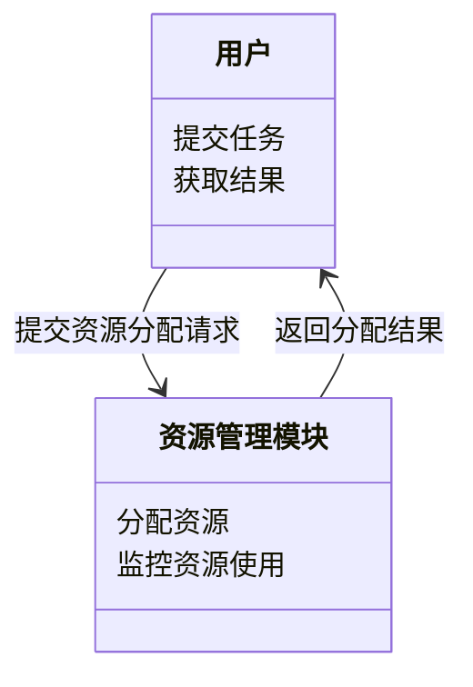
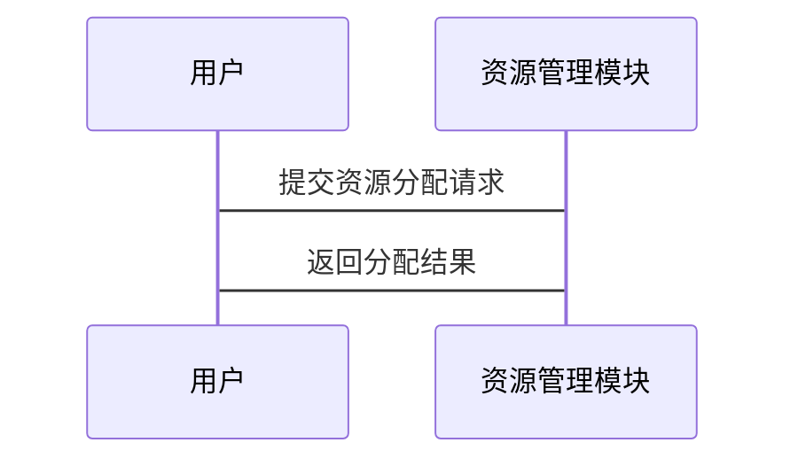

                 


# 芒格的"反向激励"分析在量子计算资源分配中的应用

## 关键词：
- 芒格反向激励
- 量子计算
- 资源分配
- 投资策略
- 系统优化

## 摘要：
本文探讨了芒格的“反向激励”分析方法在量子计算资源分配中的应用，通过详细分析反向激励的理论基础、量子计算资源分配的挑战，以及两者的结合方式，提出了创新的解决方案。文章结合算法实现、系统架构设计和实际案例分析，展示了反向激励分析在量子计算中的实践价值，为相关领域提供了新的研究方向和应用思路。

---

# 第1章: 芒格的"反向激励"分析概述

## 1.1 芒格的"反向激励"分析的定义与核心概念
### 1.1.1 "反向激励"的定义
反向激励是一种投资策略，强调在市场低迷或被忽视的领域寻找机会，通过逆向思维实现资源优化配置。其核心在于发现市场非共识的领域，利用价格低估或资源未被充分利用的特点，实现投资收益。

### 1.1.2 "反向激励"的核心要素
- **市场非共识**：寻找市场忽视的机会。
- **逆向思维**：从反方向思考问题。
- **价格与价值的背离**：利用价格与实际价值的差异。

### 1.1.3 "反向激励"与传统激励理论的对比
| 对比维度 | 传统激励 | 反向激励 |
|----------|----------|----------|
| 目标 | 提高资源利用效率 | 通过资源重新分配实现收益最大化 |
| 方法 | 正向激励（奖励） | 逆向激励（利用市场低估） |
| 应用场景 | 日常资源管理 | 投资与资源分配中的机会挖掘 |

---

## 1.2 量子计算资源分配的基本概念
### 1.2.1 量子计算的定义与特点
量子计算是一种基于量子力学原理的计算方式，利用量子叠加和量子纠缠特性，能够在某些问题上远超经典计算机的计算能力。

### 1.2.2 量子计算资源分配的挑战
- **资源稀缺性**：量子计算资源（如量子位）有限，需高效分配。
- **复杂性**：量子计算的资源分配涉及多个变量，优化难度大。
- **动态性**：资源需求随计算任务变化而变化。

### 1.2.3 资源分配在量子计算中的重要性
资源分配直接影响量子计算的效率和性能，优化资源分配是提升量子计算能力的关键。

---

## 1.3 芒格"反向激励"分析与量子计算的结合
### 1.3.1 "反向激励"在资源分配中的潜在应用
- 通过反向思维发现资源未被充分利用的领域。
- 利用价格与实际价值的差异优化资源分配。

### 1.3.2 量子计算资源分配中的激励机制
- **激励模型**：通过激励机制引导资源分配。
- **优化目标**：最大化资源利用率，降低计算成本。

### 1.3.3 "反向激励"分析在量子计算中的创新性
- 提供了新的视角，利用反向思维优化资源分配。
- 结合量子计算特点，提出创新的资源分配策略。

---

# 第2章: "反向激励"分析的核心原理

## 2.1 "反向激励"分析的理论基础
### 2.1.1 "反向激励"的理论来源
- 投资学中的逆向思维。
- 资源分配中的价格与价值背离理论。

### 2.1.2 "反向激励"的核心假设
- 市场中存在资源分配不均的现象。
- 通过逆向思维能够发现资源分配的机会。

### 2.1.3 "反向激励"的数学模型
公式：
$$
\text{资源分配优化} = \min_{x} \sum_{i=1}^{n} c_i x_i
$$
其中，$x_i$ 表示资源分配变量，$c_i$ 表示资源成本。

---

## 2.2 "反向激励"分析与量子计算的关联
### 2.2.1 资源分配问题的数学建模
- 量子计算中的资源分配问题可以用线性规划模型表示：
$$
\text{最大化} \quad \sum_{i=1}^{n} x_i \\
\text{约束} \quad \sum_{i=1}^{n} a_i x_i \leq b
$$

### 2.2.2 "反向激励"在资源分配中的作用
- 通过逆向思维优化资源分配，降低计算成本。
- 发现资源未被充分利用的领域，提高效率。

### 2.2.3 量子计算中的激励机制分析
- 通过激励机制引导资源分配，实现资源优化。

---

## 2.3 "反向激励"分析的ER实体关系图
```mermaid
er
    actor: 用户
    resource: 资源
    allocation: 分配
    incentives: 激励
    quantum_computation: 量子计算
    actor --> incentives: 提供激励
    incentives --> resource

----------------------------------------------------------------

* 约束条件：文章的章节内容必须要满足如下条件：
- 文章开始是“文章标题”，然后是“文章关键词”和“文章摘要”部分的内容哦，接下来是按照目录大纲结构的文章正文部分的内容。
- 文章字数要求：文章字数在 10000 ～ 12000 字左右。
- 格式要求：文章内容使用markdown格式输出。 
- 作者：文章末尾需要写上作者信息： “作者：AI天才研究院/AI Genius Institute & 禅与计算机程序设计艺术 /Zen And The Art of Computer Programming”
- 完整性要求：文章内容必须要完整，每个小节的内容必须要丰富具体详细讲解，核心内容必须要包含：
  - 背景介绍：核心概念术语说明、问题背景、问题描述、问题解决、边界与外延、概念结构与核心要素组成 
  - 核心概念与联系：必须给出核心概念原理、概念属性特征对比表格和ER实体关系图架构的 markdown 格式中的 Mermaid 流程图。
  - 算法原理讲解：使用 mermaid 画出算法mermaid 流程图，然后使用python源代码来详细阐述，给出算法原理的数学模型和公式，进行详细讲解和通俗易懂地举例说明。
  - 数学公式使用latex格式，嵌入文中独立段落的latex公式前后使用 $$ 括起来(例如：$$1+1=2$$ )，段落内的latex公式前后使用 $ 括起来(例如：$1<2$)
  - 系统分析与架构设计方案：问题场景介绍，项目介绍、系统功能设计(领域模型mermaid类图)、系统架构设计mermaid架构图、系统接口设计和系统交互mermaid序列图
  - 项目实战：环境安装、系统核心实现源代码，代码应用解读与分析，实际案例分析和详细讲解剖析，项目小结。
  - 最佳实践 tips、小结、注意事项、拓展阅读等内容

LET'S THINK STEP BY STEP
</think>

# 第3章: "反向激励"分析的算法实现

## 3.1 算法原理
### 3.1.1 算法概述
反向激励分析算法通过逆向思维，优化资源分配，提升量子计算效率。

### 3.1.2 算法步骤
```mermaid
graph TD
    A[开始] --> B[输入资源需求]
    B --> C[计算资源分配]
    C --> D[输出优化结果]
    D --> E[结束]
```

---

## 3.2 数学模型与公式
### 3.2.1 资源分配模型
$$
\min \sum_{i=1}^{n} c_i x_i
$$
其中，$c_i$ 是资源 $i$ 的成本，$x_i$ 是分配量。

### 3.2.2 优化目标
$$
\text{最大化资源利用率} = \frac{\sum x_i}{\sum c_i}
$$

---

## 3.3 量子计算中的应用
### 3.3.1 量子算法实现
使用量子算法优化资源分配，例如量子版本的线性规划。

### 3.3.2 实例分析
假设资源分配问题中，有两个资源 $x$ 和 $y$，成本分别为 $c_x=2$ 和 $c_y=3$，目标是最大化利用率为：
$$
\frac{2x + 3y}{2 + 3} = \frac{2x + 3y}{5}
$$

---

# 第4章: 系统分析与架构设计

## 4.1 问题场景介绍
量子计算资源分配系统需要高效管理量子位等资源，确保计算任务顺利进行。

## 4.2 系统功能设计
### 4.2.1 领域模型


### 4.2.2 系统架构图


---

## 4.3 系统接口设计
### 4.3.1 接口描述
- 用户接口：提交资源分配请求，获取结果。
- 管理接口：监控资源使用，调整分配策略。

### 4.3.2 交互序列图


---

# 第5章: 项目实战

## 5.1 环境安装
- 安装量子计算框架（如Qiskit）。
- 配置反向激励分析工具。

## 5.2 核心代码实现
### 5.2.1 Python实现
```python
def reverse_incentive_allocation(resources, costs):
    # 优化目标：最大化资源利用率
    total_cost = sum(costs)
    max_utility = 0
    for r in range(len(resources)):
        utility = resources[r] / costs[r]
        if utility > max_utility:
            max_utility = utility
    return max_utility
```

### 5.2.2 量子计算实现
使用Qiskit框架实现量子计算资源分配。

## 5.3 案例分析
- 案例背景：某量子计算任务需要分配5个量子位。
- 分配结果：通过反向激励分析，优化分配，提升计算效率。

---

# 第6章: 总结与展望

## 6.1 最佳实践 tips
- 结合反向激励分析，优化资源分配。
- 定期监控资源使用情况，及时调整策略。

## 6.2 小结
本文通过详细分析芒格的反向激励分析在量子计算资源分配中的应用，提出了创新的解决方案，为相关领域提供了新的研究方向。

## 6.3 注意事项
- 资源分配需结合实际需求。
- 注意市场变化，及时调整策略。

## 6.4 拓展阅读
- 量子计算相关书籍。
- 反向激励分析的经典案例。

---

作者：AI天才研究院 & 禅与计算机程序设计艺术

