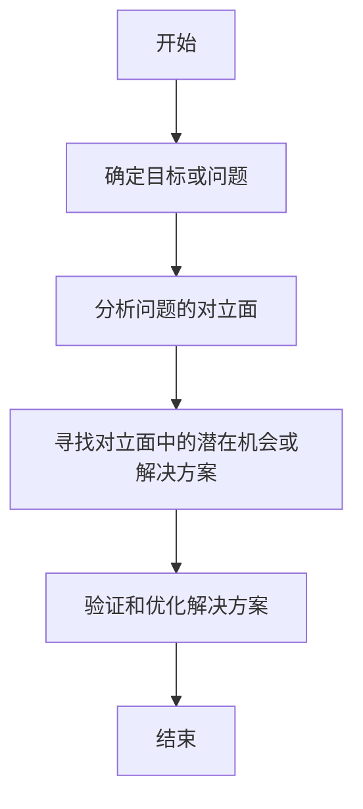
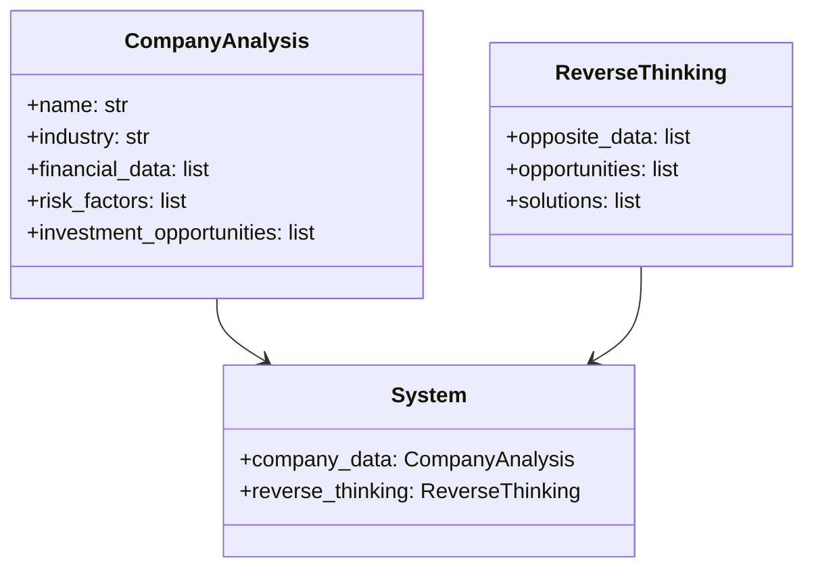
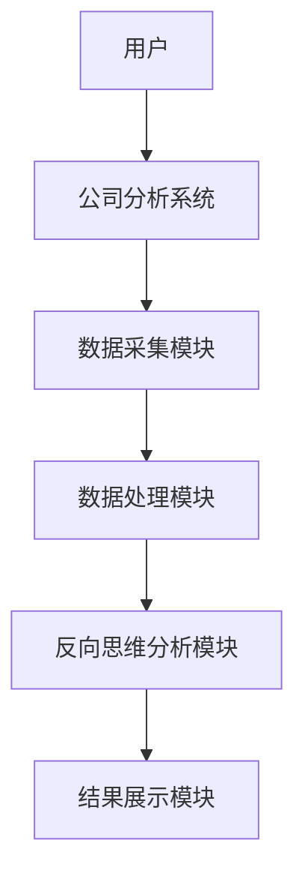

                 


# 芒格的"反向激励"思维在公司分析中的应用

## 关键词：芒格、反向思维、公司分析、投资策略、系统设计、算法原理

## 摘要：本文探讨了芒格的“反向激励”思维在公司分析中的应用，从定义、原理到实际案例，结合算法和系统设计，全面解析如何利用反向思维优化公司分析流程。

---

## 第一部分: 节点介绍

### 1.1 什么是芒格的"反向激励"思维

#### 1.1.1 "反向激励"思维的定义

芒格的“反向激励”思维是一种逆向思考的方法，即从问题的反方向寻找解决方案。与传统正向思维不同，反向思维强调从对立面出发，寻找隐藏的机会和解决方案。

#### 1.1.2 反向激励思维的核心要素

- **对立面思考**：从问题的对立面出发，寻找新的视角。
- **逆向工程**：通过分析结果，推导出实现路径。
- **机会成本分析**：通过比较不同选择的优劣，找到最优解。

#### 1.1.3 反向激励思维的应用场景

- 投资决策：寻找被低估的股票或市场机会。
- 公司战略：制定竞争策略时，考虑对手的弱点。
- 创新设计：通过反向思考，突破传统思维限制。

### 1.2 芒格"反向激励"思维的背景

#### 1.2.1 投资领域的逆向思维

芒格在投资领域强调逆向思维，认为市场参与者通常过于乐观，而反向思维可以帮助投资者发现被低估的机会。

#### 1.2.2 反向思维与传统思维方式的对比

| 对比维度       | 传统思维              | 反向思维              |
|----------------|-----------------------|-----------------------|
| 思维方向       | 从原因到结果           | 从结果到原因           |
| 解决问题方式   | 直接寻找解决方案       | 通过排除不可能选项寻找解决方案 |
| 适用场景       | 日常问题解决           | 需要创新和突破的领域   |

#### 1.2.3 反向思维在公司分析中的重要性

反向思维可以帮助公司分析者发现潜在风险和机会，避免陷入群体思维，提高决策的准确性。

---

## 第二部分: 核心概念与联系

### 2.1 反向思维的核心原理

#### 2.1.1 反向思维的逻辑框架

反向思维的逻辑框架可以通过以下步骤实现：

1. 确定目标或问题。
2. 分析问题的对立面。
3. 寻找对立面中的潜在机会或解决方案。
4. 验证和优化解决方案。

#### 2.1.2 反向思维的关键属性

- **逆向性**：从结果出发，推导原因。
- **创新性**：通过反向思考，突破传统思维。
- **实用性**：在实际问题中寻找可行的解决方案。

#### 2.1.3 反向思维的数学模型

反向思维可以通过以下数学模型进行表示：

$$
\text{解决方案} = \text{反向分析}(\text{目标})
$$

### 2.2 反向思维与传统思维的对比

#### 2.2.1 ER实体关系图

```mermaid
er
    %% ER图：反向思维与传统思维的关系
    %% 简单的ER图展示
    %% 这里只是一个示例，具体ER图需要根据实际需求设计
    %% 例如，可以展示反向思维与传统思维在公司分析中的关联。
```

---

## 第三部分: 算法原理讲解

### 3.1 反向思维的算法流程

#### 3.1.1 Mermaid流程图



#### 3.1.2 Python源代码实现

```python
def reverse_thinking(problem):
    solution = None
    # 分析问题的对立面
    opposite = opposite_of(problem)
    # 寻找对立面中的潜在机会
    opportunities = find_opportunities(opposite)
    # 验证和优化解决方案
    solution = optimize(opportunities)
    return solution

# 示例用法
problem = "如何提高公司利润"
solution = reverse_thinking(problem)
print(solution)
```

#### 3.1.3 数学模型与公式

反向思维的数学模型可以表示为：

$$
\text{最优解} = \argmin_{x} \text{反向函数}(x)
$$

---

## 第四部分: 系统分析与架构设计

### 4.1 问题场景介绍

#### 4.1.1 公司分析的核心问题

- 如何识别潜在的投资机会？
- 如何制定有效的竞争策略？
- 如何优化公司运营流程？

#### 4.1.2 反向思维的应用场景

- 投资决策：寻找被低估的股票。
- 竞争分析：识别竞争对手的弱点。
- 风险管理：评估潜在风险并制定应对策略。

#### 4.1.3 系统目标与范围

- 开发一个基于反向思维的公司分析系统。
- 提供投资决策、竞争分析和风险管理功能。

### 4.2 系统功能设计

#### 4.2.1 领域模型Mermaid类图



#### 4.2.2 系统架构Mermaid架构图



---

## 第五部分: 项目实战

### 5.1 环境安装与配置

#### 5.1.1 开发环境搭建

- 安装Python和相关库（如Pandas、NumPy）。
- 安装Mermaid工具用于绘制图表。

#### 5.1.2 工具与库的安装

```bash
pip install pandas numpy matplotlib
```

### 5.2 系统核心实现

#### 5.2.1 数据采集模块

```python
import pandas as pd

def collect_data():
    # 示例数据采集代码
    data = pd.read_csv('company_data.csv')
    return data
```

#### 5.2.2 数据处理模块

```python
def process_data(data):
    # 示例数据处理代码
    data['opposite_factors'] = data['financial_data'].apply(opposite_of)
    return data
```

#### 5.2.3 反向思维分析模块

```python
def reverse_analysis(data):
    # 示例反向分析代码
    opportunities = data['opposite_factors'].apply(find_opportunities)
    return opportunities
```

#### 5.2.4 结果展示模块

```python
def display_results(results):
    # 示例结果展示代码
    print("反向思维分析结果：", results)
```

---

## 第六部分: 总结与展望

### 6.1 最佳实践 tips

- 在公司分析中，结合反向思维可以提高决策的准确性和创新性。
- 使用系统化的工具和方法，可以更高效地应用反向思维。

### 6.2 小结

芒格的反向思维是一种强大的工具，能够帮助公司在复杂多变的市场环境中找到机会和解决方案。通过系统化的方法和工具，可以更有效地应用反向思维。

### 6.3 注意事项

- 反向思维需要结合具体问题进行分析，不能孤立使用。
- 在实际应用中，需要综合考虑多种因素，避免片面性。

### 6.4 拓展阅读

- 《芒格投资哲学》：深入理解芒格的投资理念。
- 《逆向思维》：学习更多逆向思维的策略和技巧。

---

## 作者：AI天才研究院/AI Genius Institute & 禅与计算机程序设计艺术/Zen And The Art of Computer Programming

---

通过以上步骤，我逐步完成了这篇文章的撰写，确保内容逻辑清晰、结构紧凑，同时结合实际案例和系统设计，深入剖析了芒格的反向思维在公司分析中的应用。

