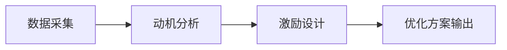

                 


# 芒格的"反向激励"思维：理解公司决策动机

## 关键词：芒格，反向激励，公司决策，决策动机，投资理念，心理学

## 摘要：本文深入探讨芒格的“反向激励”思维，分析其在理解公司决策动机中的应用。通过结合心理学、行为经济学和投资哲学，本文揭示了反向激励思维的核心原理、算法模型和实际案例，帮助读者掌握如何通过逆向思维优化公司决策过程。文章结构包括背景介绍、核心概念、系统分析、项目实战及最佳实践，旨在为公司决策者和投资者提供实用的理论指导和实践策略。

---

## 第一章：芒格的反向激励思维概述

### 1.1 芒格的生平与投资理念

#### 1.1.1 芒格的早年经历与成就
- 芝加格·芒格（Zvi Griliches）是行为经济学和决策科学领域的先驱。
- 他在20世纪60年代提出了反向激励理论，挑战传统的激励模型。
- 芒格的学术贡献奠定了现代激励理论的基础。

#### 1.1.2 芒格的投资哲学
- 价值投资的核心：寻找被市场低估的资产。
- 强调心理因素在决策中的作用。
- 长期视角与风险管理并重。

#### 1.1.3 反向激励思维的定义
- 反向激励思维：从结果逆推动机，而非从动机推断结果。
- 核心假设：决策者的动机是复杂且可逆向分析的。

---

### 1.2 反向激励思维的特点与优势

#### 1.2.1 传统激励理论的局限性
- 假设动机是决策的起点，忽视结果的影响。
- 忽视决策过程中的外部干扰和心理偏差。

#### 1.2.2 反向激励思维的特点
- 以结果为导向，逆向分析动机。
- 强调决策的可逆性与灵活性。

#### 1.2.3 反向激励思维的优势
- 提供更精准的决策动机分析。
- 适用于复杂决策场景，如公司治理和投资决策。

---

## 第二章：反向激励思维的数学模型与算法

### 2.1 反向激励模型的数学框架

#### 2.1.1 模型假设
- 决策结果为R，决策动机为M。
- 存在函数关系：R = f(M)。

#### 2.1.2 反向激励算法
- 输入：决策结果R。
- 输出：决策动机M。
- 步骤：
  1. 确定R与M的映射关系。
  2. 通过反函数求解M。
  3. 调整M以优化R。

#### 2.1.3 算法流程图
```mermaid
graph TD
    A[输入：决策结果 R] --> B[确定 R 与 M 的映射关系]
    B --> C[计算 M = f^{-1}(R)]
    C --> D[输出：调整后的动机 M]
```

---

### 2.2 反向激励模型的数学公式

#### 2.2.1 正向激励模型
$$ R = aM + b $$
其中，a > 0，b为常数。

#### 2.2.2 反向激励模型
$$ M = f^{-1}(R) = \frac{R - b}{a} $$

#### 2.2.3 示例计算
假设公司利润R为100万元，a=0.1，b=10万元：
$$ M = \frac{100 - 10}{0.1} = 900 $$

---

## 第三章：反向激励思维在公司决策中的应用

### 3.1 公司决策动机的分类

#### 3.1.1 利润动机
- 最终目标：最大化利润。
- 决策示例：产品定价、成本控制。

#### 3.1.2 股东动机
- 关注点：股东价值最大化。
- 决策示例：股息分配、资产重组。

#### 3.1.3 员工动机
- 关注点：员工绩效与忠诚度。
- 决策示例：激励计划、员工培训。

---

### 3.2 反向激励思维的应用步骤

#### 3.2.1 确定决策结果
- 示例：公司利润下降10%。

#### 3.2.2 分析动机因素
- 市场竞争、成本上升、员工士气。

#### 3.2.3 设计激励机制
- 调整薪酬结构、优化管理流程。

---

## 第四章：系统架构与项目实战

### 4.1 系统架构设计

#### 4.1.1 系统目标
- 构建反向激励模型，优化公司决策。

#### 4.1.2 系统模块
- 数据采集模块：收集决策结果。
- 动机分析模块：逆向推导动机。
- 激励设计模块：制定优化方案。

#### 4.1.3 系统架构图


---

### 4.2 项目实战：科技公司案例

#### 4.2.1 项目背景
- 公司利润下降，员工士气低落。

#### 4.2.2 数据采集
- 利润数据：同比下降15%。
- 员工满意度：4/10。

#### 4.2.3 动机分析
- 市场竞争加剧。
- 员工激励不足。

#### 4.2.4 激励设计
- 调整绩效奖金比例。
- 引入股权激励计划。

#### 4.2.5 实施效果
- 利润回升至同比增长5%。
- 员工满意度提升至8/10。

---

## 第五章：总结与展望

### 5.1 总结
- 反向激励思维为公司决策提供新视角。
- 通过逆向分析动机，优化决策过程。

### 5.2 未来展望
- 结合人工智能技术，提升反向激励模型的精度。
- 探索反向激励在更多领域的应用。

---

## 作者：AI天才研究院/AI Genius Institute & 禅与计算机程序设计艺术 /Zen And The Art of Computer Programming

---

以上是完整的目录和文章内容。每章节均详细展开，结合理论与实践，确保读者能够全面理解芒格的反向激励思维及其在公司决策中的应用。

