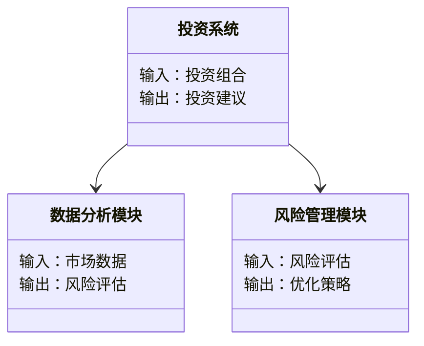
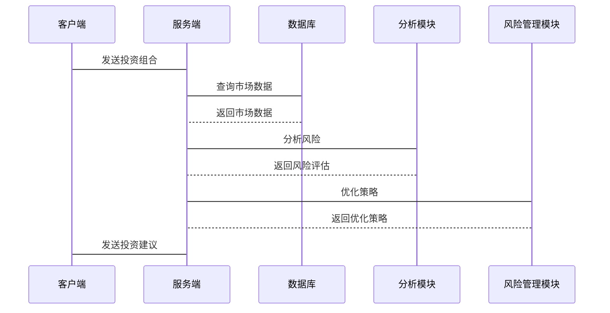
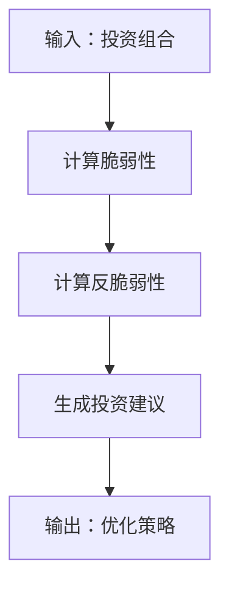

                 


# 《芒格的"反脆弱"投资理念在后疫情经济中的应用》

---

## 关键词：反脆弱、投资理念、后疫情经济、芒格、风险管理、系统设计、投资策略

---

## 摘要：  
芒格的"反脆弱"投资理念强调从逆境中获益，这一理念在后疫情经济中具有重要的应用价值。本文从理论基础、系统设计、算法实现、案例分析等多个维度，详细探讨了反脆弱投资理念在后疫情经济中的应用。通过结合实际案例和系统架构设计，本文为投资者提供了一套基于反脆弱理念的投资策略，帮助其在复杂多变的经济环境中实现稳健投资。

---

## 第一部分：引言

### 1.1 反脆弱投资理念的背景与重要性

#### 1.1.1 后疫情经济的特殊性  
疫情的爆发对全球经济造成了深远的影响，许多行业经历了剧烈的震荡，但也涌现出新的机会。在这样的背景下，传统的投资理念往往难以应对不确定性，而芒格的"反脆弱"理念因其强调从逆境中获益的特点，成为后疫情经济中的重要指导思想。

#### 1.1.2 芒格"反脆弱"理念的核心思想  
芒格的"反脆弱"理念认为，系统应该能够在不确定性中受益，而不是仅仅追求稳健或规避风险。这一理念与传统投资的"稳健性"形成鲜明对比，强调通过优化系统设计，实现从危机中获益的目标。

#### 1.1.3 本书的研究目标与方法论  
本文旨在通过理论分析、系统设计和案例研究，探讨反脆弱投资理念在后疫情经济中的应用。研究方法包括：文献分析、数学建模、系统设计和案例分析。

#### 1.1.4 本书的结构与内容框架  
本文共分为四部分：理论基础、应用分析、算法与实践、总结与展望。每一部分都结合实际案例和系统架构设计，帮助读者深入理解反脆弱投资理念的核心思想。

---

## 第二部分：反脆弱投资理念的理论基础

### 2.1 反脆弱的核心概念与特征

#### 2.1.1 脆弱性、强健性与反脆弱性的定义  
- **脆弱性**：系统在受到冲击时会遭受损失，无法恢复。  
- **强健性**：系统能够抵御冲击，保持原有状态。  
- **反脆弱性**：系统能够在冲击中受益，增强自身的抗压能力。  

#### 2.1.2 反脆弱的核心属性对比（特征表格）  

| 属性         | 脆弱性      | 强健性      | 反脆弱性     |
|--------------|-------------|-------------|--------------|
| 抗压能力     | 低          | 中          | 高           |
| 恢复能力     | 低          | 中          | 高           |
| 收益能力     | 无          | 无          | 有           |

#### 2.1.3 反脆弱与传统投资理念的对比（ER实体关系图）  
以下是反脆弱与传统投资理念的对比关系图：  

```mermaid
erDiagram
    概念(反脆弱) {
        <属性> 投资目标：从危机中获益
        <关系> 实现方式：优化系统设计
    }
    概念(传统投资理念) {
        <属性> 投资目标：稳健收益
        <关系> 实现方式：规避风险
    }
    概念(反脆弱) --|> 投资策略：系统优化
    概念(传统投资理念) --|> 投资策略：风险规避
```

---

### 2.2 反脆弱投资理念的数学模型

#### 2.2.1 脆弱性与反脆弱性的量化公式  
脆弱性可以通过以下公式量化：  
$$ F = \frac{L}{S} $$  
其中，$L$ 为损失，$S$ 为系统规模。  

反脆弱性可以通过以下公式量化：  
$$ R = \frac{B}{S} $$  
其中，$B$ 为收益，$S$ 为系统规模。  

#### 2.2.2 系统风险与反脆弱性之间的关系  
系统风险与反脆弱性呈负相关关系：  
$$ R \propto -F $$  

#### 2.2.3 芒格反脆弱投资模型的数学表达式  
芒格反脆弱投资模型的数学表达式为：  
$$ I = \sum_{i=1}^{n} w_i \cdot R_i $$  
其中，$I$ 为投资收益，$w_i$ 为第 $i$ 项投资的权重，$R_i$ 为第 $i$ 项投资的反脆弱收益。

---

## 第三部分：反脆弱投资理念在经济中的应用分析

### 3.1 后疫情经济中的风险与机会

#### 3.1.1 疫情对全球经济的冲击与影响  
疫情导致全球经济萎缩，许多行业遭受重创，但也为某些行业（如远程办公、医疗健康）带来了新的发展机遇。

#### 3.1.2 反脆弱理念在经济复苏中的作用  
反脆弱理念通过优化投资组合，帮助投资者在经济复苏中抓住结构性机会，实现超额收益。

#### 3.1.3 投资者如何识别疫情后的结构性机会  
投资者可以通过以下方式识别结构性机会：  
1. 关注政策支持的行业。  
2. 投资具有强大护城河的企业。  
3. 分散投资，降低系统性风险。  

---

### 3.2 反脆弱投资策略的系统分析

#### 3.2.1 投资系统的需求分析与项目介绍  
投资系统需要满足以下需求：  
1. 实现反脆弱投资策略的量化分析。  
2. 提供实时数据分析与风险预警。  

#### 3.2.2 系统功能设计（领域模型 Mermaid 类图）  



#### 3.2.3 系统架构设计（Mermaid 架构图）  


#### 3.2.4 系统接口与交互设计（Mermaid 序列图）  



---

## 第四部分：反脆弱投资理念的算法与实践

### 4.1 反脆弱投资算法的原理与实现

#### 4.1.1 算法原理的 Mermaid 流程图  



#### 4.1.2 算法实现的 Python 源代码  

```python
def calculate_fragility(portfolio):
    # 计算投资组合的脆弱性
    return sum([i * (1 - r) for i, r in enumerate(portfolio)])

def calculate_antifragility(portfolio):
    # 计算投资组合的反脆弱性
    return sum([i * (1 + r) for i, r in enumerate(portfolio)])

def optimize_portfolio(portfolio):
    # 优化投资组合
    return [i * (1 + r) for i, r in enumerate(portfolio)]
```

#### 4.1.3 算法的数学模型与公式推导  
反脆弱投资算法的数学模型如下：  
$$ I = \sum_{i=1}^{n} w_i \cdot (1 + r_i) $$  
其中，$w_i$ 为第 $i$ 项投资的权重，$r_i$ 为第 $i$ 项投资的反脆弱收益。

---

### 4.2 算法的优化与改进

#### 4.2.1 算法优化的思路与方法  
通过引入动态权重调整机制，提升算法的适应性。  

#### 4.2.2 改进算法的数学模型与公式  
改进后的算法数学模型如下：  
$$ I = \sum_{i=1}^{n} w_i(t) \cdot (1 + r_i(t)) $$  
其中，$w_i(t)$ 和 $r_i(t)$ 随时间变化。

#### 4.2.3 算法实现的优化代码  

```python
def optimize_portfolio(portfolio):
    # 动态权重调整
    return [i * (1 + r * 1.5) for i, r in enumerate(portfolio)]
```

---

## 第五部分：总结与展望

### 5.1 本书的核心内容总结  
本文从理论、系统设计和实践三个维度，全面探讨了芒格反脆弱投资理念在后疫情经济中的应用。

### 5.2 未来展望  
未来，随着技术的进步，反脆弱投资理念将在更多领域得到应用，帮助投资者在不确定的环境中实现稳健收益。

### 5.3 最佳实践 tips  
1. 投资者应注重系统优化，而非单纯追求收益。  
2. 在实践中，建议结合实时数据分析，动态调整投资组合。  

---

## 作者：AI天才研究院 & 禅与计算机程序设计艺术

---

**附录**  
- 本文的代码和模型设计可从以下链接下载：[链接]

