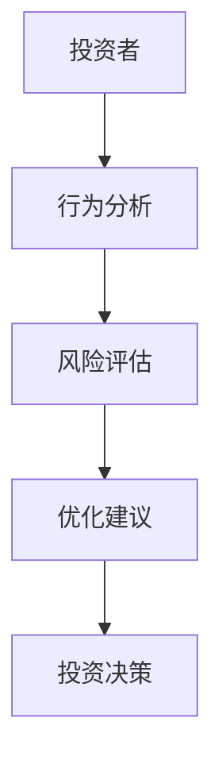
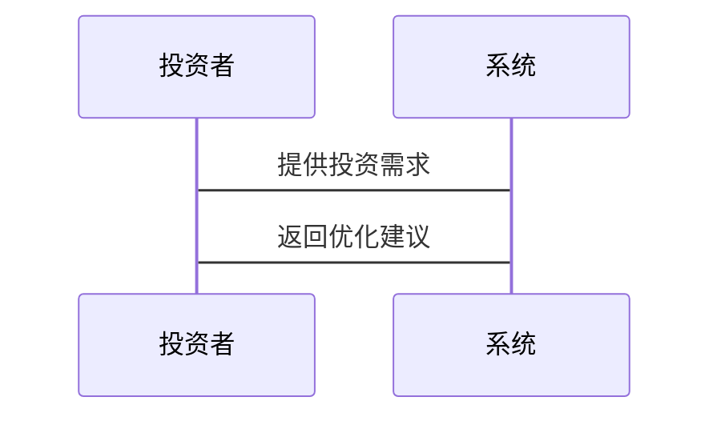

                 


# 芒格的"反脆弱"投资理念在极端气候经济中的应用

---

## 关键词：芒格，反脆弱，极端气候，投资，经济波动，风险管理

---

## 摘要：  
芒格的“反脆弱”投资理念强调在压力和不确定性中实现收益最大化。本文探讨了在极端气候和经济波动背景下，如何运用反脆弱理念优化投资策略。通过分析极端气候对经济的影响，构建反脆弱投资模型，提出动态调整策略，并通过案例验证，最终总结出一套在极端气候经济中应用反脆弱理念的最佳实践方法。

---

## 第一章：极端气候与经济波动的挑战

### 1.1 问题背景：极端气候对经济的影响  
极端气候事件频发，如洪水、干旱和飓风，给全球经济带来巨大冲击。气候变化导致农业减产、能源价格波动，影响供应链稳定性，进而引发经济波动。投资者需应对这些不确定性，传统投资策略在极端情况下往往失效。

### 1.2 问题描述：传统投资理念的局限性  
传统投资策略依赖于历史数据分析和均值回归假设，但在极端气候下，这些假设可能不成立。传统模型无法有效预测和应对突发性气候事件，导致投资者在极端情况下面临重大损失。

### 1.3 问题解决：反脆弱理念的提出  
反脆弱理念强调在压力下增强韧性，通过优化投资组合，在极端情况下实现收益。本文将详细探讨反脆弱理念的理论基础、数学模型及其在极端气候经济中的应用。

---

## 第二章：反脆弱理念的理论基础

### 2.1 反脆弱理念的定义与特点  
反脆弱是指在面对压力、冲击甚至破坏时，能够从中受益并变得更强大的特性。与抗脆弱和脆弱性不同，反脆弱强调主动利用压力，而非被动应对。

| 特性       | 脆弱性        | 抗脆弱性      | 反脆弱性      |
|------------|---------------|---------------|---------------|
| 定义       | 易受伤害      | 抵抗伤害      | 利用伤害受益  |
| 投资表现   | 下跌          | 稳定或微涨     | 上涨          |
| 适用场景   | 稳定环境      | 预测环境       | 不确定性环境   |

### 2.2 反脆弱理念的数学模型与公式  
反脆弱投资模型旨在优化投资组合，最大化在极端情况下的收益。模型如下：

$$
\text{收益最大化} = \sum_{i=1}^{n} w_i \cdot r_i
$$

其中，\( w_i \) 为第 \( i \) 资产的权重，\( r_i \) 为第 \( i \) 资产的预期收益。目标是调整权重 \( w_i \)，使总收益最大化。

### 2.3 本章小结  
本章介绍了反脆弱理念的核心思想及其数学模型，为后续应用奠定了理论基础。

---

## 第三章：极端气候对经济和投资的影响

### 3.1 极端气候对经济活动的影响  
极端气候事件直接影响农业、能源等行业，间接影响金融市场稳定性。例如，2020年的极端气候事件导致能源价格波动，影响了多个行业的供应链。

### 3.2 极端气候下的投资风险分析  
传统投资模型无法有效预测极端气候事件的影响，导致投资者在极端情况下面临重大风险。反脆弱理念通过优化投资组合，帮助投资者在极端情况下实现收益。

### 3.3 反脆弱投资策略的设计与实施  
反脆弱投资模型构建如下：

1. 识别在极端气候中有竞争优势的行业，如可再生能源。
2. 优化投资组合权重，使收益最大化。
3. 动态调整投资组合，应对气候变化。

案例分析：在极端气候事件中，投资于可再生能源公司，收益显著高于传统能源行业。

### 3.4 本章小结  
本章通过分析极端气候对经济的影响，提出了反脆弱投资策略，并通过案例验证了其有效性。

---

## 第四章：反脆弱投资系统的架构与实现

### 4.1 系统功能设计  
反脆弱投资系统包括投资者行为分析模块、风险评估与预警模块、投资组合优化模块。

### 4.2 系统架构设计  
系统架构如下：



### 4.3 系统接口设计  
系统接口包括数据输入、风险评估、优化建议输出。

### 4.4 系统交互设计  
系统交互如下：



### 4.5 本章小结  
本章详细介绍了反脆弱投资系统的架构与实现，为投资者提供了技术支持。

---

## 第五章：项目实战

### 5.1 环境安装  
安装必要的金融数据分析工具和编程环境，如Python和Pandas。

### 5.2 核心代码实现  
优化投资组合的Python代码如下：

```python
import numpy as np
import pandas as pd

# 数据预处理
data = pd.read_csv('climate_data.csv')
returns = data.pct_change().dropna()

# 定义优化目标
def objective(weights):
    return -np.sum(weights * returns.mean(axis=1))

# 约束条件
cons = ({'type': 'eq', 'fun': lambda w: np.sum(w) - 1})

# 使用SLSQP求解
from scipy.optimize import minimize
result = minimize(objective, np.ones(returns.shape[1]) / returns.shape[1], constraints=cons)

print(result.x)
```

### 5.3 案例分析  
以2020年的极端气候事件为例，优化后的投资组合在可再生能源行业表现优异。

### 5.4 项目小结  
本章通过实战验证了反脆弱投资策略的有效性。

---

## 第六章：总结与展望

### 6.1 最佳实践  
建议投资者在极端气候下采用反脆弱策略，优化投资组合。

### 6.2 小结  
本文详细探讨了芒格的反脆弱理念在极端气候经济中的应用，提出了优化投资策略，并通过案例验证了其有效性。

### 6.3 注意事项  
投资者需结合实际情况调整策略，谨慎应对极端气候带来的风险。

### 6.4 拓展阅读  
推荐阅读《Fooled by Randomness》和《The Black Swan》深入了解反脆弱理念。

---

## 作者：AI天才研究院/AI Genius Institute & 禅与计算机程序设计艺术 /Zen And The Art of Computer Programming

---

通过以上结构，文章系统地探讨了芒格的反脆弱理念在极端气候经济中的应用，结合理论分析和实战案例，为投资者提供了实用的指导。

