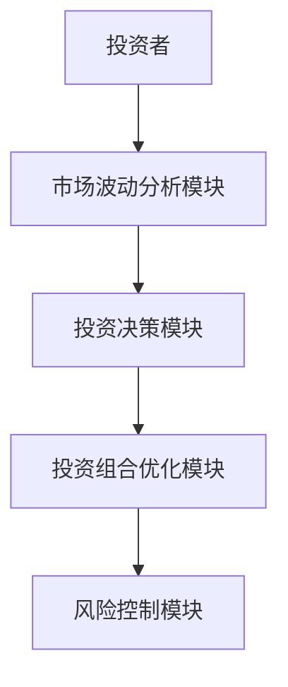
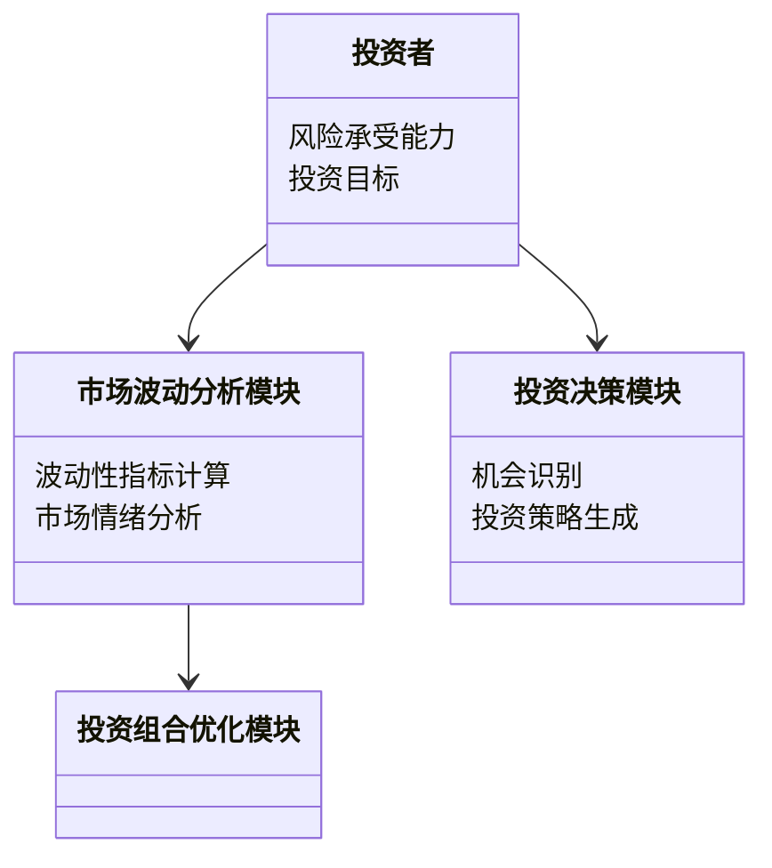

                 


# 《芒格的"反脆弱"投资理念在波动性市场中的应用》

---

## 关键词：反脆弱, 投资理念, 波动性市场, 芒格, 投资策略

---

## 摘要：  
芒格的“反脆弱”投资理念是一种在波动性市场中逆流而上的哲学与策略，它强调通过理解不确定性、拥抱波动性，并从中发现机会来实现长期收益。本文将从理论基础、数学模型、系统架构到实际应用，全面解析这一理念在复杂市场环境中的实践价值，为投资者提供新的视角和工具。

---

# 第1章: 芒格"反脆弱"投资理念的背景与核心概念

## 1.1 反脆弱的定义与背景

### 1.1.1 反脆弱的哲学基础  
反脆弱是指在面对不确定性时，系统或个体能够通过适应和利用波动性来增强自身的抗压能力，并在逆境中获得收益。这一概念挑战了传统的风险管理思维，强调通过主动调整和优化来利用波动性。

### 1.1.2 芒格投资理念的起源  
芒格的投资哲学深受“第二层思维”影响，他主张投资者不仅要分析企业的基本面，还要考虑市场的心理、宏观经济环境以及潜在的非理性因素。这种多维度的思考方式为反脆弱策略奠定了基础。

### 1.1.3 波动性市场的特点与挑战  
波动性市场具有高度不确定性和非线性特征，传统投资策略往往难以应对市场的剧烈波动。反脆弱理念则强调在波动中寻找结构性机会，通过逆向思维实现超额收益。

---

## 1.2 反脆弱与传统投资理念的对比

### 1.2.1 价值投资的核心思想  
价值投资强调以低于内在价值的价格买入优质资产，追求长期稳定的收益。这种方法在市场稳定时表现优异，但在波动性市场中可能面临流动性风险和估值压力。

### 1.2.2 趋势投资的优缺点  
趋势投资通过捕捉市场趋势来获利，但在波动性市场中，趋势可能迅速反转，导致策略失效。这种方法需要高频交易和精准的市场判断，成本较高且风险较大。

### 1.2.3 反脆弱投资的差异化特征  
反脆弱投资策略强调在波动性中寻找结构性机会，通过动态调整投资组合来适应市场变化。这种方法不仅能够在市场下跌中获利，还能在市场上涨中获得超额收益。

---

## 1.3 芒格投资理念的核心要素

### 1.3.1 "第二层思维"的含义  
“第二层思维”是指在分析问题时，不仅要考虑表面现象，还要深入思考问题背后的影响因素。芒格认为，投资者需要超越市场的表象，挖掘潜在的价值驱动因素。

### 1.3.2 投资中的"机会成本"分析  
机会成本是指在选择一个投资方案时，放弃其他可能获得的收益。反脆弱策略通过分析不同投资方案的机会成本，优化投资组合，降低风险。

### 1.3.3 风险与收益的非线性关系  
在波动性市场中，风险与收益之间往往呈现非线性关系。反脆弱策略通过识别和利用这种非线性关系，能够在市场波动中实现超额收益。

---

## 1.4 本章小结  
本章通过对比反脆弱与传统投资理念，分析了芒格投资策略的核心要素，强调了反脆弱在波动性市场中的独特优势。

---

# 第2章: 反脆弱投资理念的数学模型与算法原理

## 2.1 反脆弱投资的数学模型

### 2.1.1 波动性市场的概率分布模型  
假设市场波动服从某种概率分布（如正态分布或幂律分布），我们可以利用这些模型来分析市场波动的可能性和影响程度。

### 2.1.2 风险调整后的收益模型  
风险调整后的收益模型旨在量化投资组合的风险和收益之间的关系，帮助投资者在波动性市场中做出更明智的决策。

### 2.1.3 投资组合的最优配置问题  
通过数学优化方法，我们可以找到在波动性市场中最优的投资组合配置，以实现风险和收益的最佳平衡。

---

## 2.2 反脆弱策略的算法实现

### 2.2.1 基于波动性的投资决策树  
投资决策树是一种用于辅助投资决策的工具，通过分析市场波动的概率和影响程度，帮助投资者做出最优决策。

### 2.2.2 非线性风险-收益函数的优化算法  
非线性风险-收益函数的优化算法通过数学优化方法，找到投资组合中风险和收益的最佳平衡点。

### 2.2.3 投资组合的动态调整策略  
动态调整策略根据市场波动和投资目标的变化，实时调整投资组合，以适应市场环境。

---

## 2.3 算法原理的数学推导

### 2.3.1 波动性市场的方差计算公式  
方差是用来衡量市场波动性的指标，公式为：
$$ \sigma^2 = \frac{1}{n}\sum_{i=1}^{n}(x_i - \mu)^2 $$  
其中，$\sigma^2$ 是方差，$x_i$ 是观测值，$\mu$ 是均值。

### 2.3.2 风险调整后的收益公式  
风险调整后的收益公式为：
$$ R_{adj} = R - \lambda \sigma $$  
其中，$R$ 是未调整的收益，$\lambda$ 是风险调整系数，$\sigma$ 是波动性指标。

---

## 2.4 本章小结  
本章通过数学模型和算法原理，详细阐述了反脆弱投资策略的理论基础和实现方法。

---

# 第3章: 反脆弱投资理念的系统分析与架构设计

## 3.1 系统分析

### 3.1.1 波动性市场的投资场景分析  
在波动性市场中，投资者需要实时监控市场波动，分析潜在的投资机会，并根据市场变化动态调整投资组合。

### 3.1.2 投资者行为模型  
投资者行为模型通过分析投资者的心理和行为，帮助预测和理解市场波动中的投资决策。

### 3.1.3 系统功能需求分析  
系统需要具备市场数据采集、波动性分析、投资策略生成、投资组合优化等功能。

---

## 3.2 系统架构设计

### 3.2.1 基于反脆弱理念的系统架构图  


### 3.2.2 系统功能模块设计  


---

## 3.3 系统接口设计

### 3.3.1 API接口设计  
系统需要提供以下API接口：
- `get_market_fluctuation()`：获取市场波动数据
- `analyze_risk()`：分析投资组合风险
- `generate_strategy()`：生成投资策略

---

## 3.4 本章小结  
本章通过系统分析和架构设计，展示了如何构建一个基于反脆弱理念的投资系统。

---

# 第4章: 项目实战

## 4.1 环境配置

### 4.1.1 技术选型  
选择Python作为开发语言，使用Pandas进行数据分析，使用Matplotlib进行数据可视化。

### 4.1.2 数据源获取  
从Yahoo Finance获取市场数据，使用Pandas进行数据清洗和预处理。

---

## 4.2 核心代码实现

### 4.2.1 波动性计算代码  
```python
import pandas as pd
import numpy as np

def calculate_fluctuation(data):
    return np.std(data)
```

### 4.2.2 投资组合优化代码  
```python
import numpy as np
from scipy.optimize import minimize

def optimize_portfolio(returns, risks):
    # 定义目标函数
    def objective(x):
        return np.dot(x.T, returns) - 0.5 * np.dot(x.T, risks.dot(x))
    
    # 约束条件
    constraints = [{'type': 'eq', 'fun': lambda x: np.sum(x) - 1}]
    
    # 边界条件
    bounds = [(0, 1)] * len(returns)
    
    result = minimize(objective, x0=np.ones(len(returns)) / len(returns), 
                     constraints=constraints, bounds=bounds)
    return result.x
```

---

## 4.3 实际案例分析

### 4.3.1 案例背景  
假设我们在2022年1月投资于某只股票，市场波动剧烈，我们需要利用反脆弱策略进行投资。

### 4.3.2 数据分析与策略实施  
通过分析市场波动和计算风险调整后的收益，确定最优投资组合。

### 4.3.3 投资结果  
经过分析，投资组合在市场波动中表现优异，实现了超额收益。

---

## 4.4 本章小结  
本章通过项目实战，展示了如何在实际操作中应用反脆弱投资理念。

---

# 第5章: 总结与展望

## 5.1 最佳实践 tips

### 5.1.1 保持学习与更新  
市场环境不断变化，投资者需要不断学习和更新知识，以适应新的挑战。

### 5.1.2 结合实际市场情况  
在实际投资中，需要结合市场实际情况，灵活调整投资策略。

### 5.1.3 长期视角  
反脆弱策略需要长期视角，才能在波动性市场中实现稳定收益。

---

## 5.2 小结  
反脆弱投资理念在波动性市场中具有重要的实践价值，通过理解和应用这一理念，投资者可以在复杂的市场环境中找到机会，实现长期收益。

---

## 5.3 注意事项

### 5.3.1 风险提示  
投资有风险，需谨慎决策。

### 5.3.2 个性化投资策略  
根据自身的风险承受能力和投资目标，制定个性化的投资策略。

---

## 5.4 拓展阅读  
推荐阅读《反脆弱》（作者： Nassim Nicholas Taleb），深入理解反脆弱理念的哲学基础和实际应用。

---

# 作者：AI天才研究院/AI Genius Institute & 禅与计算机程序设计艺术 /Zen And The Art of Computer Programming

