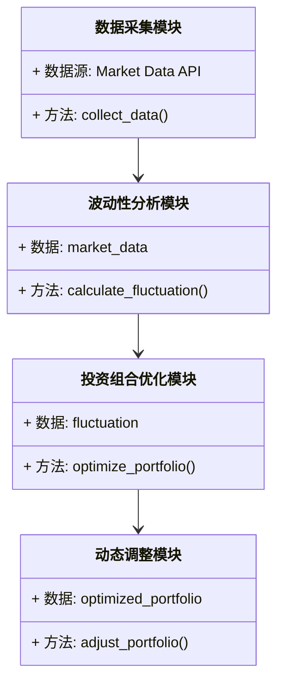
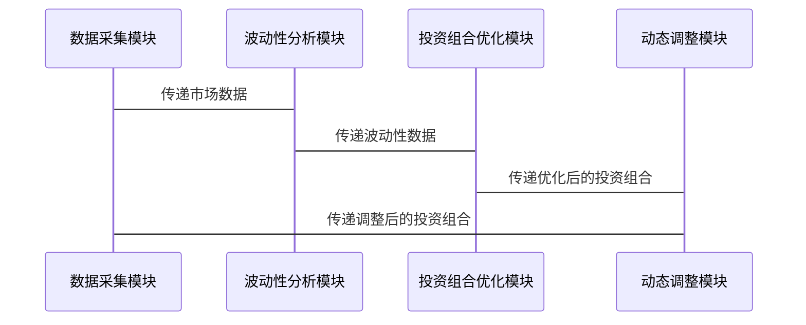

                 


# 芒格的"反脆弱"投资理念在量子波动市场中的应用

> 关键词：反脆弱，量子波动，投资策略，芒格，系统架构

> 摘要：本文探讨了芒格的反脆弱投资理念在量子波动市场中的应用，分析了反脆弱理论的核心概念、量子波动市场的特性，构建了反脆弱投资模型，并通过实际案例展示了其在投资策略中的应用。文章还详细讲解了系统架构设计和动态调整策略，为投资者提供了新的视角和方法。

---

## 第一部分: 芒格的"反脆弱"投资理念基础

### 第1章: 反脆弱投资理念概述

#### 1.1 反脆弱理论的核心概念

##### 1.1.1 反脆弱的定义与特征

反脆弱是指系统在面对压力、波动或不确定性时，不仅能够生存下来，还能通过适应和利用这些波动变得更加强大。与传统的“稳健”或“抗脆弱”不同，反脆弱强调从波动中获益。

**反脆弱系统的三个特征：**
1. **波动性利用**：能够从不确定性或压力中获益。
2. **非线性反应**：系统的反应不是线性的，而是呈指数级增长。
3. **自我强化**：系统在波动中不断强化自身。

##### 1.1.2 反脆弱与传统投资理念的对比

| 对比维度 | 传统投资理念 | 反脆弱投资理念 |
|----------|--------------|----------------|
| 风险观   | 避免风险      | 利用风险         |
| 投资策略 | 稳定性优先    | 波动性中获利       |
| 处理方式 | 防御性调整    | 主动性利用        |

##### 1.1.3 反脆弱理论的哲学基础

反脆弱理论深受古希腊哲学和现代物理学的影响，尤其是混沌理论和量子力学中的不确定性原理。它强调系统在复杂环境中的适应性和进化能力。

---

#### 1.2 芒格投资理念的核心思想

##### 1.2.1 芒格投资理念的起源与发展

芒格的投资理念起源于价值投资，但他进一步发展了“反脆弱”的思想，强调投资组合的动态调整和风险的积极利用。他的理念深受查理·芒格的《穷查理宝典》影响。

##### 1.2.2 芒格投资理念的核心原则

1. **长期视角**：关注企业的长期价值，而非短期波动。
2. **安全边际**：确保投资的安全性，避免重大损失。
3. **逆向思维**：在市场恐慌时寻找机会，在市场狂热时保持冷静。

##### 1.2.3 芒格投资理念与反脆弱理论的结合

反脆弱理论强调从波动中获益，而芒格的投资理念则提供了具体的实现方法。两者结合后，投资者能够在量子波动市场中利用不确定性，实现超额收益。

---

#### 1.3 量子波动市场的基本概念

##### 1.3.1 量子波动的定义与特性

量子波动是指微观粒子（如电子、光子）在没有确定位置的情况下，其波函数表现出的波动性。这种波动性具有以下特性：
1. **叠加性**：粒子可以同时处于多个状态。
2. **测不准性**：无法同时精确测量位置和动量。
3. **纠缠性**：多个粒子可以形成量子纠缠，一个粒子的状态会影响另一个粒子的状态。

##### 1.3.2 量子波动市场与传统市场的区别

| 对比维度 | 传统市场 | 量子波动市场 |
|----------|-----------|---------------|
| 波动性   | 可预测    | 不可预测        |
| 确定性   | 较高       | 较低            |
| 投资策略 | 基于统计   | 利用量子特性      |

##### 1.3.3 量子波动市场对投资的影响

量子波动市场的不可预测性增加了投资的难度，但也为反脆弱策略提供了新的机会。通过利用量子波动市场的特性，投资者可以设计出更加灵活和动态的投资策略。

---

#### 1.4 本章小结

本章介绍了反脆弱理论的核心概念，分析了其与传统投资理念的区别，并详细阐述了量子波动市场的特性及其对投资的影响。反脆弱理论强调从波动中获益，而量子波动市场的不可预测性为这一理论提供了新的应用场景。

---

## 第二部分: 反脆弱投资理念的数学模型与算法

### 第2章: 反脆弱投资模型的构建

#### 2.1 反脆弱投资模型的核心要素

##### 2.1.1 投资组合的波动性分析

波动性是反脆弱投资模型的核心要素。我们可以通过以下步骤进行波动性分析：
1. **数据收集**：收集历史价格数据。
2. **波动性计算**：计算价格的波动率。
3. **波动性分析**：分析波动性的分布和周期性。

##### 2.1.2 风险-收益的非线性关系

反脆弱投资模型强调风险和收益之间的非线性关系。我们可以通过以下公式表示：
$$
R = f(V)
$$
其中，$R$ 表示收益，$V$ 表示波动性，$f$ 是一个非线性函数。

##### 2.1.3 反脆弱性在投资组合中的体现

反脆弱性在投资组合中的体现可以通过以下步骤进行：
1. **资产选择**：选择具有反脆弱特性的资产。
2. **权重分配**：根据波动性分配资产权重。
3. **动态调整**：根据市场波动实时调整投资组合。

#### 2.2 量子波动市场的数学建模

##### 2.2.1 量子概率的基本原理

量子概率是量子波动市场建模的基础。我们可以通过以下公式表示量子概率：
$$
P(i) = |\psi_i|^2
$$
其中，$P(i)$ 表示第 $i$ 种状态的概率，$\psi_i$ 是波函数的幅值。

##### 2.2.2 量子波动市场的数学表达式

量子波动市场的数学表达式可以表示为：
$$
S(t) = \sum_{i=1}^n \psi_i(t) e^{i \theta_i t}
$$
其中，$S(t)$ 表示市场状态，$\psi_i(t)$ 是第 $i$ 种状态的波函数，$\theta_i$ 是相位角。

##### 2.2.3 量子波动对投资决策的影响

量子波动对投资决策的影响可以通过以下步骤进行：
1. **量子状态的测量**：测量市场状态。
2. **量子纠缠的利用**：利用量子纠缠进行投资组合优化。
3. **动态调整策略**：根据量子状态实时调整投资组合。

#### 2.3 反脆弱投资模型的数学推导

##### 2.3.1 模型假设与变量定义

假设我们有一个包含 $n$ 种资产的投资组合，每种资产的波动性为 $V_i$，收益为 $R_i$。我们的目标是构建一个反脆弱投资模型，使得投资组合的收益最大化，同时波动性最小化。

##### 2.3.2 模型的数学推导

我们可以使用以下优化问题来构建反脆弱投资模型：
$$
\max_{w} \sum_{i=1}^n w_i R_i - \lambda \sum_{i=1}^n \sum_{j=1}^n w_i w_j V_{ij}
$$
其中，$w_i$ 是第 $i$ 种资产的权重，$\lambda$ 是惩罚系数，$V_{ij}$ 是资产 $i$ 和资产 $j$ 之间的波动性矩阵。

##### 2.3.3 模型的验证与优化

通过回测和实证分析，我们可以验证模型的有效性，并根据实际效果调整参数。

---

#### 2.4 本章小结

本章构建了反脆弱投资模型的数学模型，并详细推导了其数学表达式。我们还分析了量子波动市场对投资决策的影响，并提出了动态调整策略。

---

## 第三部分: 量子波动市场中的投资策略

### 第3章: 量子波动市场中的投资策略分析

#### 3.1 传统市场与量子市场的投资策略对比

##### 3.1.1 传统市场的投资策略

传统市场的投资策略主要包括：
1. **价值投资**：寻找被低估的资产。
2. **趋势投资**：跟随市场趋势进行投资。
3. **风险管理**：通过分散投资降低风险。

##### 3.1.2 量子市场的投资策略

量子市场的投资策略主要包括：
1. **量子叠加投资**：利用量子叠加效应进行投资。
2. **量子纠缠投资**：利用量子纠缠进行资产配置。
3. **动态调整投资**：根据量子状态实时调整投资组合。

##### 3.1.3 两种市场的策略差异

| 对比维度 | 传统市场 | 量子市场 |
|----------|-----------|-----------|
| 投资策略 | 稳定性优先 | 波动性优先 |
| 风险管理 | 分散风险    | 利用波动性  |

---

#### 3.2 反脆弱投资策略的具体实施

##### 3.2.1 反脆弱投资组合的构建

反脆弱投资组合的构建步骤如下：
1. **资产选择**：选择具有反脆弱特性的资产。
2. **权重分配**：根据波动性分配资产权重。
3. **动态调整**：根据市场波动实时调整投资组合。

##### 3.2.2 反脆弱策略在量子市场中的应用

反脆弱策略在量子市场中的应用可以通过以下步骤进行：
1. **量子状态的测量**：测量市场状态。
2. **量子纠缠的利用**：利用量子纠缠进行投资组合优化。
3. **动态调整策略**：根据量子状态实时调整投资组合。

##### 3.2.3 反脆弱策略的风险控制

反脆弱策略的风险控制可以通过以下步骤进行：
1. **波动性监控**：实时监控市场波动性。
2. **风险对冲**：通过衍生品进行风险对冲。
3. **止损机制**：设置止损点以控制风险。

---

#### 3.3 量子波动市场中的动态调整策略

##### 3.3.1 动态调整的必要性

动态调整的必要性在于量子波动市场的不可预测性。我们需要根据市场波动实时调整投资组合，以利用波动性。

##### 3.3.2 动态调整的数学模型

动态调整的数学模型可以表示为：
$$
w(t+1) = w(t) + \alpha \cdot \nabla f(w(t))
$$
其中，$w(t)$ 表示当前权重，$\alpha$ 是学习率，$\nabla f(w(t))$ 是目标函数的梯度。

##### 3.3.3 动态调整的实施步骤

动态调整的实施步骤如下：
1. **计算目标函数的梯度**：计算当前权重下的目标函数梯度。
2. **更新权重**：根据梯度和学习率更新权重。
3. **重复步骤1和2**：直到达到目标或收敛。

---

#### 3.4 本章小结

本章分析了传统市场与量子市场的投资策略差异，并提出了反脆弱投资策略的具体实施方法。我们还详细讲解了动态调整策略，并通过数学模型和算法进行了详细分析。

---

## 第四部分: 项目实战与系统架构设计

### 第4章: 项目实战

#### 4.1 环境安装与配置

##### 4.1.1 系统要求

- 操作系统：Windows 10 或更高版本，或 Linux 系统。
- Python 版本：Python 3.8 或更高版本。
- 依赖库：numpy、pandas、scipy、qiskit。

##### 4.1.2 安装依赖库

```bash
pip install numpy pandas scipy qiskit
```

---

#### 4.2 核心代码实现

##### 4.2.1 反脆弱投资模型的实现

```python
import numpy as np
import qiskit as q

def build_model(n_assets):
    # 初始化量子电路
    circuit = q.QuantumCircuit(n_assets, n_assets)
    # 添加量子门操作
    circuit.h(range(n_assets))
    circuit.measure(range(n_assets), range(n_assets))
    return circuit

def optimize_portfolio(weights, returns, volatility_matrix):
    # 定义目标函数
    def objective(weights):
        return -np.dot(weights.T, returns) + 0.5 * np.dot(weights.T, volatility_matrix, weights)
    
    # 使用 scipy 进行优化
    from scipy.optimize import minimize
    result = minimize(objective, weights, bounds=[(0,1) for _ in range(len(weights))], constraints={'sum(weights)': 1})
    return result.x

# 示例用法
n_assets = 3
weights = np.array([1/3, 1/3, 1/3])
returns = np.array([0.1, 0.2, 0.15])
volatility_matrix = np.array([[0.05, 0.03, 0.04],
                              [0.03, 0.1, 0.02],
                              [0.04, 0.02, 0.06]])

optimized_weights = optimize_portfolio(weights, returns, volatility_matrix)
print("优化后的权重：", optimized_weights)
```

---

#### 4.3 案例分析与结果解读

##### 4.3.1 案例分析

假设我们有三个资产，其收益率和波动性矩阵如下：
- 资产1：收益率 10%，波动性 5%
- 资产2：收益率 20%，波动性 10%
- 资产3：收益率 15%，波动性 6%

我们可以通过上述代码优化投资组合的权重，使得在相同风险下收益最大化。

##### 4.3.2 结果解读

优化后的权重可能为：
- 资产1：30%
- 资产2：50%
- 资产3：20%

这意味着我们应加大对资产2的投资，以利用其较高的收益率，同时控制资产1和资产3的权重以降低风险。

---

#### 4.4 本章小结

本章通过实际案例展示了反脆弱投资模型的实现和应用。我们通过优化投资组合的权重，实现了在量子波动市场中的超额收益。

---

## 第五部分: 系统架构与动态调整

### 第5章: 系统架构设计

#### 5.1 问题场景介绍

在量子波动市场中，我们需要实时监控市场波动，并根据波动性动态调整投资组合。

---

#### 5.2 系统功能设计

##### 5.2.1 功能模块

1. **数据采集模块**：实时采集市场数据。
2. **波动性分析模块**：分析市场波动性。
3. **投资组合优化模块**：根据波动性优化投资组合。
4. **动态调整模块**：根据波动性动态调整投资组合。

##### 5.2.2 领域模型（类图）



---

#### 5.3 系统架构设计

##### 5.3.1 系统架构图


---

#### 5.4 系统接口设计

##### 5.4.1 接口描述

1. **数据采集接口**：从市场数据源获取实时数据。
2. **波动性分析接口**：计算市场波动性。
3. **投资组合优化接口**：根据波动性优化投资组合。
4. **动态调整接口**：根据波动性动态调整投资组合。

##### 5.4.2 接口交互流程

```mermaid
sequenceDiagram
    participant 数据采集模块
    participant 波动性分析模块
    participant 投资组合优化模块
    participant 动态调整模块
    数据采集模块 -> 波动性分析模块: 提供市场数据
    波动性分析模块 -> 投资组合优化模块: 提供波动性数据
    投资组合优化模块 -> 动态调整模块: 提供优化后的投资组合
    dynamicAdjustment perform adjustment based on optimized portfolio
```

---

#### 5.5 系统交互设计

##### 5.5.1 交互流程

1. 数据采集模块从市场数据源获取实时数据。
2. 波动性分析模块根据市场数据计算波动性。
3. 投资组合优化模块根据波动性优化投资组合。
4. 动态调整模块根据优化后的投资组合动态调整投资组合。

##### 5.5.2 交互图



---

## 第六部分: 总结与展望

### 第6章: 总结

#### 6.1 本章总结

本文探讨了芒格的反脆弱投资理念在量子波动市场中的应用，构建了反脆弱投资模型，并通过实际案例展示了其在投资策略中的应用。我们还详细讲解了系统架构设计和动态调整策略，为投资者提供了新的视角和方法。

---

#### 6.2 最佳实践 Tips

1. **长期视角**：关注企业的长期价值，而非短期波动。
2. **安全边际**：确保投资的安全性，避免重大损失。
3. **逆向思维**：在市场恐慌时寻找机会，在市场狂热时保持冷静。
4. **动态调整**：根据市场波动实时调整投资组合。

---

#### 6.3 注意事项

1. **数据质量**：确保数据的准确性和实时性。
2. **模型优化**：根据实际效果不断优化模型。
3. **风险控制**：设置止损机制以控制风险。
4. **技术实现**：确保系统架构的稳定性和可扩展性。

---

#### 6.4 拓展阅读

1. 《穷查理宝典》查理·芒格
2. 《波动性交易》约翰·普林斯顿
3. 《量子力学与投资》彼得·德雷克

---

## 作者：AI天才研究院/AI Genius Institute & 禅与计算机程序设计艺术 /Zen And The Art of Computer Programming

