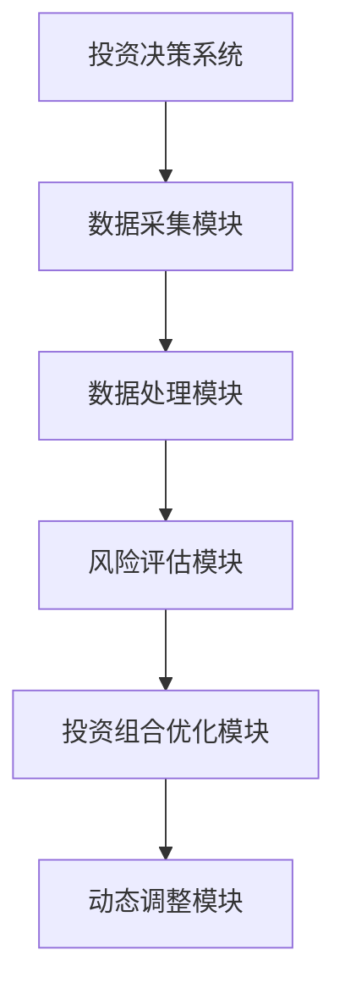
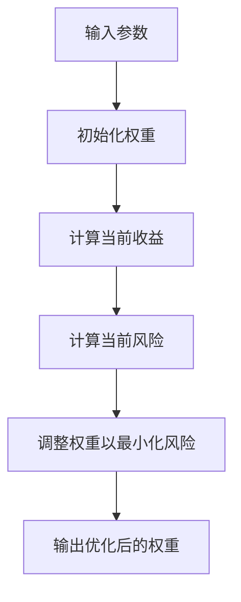
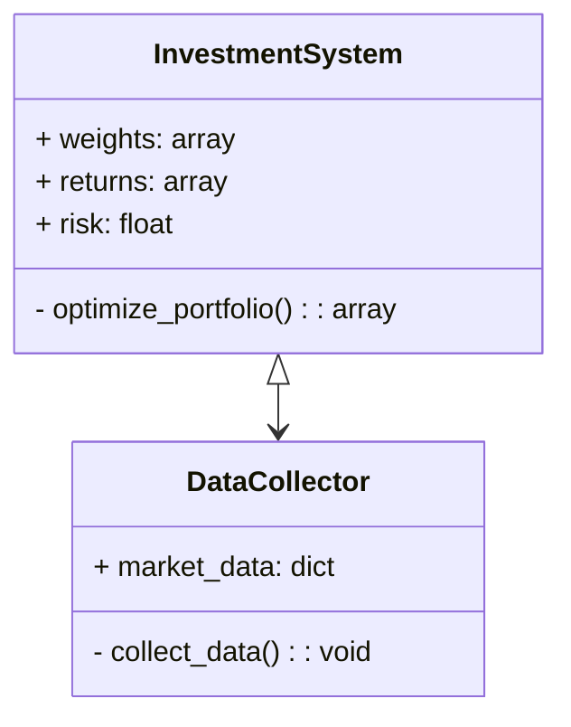

                 


# 芒格的"反脆弱"投资理念：在不确定性中茁壮成长

> 关键词：反脆弱，投资理念，风险管理，系统架构，算法设计，芒格

> 摘要：本文深入探讨了芒格提出的"反脆弱"投资理念，从概念解析、数学建模、算法设计、系统架构到实际案例分析，全面阐述了如何在不确定性和风险中构建稳健的投资体系。文章结合技术视角，通过系统架构图、算法流程图和数学公式等工具，详细解析了反脆弱理念在投资决策中的应用，并通过实际案例展示了其在复杂环境下的有效性。本文旨在为投资者和技术从业者提供一种新的思维方式，帮助他们在不确定性和风险中找到成长的机会。

---

## 第1章: 反脆弱的背景与核心思想

### 1.1 投资领域的不确定性与风险
投资世界本质上是一个充满不确定性的领域，市场的波动、经济周期的起伏以及突发事件的冲击都可能导致投资组合的收益与预期产生偏差。传统投资理论通常基于确定性假设，但在现实中，投资者需要面对的是高度不确定性和非线性变化的市场环境。

### 1.2 芒格投资理念的形成背景
芒格的投资理念深受其哲学背景影响，他强调以“逆向思维”为基础，注重安全边际和长期稳健的回报。反脆弱理念的提出，正是对传统风险管理思维的一种突破，强调在压力和不确定性中寻找成长机会。

### 1.3 反脆弱概念的提出与意义
反脆弱性是指系统在面对外界压力时，不仅能够承受冲击，还能通过调整和优化在压力中获得增强。在投资领域，反脆弱理念的意义在于帮助投资者构建能够在不确定性中持续增长的投资组合。

---

## 第2章: 反脆弱的核心概念与数学模型

### 2.1 反脆弱的核心概念解析
反脆弱性可以通过以下三个维度来定义：
1. **承受压力的能力**：系统在面对外部冲击时，能够吸收损失而不崩溃。
2. **从压力中获益的能力**：系统通过调整和优化，在压力中实现增强。
3. **动态适应性**：系统能够根据外部环境的变化调整自身结构和策略。

### 2.2 反脆弱的数学模型
反脆弱投资组合优化模型可以通过以下公式表示：

$$
\text{最大化收益} = \sum_{i=1}^{n} w_i r_i - \lambda \sum_{i=1}^{n} w_i^2
$$

其中：
- \(w_i\) 是第 \(i\) 个资产的权重。
- \(r_i\) 是第 \(i\) 个资产的预期收益。
- \(\lambda\) 是风险惩罚因子。

### 2.3 反脆弱与脆弱性的对比分析
通过对比脆弱性和反脆弱性，我们可以更好地理解两者的区别：

| 特性          | 脆弱性            | 反脆弱性          |
|---------------|-------------------|-------------------|
| 压力反应       | 损失或崩溃        | 增强或收益        |
| 风险暴露       | 高度敏感          | 低敏感或受益      |
| 系统调整能力   | 无法从压力中获益   | 能够从压力中获益   |

---

## 第3章: 反脆弱投资的系统架构与算法设计

### 3.1 投资决策系统的整体架构
反脆弱投资系统的架构可以分为以下几个模块：



### 3.2 反脆弱算法的核心设计
反脆弱算法的核心在于通过动态调整投资组合的权重，以应对市场波动和不确定性。以下是一个简化的优化算法流程：



### 3.3 算法实现的代码示例
以下是反脆弱投资组合优化算法的Python代码示例：

```python
import numpy as np

def reverse_fragility_optimizer(weights, returns, lambda_factor):
    # 计算当前组合的收益和风险
    current_return = np.dot(weights, returns)
    current_risk = np.sum(weights**2)
    
    # 调整权重以最小化风险
    optimized_weights = weights * (1 / (1 + current_risk))
    optimized_weights = optimized_weights / np.sum(optimized_weights)
    
    return optimized_weights

# 示例使用
weights = np.array([0.3, 0.4, 0.3])
returns = np.array([0.1, 0.2, 0.15])
lambda_factor = 0.1

optimized_weights = reverse_fragility_optimizer(weights, returns, lambda_factor)
print("优化后的权重:", optimized_weights)
```

---

## 第4章: 反脆弱投资的项目实战

### 4.1 项目背景与目标
在一个充满不确定性的市场环境中，我们需要设计一个能够动态调整投资组合的系统，以应对市场波动和突发事件。

### 4.2 项目系统设计
系统的功能模块设计如下：



### 4.3 项目核心代码实现
以下是项目的主代码实现：

```python
class InvestmentSystem:
    def __init__(self, weights, returns):
        self.weights = weights
        self.returns = returns
        self.risk = self.calculate_risk()
    
    def calculate_risk(self):
        return np.sum(self.weights**2)
    
    def optimize_portfolio(self):
        current_risk = self.risk
        optimized_weights = self.weights * (1 / (1 + current_risk))
        optimized_weights = optimized_weights / np.sum(optimized_weights)
        return optimized_weights

# 示例使用
weights = np.array([0.3, 0.4, 0.3])
returns = np.array([0.1, 0.2, 0.15])

system = InvestmentSystem(weights, returns)
optimized_weights = system.optimize_portfolio()
print("优化后的权重:", optimized_weights)
```

---

## 第5章: 最佳实践与总结

### 5.1 小结
反脆弱理念的核心在于通过动态调整和优化，在不确定性中实现稳健增长。本文从理论到实践，详细解析了如何将反脆弱理念应用于投资决策中。

### 5.2 注意事项
1. **模型假设的局限性**：反脆弱模型基于假设，实际应用中需结合具体市场环境进行调整。
2. **数据质量的重要性**：模型的准确性依赖于高质量的数据输入。
3. **动态调整的频率**：过于频繁的调整可能导致交易成本增加，需权衡利弊。

### 5.3 拓展阅读
1. 《Fooled by Randomness》—— Nassim Taleb
2. 《The Black Swan》—— Nassim Taleb
3. 《投资学原理》—— Richard A. Brealey

---

作者：AI天才研究院 & 禅与计算机程序设计艺术

