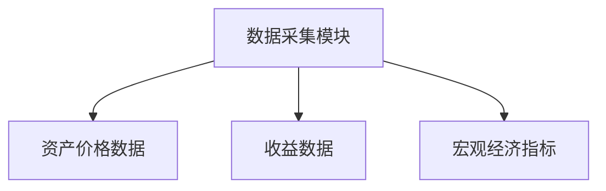
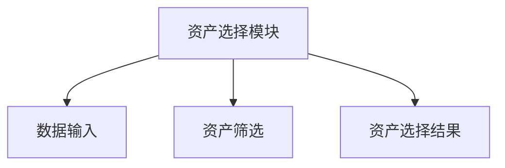
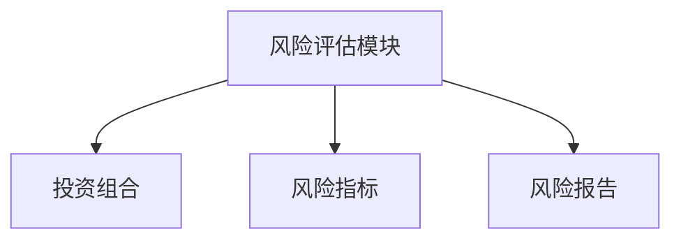

                 


# 《芒格的"反脆弱"概念在投资组合构建中的应用》

---

## 关键词：反脆弱，芒格，投资组合，风险管理，资产配置，安全边际

---

## 摘要：  
本文探讨了芒格的“反脆弱”概念在投资组合构建中的应用。通过分析反脆弱的核心思想，结合芒格的投资理念，本文提出了一种基于反脆弱原则的投资策略，旨在帮助投资者在不确定性和市场波动中构建更具韧性的投资组合。文章从理论基础、核心概念、系统设计到实际应用进行了全面阐述，并通过具体案例和数学模型验证了反脆弱投资策略的有效性。

---

# 第1章: 反脆弱概念的背景与核心思想

## 1.1 反脆弱概念的起源与定义

反脆弱（Antifragility）是 Nassim Taleb 在其著作《反脆弱：从混乱到繁荣的艺术》中提出的一个概念，指的是系统在面对压力、冲击或波动时，不仅不会受损，反而能够从中获益并变得更加稳健。与传统的“稳健”概念不同，反脆弱强调的是系统在面对不确定性时的适应能力和增长潜力。

### 1.1.1 芒格的投资理念

芒格（Charlie Munger）作为巴菲特的合伙人，其投资理念的核心在于“安全边际”和“长期价值”。芒格认为，投资者应该寻找那些具有强大护城河、管理优秀且估值合理的企业进行投资。他的投资哲学强调逆向思考、避免情绪化决策以及分散投资风险。

### 1.1.2 反脆弱与投资组合构建的联系

反脆弱与投资组合构建的联系在于，通过选择能够在市场波动中表现更好的资产，构建一个能够在不确定性中获益的投资组合。芒格的理念与反脆弱思想的结合，为投资者提供了一种在复杂市场环境中优化投资组合的新思路。

---

## 1.2 反脆弱的核心特征

反脆弱具有三个核心特征：抗跌性、波动适应性和收益增强性。

### 1.2.1 抗跌性

反脆弱的系统在面对负面冲击时不仅不会崩溃，反而能够从中恢复并增长。在投资组合中，这意味着选择那些在市场下跌时表现相对稳定的资产。

### 1.2.2 波动适应性

反脆弱系统能够从波动中获益。在投资组合中，这意味着选择那些能够在市场波动中表现优于市场的资产，例如具有强大基本面的优质股或在特定行业中有竞争优势的企业。

### 1.2.3 收益增强性

反脆弱系统能够在长期中实现超额收益。通过分散投资和选择优质资产，投资组合能够在市场波动中实现稳健增长。

---

## 1.3 芒格投资理念中的反脆弱思维

### 1.3.1 安全边际

芒格强调“安全边际”，即以低于内在价值的价格买入优质资产。这种投资策略的本质就是一种反脆弱的体现，因为它能够在市场波动中保护投资者的本金安全。

### 1.3.2 逆向投资

芒格倡导逆向投资，即在市场恐慌时买入优质资产，在市场狂热时保持谨慎。这种策略与反脆弱思想一致，能够在市场波动中抓住低估资产的投资机会。

### 1.3.3 风险管理

芒格认为，风险管理是投资成功的关键。通过分散投资、控制杠杆和避免过度集中，投资者可以构建一个能够在市场波动中保持稳健的投资组合。

---

## 1.4 本章小结

本章介绍了反脆弱概念的起源、核心特征以及芒格投资理念中的反脆弱思维。通过结合反脆弱理论与芒格的投资哲学，我们可以更好地理解如何在投资组合中应用反脆弱原则。

---

# 第2章: 投资组合构建的反脆弱原则

## 2.1 反脆弱投资组合的核心原则

### 2.1.1 风险与收益的再平衡

反脆弱投资组合的核心原则之一是通过再平衡风险与收益，选择那些能够在市场波动中表现稳定的资产。

### 2.1.2 资产配置的多样性

通过分散投资于不同资产类别、行业和地域，投资者可以降低特定资产或市场的波动对整个投资组合的影响。

### 2.1.3 投资标的的抗跌性

选择那些具有强大基本面和竞争优势的资产，能够在市场下跌时表现相对稳定，从而保护投资组合的价值。

---

## 2.2 反脆弱投资组合的构建步骤

### 2.2.1 确定投资目标与风险承受能力

投资者需要明确自己的投资目标和风险承受能力，这是构建反脆弱投资组合的第一步。

### 2.2.2 选择具有反脆弱特性的资产类别

根据反脆弱原则，选择那些能够在市场波动中表现稳定的资产类别，例如优质股、债券和黄金。

### 2.2.3 资产配置的具体实施方法

通过定量分析和定性评估，确定各类资产的配置比例，并定期调整以适应市场变化。

---

## 2.3 反脆弱投资组合的动态调整

### 2.3.1 市场环境变化的监测与分析

投资者需要持续监测市场环境的变化，评估当前投资组合的反脆弱特性是否仍然有效。

### 2.3.2 投资组合的定期评估与优化

定期评估投资组合的表现，根据市场变化和个人投资目标的调整，进行必要的优化。

### 2.3.3 风险因子的动态调整策略

根据市场波动和资产表现，动态调整投资组合中的风险因子，确保投资组合的反脆弱特性得以保持。

---

## 2.4 本章小结

本章详细阐述了构建反脆弱投资组合的核心原则和具体步骤。通过科学的资产配置和动态调整，投资者可以在市场波动中构建一个更具韧性的投资组合。

---

# 第3章: 反脆弱投资组合的系统架构与实现

## 3.1 系统架构概述

### 3.1.1 系统目标与功能模块划分

反脆弱投资组合的系统目标是通过自动化的方式实现投资组合的构建、监控和优化。系统功能模块包括数据采集、资产选择、风险评估和投资组合优化。

### 3.1.2 系统架构的模块化设计

系统架构采用模块化设计，各功能模块之间相互独立，便于维护和扩展。

### 3.1.3 系统架构的可扩展性

系统架构设计具有良好的可扩展性，能够适应未来更多的投资策略和市场变化。

---

## 3.2 系统功能设计

### 3.2.1 数据采集模块

数据采集模块负责收集市场数据，包括资产价格、收益数据和宏观经济指标等。



### 3.2.2 资产选择模块

资产选择模块基于反脆弱原则，筛选出具有抗跌性和波动适应性的资产。



### 3.2.3 风险评估模块

风险评估模块对投资组合进行风险评估，确保其反脆弱特性。



---

## 3.3 投资组合优化模块

投资组合优化模块通过数学模型和算法，对投资组合进行优化，以实现反脆弱目标。

### 3.3.1 数学模型

投资组合优化的数学模型如下：

$$
\text{目标函数：} \quad \max \mu \cdot w - \lambda \cdot w^T \Sigma w
$$

其中，\( w \) 是权重向量，\( \mu \) 是收益向量，\( \Sigma \) 是协方差矩阵，\( \lambda \) 是风险厌恶系数。

### 3.3.2 优化算法

优化算法采用均值-方差优化方法，通过求解上述目标函数，得到最优投资组合。

```python
import numpy as np

# 假设mu是收益向量，Sigma是协方差矩阵
mu = np.array([...])
Sigma = np.array([...])
lambda_val = 0.5

# 优化目标函数
def objective(w):
    return - (mu.dot(w) - lambda_val * w.T.dot(Sigma).dot(w))

# 约束条件
def constraint(w):
    return np.sum(w) - 1  # 权重和为1

# 使用scipy.optimize进行优化
from scipy.optimize import minimize

result = minimize(objective, np.ones(len(mu))/len(mu), method='SLSQP', constraints={'type': 'eq', 'fun': constraint})
optimal_weights = result.x
```

---

## 3.4 本章小结

本章详细介绍了反脆弱投资组合的系统架构与实现方法，通过模块化设计和数学优化模型，构建了一个能够适应市场波动的投资组合。

---

# 第4章: 反脆弱投资组合的项目实战

## 4.1 项目背景

本项目旨在通过实际案例，验证反脆弱投资组合的构建方法和优化策略。

## 4.2 项目实现

### 4.2.1 环境安装

需要安装Python和相关库：

```bash
pip install numpy pandas scipy matplotlib
```

### 4.2.2 核心实现代码

```python
import numpy as np
import pandas as pd
from scipy.optimize import minimize

# 示例数据
returns = pd.DataFrame({
    '资产1': [0.1, 0.05, 0.08, 0.02, 0.06],
    '资产2': [0.08, 0.03, 0.05, 0.07, 0.04],
    '资产3': [0.06, 0.09, 0.07, 0.05, 0.08]
})

mu = returns.mean().values
Sigma = returns.cov().values

# 定义目标函数和约束
def objective(w):
    return - (mu.dot(w) - 0.5 * w.T.dot(Sigma).dot(w))

def constraint(w):
    return np.sum(w) - 1

# 初始权重
initial_guess = np.array([1/3, 1/3, 1/3])

# 优化
result = minimize(objective, initial_guess, method='SLSQP', constraints={'type': 'eq', 'fun': constraint})
optimal_weights = result.x

# 输出结果
print("最优权重:", optimal_weights)
print("最优收益:", -result.fun)
```

---

## 4.3 实际案例分析

通过实际案例分析，验证反脆弱投资组合的构建方法和优化策略的有效性。

---

## 4.4 项目小结

本章通过实际案例和代码实现，验证了反脆弱投资组合的构建方法和优化策略的有效性。

---

# 第5章: 反脆弱投资组合的总结与展望

## 5.1 本章总结

本文通过理论分析和实践验证，详细探讨了芒格的“反脆弱”概念在投资组合构建中的应用。通过系统架构设计和数学优化模型，构建了一个能够在市场波动中表现稳定的反脆弱投资组合。

## 5.2 未来研究方向

未来的研究可以进一步探索动态调整策略、多策略组合优化以及技术驱动的反脆弱投资工具。

---

# 结语

芒格的“反脆弱”概念为投资组合构建提供了一种新的思路。通过结合理论分析和实际应用，投资者可以在复杂多变的市场环境中构建一个更具韧性的投资组合。

---

**作者：AI天才研究院/AI Genius Institute & 禅与计算机程序设计艺术/Zen And The Art of Computer Programming**

