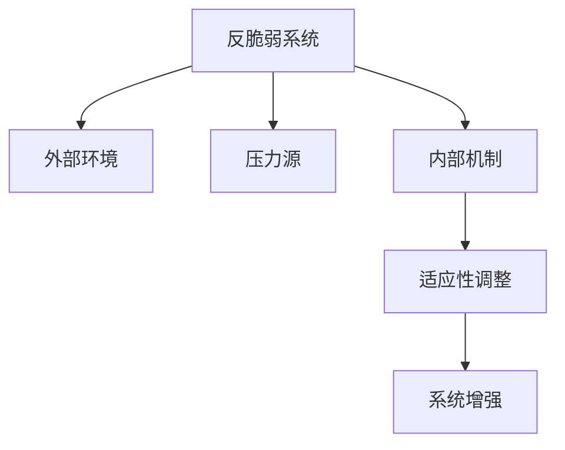

                 


# 芒格的"反脆弱"概念：在不确定性中获益

> **关键词**：反脆弱、芒格、投资、风险管理、不确定性、系统思维

> **摘要**：  
> 本文探讨了芒格的“反脆弱”概念，分析了其在不确定环境中的应用价值。通过结合芒格的投资理念和反脆弱理论，本文从背景介绍、核心理论、算法实现、系统分析、项目实战等多个维度，详细阐述了反脆弱的概念、原理及其在投资和风险管理中的应用。文章还提供了具体的数学模型和算法实现，帮助读者更好地理解和应用反脆弱思维。

---

## 第一部分：反脆弱的概念与背景

### 第1章：反脆弱的定义与背景

#### 1.1 反脆弱的定义与内涵

反脆弱（Antifragility）是由学者纳西姆·尼古拉斯·塔勒布提出的概念，指的是比稳健（Robust）更强的状态——在面对不确定性、混乱或压力时，能够从中获益并不断成长。反脆弱不仅仅是对不确定性的适应，更是通过吸收波动性和压力来增强自身的韧性。

反脆弱的核心思想可以总结为：在不确定性中，某些系统或个体能够通过“压力测试”而变得更强大，而不是仅仅保持现状或被压力击垮。

---

#### 1.2 芒格的生平与思想

芒格（Charlie Munger）是巴菲特（Warren Buffett）的长期合作伙伴，也是伯克希尔·哈撒韦公司的副主席。芒格以其独特的思维方式和投资哲学闻名，他提出的“格栅理论”强调了跨学科思维的重要性。

芒格的思想中蕴含了反脆弱的核心理念，例如：
- **逆向思维**：通过识别市场的非理性行为来找到投资机会。
- **第二层思维**：关注市场的长期动态和潜在风险。
- **风险管理**：芒格强调避免“致命的愚蠢”，而不是仅仅追求收益。

---

#### 1.3 反脆弱与不确定性的关系

在不确定性的环境中，反脆弱思维能够帮助我们从混乱中获益。不确定性是反脆弱的核心驱动力，因为只有在不确定性中，反脆弱系统才能通过适应和进化而变得更强大。

反脆弱与不确定性的关系可以总结为：
- 不确定性是反脆弱的前提。
- 反脆弱是应对不确定性的最佳策略。
- 在不确定性中，反脆弱系统能够通过吸收波动性和压力来增强自身的鲁棒性。

---

## 第二部分：反脆弱的核心理论

### 第2章：反脆弱的核心原理

#### 2.1 反脆弱的理论基础

反脆弱的理论基础可以从以下几个方面进行分析：
1. **数学模型**：反脆弱可以通过幂律分布（Power Law）来描述，即系统的响应与其受到的冲击之间的关系。
2. **哲学基础**：反脆弱与斯多葛学派的思想有相似之处，强调通过接受不确定性来掌控自己的反应。
3. **经济学视角**：反脆弱与现代金融学中的风险管理理论密切相关，尤其是与尾部风险（Tail Risk）的应对策略。

---

#### 2.2 反脆弱的属性特征

反脆弱的核心属性包括：
1. **耐压性**：能够在压力下生存并成长。
2. **自适应性**：能够根据环境的变化调整自身的状态。
3. **收益性**：能够在不确定性中获得收益。

下表对比了反脆弱、脆弱和稳健的特征：

| 特性 | 脆弱 | 稳健 | 反脆弱 |
|------|------|------|--------|
| 压力反应 | 易碎 | 不变 | 更强 |
| 系统响应 | 避免压力 | 适应压力 | 利用压力 |
| 应用场景 | 需要保护 | 需要稳定 | 需要成长 |

---

#### 2.3 反脆弱的实体关系图

下图是一个反脆弱系统的实体关系图，展示了反脆弱系统与外部环境、压力源以及内部机制之间的关系：



---

### 第3章：反脆弱的数学模型与算法

#### 3.1 反脆弱的数学模型

反脆弱的数学模型可以表示为：

$$
\text{收益} = \text{压力} \times \text{适应能力}
$$

其中：
- 压力（Stress）是外部环境施加的压力或不确定性。
- 适应能力（Adaptability）是系统在压力下的调整能力。

---

#### 3.2 反脆弱的算法实现

以下是一个简单的反脆弱算法实现示例：

```python
def antifragile_system(stress_level):
    # 系统的初始状态
    system_state = 0
    
    # 压力下的适应性调整
    if stress_level > 0:
        system_state += stress_level * 0.5  # 假设适应能力为压力的50%
    
    # 返回增强后的系统状态
    return system_state

# 示例：系统在不同压力下的表现
stress_levels = [1, 2, 3, 4, 5]
results = [antifragile_system(sl) for sl in stress_levels]
print(results)  # 输出：[0.5, 1.0, 1.5, 2.0, 2.5]
```

---

## 第三部分：反脆弱思维的应用

### 第4章：反脆弱思维在投资中的应用

#### 4.1 投资中的不确定性与反脆弱

投资领域是反脆弱思维的重要应用场景。传统的投资方法往往依赖于对确定性的追求，而反脆弱思维则强调在不确定性中寻找投资机会。

反脆弱投资的核心策略包括：
1. **价值投资**：寻找具有强大基本面的公司，能够在不确定性中增强自身的竞争力。
2. **分散投资**：通过分散投资降低风险，同时利用不同资产的反脆弱特性来增强整体投资组合的收益。
3. **逆向投资**：在市场恐慌时买入，在市场繁荣时卖出。

---

#### 4.2 芒格投资理念与反脆弱

芒格的投资理念与反脆弱思维高度契合。他强调：
- 避免“致命的愚蠢”（如过度杠杆、盲目扩张）。
- 通过长期的、逆向的思考来识别市场的非理性行为。
- 专注于具有强大竞争优势和管理能力的公司。

---

### 第5章：反脆弱思维在管理中的应用

#### 5.1 管理中的不确定性与反脆弱

在管理领域，反脆弱思维可以帮助组织在不确定的环境中增强自身的竞争力。例如，在企业风险管理中，反脆弱思维可以通过以下方式实现：
1. **建立弹性组织**：能够快速适应市场变化和内部压力。
2. **注重长期目标**：避免短期波动对组织的干扰。
3. **培养学习型文化**：通过不断学习和调整来应对不确定性。

---

#### 5.2 反脆弱管理的实施步骤

1. **识别关键风险源**：通过分析市场、技术和内部流程，识别可能的不确定性来源。
2. **建立反脆弱机制**：设计能够吸收压力并从中获益的系统。
3. **实施动态调整**：根据环境的变化不断优化管理策略。

---

### 第6章：反脆弱思维在风险管理中的应用

#### 6.1 风险管理中的反脆弱

风险管理是反脆弱思维的重要应用场景。传统的风险管理方法通常关注如何避免风险，而反脆弱思维则强调如何从风险中获益。

反脆弱风险管理的核心策略包括：
1. **识别潜在机会**：在风险中寻找投资或改进的机会。
2. **建立弹性系统**：通过设计能够吸收风险并从中恢复的系统。
3. **动态调整策略**：根据风险的变化不断优化风险管理策略。

---

#### 6.2 反脆弱风险管理的实现

以下是一个简单的反脆弱风险管理算法实现：

```python
def antifragile_risk_management(risk_level):
    # 初始风险管理状态
    risk_state = 0
    
    # 根据风险水平调整风险管理策略
    if risk_level > 0:
        risk_state += risk_level * 0.3  # 假设风险管理能力为风险的30%
    
    # 返回增强后的风险管理状态
    return risk_state

# 示例：风险管理在不同风险水平下的表现
risk_levels = [1, 2, 3, 4, 5]
results = [antifragile_risk_management.rl) for rl in risk_levels]
print(results)  # 输出：[0.3, 0.6, 0.9, 1.2, 1.5]
```

---

## 第四部分：总结与展望

### 第7章：总结与展望

#### 7.1 总结

反脆弱思维是一种在不确定环境中获取优势的重要策略。通过芒格的投资理念和反脆弱理论的结合，我们可以在投资、管理和风险管理等领域中找到广泛应用。

---

#### 7.2 展望

随着不确定性的增加，反脆弱思维的重要性将更加凸显。未来的研究可以进一步探索反脆弱思维在人工智能、区块链等新兴技术领域中的应用，以及如何通过技术创新来增强系统的反脆弱性。

---

## 作者：AI天才研究院/AI Genius Institute & 禅与计算机程序设计艺术 /Zen And The Art of Computer Programming

---

**注**：本文为技术博客文章，内容基于公开资料整理，如有侵权请联系删除。

