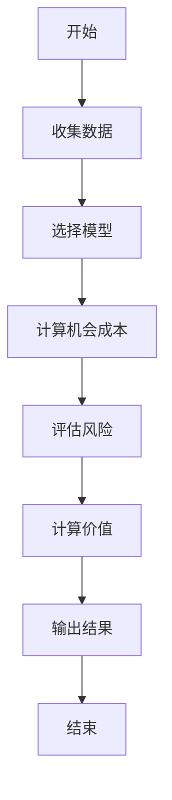
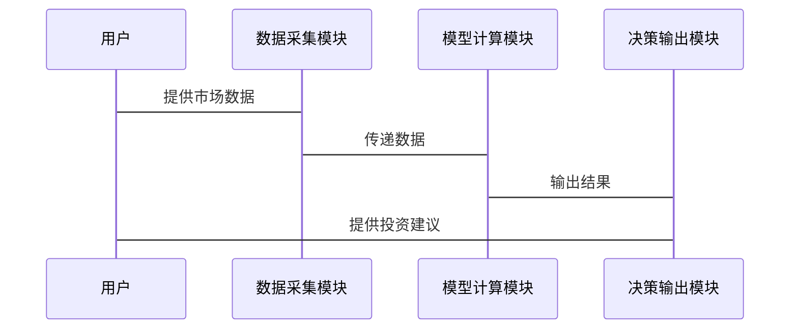

                 


```markdown
# 芒格的"地图思维"在投资战略制定中的应用

> 关键词：芒格，地图思维，投资战略，多学科模型，决策框架

> 摘要：本文深入探讨了芒格的"地图思维"在投资战略制定中的应用。通过分析"地图思维"的核心概念、数学模型、系统架构以及实际案例，展示了如何将多学科思维模型应用于投资决策中，构建高效的投资战略制定系统。

---

## 第一部分: 芒格"地图思维"的核心概念

### 1.1 芒格"地图思维"的背景介绍

#### 1.1.1 "地图思维"的定义
"地图思维"是芒格提出的一种多维度分析方法，强调通过多个学科的视角构建决策框架。其核心在于将复杂问题拆解为多个简单问题，并通过跨学科模型进行分析。

#### 1.1.2 投资战略制定的背景与挑战
在现代投资环境中，市场波动剧烈，信息复杂且不透明。传统单一学科的分析方法已难以应对复杂的市场变化，投资者需要一种更全面的决策框架。

#### 1.1.3 "地图思维"的核心要素
- **知识广度**：涵盖经济学、心理学、管理学等多个学科。
- **模型深度**：每个模型都需要深入理解其内在逻辑。
- **模型关联性**：模型之间需要相互印证，形成完整的决策框架。

### 1.2 多学科思维模型的优势

#### 1.2.1 多学科思维模型的定义
多学科思维模型是指将不同学科的理论和方法结合起来，用于解决复杂问题的思维方式。

#### 1.2.2 多学科思维模型的特点
- **综合性**：能够从多个角度分析问题。
- **灵活性**：适用于不同场景的分析。
- **系统性**：能够构建完整的决策框架。

#### 1.2.3 多学科思维模型与传统方法的对比
| 对比维度 | 多学科思维模型 | 传统单一学科模型 |
|----------|----------------|-------------------|
| 分析角度 | 多维度         | 单一维度         |
| 适用性   | 高度灵活       | 较低              |
| 决策质量 | 高             | 一般              |

---

## 第二部分: "地图思维"的数学模型与算法

### 2.1 投资决策中的数学模型

#### 2.1.1 机会成本分析模型
机会成本是指在决策中放弃某项选择所付出的代价。其数学公式为：
$$ \text{机会成本} = \text{最佳选择的价值} - \text{次优选择的价值} $$

#### 2.1.2 风险评估模型
风险评估可以通过概率论进行建模。假设某投资的风险概率分布如下：
$$ P(r) = \sum_{i=1}^{n} p_i \times r_i $$
其中，\( p_i \) 是第 \( i \) 种风险发生的概率，\( r_i \) 是风险的损失值。

#### 2.1.3 价值评估模型
价值评估可以使用DCF（现金流折现法）模型：
$$ V = \sum_{t=1}^{n} \frac{CF_t}{(1 + r)^t} $$
其中，\( CF_t \) 是第 \( t \) 年的现金流，\( r \) 是折现率。

### 2.2 算法实现与流程图



---

## 第三部分: 系统分析与架构设计

### 3.1 投资战略制定的系统架构

#### 3.1.1 系统功能模块
- **数据采集模块**：收集市场数据、企业信息。
- **模型计算模块**：执行多学科模型的计算。
- **决策输出模块**：生成投资建议。

#### 3.1.2 系统架构设计


#### 3.1.3 系统接口设计
- **输入接口**：接收市场数据和用户指令。
- **输出接口**：生成投资报告和决策建议。

### 3.2 系统交互流程



---

## 第四部分: 项目实战

### 4.1 实战环境与安装

#### 4.1.1 环境要求
- 操作系统：Linux/Windows/MacOS
- 开发工具：Python 3.8+
- 依赖库：numpy, pandas, matplotlib

#### 4.1.2 安装依赖
```bash
pip install numpy pandas matplotlib
```

### 4.2 核心实现代码

#### 4.2.1 数据处理模块
```python
import numpy as np
import pandas as pd

def process_data(data):
    # 数据清洗
    data = data.dropna()
    # 计算均值
    mean = data.mean()
    return mean
```

#### 4.2.2 模型计算模块
```python
def calculate_opportunity_cost(best_choice, next_best_choice):
    return best_choice - next_best_choice
```

#### 4.2.3 风险评估模块
```python
def assess_risk(probabilities, losses):
    return np.dot(probabilities, losses)
```

### 4.3 实战案例分析

#### 4.3.1 案例背景
假设我们有两个投资选项：
- 选项A：预期收益100，风险概率0.2，损失20。
- 选项B：预期收益120，风险概率0.3，损失30。

#### 4.3.2 计算过程
- 机会成本计算：
$$ \text{机会成本} = 120 - 100 = 20 $$
- 风险评估：
$$ \text{风险值} = 0.2 \times 20 + 0.3 \times 30 = 10 + 9 = 19 $$

### 4.4 项目小结
通过实战案例，我们验证了"地图思维"在投资决策中的有效性。机会成本和风险评估模型能够帮助投资者做出更明智的决策。

---

## 第五部分: 总结与展望

### 5.1 本章总结
- "地图思维"是一种多维度的决策方法，能够帮助投资者制定更科学的投资战略。
- 通过数学模型和系统架构的设计，可以将"地图思维"应用于实际投资决策中。

### 5.2 最佳实践 Tips
1. 在投资前，确保对目标企业有足够的了解。
2. 使用多学科模型进行分析，避免单一视角的局限性。
3. 定期评估投资组合的风险和收益。

### 5.3 未来展望
随着人工智能和大数据技术的发展，"地图思维"的应用将更加广泛和深入。未来的研究可以进一步探索如何结合AI技术，构建更智能的投资决策系统。

---

## 作者信息

作者：AI天才研究院/AI Genius Institute & 禅与计算机程序设计艺术 /Zen And The Art of Computer Programming

---

**注意**：以上内容为示例，实际文章需要根据具体需求进行调整和补充。

