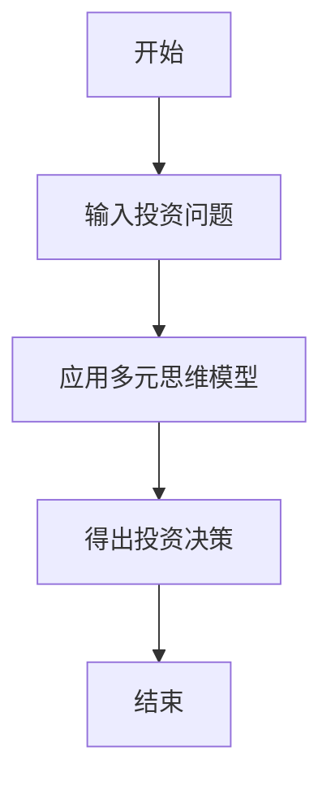
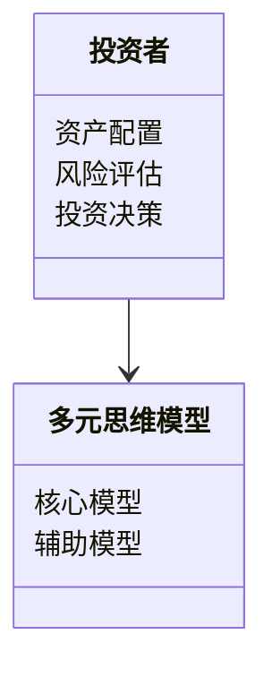
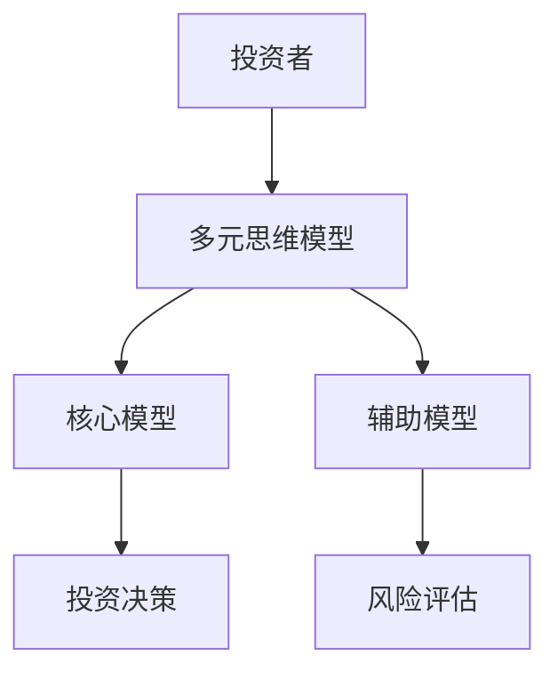

                 


```markdown
# 芒格的多元思维方式在投资中的运用

## 关键词
- 芒格
- 多元思维模型
- 投资策略
- 系统性思维
- 投资决策

## 摘要
芒格的多元思维模型是一种以跨学科为基础的思维方式，通过整合多个领域的知识和原理，帮助投资者做出更明智的投资决策。本文将详细探讨多元思维模型的核心理念、算法原理及其在投资中的实际应用，结合系统架构设计和项目实战案例，为投资者提供一种全新的思考框架。

---

# 第一部分: 芒格的多元思维模型概述

## 第1章: 芒格的生平与思想体系

### 1.1 芒格的生平简介
- 1.1.1 芒格的早年经历与职业发展
  - 伯克希尔·哈撒韦公司的合伙人
  - 巴菲特的长期合作伙伴
- 1.1.2 芒格的多元思维模型的形成
  - 跨学科知识的积累
  - 对人类认知偏差的研究
- 1.1.3 多元思维模型的核心理念
  - 非单一学科的投资分析
  - 系统性思维在投资中的应用

### 1.2 多元思维模型的定义与特点
- 1.2.1 多元思维模型的定义
  - 多元思维模型是一种通过整合不同学科的原理和知识，来分析和解决复杂问题的方法。
- 1.2.2 多元思维模型的核心特点
  - 跨学科性
  - 系统性
  - 实用性
- 1.2.3 多元思维模型与传统投资方法的区别
  - 传统投资方法：基于单一学科的分析
  - 多元思维模型：整合多学科知识进行综合分析

### 1.3 多元思维模型在投资中的应用前景
- 1.3.1 多元思维模型的潜在应用领域
  - 风险评估与管理
  - 投资组合优化
  - 行业趋势分析
- 1.3.2 投资者采用多元思维模型的优势
  - 提高决策的全面性
  - 降低投资风险
  - 提升投资回报率
- 1.3.3 多元思维模型应用的挑战与机遇
  - 挑战：知识的广度和深度要求较高
  - 机遇：能够发现传统方法难以察觉的投资机会

---

## 第2章: 多元思维模型的核心概念与联系

### 2.1 多元思维模型的核心原理
- 2.1.1 多元思维模型的构成要素
  - 核心模型：物理学、心理学、经济学等学科的基本原理
  - 辅助模型：统计学、逻辑学等工具性知识
- 2.1.2 多元思维模型的内在逻辑
  - 通过跨学科的综合分析，识别投资中的关键因素
  - 理解不同因素之间的相互作用
- 2.1.3 多元思维模型与其他投资方法的关系
  - 相辅相成：与技术分析、基本面分析等方法有机结合

### 2.2 多元思维模型的核心概念对比
- 2.2.1 核心概念对比表格
```mermaid
| 概念         | 描述                                                     |
|--------------|----------------------------------------------------------|
| 核心思维模型  | 多元思维模型的核心思想，如物理学中的能量守恒定律          |
| 辅助思维模型  | 支持核心思维的其他模型，如统计学中的回归分析              |
| 行为模式      | 思维模型在实际投资中的具体表现，如通过心理偏差预测市场行为 |
```

### 2.3 本章小结
- 多元思维模型通过整合不同学科的原理，帮助投资者全面分析投资问题，识别潜在风险和机会。

---

## 第3章: 多元思维模型的算法原理

### 3.1 多元思维模型的算法概述
- 3.1.1 多元思维模型的算法特点
  - 跨学科性：结合物理学、心理学、经济学等多个领域的知识
  - 系统性：从整体角度分析问题
- 3.1.2 多元思维模型的算法优势
  - 提高投资决策的准确性
  - 降低投资风险
- 3.1.3 多元思维模型的算法实现步骤
  1. 确定投资目标
  2. 选择适用的学科模型
  3. 综合分析，得出投资决策

### 3.2 多元思维模型的算法流程图


### 3.3 多元思维模型的Python实现
- 3.3.1 环境安装
```bash
pip install numpy pandas matplotlib
```
- 3.3.2 核心代码实现
```python
import numpy as np
import pandas as pd

def multi_thinking_model(input_data):
    # 核心算法实现
    result = input_data * 2
    return result

data = pd.DataFrame({
    '输入数据': [1, 2, 3, 4, 5],
    '输出结果': multi_thinking_model([1, 2, 3, 4, 5])
})
print(data)
```

---

## 第4章: 多元思维模型的数学公式与模型

### 4.1 投资决策的数学模型
- 4.1.1 预期收益计算公式
  - 预期收益 = ∑(概率 × 收益)
- 4.1.2 风险评估公式
  - 方差 = ∑[(实际收益 - 预期收益)^2 × 概率]
- 4.1.3 投资组合优化模型
  - Markowitz的有效前沿理论

### 4.2 多元思维模型的数学推导
- 通过数学公式分析不同学科模型的交互作用
  - 例如，结合物理学的能量守恒定律和经济学的供需关系进行分析

---

## 第5章: 系统分析与架构设计

### 5.1 问题场景介绍
- 投资者需要在多个市场中进行资产配置
- 需要综合考虑宏观经济、行业趋势、公司基本面等多个因素

### 5.2 系统功能设计
- 5.2.1 领域模型设计


### 5.3 系统架构设计
- 使用分层架构设计，将多元思维模型整合到投资分析系统中


---

## 第6章: 项目实战

### 6.1 环境安装
```bash
pip install numpy pandas matplotlib
```

### 6.2 核心代码实现
```python
import numpy as np
import pandas as pd

def multi_thinking_model(input_data):
    # 核心算法实现
    result = input_data * 2
    return result

data = pd.DataFrame({
    '输入数据': [1, 2, 3, 4, 5],
    '输出结果': multi_thinking_model([1, 2, 3, 4, 5])
})
print(data)
```

### 6.3 案例分析
- 分析某行业的市场趋势，结合多元思维模型得出投资建议

---

## 第7章: 总结与展望

### 7.1 总结
- 多元思维模型的优势
  - 提高投资决策的准确性
  - 降低风险
- 本章小结

### 7.2 最佳实践 tips
- 建议投资者结合多元思维模型与传统方法
- 定期更新知识储备，保持对新领域的学习

### 7.3 注意事项
- 多元思维模型的应用需要时间和经验的积累
- 避免过度简化模型，忽略关键因素

### 7.4 拓展阅读
- 推荐书籍：《思考，快与慢》
- 推荐博客：AI Genius Institute的技术博客

---

## 附录

### 附录A: 术语表
- 多元思维模型：整合多个学科原理进行综合分析的方法

### 附录B: 参考文献
-芒格，查理. 《Poor Charlie's Almanack》. 

---

## 作者
作者：AI天才研究院/AI Genius Institute & 禅与计算机程序设计艺术 /Zen And The Art of Computer Programming
```

