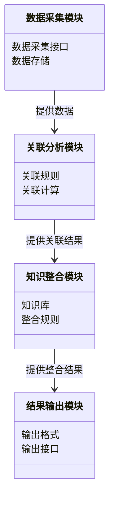
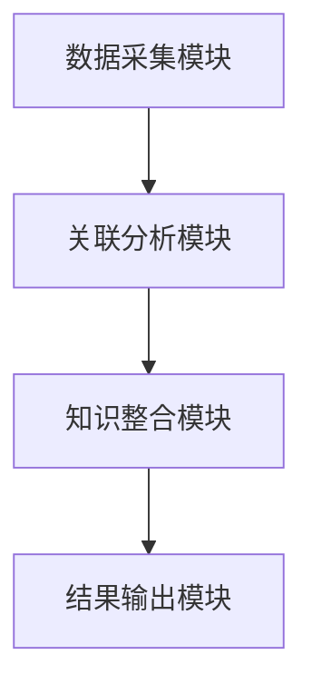
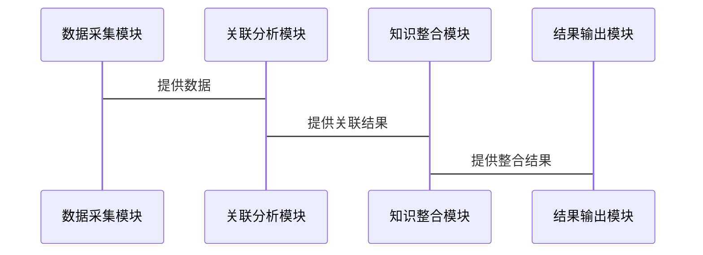

                 


# 芒格的"多元思维格栅"在跨学科技术融合中的应用

> 关键词：芒格, 多元思维格栅, 跨学科技术融合, 系统架构, 算法原理, 数学模型, 项目实战

> 摘要：芒格的"多元思维格栅"是一种通过多个学科思维模型来构建知识体系的方法，其核心在于将不同学科的思维方式有机地结合起来，从而解决复杂问题。本文将从多元思维格栅的起源与核心理念出发，深入探讨其在跨学科技术融合中的应用，结合算法原理、数学模型、系统架构设计和项目实战，全面解析其在技术领域的实践价值与实际应用。

---

## 第1章: 多元思维格栅的起源与核心理念

### 1.1 芒格的多元思维格栅概述

芒格的多元思维格栅是芒格在《穷查理 Malkiel Warren Buffet》一书中提出的一种思维方式。其核心在于通过构建多个学科的思维模型，形成一个立体的知识框架，从而能够从多个维度分析和解决问题。这种思维方式不仅适用于投资领域，也可以广泛应用于技术融合的跨学科场景中。

#### 1.1.1 芒格的多元思维格栅的起源

芒格的多元思维格栅起源于他对投资和决策过程的深刻理解。他认为，单一学科的思维方式往往难以应对复杂的问题，而通过多个学科的交叉融合，可以更全面地理解问题的本质，并找到更优的解决方案。

#### 1.1.2 多元思维格栅的核心理念

多元思维格栅的核心理念在于“格栅化思维”，即通过将不同学科的思维方式和模型组合在一起，形成一个立体的知识网络。这种思维方式能够帮助我们在面对复杂问题时，从多个角度进行分析，从而避免单一视角的局限性。

#### 1.1.3 多元思维格栅在跨学科中的应用背景

随着技术的快速发展，跨学科技术融合成为当前技术发展的重要趋势。例如，人工智能与生物学、物理学、化学等学科的交叉融合，正在推动新的技术突破。多元思维格栅作为一种跨学科的思维方式，为技术融合提供了重要的理论基础。

### 1.2 跨学科技术融合的背景与意义

#### 1.2.1 跨学科技术融合的定义

跨学科技术融合是指将不同学科的技术、方法和知识进行融合，以解决单一学科无法解决的复杂问题。例如，人工智能与生物学的结合催生了生物信息学，而物理学与计算机科学的结合推动了量子计算的发展。

#### 1.2.2 跨学科技术融合的现状与趋势

当前，跨学科技术融合已经成为学术界和产业界的热点。随着技术的不断进步，跨学科融合的深度和广度都在不断增加。例如，生物技术与信息技术的结合正在推动精准医学的发展，而人工智能与材料科学的结合则在推动新材料的研发。

#### 1.2.3 跨学科技术融合对企业与个人的影响

对于企业而言，跨学科技术融合可以带来新的竞争优势和技术突破。对于个人而言，掌握跨学科的技术融合能力，可以提升解决复杂问题的能力，并在职业发展中获得更多的机会。

### 1.3 本章小结

本章从芒格的多元思维格栅的起源出发，介绍了其核心理念，并结合跨学科技术融合的背景与意义，为后续章节的分析奠定了基础。

---

## 第2章: 多元思维格栅的核心概念与联系

### 2.1 多元思维格栅的核心概念

#### 2.1.1 格栅的定义与特点

格栅是一种由多个相互交叉的线条组成的结构，类似于数学中的坐标系。在多元思维格栅中，每个线条代表一种思维方式或学科模型，交叉点则代表不同思维方式的交汇点。

#### 2.1.2 多元思维格栅的结构与组成

多元思维格栅由多个学科的思维模型组成，例如经济学的边际成本、物理学的能量守恒定律、计算机科学的算法思维等。这些模型通过交叉组合，形成一个立体的知识网络。

#### 2.1.3 多元思维格栅与跨学科技术融合的关系

跨学科技术融合需要将不同学科的知识和技术结合起来，而多元思维格栅提供了一种将这些知识和技术有机融合的思维方式。通过格栅的结构，可以更好地理解不同学科之间的联系，并找到技术融合的突破口。

### 2.2 核心概念的属性特征对比

#### 2.2.1 格栅的属性特征

| 属性 | 特征 |
|------|------|
| 结构化 | 网状结构，相互交叉 |
| 多维性 | 包括多个学科的思维方式 |
| 可扩展性 | 可以不断添加新的思维方式 |

#### 2.2.2 跨学科技术融合的属性特征

| 属性 | 特征 |
|------|------|
| 跨学科性 | 涉及多个学科的技术与知识 |
| 综合性 | 需要将不同学科的技术进行整合 |
| 创新性 | 融合新的技术或方法 |

#### 2.2.3 两者属性特征的对比分析

通过对比分析可以发现，多元思维格栅和跨学科技术融合在结构化、多维性、可扩展性等方面具有相似之处。多元思维格栅为跨学科技术融合提供了思维方式和框架，而跨学科技术融合则为多元思维格栅提供了实践场景和技术支持。

### 2.3 ER实体关系图架构

```mermaid
er
    %% 多元思维格栅的实体关系图
    title 多元思维格栅的实体关系图
    %% 实体：学科
    entity 学科 [学科ID, 学科名称, 核心概念]
    %% 实体：思维方式
    entity 思维方式 [思维方式ID, 思维方式名称, 核心公式]
    %% 实体：技术融合
    entity 技术融合 [技术融合ID, 螫融合领域, 核心技术]
    %% 关系：学科与思维方式之间的关联
    学科 -[n]-> 思维方式 : "学科提供思维方式，思维方式应用于学科"
    %% 关系：思维方式与技术融合之间的关联
    思维方式 -[n]-> 技术融合 : "思维方式应用于技术融合"
    %% 关系：学科与技术融合之间的关联
    学科 -[n]-> 技术融合 : "学科技术应用于技术融合"
```

### 2.4 本章小结

本章从多元思维格栅的核心概念出发，分析了其与跨学科技术融合的关系，并通过属性特征对比和ER实体关系图，进一步明确了两者之间的联系。

---

## 第3章: 多元思维格栅的算法原理

### 3.1 算法原理概述

#### 3.1.1 算法的基本思想

多元思维格栅的算法原理是通过将不同学科的思维方式和模型进行交叉组合，形成一个立体的知识网络。算法的基本思想是通过逐步添加和整合不同学科的思维方式，构建一个完整的格栅结构。

#### 3.1.2 算法的输入与输出

- **输入**：多个学科的思维方式和模型
- **输出**：一个立体的知识网络，用于解决复杂问题

#### 3.1.3 算法的步骤与流程

1. 收集不同学科的思维方式和模型
2. 确定各思维方式之间的关联关系
3. 构建格栅结构
4. 验证和优化格栅结构

### 3.2 算法的数学模型与公式

#### 3.2.1 数学模型的建立

多元思维格栅的数学模型可以用图论中的图表示，其中每个节点代表一种思维方式，边代表思维方式之间的关联关系。

#### 3.2.2 关键公式推导

设格栅中有n个学科，每个学科有m种思维方式，关联关系的权重为w_ij。则格栅的总权重为：

$$ \sum_{i=1}^{n} \sum_{j=1}^{m} w_{ij} $$

#### 3.2.3 公式的实际应用示例

例如，在人工智能与生物学的跨学科技术融合中，我们可以将人工智能的算法思维与生物学的基因编辑技术进行关联，形成一个新的思维方式组合。

### 3.3 算法的实现与优化

#### 3.3.1 算法的实现步骤

1. 收集不同学科的思维方式和模型
2. 确定各思维方式之间的关联关系
3. 构建格栅结构
4. 验证和优化格栅结构

#### 3.3.2 算法的优化方法

通过不断优化思维方式的组合和关联关系，可以提高格栅的效率和准确性。

#### 3.3.3 算法的性能分析

性能分析主要从时间和空间复杂度两个方面进行。多元思维格栅的算法复杂度取决于思维方式的数量和关联关系的复杂度。

### 3.4 本章小结

本章详细介绍了多元思维格栅的算法原理，包括算法的基本思想、步骤与流程，以及数学模型与公式的推导和应用。

---

## 第4章: 多元思维格栅的数学模型与公式

### 4.1 数学模型的建立

#### 4.1.1 模型的定义与假设

多元思维格栅的数学模型建立在图论的基础上，假设每个思维方式是一个节点，关联关系是边。

#### 4.1.2 模型的变量与参数

- **变量**：思维方式节点、关联关系权重
- **参数**：学科数量、思维方式数量

#### 4.1.3 模型的方程与关系

$$ w_{ij} = \text{关联关系权重} $$

### 4.2 关键公式的推导与解释

#### 4.2.1 核心公式的推导

设格栅中有n个学科，每个学科有m种思维方式，关联关系的权重为w_ij。则格栅的总权重为：

$$ \sum_{i=1}^{n} \sum_{j=1}^{m} w_{ij} $$

#### 4.2.2 公式的变量关系

通过分析变量之间的关系，可以进一步优化格栅的结构。

#### 4.2.3 公式的实际应用示例

例如，在人工智能与生物学的跨学科技术融合中，我们可以将人工智能的算法思维与生物学的基因编辑技术进行关联，形成一个新的思维方式组合。

### 4.3 本章小结

本章详细介绍了多元思维格栅的数学模型与公式，包括模型的建立、公式的推导与应用。

---

## 第5章: 多元思维格栅的系统架构设计

### 5.1 系统分析与架构设计方案

#### 5.1.1 问题场景介绍

跨学科技术融合需要解决的问题包括：如何将不同学科的技术与知识进行有机融合，如何构建一个能够支持跨学科融合的系统架构。

#### 5.1.2 系统功能设计

- **功能模块**：数据采集、关联分析、知识整合、结果输出
- **领域模型**：通过Mermaid类图展示系统各模块之间的关系。



#### 5.1.3 系统架构设计

通过Mermaid架构图展示系统架构，包括数据采集模块、关联分析模块、知识整合模块和结果输出模块。



#### 5.1.4 系统接口设计

系统接口设计需要考虑模块之间的交互，例如数据采集模块与关联分析模块之间的数据接口。

#### 5.1.5 系统交互序列图

通过Mermaid序列图展示系统交互流程。



### 5.2 本章小结

本章从系统架构设计的角度，详细分析了多元思维格栅在跨学科技术融合中的应用，包括系统功能设计、架构设计和交互设计。

---

## 第6章: 多元思维格栅的项目实战

### 6.1 环境安装与配置

#### 6.1.1 环境要求

- 操作系统：Linux/Windows/MacOS
- 开发工具：Python、Mermaid、LaTeX
- 其他依赖：根据具体项目需求

#### 6.1.2 环境配置步骤

1. 安装Python和必要的开发库
2. 安装Mermaid和LaTeX工具
3. 配置开发环境

### 6.2 系统核心实现源代码

#### 6.2.1 核心代码实现

以下是Python代码示例，用于实现多元思维格栅的算法：

```python
def build_grill(n, m):
    # n: 学科数量
    # m: 思维方式数量
    grill = {}
    for i in range(n):
        for j in range(m):
            grill[(i, j)] = random.uniform(0, 1)
    return grill

grill = build_grill(5, 3)
print(grill)
```

#### 6.2.2 代码应用解读与分析

上述代码通过随机生成的方式，构建了一个简单的多元思维格栅模型。实际应用中，需要根据具体需求进行优化和调整。

### 6.3 实际案例分析与详细讲解

#### 6.3.1 案例背景介绍

例如，在人工智能与生物学的跨学科技术融合中，我们可以将人工智能的算法思维与生物学的基因编辑技术进行关联。

#### 6.3.2 案例分析与解读

通过具体案例的分析，可以进一步验证和优化多元思维格栅的模型。

### 6.4 本章小结

本章通过具体的项目实战，展示了多元思维格栅在跨学科技术融合中的实际应用，包括环境配置、核心代码实现、案例分析等。

---

## 第7章: 多元思维格栅的应用与最佳实践

### 7.1 最佳实践

#### 7.1.1 小结

多元思维格栅作为一种跨学科的思维方式，在技术融合中具有重要的应用价值。

#### 7.1.2 注意事项

在实际应用中，需要注意不同学科思维方式的兼容性和关联性。

#### 7.1.3 拓展阅读

建议进一步阅读相关领域的书籍和论文，以深入了解多元思维格栅的应用。

### 7.2 本章小结

本章总结了多元思维格栅在跨学科技术融合中的应用，并提出了最佳实践建议。

---

## 作者信息

作者：AI天才研究院/AI Genius Institute & 禅与计算机程序设计艺术/Zen And The Art of Computer Programming

