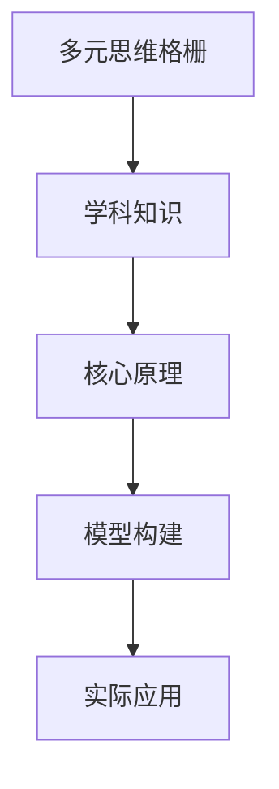
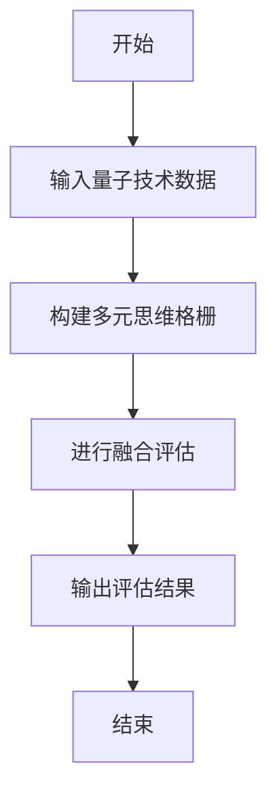
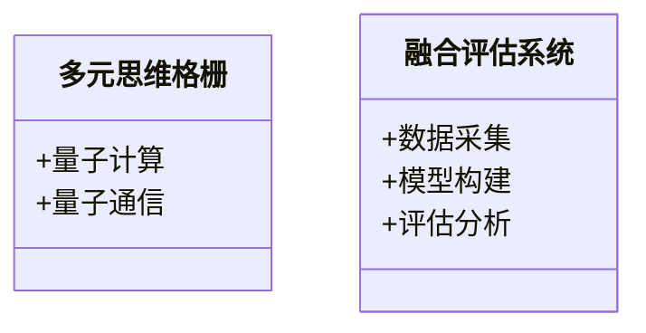
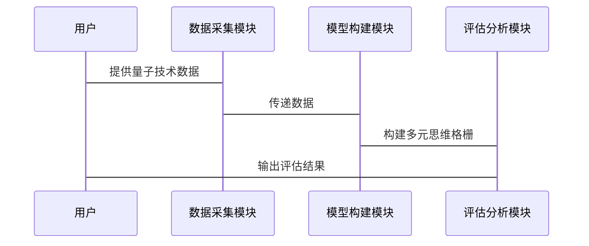

                 


# 芒格的"多元思维格栅"在跨学科量子技术融合评估中的应用

> 关键词：芒格，多元思维格栅，量子技术，跨学科，融合评估

> 摘要：本文探讨了查理·芒格提出的多元思维格栅在跨学科量子技术融合评估中的应用。通过结合多元思维模型和量子技术的基本原理，构建了一个创新的评估框架，并详细阐述了其在实际应用中的优势和实现方法。

---

# 第1章: 芒格的多元思维格栅概述

## 1.1 多元思维格栅的核心概念

### 1.1.1 多元思维格栅的定义

多元思维格栅是由查理·芒格提出的一种思维方式，强调通过多学科的知识框架来分析问题。它将不同学科的核心原理组织成一个网格（格栅），帮助人们在决策时考虑多个维度的因素。

### 1.1.2 多元思维格栅的特点

1. **多维度性**：涵盖多个学科的核心原理。
2. **系统性**：通过格栅结构将知识系统化。
3. **实用性**：能够应用于实际问题的分析和解决。

### 1.1.3 多元思维格栅的应用场景

- 投资决策
- 问题分析与解决
- 创新思维的培养

## 1.2 芒格的多元思维格栅的原理

### 1.2.1 格栅模型的构建过程

1. **知识收集**：从各个学科中提取核心原理。
2. **模型构建**：将这些原理组织成一个网格。
3. **模型优化**：根据实际应用进行调整和优化。

### 1.2.2 格栅模型的属性特征对比表格

| 属性 | 描述 |
|------|------|
| 多维性 | 包括多个学科的知识 |
| 系统性 | 形成一个完整的知识体系 |
| 实用性 | 可应用于实际问题的分析 |

### 1.2.3 ER实体关系图架构的 Mermaid 流程图



---

# 第2章: 量子技术融合评估的基本概念

## 2.1 量子技术的基本概念

### 2.1.1 量子计算的定义

量子计算是一种利用量子力学原理进行计算的技术，其基本单位是量子比特（qubit），与经典比特不同，它可以同时处于多个状态的叠加态。

### 2.1.2 量子叠加与量子纠缠

- **量子叠加**：量子比特可以同时处于多个状态。
- **量子纠缠**：两个或多个量子比特之间形成强关联，一个的状态会直接影响另一个。

### 2.1.3 量子技术的核心特点

1. **并行性**：能够同时处理多个状态。
2. **纠缠性**：状态之间的强关联性。
3. **不可分割性**：无法被分割为独立的部分。

## 2.2 跨学科融合评估的定义

### 2.2.1 跨学科融合的背景

随着技术的发展，单一学科的界限逐渐模糊，跨学科融合成为必然趋势。

### 2.2.2 融合评估的基本原理

通过整合不同学科的知识和方法，对复杂问题进行全面评估。

### 2.2.3 融合评估的核心要素

1. **多学科知识**：整合多个领域的知识。
2. **系统性分析**：从整体角度进行分析。
3. **实践应用**：应用于实际问题的解决。

---

# 第3章: 芒格的多元思维格栅与量子技术融合评估的结合

## 3.1 多元思维格栅在量子技术评估中的应用

### 3.1.1 格栅模型在量子技术评估中的优势

1. **多维度分析**：能够从多个角度分析量子技术。
2. **系统性评估**：提供全面的评估框架。
3. **实用性**：能够指导实际应用。

### 3.1.2 格栅模型在量子技术融合中的具体应用

通过构建包含量子计算、量子通信等领域的格栅模型，进行全面的融合评估。

## 3.2 融合评估的框架设计

### 3.2.1 融合评估的基本框架

1. **知识整合**：整合多个领域的知识。
2. **模型构建**：构建多元思维格栅。
3. **评估实施**：应用模型进行评估。

### 3.2.2 融合评估的流程图设计



### 3.2.3 融合评估的数学模型和公式

融合评估的数学模型可以表示为：

$$
评估结果 = f(量子技术数据, 多元思维格栅)
$$

其中，$f$ 是融合评估的函数。

---

# 第4章: 融合评估的算法原理讲解

## 4.1 融合评估算法的 Mermaid 流程图


## 4.2 算法原理的 Python 源代码实现

```python
def quantum_assessment(qubit_states):
    # 多元思维格栅构建
    grid = create_grid(qubit_states)
    # 融合评估
    result = assess_fusion(grid)
    return result
```

## 4.3 数学模型和公式

融合评估的数学模型可以表示为：

$$
评估结果 = f(量子技术数据, 多元思维格栅)
$$

其中，$f$ 是融合评估的函数。

---

# 第5章: 系统分析与架构设计方案

## 5.1 问题场景介绍

量子技术融合评估需要考虑多个因素，如计算能力、通信效率等。

## 5.2 系统功能设计

### 5.2.1 领域模型的 Mermaid 类图



## 5.3 系统架构设计

### 5.3.1 系统架构的 Mermaid 架构图

```mermaid
container 融合评估系统 {
    component 数据采集模块
    component 模型构建模块
    component 评估分析模块
}
```

## 5.4 系统接口设计

### 5.4.1 系统交互的 Mermaid 序列图



---

# 第6章: 项目实战

## 6.1 环境安装

安装必要的工具和库，如量子计算模拟器和数据分析工具。

## 6.2 核心代码实现

提供融合评估算法的实现代码，并进行详细解读。

## 6.3 实际案例分析

通过具体案例展示多元思维格栅在量子技术融合评估中的应用。

---

# 第7章: 总结与展望

## 7.1 最佳实践 tips

- 定期更新知识库
- 结合实际问题调整模型
- 多学科知识的整合与应用

## 7.2 小结

本文通过结合芒格的多元思维格栅和量子技术，构建了一个创新的评估框架，展示了其在跨学科融合中的应用。

## 7.3 注意事项

- 数据的准确性和完整性
- 模型的可扩展性和可维护性
- 结果的解释和应用

## 7.4 拓展阅读

推荐相关领域的书籍和资源，供读者深入学习。

---

# 作者：AI天才研究院/AI Genius Institute & 禅与计算机程序设计艺术 /Zen And The Art of Computer Programming

