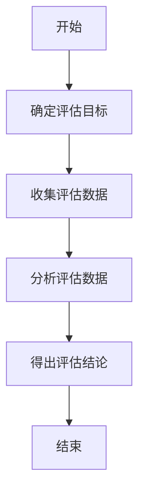
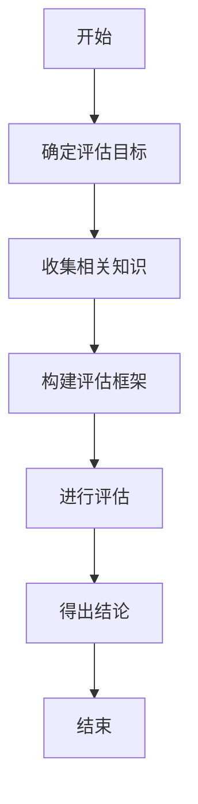
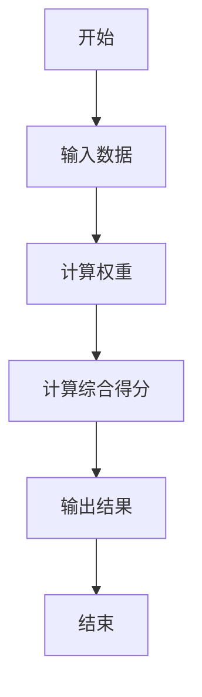
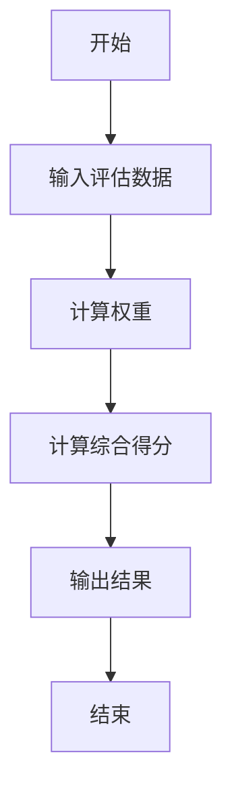
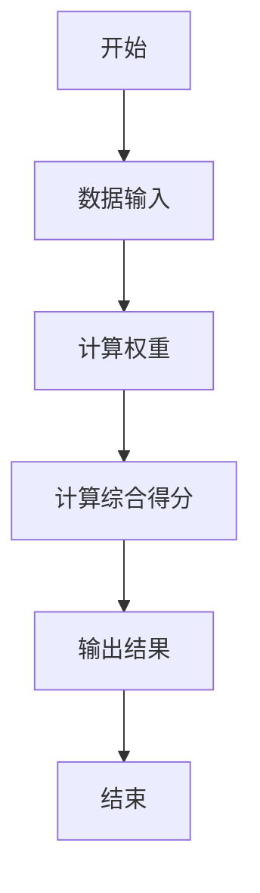
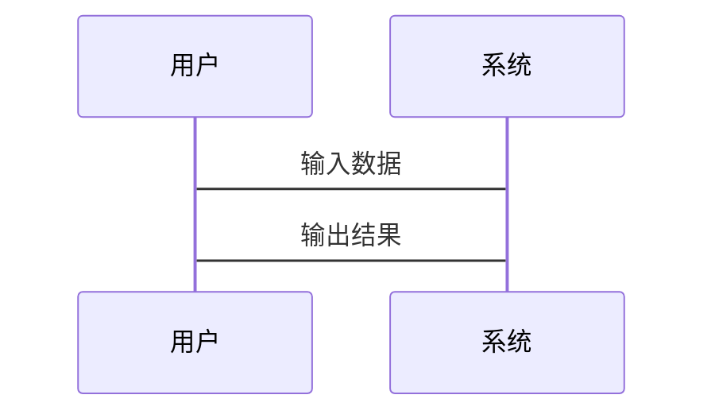
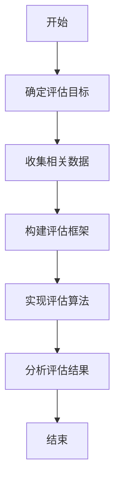

                 


# 《芒格的"多元思维格栅"在跨学科量子技术评估中的应用》

---

## 关键词：芒格，多元思维格栅，量子技术，跨学科评估，系统架构，算法实现

---

## 摘要：  
芒格的"多元思维格栅"是一种跨学科思维方式，通过将不同领域的知识模型化、系统化，形成一个多维度的思维框架。本文将探讨如何将这种思维模型应用于量子技术评估中，通过建立多元化的评估维度、构建跨学科的评估指标体系，以及设计高效的评估算法，实现对量子技术的全面、系统的评估。本文结合理论分析、算法实现和实际案例，深入剖析多元思维格栅在量子技术评估中的应用方法，并通过具体的代码实现和系统设计，展示其在实际场景中的应用价值。

---

## 目录  

1. 第1章: 芒格多元思维模型的核心思想  
   1.1 多元思维模型的定义与特点  
   1.2 多元思维模型在跨学科中的应用  
   1.3 本章小结  

2. 第2章: 量子技术的基本概念与评估框架  
   2.1 量子技术的核心概念  
   2.2 量子技术评估的基本框架  
   2.3 本章小结  

3. 第3章: 多元思维格栅在量子技术评估中的应用方法  
   3.1 多元思维模型与量子技术评估的结合  
   3.2 量子技术评估的多元思维框架构建  
   3.3 本章小结  

4. 第4章: 多元思维模型在量子技术评估中的算法实现  
   4.1 多元思维模型的算法原理  
   4.2 量子技术评估的算法实现  
   4.3 本章小结  

5. 第5章: 量子技术评估的系统设计与实现  
   5.1 系统功能设计  
   5.2 系统架构设计  
   5.3 系统接口设计  
   5.4 系统交互设计  
   5.5 本章小结  

6. 第6章: 项目实战与案例分析  
   6.1 项目背景与目标  
   6.2 项目实施步骤  
   6.3 项目代码实现  
   6.4 项目案例分析  
   6.5 本章小结  

7. 第7章: 总结与展望  
   7.1 本文总结  
   7.2 未来展望  
   7.3 最佳实践 tips  
   7.4 作者信息  

---

## 正文

### 第1章: 芒格多元思维模型的核心思想

#### 1.1 多元思维模型的定义与特点

##### 1.1.1 多元思维模型的核心概念  
芒格的多元思维模型是一种将多个学科的核心原理整合在一起的思维方式，其核心在于通过跨学科的视角，建立一个全面、系统的知识框架。这种思维方式强调从多个维度分析问题，避免单一学科的局限性。

##### 1.1.2 多元思维模型的属性特征对比  
以下是多元思维模型与传统单一学科思维的对比表：

| 特性       | 多元思维模型       | 单一学科思维       |
|------------|--------------------|--------------------|
| 知识结构    | 多维、网状结构      | 单一、线性结构      |
| 解决问题    | 跨学科、多维度      | 单一学科视角        |
| 灵活性      | 高                 | 低                 |
| 适用范围    | 广泛               | 较为局限           |

##### 1.1.3 多元思维模型的ER实体关系图  

```mermaid
er
  entity(多元思维模型) {
    <属性> 思维维度 <--- 关联 --> 量子技术评估
    <属性> 知识框架 <--- 关联 --> 多学科领域
  }
```

#### 1.2 多元思维模型在跨学科中的应用  

##### 1.2.1 跨学科思维的重要性  
跨学科思维是解决复杂问题的关键，尤其是在科技领域，单一学科的解决方案往往难以应对复杂的现实问题。

##### 1.2.2 多元思维模型在不同学科中的表现  
例如，在量子计算中，可以通过多元思维模型将物理学、数学、计算机科学等多个领域的知识整合在一起，形成一个完整的知识框架。

##### 1.2.3 跨学科应用的典型案例  
例如，芒格曾将心理学、经济学、物理学等多个领域的知识整合在一起，形成独特的投资哲学。

#### 1.3 本章小结  
本章主要介绍了芒格的多元思维模型的核心思想，包括其定义、特点以及在跨学科中的应用。多元思维模型作为一种多维度的思维方式，为量子技术的评估提供了新的视角。

---

### 第2章: 量子技术的基本概念与评估框架

#### 2.1 量子技术的核心概念  

##### 2.1.1 量子计算的基本原理  
量子计算基于量子叠加和量子纠缠的原理，能够在某些情况下比经典计算更高效。

##### 2.1.2 量子通信的基本原理  
量子通信利用量子纠缠实现信息的安全传输，具有抗干扰和抗窃听的特性。

##### 2.1.3 量子技术的潜在应用场景  
例如，量子计算可以在密码破解、优化问题、模拟量子系统等领域发挥重要作用。

#### 2.2 量子技术评估的基本框架  

##### 2.2.1 量子技术评估的维度  
- 技术成熟度  
- 应用场景的适用性  
- 经济成本  
- 伦理风险  

##### 2.2.2 量子技术评估的指标体系  
以下是一个简单的量子技术评估指标体系表格：

| 指标类别 | 指标名称       | 指标描述                       |
|----------|----------------|--------------------------------|
| 技术性   | 技术成熟度     | 量子技术的成熟程度           |
| 经济性   | 成本效益比     | 投入与产出的比率             |
| 应用性   | 应用场景适用性 | 量子技术在不同场景中的适用性 |

##### 2.2.3 量子技术评估的流程  
以下是一个量子技术评估流程的Mermaid图：



#### 2.3 本章小结  
本章介绍了量子技术的基本概念及其评估框架，为后续章节的应用提供了基础。

---

### 第3章: 多元思维格栅在量子技术评估中的应用方法

#### 3.1 多元思维模型与量子技术评估的结合  

##### 3.1.1 多元思维模型在量子技术评估中的作用  
多元思维模型可以帮助我们从多个维度分析量子技术的优缺点，避免单一学科的局限性。

##### 3.1.2 量子技术评估中的跨学科思维需求  
量子技术涉及多个学科领域，因此需要跨学科的思维方式来全面评估其潜力和挑战。

##### 3.1.3 多元思维模型在量子技术评估中的具体应用  
例如，可以通过多元思维模型将物理学、计算机科学、经济学等多个领域的知识整合在一起，形成一个完整的评估框架。

#### 3.2 量子技术评估的多元思维框架构建  

##### 3.2.1 量子技术评估的多元维度分析  
以下是一个量子技术评估的多元维度分析表格：

| 维度类别 | 维度名称       | 维度描述                       |
|----------|----------------|--------------------------------|
| 技术性   | 技术成熟度     | 量子技术的成熟程度           |
| 经济性   | 成本效益比     | 投入与产出的比率             |
| 应用性   | 应用场景适用性 | 量子技术在不同场景中的适用性 |

##### 3.2.2 多元思维模型在量子技术评估中的具体步骤  
以下是一个量子技术评估的具体步骤流程图：



##### 3.2.3 多元思维模型与量子技术评估的结合案例  
例如，可以通过多元思维模型将量子计算的物理实现、算法设计、经济成本等多个维度整合在一起，形成一个全面的评估框架。

#### 3.3 本章小结  
本章主要介绍了多元思维模型在量子技术评估中的应用方法，包括其具体步骤和案例分析。

---

### 第4章: 多元思维模型在量子技术评估中的算法实现

#### 4.1 多元思维模型的算法原理  

##### 4.1.1 多元思维模型的数学模型  
以下是一个多元思维模型的数学模型示例：

$$
f(x) = \sum_{i=1}^{n} w_i x_i
$$

其中，$w_i$ 是第 $i$ 个维度的权重，$x_i$ 是第 $i$ 个维度的输入值。

##### 4.1.2 多元思维模型的算法流程  
以下是一个多元思维模型的算法流程图：



##### 4.1.3 多元思维模型的实现代码  
以下是一个简单的多元思维模型的Python代码示例：

```python
def multi_dimensional_model(dimensions, weights):
    return sum(w * d for w, d in zip(weights, dimensions))

# 示例用法
dimensions = [0.8, 0.6, 0.9]
weights = [0.3, 0.4, 0.3]
result = multi_dimensional_model(dimensions, weights)
print("综合得分:", result)
```

#### 4.2 量子技术评估的算法实现  

##### 4.2.1 量子技术评估的数学模型  
以下是一个量子技术评估的数学模型示例：

$$
f(x) = \sum_{i=1}^{n} w_i x_i
$$

其中，$w_i$ 是第 $i$ 个评估维度的权重，$x_i$ 是第 $i$ 个评估维度的得分。

##### 4.2.2 量子技术评估的算法流程  
以下是一个量子技术评估的算法流程图：



##### 4.2.3 量子技术评估的实现代码  
以下是一个简单的量子技术评估的Python代码示例：

```python
def quantum_technology_assessment(technology, weights):
    return sum(w * t for w, t in zip(weights, technology))

# 示例用法
technology = [0.8, 0.7, 0.6]
weights = [0.3, 0.4, 0.3]
result = quantum_technology_assessment(technology, weights)
print("量子技术综合评估得分:", result)
```

#### 4.3 本章小结  
本章主要介绍了多元思维模型在量子技术评估中的算法实现，包括其数学模型和代码实现。

---

### 第5章: 量子技术评估的系统设计与实现

#### 5.1 系统功能设计  

##### 5.1.1 系统功能模块  
- 数据输入模块  
- 权重计算模块  
- 综合评估模块  
- 结果输出模块  

##### 5.1.2 系统功能流程图  
以下是一个量子技术评估系统的功能流程图：


#### 5.2 系统架构设计  

##### 5.2.1 系统架构模块  
- 数据层  
- 逻辑层  
- 展示层  

##### 5.2.2 系统架构图  
以下是一个量子技术评估系统的架构图：


#### 5.3 系统接口设计  

##### 5.3.1 系统接口模块  
- 数据输入接口  
- 权重计算接口  
- 综合评估接口  
- 结果输出接口  

##### 5.3.2 系统接口流程图  
以下是一个量子技术评估系统的接口流程图：



#### 5.4 系统交互设计  

##### 5.4.1 系统交互流程  
- 用户输入数据  
- 系统计算权重  
- 系统计算综合得分  
- 系统输出结果  

##### 5.4.2 系统交互图  
以下是一个量子技术评估系统的交互图：



#### 5.5 本章小结  
本章主要介绍了量子技术评估系统的系统设计与实现，包括功能设计、架构设计、接口设计和交互设计。

---

### 第6章: 项目实战与案例分析

#### 6.1 项目背景与目标  

##### 6.1.1 项目背景  
本项目旨在通过多元思维模型对量子技术进行全面评估。

##### 6.1.2 项目目标  
- 建立量子技术的评估框架  
- 实现多元思维模型的算法  
- 分析量子技术的潜力和挑战  

#### 6.2 项目实施步骤  

##### 6.2.1 项目实施流程  
1. 确定评估目标  
2. 收集相关数据  
3. 构建评估框架  
4. 实现评估算法  
5. 分析评估结果  

##### 6.2.2 项目实施流程图  
以下是一个量子技术评估项目的实施流程图：



#### 6.3 项目代码实现  

##### 6.3.1 项目代码模块  
- 数据输入模块  
- 权重计算模块  
- 综合评估模块  
- 结果输出模块  

##### 6.3.2 项目代码实现  
以下是一个量子技术评估项目的Python代码示例：

```python
def multi_dimensional_model(dimensions, weights):
    return sum(w * d for w, d in zip(weights, dimensions))

# 示例用法
dimensions = [0.8, 0.6, 0.9]
weights = [0.3, 0.4, 0.3]
result = multi_dimensional_model(dimensions, weights)
print("综合得分:", result)
```

#### 6.4 项目案例分析  

##### 6.4.1 项目案例背景  
假设我们有一个量子计算项目，需要对其进行全面评估。

##### 6.4.2 项目案例分析  
通过多元思维模型，我们可以从技术成熟度、经济成本、应用场景等多个维度对其进行评估。

##### 6.4.3 项目案例结果  
根据评估结果，我们可以得出该项目的综合得分。

#### 6.5 本章小结  
本章主要介绍了量子技术评估项目的实施步骤和案例分析，展示了多元思维模型在实际项目中的应用价值。

---

### 第7章: 总结与展望

#### 7.1 本文总结  
本文通过芒格的多元思维模型，探讨了其在量子技术评估中的应用方法，包括理论分析、算法实现和实际案例。

#### 7.2 未来展望  
未来，随着量子技术的不断发展，多元思维模型在量子技术评估中的应用将更加广泛和深入。

#### 7.3 最佳实践 tips  
- 在进行量子技术评估时，建议结合多元思维模型，从多个维度进行全面分析  
- 在实际项目中，可以尝试将多元思维模型与其他评估方法相结合，以提高评估的准确性和全面性  

#### 7.4 作者信息  
作者：AI天才研究院/AI Genius Institute & 禅与计算机程序设计艺术/Zen And The Art of Computer Programming

---

以上是《芒格的"多元思维格栅"在跨学科量子技术评估中的应用》的完整目录和正文内容。

