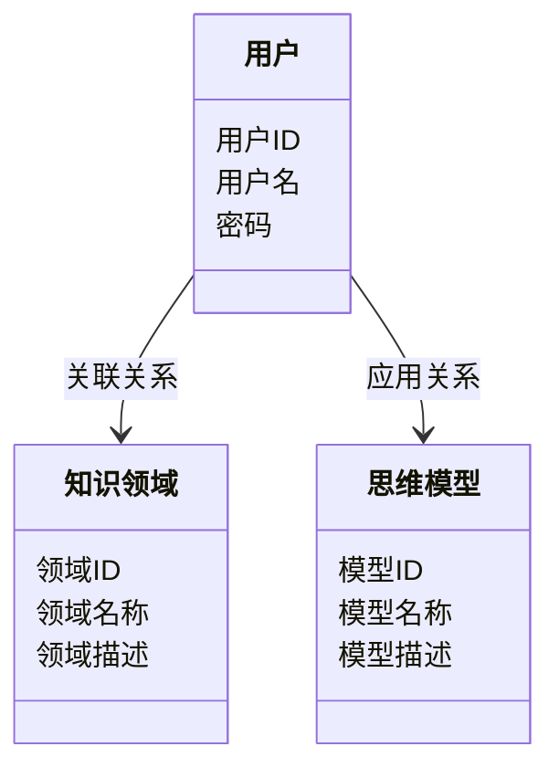
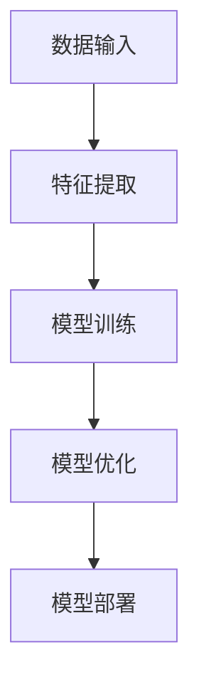
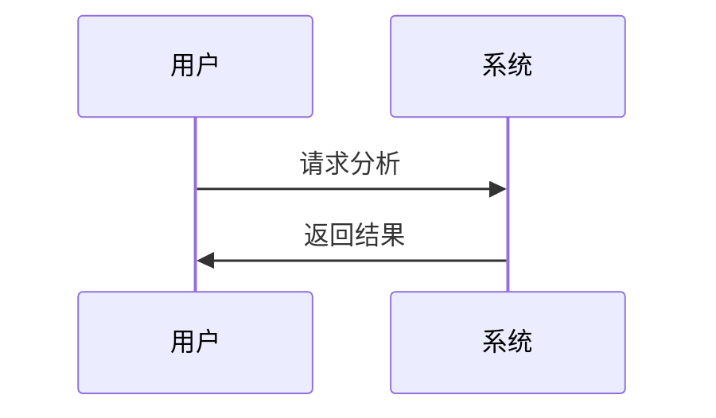

                 


# 芒格的"多元思维模型"在人工智能时代的升级

> 关键词：芒格多元思维模型，人工智能，大语言模型，知识图谱，系统设计

> 摘要：芒格的多元思维模型作为一种跨学科的思维方式，在人工智能时代面临新的挑战和机遇。本文从多元思维模型的背景出发，分析其在AI时代的升级路径，探讨大语言模型对多元思维模型的增强作用，并通过系统设计和项目实战，展示多元思维模型在AI时代的具体应用和优化策略。

---

## 第1章: 多元思维模型的背景与核心概念

### 1.1 多元思维模型的起源与演变

#### 1.1.1 芒格多元思维模型的提出

芒格的多元思维模型是一种跨学科的思维方式，强调通过多个学科的视角来分析问题。其核心在于将各个学科的基本原理整合起来，形成一个立体的知识网络。这种思维方式不仅适用于投资领域，还广泛应用于其他领域。

#### 1.1.2 多元思维模型的核心要素

多元思维模型的核心要素包括以下几点：

1. **多学科性**：涵盖多个学科的基本原理，如心理学、经济学、物理学等。
2. **系统性**：注重系统性思考，关注事物之间的相互关系和整体结构。
3. **实用性**：强调实际应用，将理论与实践相结合。
4. **动态性**：随着时代的发展不断更新和扩展。

#### 1.1.3 多元思维模型在AI时代的背景

在AI时代，多元思维模型的背景发生了变化。随着大语言模型、知识图谱等技术的兴起，多元思维模型需要与这些新技术结合，才能更好地适应AI时代的挑战。

### 1.2 多元思维模型的定义与特点

#### 1.2.1 多元思维模型的定义

多元思维模型是一种通过整合多个学科的基本原理，形成系统性思维方式的方法。它强调跨学科的视角，注重从不同角度分析问题。

#### 1.2.2 多元思维模型的核心属性对比表

以下是对多元思维模型与传统思维方式的核心属性对比：

| 属性       | 多元思维模型       | 传统思维方式      |
|------------|--------------------|-------------------|
| 多学科性    | 高                 | 低                |
| 系统性      | 高                 | 低                |
| 实用性      | 高                 | 中                |
| 动态性      | 高                 | 低                |

#### 1.2.3 多元思维模型的ER实体关系图

以下是多元思维模型的ER实体关系图：

```mermaid
erDiagram
    user {
        用户ID
        用户名
        密码
    }
    knowledge_field {
        领域ID
        领域名称
        领域描述
    }
    mind_model {
        模型ID
        模型名称
        模型描述
    }
    用户 --> 知识领域 : 关联关系
    用户 --> 思维模型 : 应用关系
```

### 1.3 多元思维模型在AI时代的升级

#### 1.3.1 AI时代对多元思维模型的挑战

AI时代带来了新的挑战，如数据爆炸、知识复杂化、技术快速迭代等。传统的多元思维模型需要适应这些变化，才能保持其有效性。

#### 1.3.2 大模型对多元思维模型的补充

大模型通过其强大的计算能力和知识整合能力，为多元思维模型提供了新的工具和方法。例如，大模型可以通过自然语言处理技术，快速整合多个领域的知识，从而增强多元思维模型的跨学科能力。

#### 1.3.3 多元思维模型的AI化升级路径

多元思维模型的AI化升级路径包括以下步骤：

1. **知识整合**：通过大模型整合多个领域的知识，形成一个统一的知识网络。
2. **动态更新**：根据新的数据和信息，动态更新知识网络。
3. **智能推理**：利用大模型的推理能力，进行跨学科的智能分析。

## 第2章: 大模型与多元思维模型的结合

### 2.1 大模型的基本原理

#### 2.1.1 大模型的训练过程

大模型的训练过程包括以下几个步骤：

1. **数据预处理**：对数据进行清洗、标注和转换。
2. **模型训练**：使用训练数据对模型进行训练，优化模型参数。
3. **模型评估**：通过验证集和测试集评估模型的性能。
4. **模型部署**：将模型部署到实际应用场景中。

#### 2.1.2 大模型的核心算法

大模型的核心算法包括以下几种：

1. **Transformer**：一种基于注意力机制的深度学习模型。
2. **BERT**：一种预训练的Transformer模型，用于自然语言处理任务。
3. **GPT**：一种生成式的大语言模型，用于文本生成任务。

#### 2.1.3 大模型的数学模型

大模型的数学模型通常包括以下部分：

$$ P(y|x) = \frac{P(x|y)P(y)}{P(x)} $$

其中，$P(y|x)$ 表示在条件 $x$ 下，事件 $y$ 发生的概率。

### 2.2 大模型对多元思维模型的增强

#### 2.2.1 大模型在多元思维模型中的应用

大模型可以通过以下方式增强多元思维模型：

1. **知识整合**：通过大模型整合多个领域的知识，形成一个统一的知识网络。
2. **智能推理**：利用大模型的推理能力，进行跨学科的智能分析。
3. **动态更新**：根据新的数据和信息，动态更新知识网络。

#### 2.2.2 大模型对多元思维模型的优化

大模型对多元思维模型的优化主要体现在以下方面：

1. **提高效率**：通过大模型的快速计算能力，提高多元思维模型的分析效率。
2. **增强准确性**：通过大模型的深度学习能力，提高多元思维模型的分析准确性。
3. **扩展应用**：通过大模型的通用性，扩展多元思维模型的应用范围。

#### 2.2.3 多元思维模型与大模型的结合案例

以下是一个多元思维模型与大模型结合的案例：

假设我们需要分析一个企业的市场策略，可以利用大模型整合市场营销、心理学、经济学等多个领域的知识，形成一个统一的知识网络。然后，通过大模型的推理能力，进行跨学科的智能分析，得出最优的市场策略。

### 2.3 本章小结

---

## 第3章: 多元思维模型的系统分析与架构设计

### 3.1 系统分析

#### 3.1.1 问题场景描述

在AI时代，多元思维模型需要与大模型结合，形成一个智能的知识管理系统。该系统需要具备以下功能：

1. **知识整合**：整合多个领域的知识，形成统一的知识网络。
2. **智能推理**：利用大模型的推理能力，进行跨学科的智能分析。
3. **动态更新**：根据新的数据和信息，动态更新知识网络。

#### 3.1.2 领域模型设计

以下是领域模型的设计：



### 3.2 系统设计

#### 3.2.1 系统功能设计

系统功能设计包括以下内容：

1. **知识整合模块**：整合多个领域的知识，形成统一的知识网络。
2. **智能推理模块**：利用大模型的推理能力，进行跨学科的智能分析。
3. **动态更新模块**：根据新的数据和信息，动态更新知识网络。

#### 3.2.2 系统架构设计

以下是系统架构设计：



#### 3.2.3 系统接口设计

系统接口设计包括以下内容：

1. **数据接口**：用于数据的输入和输出。
2. **模型接口**：用于模型的训练和推理。
3. **用户接口**：用于用户的交互和操作。

#### 3.2.4 系统交互设计

以下是系统交互设计：



### 3.3 本章小结

---

## 第4章: 项目实战与优化策略

### 4.1 项目实战

#### 4.1.1 环境安装

以下是项目实战的环境安装步骤：

1. **安装Python**：安装Python 3.8及以上版本。
2. **安装依赖库**：安装必要的依赖库，如TensorFlow、PyTorch等。
3. **安装大模型框架**：安装大模型框架，如Hugging Face的Transformers库。

#### 4.1.2 核心代码实现

以下是核心代码实现：

```python
def model_training(data):
    # 数据预处理
    processed_data = preprocess(data)
    # 模型训练
    model = train(processed_data)
    return model
```

#### 4.1.3 代码应用解读与分析

以下是代码应用解读与分析：

1. **数据预处理**：对输入数据进行清洗和转换，使其适合模型训练。
2. **模型训练**：使用预处理后的数据训练模型，优化模型参数。
3. **模型推理**：利用训练好的模型进行推理，输出结果。

#### 4.1.4 案例分析与详细讲解

以下是一个案例分析：

假设我们需要分析一个企业的市场策略，可以利用大模型整合市场营销、心理学、经济学等多个领域的知识，形成一个统一的知识网络。然后，通过大模型的推理能力，进行跨学科的智能分析，得出最优的市场策略。

### 4.2 优化策略

#### 4.2.1 提升模型性能的策略

1. **优化数据预处理**：通过数据增强、清洗等方法提升数据质量。
2. **优化模型参数**：通过调整学习率、批量大小等参数提升模型性能。
3. **优化推理算法**：通过改进推理算法提升推理效率。

#### 4.2.2 系统设计的优化

1. **优化系统架构**：通过改进系统架构提升系统的扩展性和稳定性。
2. **优化系统接口**：通过改进系统接口提升系统的交互效率。
3. **优化系统交互**：通过改进系统交互提升用户体验。

### 4.3 本章小结

---

## 第5章: 总结与展望

### 5.1 总结

多元思维模型在AI时代的升级是一个重要的研究方向。通过与大模型的结合，多元思维模型能够更好地适应AI时代的挑战和机遇，提升分析效率和决策能力。

### 5.2 展望

未来，随着大模型技术的不断发展，多元思维模型在AI时代的应用将更加广泛和深入。我们可以期待更多创新性的应用和优化策略的出现。

---

## 作者：AI天才研究院/AI Genius Institute & 禅与计算机程序设计艺术 /Zen And The Art of Computer Programming

---

以上是《芒格的"多元思维模型"在人工智能时代的升级》的技术博客文章的完整内容。

