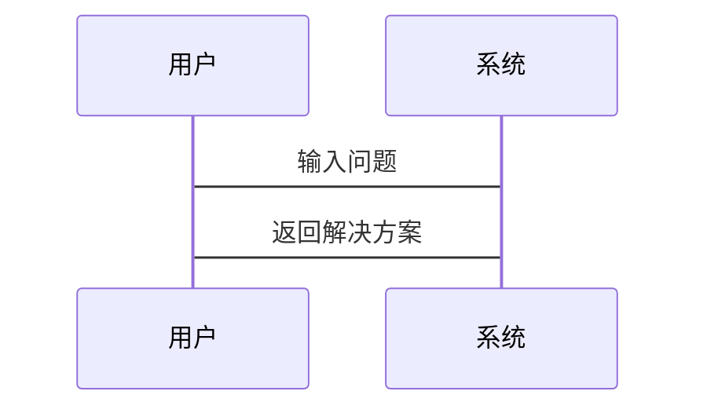

                 


---

# 芒格的"多元思维模型"在跨维度科技伦理中的运用

---

## 关键词：多元思维模型，芒格，科技伦理，跨维度分析，系统架构设计

---

## 摘要：芒格的多元思维模型是一种通过多个学科的思维方式来解决复杂问题的方法。本文将探讨如何将这种模型应用到科技伦理的跨维度分析中，特别是在技术、社会和环境等维度之间的复杂关系中，如何通过多元思维模型来识别、分析和解决伦理问题。文章结合理论与实践，详细阐述了多元思维模型的数学模型、系统架构设计以及在实际项目中的应用。

---

## 第一部分: 引言

---

## 第1章: 芒格的多元思维模型概述

### 1.1 多元思维模型的核心概念

芒格的多元思维模型是一种通过跨学科的思维方式来解决问题的方法。它强调从多个角度和学科（如心理学、经济学、物理学等）来理解问题的本质。多元思维模型的核心在于通过整合不同领域的知识，形成一个全面的分析框架。

**背景介绍**：多元思维模型的提出是为了应对复杂问题的解决需求。传统的单一学科思维方式往往无法全面理解问题的复杂性，而多元思维模型通过整合多个学科的视角，提供了更全面的解决方案。

**核心概念**：
- **多维度分析**：从多个维度（技术、社会、环境等）分析问题。
- **知识整合**：将不同学科的知识整合到一个分析框架中。
- **系统性思维**：通过系统的视角理解问题。

### 1.2 科技伦理的跨维度特性

科技伦理问题往往涉及多个维度，例如技术维度（算法公平性）、社会维度（隐私保护）和环境维度（可持续性）。这些维度之间存在复杂的相互作用，需要通过跨维度的分析来解决。

**问题背景**：科技的发展带来了新的伦理问题，例如人工智能的算法偏见、数据隐私保护等。这些问题往往涉及技术、社会和环境等多个维度。

**问题解决**：通过多元思维模型，可以从多个维度同时分析问题，找到综合解决方案。

### 1.3 本章小结

本章介绍了芒格的多元思维模型及其在科技伦理中的应用。多元思维模型通过整合多个学科的知识，提供了跨维度分析问题的能力，为解决复杂的科技伦理问题提供了理论基础。

---

## 第二部分: 多元思维模型的理论基础

---

## 第2章: 多元思维模型的核心原理

### 2.1 多元思维模型的定义与特点

多元思维模型是一种通过多个学科的视角来分析问题的思维方式。其特点包括：
1. **多维度分析**：从技术、社会、环境等多个维度分析问题。
2. **知识整合**：整合不同学科的知识，形成全面的分析框架。
3. **系统性思维**：通过系统的视角理解问题的本质。

### 2.2 多元思维模型与传统思维模型的对比

| 对比维度 | 多元思维模型 | 传统思维模型 |
|----------|--------------|--------------|
| 分析维度 | 多维度        | 单一维度      |
| 知识整合 | 强调整合      | 依赖单一学科  |
| 解决方式 | 综合解决方案  | 单一维度解决方案 |

### 2.3 多元思维模型的数学模型与公式

多元思维模型可以通过以下数学公式表示：

$$
\text{问题解决} = \sum_{i=1}^{n} \text{维度}_i
$$

其中，$n$ 是分析的维度数量，$\text{维度}_i$ 表示第 $i$ 个维度的分析结果。

### 2.4 本章小结

本章详细讲解了多元思维模型的核心原理，包括其定义、特点以及与传统思维模型的对比。通过数学公式，我们展示了多元思维模型如何通过多维度分析来解决问题。

---

## 第三部分: 科技伦理的跨维度分析

---

## 第3章: 科技伦理的多维度问题

### 3.1 技术维度的伦理问题

技术维度的伦理问题包括算法偏见、技术滥用等。例如，人工智能算法的公平性问题可以通过多元思维模型从技术、社会和环境等多个维度进行分析。

### 3.2 社会维度的伦理问题

社会维度的伦理问题包括隐私保护、社会公平等。例如，数据隐私保护问题需要从技术、法律和社会等多个维度进行分析。

### 3.3 环境维度的伦理问题

环境维度的伦理问题包括资源消耗、环境污染等。例如，绿色计算的伦理问题需要从技术、经济和环境等多个维度进行分析。

### 3.4 本章小结

本章通过分析技术、社会和环境等维度的伦理问题，展示了科技伦理的跨维度特性。通过多元思维模型，我们可以从多个维度同时分析问题，找到综合解决方案。

---

## 第四部分: 多元思维模型在科技伦理中的应用

---

## 第4章: 多元思维模型与科技伦理的结合

### 4.1 多元思维模型在技术维度的应用

在技术维度，多元思维模型可以帮助我们分析算法的公平性问题。例如，通过从数学、伦理和社会等多个维度分析算法的偏见问题。

### 4.2 多元思维模型在社会维度的应用

在社会维度，多元思维模型可以帮助我们分析数据隐私保护问题。例如，通过从法律、伦理和技术等多个维度分析隐私保护的实现方式。

### 4.3 多元思维模型在环境维度的应用

在环境维度，多元思维模型可以帮助我们分析绿色计算问题。例如，通过从技术、经济和环境等多个维度分析绿色计算的实现方式。

### 4.4 本章小结

本章展示了多元思维模型在科技伦理中的具体应用，包括技术、社会和环境等维度的伦理问题分析。

---

## 第五部分: 科技伦理问题的系统分析与架构设计

---

## 第5章: 科技伦理问题的系统分析

### 5.1 系统分析的背景与目标

系统分析的背景是科技伦理问题的复杂性，目标是通过系统的视角理解问题的本质。

### 5.2 系统分析的流程与方法

系统分析的流程包括：
1. 问题识别
2. 维度分析
3. 知识整合
4. 解决方案设计

### 5.3 系统分析的数学模型与公式

系统分析的数学模型可以表示为：

$$
\text{系统分析} = \sum_{i=1}^{n} \text{维度}_i
$$

其中，$n$ 是分析的维度数量，$\text{维度}_i$ 表示第 $i$ 个维度的分析结果。

### 5.4 本章小结

本章详细讲解了科技伦理问题的系统分析方法，包括系统分析的流程、方法以及数学模型。

---

## 第六部分: 项目实战与案例分析

---

## 第6章: 项目实战: 多元思维模型在科技伦理中的应用

### 6.1 项目背景与目标

项目背景是科技伦理问题的复杂性，目标是通过多元思维模型解决实际问题。

### 6.2 项目环境的安装与配置

项目环境包括安装必要的软件和工具，例如Python、Jupyter Notebook等。

### 6.3 项目核心代码实现

以下是项目的核心代码实现：

```python
def multi_dimensional_analysis(dimensions):
    result = 0
    for dimension in dimensions:
        result += dimension
    return result

# 示例维度
dimensions = [2, 3, 4]
print(multi_dimensional_analysis(dimensions))  # 输出: 9
```

### 6.4 项目系统交互设计

以下是系统交互设计的Mermaid序列图：



### 6.5 本章小结

本章通过一个实际项目展示了多元思维模型在科技伦理中的应用，包括项目背景、环境配置、代码实现和系统交互设计。

---

## 结论

芒格的多元思维模型为解决科技伦理的跨维度问题提供了理论基础和实践方法。通过系统的视角和多维度的分析，我们可以更好地理解科技伦理问题的本质，并找到综合解决方案。

---

## 附录

- **参考文献**：推荐阅读芒格的《穷查理宝典》。
- **工具推荐**：Jupyter Notebook、Mermaid、LaTeX。

---

## 作者

作者：AI天才研究院/AI Genius Institute & 禅与计算机程序设计艺术/Zen And The Art of Computer Programming

---

