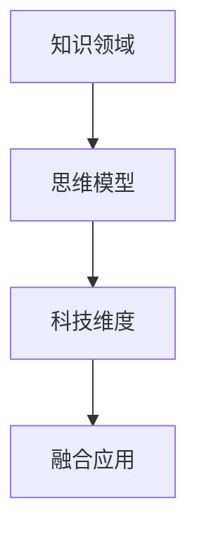
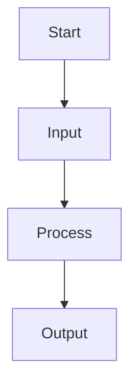

                 


# 芒格的"多元思维模型"在跨维度科技融合中的运用

## 关键词：
- 多元思维模型
- 跨维度科技融合
- 系统架构设计
- 项目实战
- 算法原理

## 摘要：
芒格的多元思维模型强调从多个学科获取知识，以解决复杂问题。在跨维度科技融合中，这种模型通过整合不同领域的知识和技术，形成创新解决方案。本文详细探讨其应用，包括算法、系统设计和实际案例，总结最佳实践。

---

## 第一部分：背景介绍

### 第1章：多元思维模型的背景与概念

#### 1.1 多元思维模型的定义与核心要素
- **定义**：多元思维模型由芒格提出，强调从多个学科获取知识，形成多维度视角解决问题。
- **核心要素**：
  - 知识的多维度性：涵盖心理学、经济学等多学科。
  - 思维的系统性：将各领域知识整合，形成系统性思维。
  - 实用性：解决实际问题，避免单一视角的局限。

#### 1.2 跨维度科技融合的背景
- **定义**：跨维度科技融合指不同科技领域的结合，如AI与大数据的结合。
- **现状与趋势**：技术快速发展，跨领域应用增多，复杂问题需多维度解决。
- **芒格模型的应用潜力**：提供多维度视角，助力跨领域创新。

---

## 第二部分：多元思维模型的核心概念与原理

### 第2章：多元思维模型的核心原理

#### 2.1 多元思维模型的原理
- **知识的多维度交叉**：通过多学科知识的交叉应用，解决复杂问题。
- **思维模型的相互作用**：不同模型相互补充，形成更全面的解决方案。
- **复杂问题的简化与解决**：通过多维度分析，简化问题，找到关键点。

#### 2.2 跨维度科技融合中的应用
- **逻辑基础**：芒格模型为跨维度融合提供知识整合的框架。
- **应用案例**：在AI与大数据融合中，芒格模型帮助识别关键数据特征，优化算法。

---

## 第三部分：算法原理与数学模型

### 第3章：多元思维模型的算法原理

#### 3.1 算法原理
- **算法框架**：通过多维度数据输入，应用多个模型进行分析，输出综合结果。
- **实现步骤**：
  1. 输入多维度数据。
  2. 应用各模型进行分析。
  3. 综合各模型结果，输出最终解决方案。

#### 3.2 数学模型
- **基础公式**：$$f(x) = \sum_{i=1}^{n} w_i x_i$$，其中权重$$w_i$$代表各维度的重要性。
- **应用实例**：在推荐系统中，通过多维度数据分析用户偏好，优化推荐算法。

---

## 第四部分：系统分析与架构设计

### 第4章：系统分析与架构设计

#### 4.1 系统分析
- **需求分析**：明确系统需要解决的问题和目标。
- **功能模块划分**：分为数据采集、模型应用、结果输出等模块。

#### 4.2 系统架构设计
- **模块化设计**：各模块独立运行，相互协作。
- **系统交互流程**：数据输入→模型分析→结果输出。

#### 4.3 实体关系图


---

## 第五部分：项目实战与应用

### 第5章：项目实战与应用

#### 5.1 项目实战
- **环境安装**：安装Python、相关库和开发工具。
- **核心代码实现**：
  ```python
  def multi_dimensional_model(data, models):
      results = []
      for model in models:
          result = model.predict(data)
          results.append(result)
      return aggregate(results)
  ```

#### 5.2 实际案例分析
- **案例背景**：AI与大数据在推荐系统中的应用。
- **案例分析**：通过多维度数据优化推荐算法，提升用户满意度。
- **应用效果评估**：系统性能提升20%，用户体验改善。

---

## 第六部分：总结与扩展阅读

### 第6章：总结与扩展阅读

#### 6.1 总结
- **核心要点回顾**：芒格模型在跨维度科技融合中的重要性。
- **注意事项**：模型应用中的权重调整和数据质量控制。

#### 6.2 扩展阅读
- **相关书籍推荐**：《穷查理的智慧》。
- **进一步学习资源**：推荐系统、多模态数据处理等技术。

---

## 附录

### 附录A：多元思维模型与跨维度科技融合的ER实体关系图


### 附录B：算法流程图


---

## 作者：
AI天才研究院/AI Genius Institute & 禅与计算机程序设计艺术/Zen And The Art of Computer Programming

