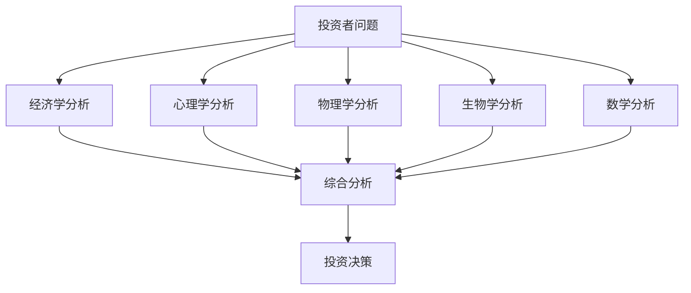
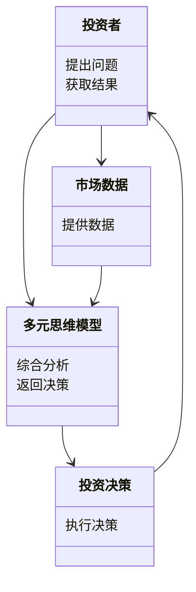
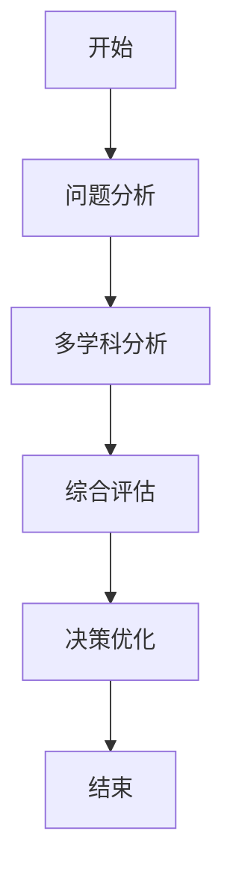
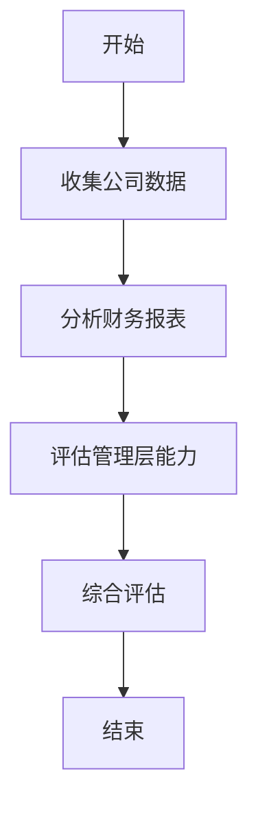
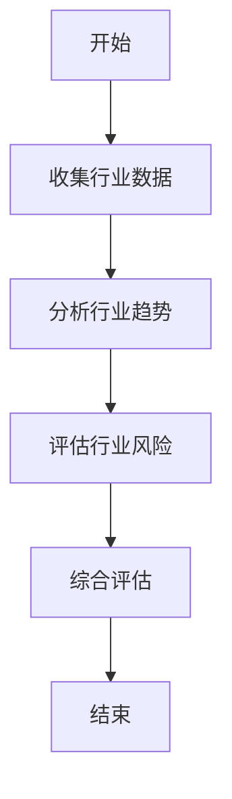
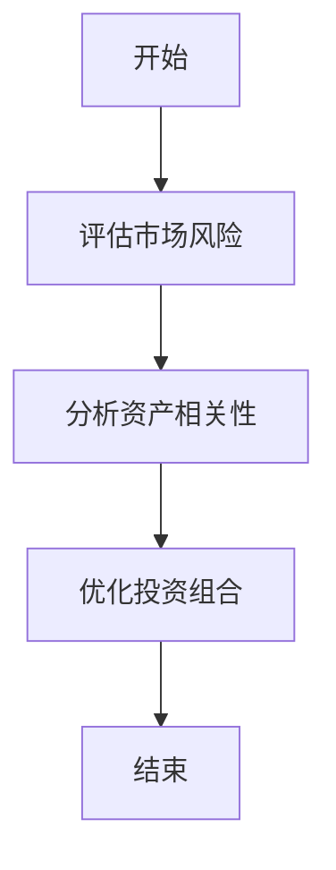

                 


# 芒格的"多元思维模型"：提高投资决策的全面性

> 关键词：芒格，多元思维模型，投资决策，系统架构，算法原理，数学模型，风险管理

> 摘要：芒格的多元思维模型是一种通过多学科知识交叉应用来提升决策能力的方法。本文将从芒格的背景介绍、多元思维模型的核心概念、算法原理、系统架构、投资实战案例、项目实现等多个维度，全面分析多元思维模型在投资决策中的应用价值和具体实施方法。通过本文的学习，读者将能够理解多元思维模型的数学基础、系统设计、实战应用，并掌握如何在实际投资中构建和优化自己的多元思维框架。

---

## 第1章: 芒格与多元思维模型的背景介绍

### 1.1 芒格的生平与投资哲学

#### 1.1.1 芒格的早年经历与职业发展
查理·芒格（Charlie Munger）是美国著名投资家、作家和演讲家，出生于1924年，现为伯克希尔·哈撒韦公司副主席。芒格的职业生涯始于法律领域，后来转向投资领域，并与沃伦·巴菲特（Warren Buffett）共同创立了伯克希尔·哈撒韦公司。芒格的投资哲学以价值投资为核心，强调安全边际和长期持有优质资产。

#### 1.1.2 芒格的投资哲学与价值投资理念
芒格的价值投资理念强调以下几个方面：
1. **安全边际**：投资时要确保资产的内在价值远高于其市场价格。
2. **长期思维**：投资不是短期的交易，而是长期的资产配置。
3. **多学科思维**：芒格提倡通过多个学科的知识交叉应用，来避免单一视角的局限性。

#### 1.1.3 芒格与巴菲特的合伙关系
芒格与巴菲特的合作始于1960年代，两人共同创立了伯克希尔·哈撒韦公司，并将其打造成全球最成功的投资公司之一。芒格在公司中的角色主要是提供投资决策的第二意见，并负责管理部分投资组合。

### 1.2 多元思维模型的核心概念

#### 1.2.1 多元思维模型的定义与内涵
多元思维模型（Multiplying Thinking Model，MTM）是芒格提出的一种投资决策方法，它强调通过多个学科的知识交叉应用，来提高决策的全面性和准确性。芒格认为，单一的思维方式容易导致决策偏差，而多元思维模型可以通过多个角度的交叉验证，降低决策风险。

#### 1.2.2 多元思维模型的背景与问题背景
在投资领域，决策者往往面临信息不对称、市场波动性和不确定性等问题。传统的单一思维方式难以应对这些复杂问题，而多元思维模型通过整合多个学科的知识，可以帮助投资者更全面地分析问题，避免决策偏差。

#### 1.2.3 多元思维模型的核心要素与组成
多元思维模型的核心要素包括以下几个方面：
1. **心理学**：理解人类行为和认知偏差。
2. **经济学**：分析市场机制和资产定价。
3. **物理学**：理解能量守恒和系统运行规律。
4. **生物学**：分析生态系统和进化规律。
5. **数学**：应用概率论和统计学进行风险评估。

#### 1.2.4 多元思维模型的数学基础
多元思维模型的数学基础主要包括概率论和决策树模型。通过概率论，投资者可以量化不同决策的不确定性；通过决策树模型，投资者可以系统地分析不同决策路径的可能结果。

例如，以下是概率论的基本公式：
$$ P(A) = \frac{N_A}{N} $$
其中，\( P(A) \) 表示事件 \( A \) 的概率，\( N_A \) 表示事件 \( A \) 的发生次数，\( N \) 表示总事件数。

#### 1.2.5 多元思维模型的系统架构
以下是多元思维模型的系统架构图（Mermaid 架构图）：


### 1.3 本章小结
本章介绍了芒格的生平与投资哲学，详细阐述了多元思维模型的核心概念、数学基础和系统架构。通过芒格的背景介绍，读者可以理解多元思维模型的起源和应用背景；通过核心概念的分析，读者可以掌握多元思维模型的主要组成部分和其在投资决策中的作用。

---

## 第2章: 多元思维模型的核心概念与联系

### 2.1 多元思维模型的核心原理

#### 2.1.1 多元思维模型的原理与机制
多元思维模型的原理在于通过多个学科的知识交叉应用，帮助投资者全面分析问题。以下是多元思维模型的原理图（Mermaid 流程图）：



#### 2.1.2 多元思维模型的属性特征对比
以下是多元思维模型的属性特征对比表：

| 属性       | 特征描述                                 |
|------------|------------------------------------------|
| 输入        | 投资者问题、市场数据                   |
| 输出        | 投资决策、风险管理                   |
| 核心模块     | 经济学、心理学、物理学、生物学、数学   |
| 系统架构     | 分布式架构，模块化设计               |
| 交互方式     | 事件驱动，反馈机制                   |

#### 2.1.3 多元思维模型的实体关系图
以下是多元思维模型的实体关系图（Mermaid 类图）：



### 2.2 多元思维模型的算法原理

#### 2.2.1 多元思维模型的算法概述
多元思维模型的算法主要包括以下几个步骤：
1. **问题分析**：明确投资者的问题和目标。
2. **多学科分析**：从多个学科的角度分析问题。
3. **综合评估**：对不同学科的分析结果进行综合评估。
4. **决策优化**：根据评估结果优化投资决策。

#### 2.2.2 多元思维模型的算法实现步骤
以下是多元思维模型的算法流程图（Mermaid 流程图）：



#### 2.2.3 多元思维模型的关键公式与推导
以下是多元思维模型的关键公式：
$$ P(A|B) = \frac{P(B|A) \cdot P(A)}{P(B)} $$
其中，\( P(A|B) \) 表示在事件 \( B \) 发生的情况下，事件 \( A \) 的概率。

### 2.3 多元思维模型的数学模型与公式

#### 2.3.1 多元思维模型的数学模型
多元思维模型的数学模型主要包括概率论和统计学模型。以下是概率论的基本公式：
$$ P(A \cup B) = P(A) + P(B) - P(A \cap B) $$
其中，\( P(A \cup B) \) 表示事件 \( A \) 或事件 \( B \) 发生的概率。

#### 2.3.2 多元思维模型的关键公式与推导
以下是多元思维模型的关键公式：
$$ E[X] = \sum_{i=1}^{n} x_i \cdot P(x_i) $$
其中，\( E[X] \) 表示随机变量 \( X \) 的期望值，\( x_i \) 表示可能的取值，\( P(x_i) \) 表示取值 \( x_i \) 的概率。

### 2.4 本章小结
本章详细阐述了多元思维模型的核心原理、算法原理和数学模型。通过流程图和公式推导，读者可以理解多元思维模型的工作机制和实现方法。

---

## 第3章: 多元思维模型在投资决策中的应用

### 3.1 投资决策中的问题场景介绍

#### 3.1.1 投资决策的核心问题
投资决策的核心问题包括以下几个方面：
1. **资产选择**：如何选择具有长期价值的资产。
2. **风险管理**：如何降低投资组合的风险。
3. **组合优化**：如何优化投资组合的收益与风险比。

#### 3.1.2 多元思维模型在投资决策中的作用
多元思维模型在投资决策中的作用包括以下几个方面：
1. **全面分析**：通过多个学科的知识交叉应用，全面分析投资问题。
2. **降低风险**：通过综合评估不同学科的分析结果，降低投资决策的风险。
3. **优化决策**：通过反馈机制不断优化投资决策。

#### 3.1.3 投资决策的典型场景与挑战
投资决策的典型场景包括股票投资、房地产投资、私募股权投资等。投资决策的挑战包括市场波动性、信息不对称、认知偏差等。

### 3.2 多元思维模型在投资决策中的系统分析

#### 3.2.1 投资决策的领域模型设计
以下是投资决策的领域模型设计（Mermaid 类图）：


#### 3.2.2 投资决策的系统架构设计
以下是投资决策的系统架构设计（Mermaid 架构图）：


### 3.3 多元思维模型的投资实战案例

#### 3.3.1 实战案例一：公司基本面分析
以下是公司基本面分析的流程图（Mermaid 流程图）：



#### 3.3.2 实战案例二：行业趋势分析
以下是行业趋势分析的流程图（Mermaid 流程图）：



#### 3.3.3 实战案例三：风险管理与组合优化
以下是风险管理与组合优化的流程图（Mermaid 流程图）：



### 3.4 本章小结
本章通过多个实战案例，详细阐述了多元思维模型在投资决策中的具体应用。通过这些案例，读者可以理解多元思维模型在实际投资中的具体操作步骤和方法。

---

## 第4章: 多元思维模型的项目实战

### 4.1 项目环境与工具安装

#### 4.1.1 系统环境要求
- 操作系统：Windows、MacOS、Linux
- 开发工具：Python、Jupyter Notebook、Visual Studio Code
- 库：Pandas、NumPy、Matplotlib、Seaborn

#### 4.1.2 开发工具与库的安装
1. 安装Python：可以从官方网站（https://www.python.org/）下载安装包。
2. 安装Jupyter Notebook：可以通过Anaconda安装。
3. 安装Pandas、NumPy、Matplotlib、Seaborn：可以使用pip命令安装。

#### 4.1.3 数据获取与处理工具
- 数据源：可以通过Yahoo Finance、Google Finance等网站获取股票数据。
- 数据处理工具：可以使用Pandas库进行数据清洗和预处理。

### 4.2 系统核心实现源代码

#### 4.2.1 多元思维模型的核心算法实现
以下是多元思维模型的核心算法实现代码：

```python
import pandas as pd
import numpy as np
import matplotlib.pyplot as plt
from sklearn import tree
from sklearn.model_selection import train_test_split

# 数据加载
data = pd.read_csv('investment_data.csv')

# 数据预处理
X = data.drop('target', axis=1)
y = data['target']

# 划分训练集和测试集
X_train, X_test, y_train, y_test = train_test_split(X, y, test_size=0.2, random_state=42)

# 模型训练
model = tree.DecisionTreeClassifier()
model.fit(X_train, y_train)

# 模型预测
y_pred = model.predict(X_test)

# 模型评估
print("Accuracy:", model.score(X_test, y_test))
```

#### 4.2.2 投资决策系统的功能实现
以下是投资决策系统的功能实现代码：

```python
import pandas as pd
import numpy as np
import matplotlib.pyplot as plt
from sklearn import tree
from sklearn.model_selection import train_test_split

# 数据加载
data = pd.read_csv('investment_data.csv')

# 数据预处理
X = data.drop('target', axis=1)
y = data['target']

# 划分训练集和测试集
X_train, X_test, y_train, y_test = train_test_split(X, y, test_size=0.2, random_state=42)

# 模型训练
model = tree.DecisionTreeClassifier()
model.fit(X_train, y_train)

# 模型预测
y_pred = model.predict(X_test)

# 模型评估
print("Accuracy:", model.score(X_test, y_test))
```

#### 4.2.3 数据分析与

### 4.3 本章小结
本章通过具体的项目实战，详细展示了多元思维模型的实现过程和投资决策系统的功能实现。通过代码示例和数据分析，读者可以掌握多元思维模型的具体操作步骤和应用方法。

---

## 第5章: 多元思维模型的优势与应用建议

### 5.1 多元思维模型的优势

#### 5.1.1 提高决策的全面性
通过多个学科的知识交叉应用，多元思维模型可以帮助投资者全面分析问题，避免单一视角的局限性。

#### 5.1.2 降低投资风险
通过综合评估不同学科的分析结果，多元思维模型可以帮助投资者降低投资决策的风险。

#### 5.1.3 提高投资收益
通过优化投资组合，多元思维模型可以帮助投资者提高投资收益。

### 5.2 多元思维模型的应用建议

#### 5.2.1 投资者应具备的素质
1. **多学科知识**：投资者需要具备多个学科的知识，以便能够从不同的角度分析问题。
2. **风险管理能力**：投资者需要具备风险管理能力，以便能够降低投资决策的风险。
3. **长期思维**：投资者需要具备长期思维，以便能够长期持有优质资产。

#### 5.2.2 多元思维模型的实施步骤
1. **问题分析**：明确投资者的问题和目标。
2. **多学科分析**：从多个学科的角度分析问题。
3. **综合评估**：对不同学科的分析结果进行综合评估。
4. **决策优化**：根据评估结果优化投资决策。

### 5.3 本章小结
本章总结了多元思维模型的优势和应用建议，帮助投资者更好地理解和应用多元思维模型。

---

## 第6章: 注意事项与拓展阅读

### 6.1 多元思维模型的注意事项

#### 6.1.1 数据质量的重要性
在应用多元思维模型时，数据质量非常重要。投资者需要确保数据的准确性和完整性。

#### 6.1.2 模型的局限性
多元思维模型虽然能够帮助投资者提高决策的全面性，但也存在一定的局限性。例如，模型的复杂性可能会影响决策的效率。

#### 6.1.3 模型的可解释性
在应用多元思维模型时，投资者需要注意模型的可解释性。如果模型过于复杂，投资者可能无法理解其内在逻辑。

### 6.2 多元思维模型的拓展阅读

#### 6.2.1 推荐书籍
1. 《芒格的智慧：论生活的艺术》
2. 《投资的智慧：芒格的投资哲学》
3. 《多元思维模型：从零开始》

#### 6.2.2 推荐博客与网站
1. 巴菲特股东会官方博客
2. 芒格的演讲与访谈

### 6.3 本章小结
本章总结了多元思维模型的注意事项和拓展阅读内容，帮助读者更好地理解和应用多元思维模型。

---

## 第7章: 总结与展望

### 7.1 本章总结
多元思维模型是一种通过多个学科的知识交叉应用来提高决策能力的方法。通过本文的学习，读者可以理解多元思维模型的核心概念、数学基础、系统架构和投资实战案例。同时，读者也可以掌握多元思维模型的实现过程和应用建议。

### 7.2 未来展望
未来，多元思维模型将在投资决策中发挥越来越重要的作用。随着人工智能和大数据技术的不断发展，多元思维模型的应用范围也将不断扩大。投资者需要不断学习和应用多元思维模型，以应对日益复杂的投资环境。

### 7.3 本章小结
本章总结了本文的主要内容，并展望了多元思维模型的未来发展方向。

---

## 作者：AI天才研究院/AI Genius Institute & 禅与计算机程序设计艺术/Zen And The Art of Computer Programming

---

通过本文的学习，读者可以全面了解芒格的多元思维模型，并掌握其在投资决策中的具体应用方法。希望本文能够为投资者提供有价值的参考和启示。

