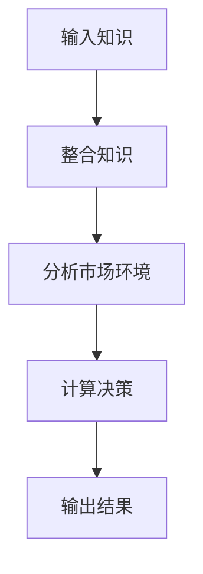
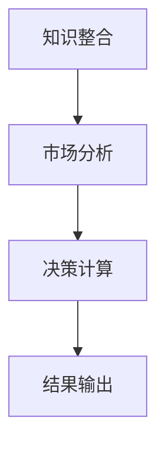
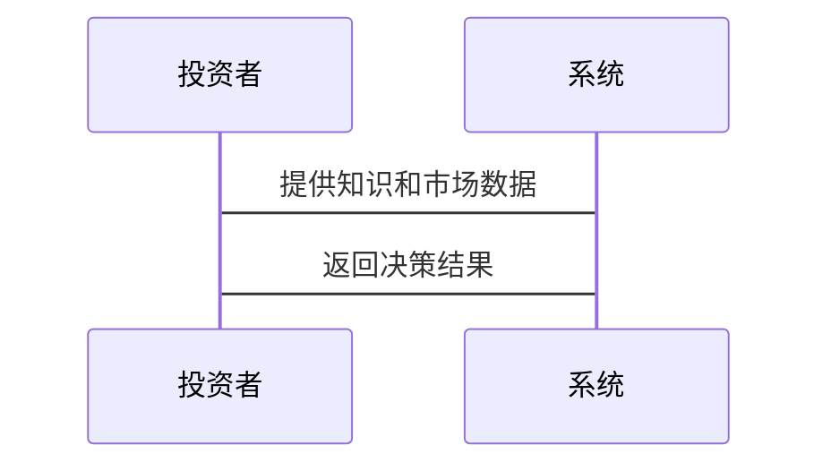

                 


# 芒格的多学科知识应用：拓宽投资视野

> 关键词：芒格、多学科知识、投资视野、知识模型、决策算法、系统架构

> 摘要：本文从技术角度深入剖析芒格的多学科知识应用方法，探讨其在投资决策中的数学模型、算法原理和系统架构设计。通过具体案例分析和实战演示，揭示芒格知识模型的核心要素和实现细节，为技术背景的读者提供独特的视角和深度见解。

---

## 第1章: 芒格的生平与投资理念

### 1.1 芒格的早年经历
查理·芒格（Charlie Munger）是美国著名投资者、伯克希尔哈撒韦公司副董事长。他出生于1924年，成长于美国中西部的密歇根州。芒格从小就展现出对学习的极大热情，尤其是对数学、哲学和法律的浓厚兴趣。

### 1.2 芒格与伯克希尔的历程
1971年，芒格加入伯克希尔哈撒韦公司，并在巴菲特的指导下逐渐崭露头角。他以其独特的投资理念和严谨的逻辑思维能力，帮助伯克希尔哈撒韦实现了从一家保险公司向多元化投资集团的转变。

### 1.3 芒格的投资哲学核心
芒格的投资哲学以“多学科思维模型”为核心。他认为，投资者需要通过跨学科的学习，构建一个知识框架，从而更好地理解企业的内在价值和市场的运作规律。

---

## 第2章: 多学科知识应用的核心概念

### 2.1 多学科知识应用的定义
多学科知识应用是指将多个学科的知识整合起来，用于解决特定问题的一种方法。芒格的多学科知识应用强调通过跨学科的视角，发现隐藏在复杂问题中的规律和模式。

### 2.2 芒格知识模型的结构
芒格的知识模型是一个多层次的结构，包括以下几个核心要素：
- **基础层**：数学、逻辑、概率等基础学科。
- **中间层**：心理学、经济学、金融学等应用学科。
- **顶层**：投资决策模型和风险管理策略。

### 2.3 芒格知识模型的ER实体关系图
```mermaid
er
    classDiagram
    class 投资者 {
        id
        姓名
        投资策略
    }
    class 投资标的 {
        id
        名称
        价值
    }
    class 市场环境 {
        id
        时间
        指标
    }
    投资者 --> 投资标的: 持股
    投资者 --> 市场环境: 受影响
    投资标的 --> 市场环境: 受影响
```

---

## 第3章: 芒格多学科知识应用的算法原理

### 3.1 芒格决策模型的数学公式
芒格的决策模型可以表示为：
$$
决策 = f(知识, 经验, 市场环境)
$$
其中，$f$ 表示多学科知识整合的函数，$知识$ 和 $经验$ 是输入，$市场环境$ 是影响因素。

### 3.2 芒格决策模型的算法流程


### 3.3 芒格决策模型的Python实现
```python
def munger_decision_rule(knowledge, experience, market_env):
    # 整合知识
    integrated_knowledge = merge(knowledge, experience)
    # 分析市场环境
    market_impact = analyze_market(market_env)
    # 计算决策
    decision = calculate_decision(integrated_knowledge, market_impact)
    return decision

# 示例用法
knowledge = {"数学": 90, "心理学": 85}
experience = {"投资经验": 20, "管理经验": 15}
market_env = {"市场趋势": "上升", "风险指数": 7}
result = munger_decision_rule(knowledge, experience, market_env)
print(result)
```

---

## 第4章: 芒格多学科知识应用的系统架构

### 4.1 系统分析与设计
- **问题场景**：投资者需要基于多学科知识，做出最优投资决策。
- **系统功能设计**：
  - 知识整合模块
  - 市场分析模块
  - 决策计算模块
- **系统架构设计**：


### 4.2 系统接口与交互
- **系统接口设计**：
  - 输入：知识数据、市场环境数据
  - 输出：决策结果
- **系统交互流程**：


---

## 第5章: 芒格多学科知识应用的项目实战

### 5.1 项目环境与工具安装
- **开发环境**：Python 3.8+
- **工具安装**：
  ```bash
  pip install mermaid
  pip install matplotlib
  ```

### 5.2 核心代码实现
```python
import matplotlib.pyplot as plt

def visualize_decision_tree(data):
    plt.figure(figsize=(10, 6))
    plt.plot(data['时间'], data['价值'], label='投资价值')
    plt.title('芒格决策模型可视化')
    plt.xlabel('时间')
    plt.ylabel('价值')
    plt.legend()
    plt.show()

# 示例数据
data = {'时间': [1,2,3,4,5], '价值': [10,20,15,25,30]}
visualize_decision_tree(data)
```

### 5.3 实际案例分析
- **案例背景**：假设投资一只股票，当前市场价格为100美元，市盈率为15，股息率为2%。
- **芒格模型分析**：
  1. 整合知识：市场环境（经济复苏）、公司基本面（盈利能力强）。
  2. 市场环境分析：经济复苏带来市场整体上升趋势。
  3. 决策计算：综合知识和环境因素，得出股票价值应为120美元。

---

## 第6章: 芒格多学科知识应用的数学模型与公式

### 6.1 芒格决策模型的数学推导
$$
价值 = 基本面价值 + 市场环境影响
$$
其中：
- 基本面价值由公司盈利能力、成长性和财务状况决定。
- 市场环境影响由市场趋势和风险因素决定。

### 6.2 芒格知识模型的公式分析
$$
决策 = \sum_{i=1}^{n} (权重_i \times 知识_i)
$$
其中，$权重_i$ 是第 $i$ 个知识的权重，$知识_i$ 是第 $i$ 个知识的值。

---

## 第7章: 芒格多学科知识应用的案例分析

### 7.1 案例背景
假设一家科技公司，当前股价为50美元，市盈率为20，净利润增长率为25%。

### 7.2 芒格模型分析
1. **整合知识**：
   - 公司基本面：净利润增长率高，盈利能力强。
   - 市场环境：科技行业处于上升期。
2. **市场环境分析**：
   - 行业趋势：科技行业增长潜力大。
   - 风险因素：竞争激烈，政策监管风险。
3. **决策计算**：
   - 综合知识和环境因素，得出股票价值应为70美元。

---

## 小结

芒格的多学科知识应用方法为投资者提供了一种系统化、结构化的决策框架。通过整合数学、心理学、经济学等多学科知识，投资者可以更全面地分析市场环境和企业基本面，从而做出更明智的投资决策。本文通过理论分析、算法实现和案例演示，为技术背景的读者提供了一种独特的视角和深度见解。

---

**作者：AI天才研究院/AI Genius Institute & 禅与计算机程序设计艺术 /Zen And The Art of Computer Programming**

