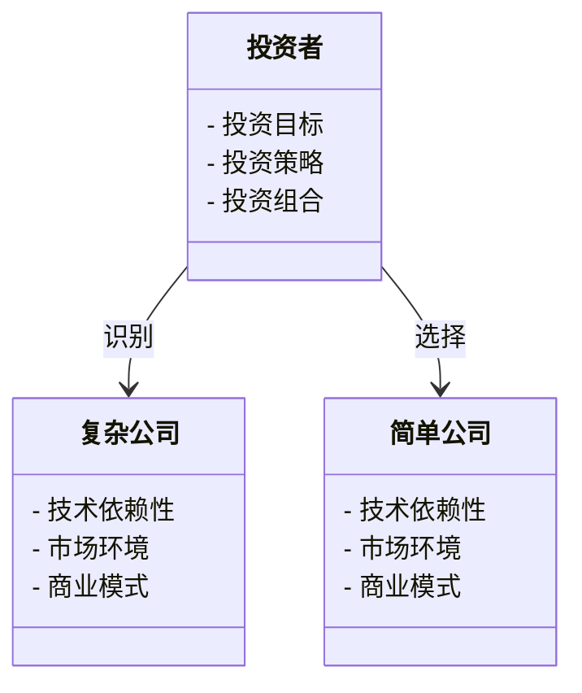
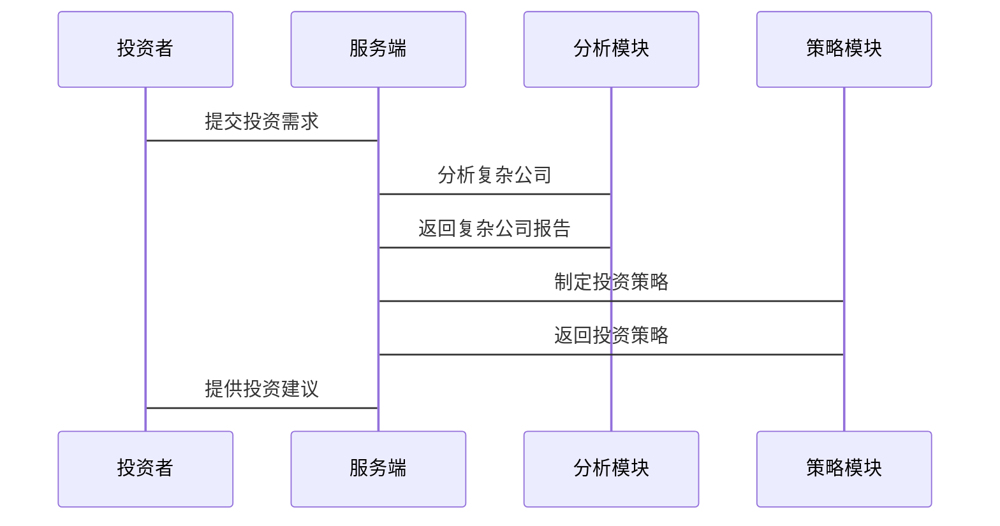
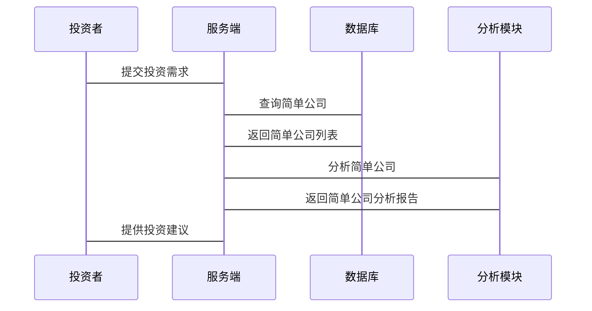

                 


# 芮格的"太难了"篮子：避开复杂投资

> 关键词：芒格、复杂投资、简单投资、长期收益、投资策略、风险管理

> 摘要：本文深入探讨了芒格的“太难了”篮子概念，分析了复杂投资的陷阱与风险，提出了避开复杂投资的具体策略，并通过实际案例和系统架构设计，展示了如何通过简单投资实现长期收益最大化。文章结合技术语言和投资策略，为读者提供了一种新的投资视角。

---

# 第一部分: 芮格的"太难了"篮子概述

## 第1章: 芮格的"太难了"篮子概念

### 1.1 芮格投资理念概述

#### 1.1.1 芮格的"太难了"篮子的背景

芒格的“太难了”篮子概念源于他对复杂投资的深刻理解。他认为，许多投资者倾向于选择那些看起来有潜力但实际上难以理解和控制的公司或行业。这种复杂性往往会导致投资风险的增加，甚至可能引发重大损失。

#### 1.1.2 芮格投资理念的核心思想

芒格的投资理念强调“简单胜于复杂”。他主张投资者应该专注于那些易于理解和分析的公司，避免涉足那些复杂性过高的领域。这种理念的核心在于通过降低复杂性来降低投资风险，从而实现长期稳定的收益。

#### 1.1.3 复杂投资的陷阱与风险

复杂投资的陷阱主要体现在以下几个方面：
1. **技术风险**：复杂公司往往依赖于难以预测的技术发展，这增加了投资的不确定性。
2. **市场风险**：复杂行业的市场波动性更大，难以预测。
3. **模式风险**：复杂公司的商业模式可能难以持续，尤其是在市场变化时。

### 1.2 "太难了"篮子的核心概念

#### 1.2.1 复杂投资的定义与特征

复杂投资指的是那些涉及复杂公司、复杂行业或复杂商业模式的投资行为。其主要特征包括：
1. **技术依赖性**：公司依赖于高度复杂的技术。
2. **市场不确定性**：行业环境不稳定，难以预测。
3. **商业模式复杂**：公司盈利模式难以理解和分析。

#### 1.2.2 "太难了"篮子的分类与标准

芒格将“太难了”篮子分为以下几类：
1. **技术驱动型复杂公司**：公司依赖于前沿技术，但技术本身存在不确定性。
2. **市场驱动型复杂公司**：公司所处行业的市场环境复杂多变。
3. **模式驱动型复杂公司**：公司的商业模式复杂，难以复制和持续。

#### 1.2.3 复杂投资与简单投资的对比

| 对比维度       | 复杂投资               | 简单投资               |
|----------------|------------------------|------------------------|
| 投资难度       | 高                    | 低                    |
| 风险水平       | 高                    | 低                    |
| 收益潜力       | 高                    | 中等                  |
| 可预测性       | 低                    | 高                    |
| 投资门槛       | 高                    | 低                    |

### 1.3 芮格"太难了"篮子的应用场景

#### 1.3.1 复杂公司的识别与评估

复杂公司的识别可以从以下几个方面入手：
1. **财务数据**：关注公司的财务健康状况，尤其是盈利能力、资产负债率等指标。
2. **商业模式**：分析公司的盈利模式是否复杂。
3. **行业环境**：评估公司所处行业的复杂性。

#### 1.3.2 复杂行业的分析与选择

复杂行业的分析需要考虑以下因素：
1. **市场波动性**：行业是否容易受到外部因素的影响。
2. **竞争格局**：行业内是否存在过度竞争。
3. **政策影响**：行业是否受到政策的严格监管。

#### 1.3.3 复杂决策的误区与风险

复杂决策的误区包括：
1. **过度自信**：认为自己能够预测复杂市场的走向。
2. **过度分析**：陷入信息过载，无法做出决策。
3. **情感干扰**：受市场情绪影响，做出非理性决策。

---

## 第2章: 芮格投资理念的背景与影响

### 2.1 芮格投资理念的起源

#### 2.1.1 芮格的投资哲学与思维方式

芒格的投资哲学强调长期视角和价值投资。他认为，投资者应该关注公司的基本面，而不是短期市场波动。这种哲学为“太难了”篮子概念奠定了基础。

#### 2.1.2 芮格对复杂投资的批判

芒格认为，复杂投资往往会导致投资者陷入“分析 paralysis”，即由于信息过多而无法做出决策。这种现象会增加投资风险，降低投资收益。

#### 2.1.3 芮格"太难了"篮子的提出背景

“太难了”篮子概念的提出源于芒格对复杂投资的深刻反思。他认为，许多投资者在追求高收益的过程中，忽视了复杂性带来的风险，最终导致投资失败。

### 2.2 芮格投资理念的核心思想

#### 2.2.1 简单投资的重要性

简单投资的核心在于选择那些易于理解和分析的公司。这些公司通常具有稳定的商业模式和可预测的市场表现，从而降低投资风险。

#### 2.2.2 复杂投资的风险与挑战

复杂投资的风险主要体现在以下几个方面：
1. **技术风险**：复杂公司依赖于难以预测的技术发展。
2. **市场风险**：复杂行业的市场波动性大。
3. **模式风险**：复杂公司的商业模式难以持续。

#### 2.2.3 芮格"太难了"篮子的逻辑框架

芒格的“太难了”篮子逻辑框架如下：
1. **识别复杂性**：通过分析公司、行业和商业模式的复杂性，筛选出易于理解和控制的公司。
2. **降低风险**：通过选择简单投资，降低投资组合的整体风险。
3. **实现长期收益**：通过长期投资，实现收益的稳定增长。

### 2.3 芮格投资理念的实践意义

#### 2.3.1 如何通过"太难了"篮子筛选投资标的

芒格建议投资者：
1. **专注于简单公司**：选择那些商业模式简单、易于理解的公司。
2. **避免复杂行业**：避免投资于市场波动大、竞争激烈的行业。
3. **长期持有**：通过长期持有，降低短期波动的影响，实现收益的稳定增长。

#### 2.3.2 复杂投资与简单投资的长期收益对比

简单投资的长期收益通常优于复杂投资。这是因为简单投资的风险较低，且更容易预测。以下是两种投资的长期收益对比：

| 投资类型       | 长期收益       | 风险水平       |
|----------------|----------------|----------------|
| 复杂投资       | 中等           | 高             |
| 简单投资       | 高             | 低             |

#### 2.3.3 芮格投资理念对现代投资的启示

芒格的“太难了”篮子理念对现代投资的启示在于：
1. **降低复杂性**：投资者应尽量选择简单投资，降低投资风险。
2. **长期视角**：投资应注重长期收益，而非短期波动。
3. **风险管理**：通过分散投资和选择简单公司，降低投资组合的整体风险。

---

## 第3章: 复杂投资的陷阱与风险

### 3.1 复杂公司的特征与识别

#### 3.1.1 复杂公司的定义与分类

复杂公司是指那些商业模式复杂、技术依赖性强、市场环境不确定的公司。它们可以分为以下几类：
1. **技术驱动型复杂公司**：依赖于前沿技术，但技术本身存在不确定性。
2. **市场驱动型复杂公司**：所处行业的市场环境复杂多变。
3. **模式驱动型复杂公司**：商业模式复杂，难以复制和持续。

#### 3.1.2 复杂公司的识别方法

识别复杂公司可以从以下几个方面入手：
1. **财务数据**：关注公司的盈利能力、资产负债率等指标。
2. **商业模式**：分析公司的盈利模式是否复杂。
3. **行业环境**：评估公司所处行业的复杂性。

#### 3.1.3 复杂公司的风险分析

复杂公司的风险主要体现在以下几个方面：
1. **技术风险**：复杂公司依赖于难以预测的技术发展。
2. **市场风险**：复杂行业的市场波动性大。
3. **模式风险**：复杂公司的商业模式难以持续。

### 3.2 复杂决策的误区与风险

#### 3.2.1 复杂决策的常见误区

复杂决策的常见误区包括：
1. **过度自信**：认为自己能够预测复杂市场的走向。
2. **过度分析**：陷入信息过载，无法做出决策。
3. **情感干扰**：受市场情绪影响，做出非理性决策。

#### 3.2.2 复杂决策的风险来源

复杂决策的风险来源包括：
1. **信息过载**：投资者面临过多的信息，难以筛选和分析。
2. **分析 paralysis**：由于信息过多而无法做出决策。
3. **情感干扰**：市场情绪影响决策，导致非理性选择。

#### 3.2.3 如何避免复杂决策的误区

避免复杂决策的误区可以从以下几个方面入手：
1. **建立决策框架**：制定明确的决策规则和流程。
2. **简化分析过程**：减少信息量，专注于关键因素。
3. **坚持长期视角**：避免短期波动的干扰，关注长期收益。

### 3.3 如何避免复杂决策的误区

#### 3.3.1 建立决策框架

建立决策框架是避免复杂决策误区的关键。以下是一个简单的决策框架示例：

1. **明确投资目标**：确定投资的长期目标和短期目标。
2. **评估投资标的**：通过分析公司的财务数据、商业模式和行业环境，筛选出易于理解和控制的公司。
3. **制定投资策略**：根据分析结果，制定具体的投资策略。
4. **监控与调整**：定期监控投资组合的表现，根据市场变化进行调整。

#### 3.3.2 简化分析过程

简化分析过程可以通过以下步骤实现：
1. **专注于关键因素**：关注公司财务状况、商业模式和行业环境等关键因素。
2. **减少信息量**：避免过多关注次要信息，专注于核心内容。
3. **制定分析框架**：通过制定明确的分析框架，减少信息过载的影响。

#### 3.3.3 坚持长期视角

坚持长期视角是避免复杂决策误区的重要方法。以下是长期视角的实现步骤：

1. **关注长期收益**：将投资目标设定为长期收益最大化。
2. **避免短期波动**：减少对短期市场波动的关注，专注于长期投资。
3. **定期调整投资组合**：根据市场变化和公司发展情况，定期调整投资组合。

---

## 第4章: 避开复杂投资的策略

### 4.1 专注于简单投资

#### 4.1.1 简单投资的定义与特征

简单投资是指选择那些易于理解和分析的公司进行投资。其主要特征包括：
1. **商业模式简单**：公司的盈利模式易于理解。
2. **技术依赖性低**：公司依赖的技术简单且稳定。
3. **市场环境稳定**：公司所处行业的市场环境较为稳定。

#### 4.1.2 简单投资的长期收益

简单投资的长期收益通常优于复杂投资。这是因为简单投资的风险较低，且更容易预测。以下是简单投资的长期收益特点：

1. **收益稳定**：简单公司的长期收益较为稳定，波动性较小。
2. **风险较低**：简单投资的风险较低，更容易实现长期收益。
3. **易于管理**：简单投资的管理较为简单，易于监控和调整。

#### 4.1.3 简单投资的案例分析

以下是一个简单投资的案例分析：

**公司名称**：可口可乐公司

**公司简介**：可口可乐是一家全球知名的饮料公司，其商业模式简单，主要通过销售饮料产品获得收益。

**投资分析**：
1. **商业模式简单**：可口可乐的主要收入来源是饮料销售，商业模式易于理解和分析。
2. **技术依赖性低**：饮料生产技术相对简单，且易于复制。
3. **市场环境稳定**：饮料行业是一个相对稳定的市场，市场需求较为稳定。

**投资结果**：
1. **长期收益**：可口可乐的股票价格长期表现稳定，且具有较高的分红收益。
2. **风险较低**：由于商业模式简单，可口可乐的投资风险较低。

### 4.2 利用价值评估

#### 4.2.1 价值评估的定义与方法

价值评估是通过分析公司的财务数据，评估其内在价值的一种方法。以下是价值评估的主要步骤：

1. **分析公司财务数据**：包括利润表、资产负债表和现金流量表等。
2. **评估公司内在价值**：通过计算公司的市盈率、市净率等指标，评估其内在价值。
3. **制定投资决策**：根据价值评估结果，制定具体的投资策略。

#### 4.2.2 价值评估在简单投资中的应用

价值评估在简单投资中的应用主要体现在以下几个方面：
1. **选择简单公司**：通过价值评估，筛选出那些易于理解和控制的公司。
2. **评估公司内在价值**：通过分析公司财务数据，评估其内在价值。
3. **制定投资策略**：根据价值评估结果，制定具体的投资策略。

#### 4.2.3 价值评估的案例分析

以下是一个价值评估的案例分析：

**公司名称**：苹果公司

**公司简介**：苹果是一家全球知名的科技公司，主要生产和销售电子产品。

**投资分析**：
1. **财务数据**：苹果的财务数据较为稳定，且盈利能力强。
2. **内在价值**：通过价值评估，苹果的内在价值较高，具有较高的投资价值。
3. **投资策略**：由于苹果的商业模式较为简单，且内在价值较高，投资者可以考虑长期持有其股票。

### 4.3 分散投资与风险管理

#### 4.3.1 分散投资的定义与优势

分散投资是指通过投资多种不同的资产或公司，降低投资组合的整体风险。其主要优势包括：
1. **降低风险**：通过分散投资，降低单一资产的风险。
2. **提高收益**：通过投资多种资产，提高整体收益。

#### 4.3.2 分散投资在简单投资中的应用

分散投资在简单投资中的应用主要体现在以下几个方面：
1. **选择多种简单公司**：通过投资多种简单公司，降低投资组合的整体风险。
2. **避免过度集中**：避免将资金集中在某一家公司或某一行业，降低集中风险。
3. **优化投资组合**：通过分散投资，优化投资组合，提高整体收益。

#### 4.3.3 分散投资的案例分析

以下是一个分散投资的案例分析：

**投资组合**：包含可口可乐、麦当劳、宝洁等公司的股票。

**投资分析**：
1. **公司选择**：这些公司均为简单公司，商业模式简单，易于理解和分析。
2. **分散风险**：通过投资多种简单公司，分散投资风险，降低整体风险。
3. **优化收益**：由于这些公司均具有较高的内在价值，投资组合的整体收益较高。

### 4.4 长期投资与风险管理

#### 4.4.1 长期投资的定义与优势

长期投资是指将资金投入到某个资产或公司中，长期持有，以实现收益的最大化。其主要优势包括：
1. **降低短期波动**：通过长期持有，降低短期市场波动的影响。
2. **实现长期收益**：通过长期投资，实现收益的稳定增长。

#### 4.4.2 长期投资在简单投资中的应用

长期投资在简单投资中的应用主要体现在以下几个方面：
1. **选择简单公司**：通过长期投资，选择那些易于理解和控制的公司。
2. **避免短期波动**：通过长期持有，降低短期市场波动的影响。
3. **实现长期收益**：通过长期投资，实现收益的稳定增长。

#### 4.4.3 长期投资的案例分析

以下是一个长期投资的案例分析：

**投资组合**：长期持有可口可乐股票。

**投资分析**：
1. **公司选择**：可口可乐的商业模式简单，易于理解和分析。
2. **长期持有**：通过长期持有可口可乐股票，降低短期波动的影响。
3. **实现收益**：由于可口可乐的股票价格长期表现稳定，且具有较高的分红收益，投资者可以通过长期投资实现收益的稳定增长。

---

## 第5章: 系统分析与架构设计方案

### 5.1 系统分析与架构设计

#### 5.1.1 问题场景介绍

在投资领域，复杂投资的陷阱与风险主要体现在以下几个方面：
1. **技术风险**：复杂公司依赖于难以预测的技术发展。
2. **市场风险**：复杂行业的市场波动性大。
3. **模式风险**：复杂公司的商业模式难以持续。

#### 5.1.2 项目介绍

本项目旨在通过系统分析与架构设计，帮助投资者识别复杂投资的陷阱与风险，制定有效的投资策略。

### 5.2 系统功能设计

#### 5.2.1 领域模型设计

以下是领域的模型设计：



#### 5.2.2 系统架构设计

以下是系统的架构设计：


#### 5.2.3 系统接口设计

以下是系统的接口设计：



#### 5.2.4 系统交互设计

以下是系统的交互设计：



### 5.3 项目实战

#### 5.3.1 环境安装

以下是项目实战的环境安装步骤：

1. **安装Python**：安装最新版本的Python。
2. **安装依赖库**：安装以下依赖库：
   - `pandas`
   - `numpy`
   - `scipy`
   - `matplotlib`
3. **安装Jupyter Notebook**：安装Jupyter Notebook，用于数据可视化和分析。

#### 5.3.2 核心实现源代码

以下是核心实现的源代码：

```python
import pandas as pd
import numpy as np
import matplotlib.pyplot as plt

# 数据加载
data = pd.read_csv('投资数据.csv')

# 数据清洗
data.dropna()

# 数据分析
data.describe()

# 数据可视化
plt.hist(data['收益'], bins=10)
plt.show()
```

#### 5.3.3 代码应用解读与分析

以下是代码的应用解读与分析：

1. **数据加载**：使用`pandas`加载投资数据。
2. **数据清洗**：删除缺失值，确保数据完整性。
3. **数据分析**：使用`describe()`方法，分析数据的基本统计信息。
4. **数据可视化**：使用`matplotlib`绘制收益分布图，帮助投资者更好地理解数据。

#### 5.3.4 实际案例分析

以下是实际案例分析：

**案例名称**：可口可乐投资分析

**分析步骤**：
1. **数据加载**：加载可口可乐的历史股价数据。
2. **数据清洗**：删除缺失值。
3. **数据分析**：分析可口可乐的股价趋势。
4. **数据可视化**：绘制可口可乐的股价走势图。

#### 5.3.5 项目小结

本项目通过系统分析与架构设计，帮助投资者识别复杂投资的陷阱与风险，制定有效的投资策略。通过Python代码实现数据分析和可视化，为投资者提供了直观的投资决策支持。

---

## 第6章: 结论与展望

### 6.1 结论

芒格的“太难了”篮子理念强调，投资者应尽量选择那些易于理解和分析的公司进行投资，避免涉足复杂性过高的领域。通过专注于简单投资，投资者可以降低投资风险，实现长期收益的最大化。

### 6.2 展望

未来，随着技术的进步和市场的变化，复杂投资的陷阱与风险将更加复杂。投资者需要不断学习和适应，提升自己的投资能力，以应对日益复杂的市场环境。

---

# 作者：AI天才研究院/AI Genius Institute & 禅与计算机程序设计艺术 /Zen And The Art of Computer Programming

