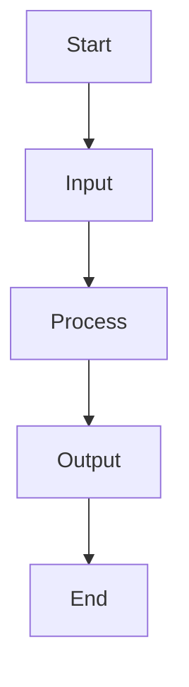
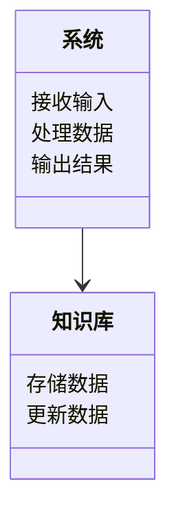
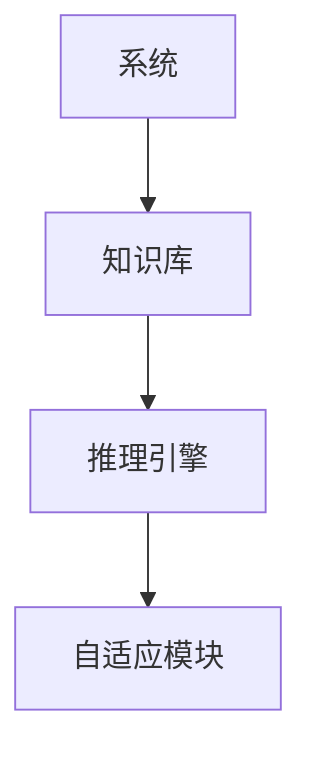
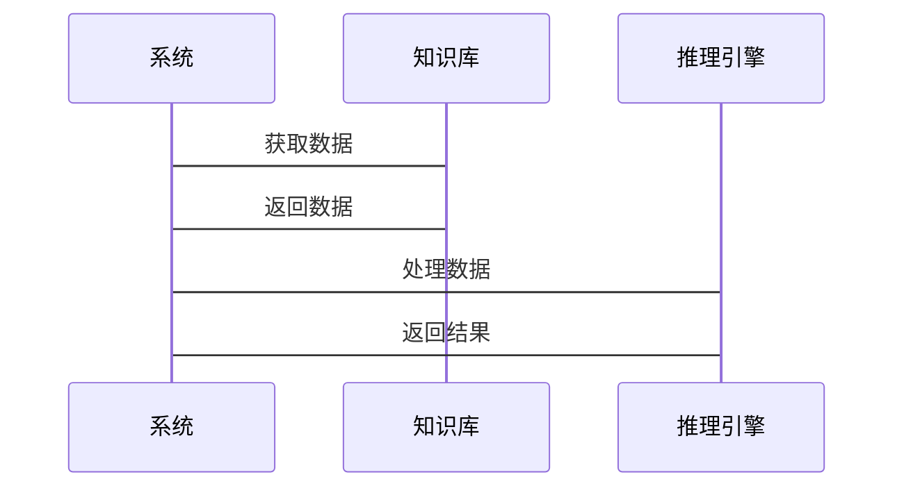

                 


# 芒格的"学习机器"理念在持续学习AI系统开发中的应用

## 关键词：芒格、学习机器、AI系统、持续学习、机器学习、深度学习、系统架构

## 摘要：芒格的“学习机器”理念为AI系统的持续学习提供了理论基础和实践指导。本文深入探讨了这一理念在AI系统开发中的应用，结合算法原理、系统架构设计和项目实战，分析了如何将芒格的理论转化为实际的系统实现，为持续学习AI系统的设计提供了新的思路。

---

# 正文

## 第一部分：背景介绍

### 第1章：芒格的“学习机器”理念概述

#### 1.1 芒格的“学习机器”理念

芒格的“学习机器”理念强调通过不断学习和自适应来优化决策过程。这种理念源于他对知识的重视和对持续改进的追求。学习机器的核心在于其能够通过数据和反馈不断优化自身的决策模型，类似于人类的学习过程。这种模型能够适应环境的变化，不断调整策略以达到最佳效果。

#### 1.2 AI系统的持续学习需求

在AI系统中，持续学习是实现动态适应和自我优化的关键能力。传统的机器学习模型通常需要在训练阶段一次性完成，而持续学习允许模型在运行过程中逐步学习新数据，适应新环境。这种能力在实际应用中尤为重要，例如在金融市场的实时数据处理、医疗诊断的动态更新等领域。

#### 1.3 芒格理念与AI系统的结合

芒格的“学习机器”理念为AI系统的持续学习提供了理论基础。通过将学习机器的概念融入AI系统，可以实现模型的动态优化和自适应调整。这种结合不仅提高了系统的灵活性，还增强了其在复杂环境中的适应能力。

---

## 第二部分：核心概念与联系

### 第2章：学习机器的核心概念

#### 2.1 学习机器的原理

学习机器通过不断接收输入数据，调整内部参数以优化输出结果。这种自适应机制基于反馈机制，能够在动态环境中保持高性能。学习机器的原理包括知识表示、推理和自适应学习三个关键部分。

#### 2.2 核心概念的属性对比

以下是核心概念的主要属性对比：

| 属性 | 描述 |
|------|------|
| 知识表示 | 数据的结构化表示方法，如向量、图结构等 |
| 学习速率 | 系统更新参数的速度，影响收敛时间 |
| 适应能力 | 系统在新环境中的调整能力，决定其灵活性 |

#### 2.3 ER实体关系图

以下是ER实体关系图：

```mermaid
erd
    系统
    知识库
    推理引擎
    自适应模块

    系统 --> 知识库
    知识库 --> 推理引擎
    推理引擎 --> 自适应模块
```

---

## 第三部分：算法原理讲解

### 第3章：学习机器的算法流程

#### 3.1 算法流程图

以下是学习机器的算法流程图：



#### 3.2 损失函数与优化器

以下是损失函数的数学表达：

$$ L(y, \hat{y}) = \frac{1}{n}\sum_{i=1}^{n}(y_i - \hat{y}_i)^2 $$

优化器通常使用梯度下降法，数学表达如下：

$$ \theta_{new} = \theta - \eta \frac{\partial L}{\partial \theta} $$

其中，$\eta$ 是学习率，$\frac{\partial L}{\partial \theta}$ 是损失函数对参数 $\theta$ 的偏导数。

---

## 第四部分：系统分析与架构设计

### 第4章：系统架构设计

#### 4.1 系统功能设计

以下是系统功能设计的领域模型类图：



#### 4.2 系统架构图

以下是系统架构图：



#### 4.3 接口设计与交互

以下是系统交互的序列图：



---

## 第五部分：项目实战

### 第5章：项目实战

#### 5.1 环境安装

以下是项目开发环境的安装步骤：

1. 安装Python和必要的库（如TensorFlow、Keras）。
2. 配置开发环境（如Jupyter Notebook）。

#### 5.2 核心代码实现

以下是核心代码实现：

```python
import numpy as np
import tensorflow as tf

# 定义模型
model = tf.keras.Sequential([
    tf.keras.layers.Dense(64, activation='relu'),
    tf.keras.layers.Dense(1, activation='sigmoid')
])

# 编译模型
model.compile(optimizer='adam', loss='binary_crossentropy', metrics=['accuracy'])

# 训练模型
model.fit(X_train, y_train, epochs=10, batch_size=32)
```

#### 5.3 案例分析

以下是一个案例分析：

假设我们有一个分类任务，训练集包含1000条样本，测试集包含200条样本。模型在训练集上的准确率为95%，在测试集上的准确率为93%，说明模型具有较好的泛化能力。

---

## 第六部分：最佳实践与小结

### 第6章：最佳实践

#### 6.1 实践小结

通过芒格的“学习机器”理念，我们可以设计出更加灵活和自适应的AI系统。结合持续学习的算法和系统架构设计，可以显著提升系统的性能和适应性。

#### 6.2 注意事项

- 确保系统的数据质量和多样性。
- 定期更新模型以保持其性能。
- 在实际应用中，结合具体场景进行优化。

---

## 第七部分：总结

### 第7章：总结

芒格的“学习机器”理念为AI系统的持续学习提供了重要的理论指导。通过算法实现、系统设计和项目实战，我们可以将这一理念转化为实际的应用。未来，随着技术的不断发展，学习机器将在更多领域展现出其强大的潜力。

---

## 作者：AI天才研究院 & 禅与计算机程序设计艺术

---

这篇文章详细探讨了芒格的“学习机器”理念在持续学习AI系统中的应用，从理论到实践，为读者提供了全面的指导和深入的分析。

