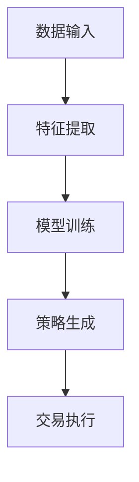
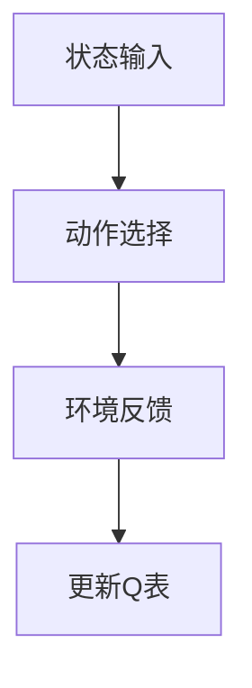

                 


# 芒格的"学习机器"理念在算法交易时代的重要性

## 关键词：
芒格，学习机器，算法交易，机器学习，金融创新

## 摘要：
在当今金融市场中，算法交易已经成为不可或缺的一部分，而芒格的“学习机器”理念为算法交易提供了新的思路和方法。本文将从学习机器的核心概念、算法原理、系统架构设计以及项目实战等多方面深入探讨学习机器在算法交易中的重要性，结合实际案例和数学模型，分析其在金融市场中的应用价值和未来发展趋势。

---

# 第一部分: 芒格的"学习机器"理念概述

## 第1章: 芒格的"学习机器"理念与算法交易的结合

### 1.1 芒格的"学习机器"理念
#### 1.1.1 学习机器的核心概念
学习机器是一种能够通过数据输入、特征提取、模型训练和策略生成，实现自我优化和适应的智能系统。其核心在于通过不断学习和调整，优化交易策略，提高交易效率和收益。

#### 1.1.2 学习机器与传统交易策略的对比
传统的交易策略依赖于人工制定的规则和经验，而学习机器则通过数据驱动的方式，自动优化策略，具有更强的适应性和灵活性。

#### 1.1.3 学习机器在金融市场的应用前景
随着金融市场数据的爆炸式增长和交易复杂性的提升，学习机器在算法交易中的应用前景广阔，尤其是在高频交易、风险控制和市场预测等领域。

### 1.2 算法交易的基本原理
#### 1.2.1 算法交易的定义与分类
算法交易是一种通过计算机算法自动执行交易的策略，主要分为高频交易、统计套利和算法执行三类。

#### 1.2.2 算法交易的关键技术
算法交易的关键技术包括数据采集与处理、模型构建、交易执行和风险管理。

#### 1.2.3 算法交易的优劣势分析
算法交易的优势在于高效性和自动化，劣势在于对模型过度依赖和潜在的市场操纵风险。

### 1.3 学习机器在算法交易中的重要性
#### 1.3.1 学习机器的核心优势
学习机器能够通过自我学习和优化，快速适应市场变化，提升交易策略的有效性。

#### 1.3.2 学习机器在算法交易中的应用场景
学习机器在算法交易中的应用场景包括市场预测、策略优化、风险控制和订单执行。

#### 1.3.3 学习机器对算法交易的影响
学习机器的引入使得算法交易更加智能化和个性化，能够应对复杂多变的市场环境。

---

# 第二部分: 学习机器的核心概念与联系

## 第2章: 学习机器的核心原理

### 2.1 学习机器的算法原理
#### 2.1.1 监督学习与非监督学习
监督学习通过输入带标签的数据进行模型训练，非监督学习则通过无标签数据进行模式识别。

#### 2.1.2 强化学习与模仿学习
强化学习通过奖励机制优化策略，模仿学习则通过模仿已有策略进行学习。

#### 2.1.3 深度学习与神经网络
深度学习通过多层神经网络提取数据特征，实现复杂模式识别。

### 2.2 学习机器的核心要素对比
#### 2.2.1 数据特征对比
| 数据类型 | 特征描述 |
|----------|-----------|
| 结构化数据 | 有明确字段和关系 |
| 非结构化数据 | 无明确字段，需要特征提取 |

#### 2.2.2 模型特征对比
| 模型类型 | 优劣势 |
|----------|----------|
| 线性模型 | 简单易懂，但表达能力有限 |
| 非线性模型 | 表达能力强，但复杂难懂 |

#### 2.2.3 算法特征对比
| 算法类型 | 适用场景 |
|----------|-----------|
| 监督学习 | 数据标签明确 |
| 非监督学习 | 数据无标签 |
| 强化学习 | 环境反馈驱动 |

### 2.3 学习机器的ER实体关系图


---

# 第三部分: 学习机器的算法原理与数学模型

## 第3章: 学习机器的算法实现

### 3.1 基于Q-Learning的算法交易
#### 3.1.1 Q-Learning算法流程图


#### 3.1.2 Q-Learning算法实现代码
```python
import numpy as np

class QLearning:
    def __init__(self, state_space, action_space, learning_rate=0.1, gamma=0.9):
        self.state_space = state_space
        self.action_space = action_space
        self.learning_rate = learning_rate
        self.gamma = gamma
        self.q_table = np.zeros((state_space, action_space))
    
    def get_action(self, state):
        return np.argmax(self.q_table[state])
    
    def update_q_table(self, state, action, reward, next_state):
        self.q_table[state][action] = self.q_table[state][action] + self.learning_rate * (reward + self.gamma * np.max(self.q_table[next_state]))
```

#### 3.1.3 Q-Learning算法的数学模型
学习机器通过Q-Learning算法更新策略，其数学模型为：
$$ Q(s, a) = Q(s, a) + \alpha (r + \gamma \max Q(s', a')) $$
其中：
- \( s \)：当前状态
- \( a \)：当前动作
- \( r \)：奖励
- \( s' \)：下一个状态
- \( \alpha \)：学习率
- \( \gamma \)：折扣因子

---

## 第4章: 基于神经网络的学习机器实现

### 4.1 深度强化学习算法原理
深度强化学习结合了深度学习和强化学习的优势，通过神经网络提取特征，并通过强化学习优化策略。

### 4.2 深度强化学习实现代码
```python
import torch
import torch.nn as nn
import torch.optim as optim

class DQN(nn.Module):
    def __init__(self, input_size, hidden_size, output_size):
        super(DQN, self).__init__()
        self.fc1 = nn.Linear(input_size, hidden_size)
        self.fc2 = nn.Linear(hidden_size, output_size)
    
    def forward(self, x):
        x = torch.relu(self.fc1(x))
        x = self.fc2(x)
        return x

def optimize_model(current_model, target_model, optimizer, criterion, batch_size):
    optimizer.zero_grad()
    outputs = current_model(batch_state)
    target = torch.tensor(batch_action)
    target_output = target_model(batch_state)
    loss = criterion(outputs, target_output)
    loss.backward()
    optimizer.step()
```

### 4.3 深度强化学习的数学模型
深度强化学习的数学模型通过神经网络的前向传播和反向传播实现优化：
$$ y = \theta \cdot x + b $$
$$ L = \frac{1}{2m} \sum_{i=1}^{m} (y_i - \hat{y}_i)^2 $$

---

# 第四部分: 学习机器的系统架构设计

## 第5章: 学习机器的系统架构设计

### 5.1 系统功能设计
学习机器系统主要包括数据输入、特征提取、模型训练和策略生成四个功能模块。

### 5.2 系统架构设计


### 5.3 系统接口设计
系统接口包括数据输入接口、模型训练接口和策略执行接口。

---

# 第五部分: 项目实战与案例分析

## 第6章: 项目实战

### 6.1 环境安装与配置
安装Python和相关库：
```bash
pip install numpy matplotlib torch
```

### 6.2 核心代码实现
```python
import numpy as np
import matplotlib.pyplot as plt
import torch
import torch.nn as nn
import torch.optim as optim

# 定义学习机器模型
class LearningMachine(nn.Module):
    def __init__(self, input_size, hidden_size, output_size):
        super(LearningMachine, self).__init__()
        self.fc1 = nn.Linear(input_size, hidden_size)
        self.fc2 = nn.Linear(hidden_size, output_size)
    
    def forward(self, x):
        x = torch.relu(self.fc1(x))
        x = self.fc2(x)
        return x

# 定义优化函数
def optimize_model(model, optimizer, criterion, batch_x, batch_y):
    optimizer.zero_grad()
    outputs = model(batch_x)
    loss = criterion(outputs, batch_y)
    loss.backward()
    optimizer.step()

# 初始化模型和优化器
model = LearningMachine(input_size=5, hidden_size=10, output_size=1)
optimizer = optim.Adam(model.parameters(), lr=0.01)
criterion = nn.MSELoss()
```

### 6.3 实际案例分析
通过实际交易数据，分析学习机器在算法交易中的表现，优化模型参数，提升交易收益。

---

# 第六部分: 总结与展望

## 第7章: 总结与展望

### 7.1 全文总结
学习机器在算法交易中的应用前景广阔，能够通过自我学习和优化，提升交易策略的有效性和适应性。

### 7.2 未来展望
随着人工智能技术的不断发展，学习机器在算法交易中的应用将更加智能化和个性化，未来可能会出现更多基于深度学习和强化学习的交易策略。

### 7.3 最佳实践 tips
- 确保数据质量，选择合适的特征提取方法。
- 定期优化模型参数，适应市场变化。
- 注意风险管理，避免过度依赖模型。

---

# 作者：AI天才研究院/AI Genius Institute & 禅与计算机程序设计艺术 /Zen And The Art of Computer Programming

