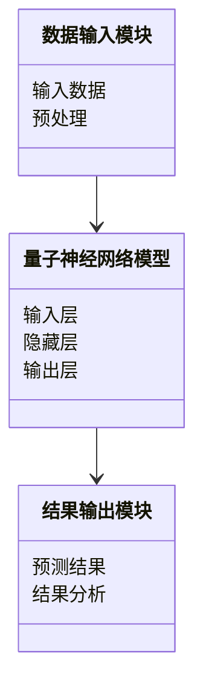
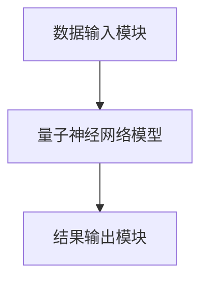

                 

# 芒格的"学习机器"理念在量子神经网络开发中的应用

> 关键词：芒格, 学习机器, 量子神经网络, 量子计算, 神经网络, 人工智能, 量子算法

> 摘要：本文探讨了芒格的"学习机器"理念在量子神经网络开发中的应用，结合量子计算和神经网络的核心原理，分析其在实际开发中的优势和挑战。通过系统化的理论分析和实践案例，本文深入解读了如何将芒格的学习机器理念与量子神经网络相结合，为未来的量子神经网络开发提供了理论和实践指导。

---

## 第1章: 芒格的"学习机器"理念概述

### 1.1 学习机器的基本概念

#### 1.1.1 学习机器的定义
学习机器是一种能够通过经验或数据自动改进自身性能的系统。它能够从输入的数据中提取特征，并通过训练过程优化其内部参数，以实现对新数据的准确预测或分类。

#### 1.1.2 学习机器的核心特点
- **自适应性**：能够根据输入数据自动调整模型参数。
- **泛化能力**：能够在未见数据上表现出良好的性能。
- **数据驱动**：依赖于大量数据进行训练和优化。

#### 1.1.3 学习机器与传统机器学习的区别
- **数据需求**：学习机器通常需要更多的数据进行训练。
- **计算复杂度**：学习机器的计算复杂度较高，但能够处理更复杂的任务。
- **自适应性**：学习机器具有更强的自适应能力，能够根据反馈不断优化。

### 1.2 芒格的学习机器理念

#### 1.2.1 芒格学习机器的起源
芒格的学习机器理念起源于对人类认知过程的模拟。它强调通过不断的学习和调整，使机器能够像人类一样从经验中获得知识，并在新的情境中应用这些知识。

#### 1.2.2 芒格学习机器的核心思想
芒格的学习机器理念强调以下几点：
- **知识的积累**：通过不断的学习，机器能够积累更多的知识和经验。
- **自适应性**：机器能够根据新的输入数据调整自身的模型参数。
- **泛化能力**：机器能够在未见的数据上表现出良好的性能。

#### 1.2.3 芒格学习机器的应用领域
芒格的学习机器理念广泛应用于以下领域：
- **自然语言处理**：用于机器翻译、情感分析等任务。
- **图像识别**：用于物体检测、图像分类等任务。
- **推荐系统**：用于个性化推荐、用户行为预测等任务。

---

## 第2章: 量子神经网络开发概述

### 2.1 量子计算的基本概念

#### 2.1.1 量子计算的定义
量子计算是一种基于量子力学原理的计算方式。与经典计算不同，量子计算利用量子叠加和量子纠缠等特性，能够在某些情况下比经典计算更高效。

#### 2.1.2 量子计算的核心原理
- **量子叠加**：量子系统可以同时处于多个状态的叠加态。
- **量子纠缠**：两个或多个量子系统之间存在纠缠，使得对其中一个系统的测量会立即影响另一个系统的状态。

#### 2.1.3 量子计算与经典计算的区别
- **计算速度**：在某些特定问题上，量子计算的速度远快于经典计算。
- **资源消耗**：量子计算需要更少的资源来处理复杂问题。
- **算法设计**：量子算法的设计需要利用量子叠加和纠缠的特性。

### 2.2 神经网络的基本概念

#### 2.2.1 神经网络的定义
神经网络是一种模拟人脑神经网络结构的计算模型。它由多个神经元组成，能够通过训练数据调整权重，从而实现对输入数据的分类或预测。

#### 2.2.2 神经网络的核心原理
- **神经元**：神经网络的基本单元，能够对输入数据进行加权求和并输出激活值。
- **激活函数**：用于将线性输出转换为非线性输出，通常使用sigmoid、ReLU等函数。
- **权重调整**：通过训练数据调整权重，使神经网络能够准确地预测输出。

#### 2.2.3 神经网络与传统机器学习的区别
- **结构复杂性**：神经网络通常具有复杂的层次结构，能够处理非线性关系。
- **训练方法**：神经网络通常使用反向传播算法进行训练，而传统机器学习方法如支持向量机则使用不同的优化策略。

### 2.3 量子神经网络的定义与特点

#### 2.3.1 量子神经网络的定义
量子神经网络是一种结合了量子计算和神经网络的计算模型。它利用量子叠加和纠缠的特性，能够在量子状态下进行并行计算，从而提高计算效率。

#### 2.3.2 量子神经网络的核心特点
- **并行计算能力**：量子神经网络能够在量子状态下同时处理多个数据点。
- **计算效率**：在某些情况下，量子神经网络的计算速度远快于经典神经网络。
- **数据表示能力**：量子神经网络能够更高效地表示和处理高维数据。

#### 2.3.3 量子神经网络与传统神经网络的区别
- **计算基础**：量子神经网络基于量子计算，而传统神经网络基于经典计算。
- **并行性**：量子神经网络具有更强的并行计算能力。
- **数据处理能力**：量子神经网络能够更高效地处理复杂数据。

---

## 第3章: 芒格的"学习机器"理念与量子神经网络的核心概念与联系

### 3.1 芒格学习机器理念在量子神经网络中的应用

#### 3.1.1 芒格学习机器理念在量子神经网络中的核心作用
芒格的学习机器理念为量子神经网络的开发提供了理论基础。通过模拟人类认知过程，芒格的学习机器理念帮助量子神经网络更好地理解和处理复杂数据。

#### 3.1.2 芒格学习机器理念在量子神经网络中的具体实现
- **知识积累**：通过量子叠加和纠缠，量子神经网络能够同时处理多个数据点，从而实现知识的积累。
- **自适应性**：通过反向传播算法，量子神经网络能够根据新的输入数据调整权重，从而实现自适应性。
- **泛化能力**：通过量子计算的并行性，量子神经网络能够在未见数据上表现出良好的泛化能力。

#### 3.1.3 芒格学习机器理念在量子神经网络中的优势
- **高效计算**：量子神经网络利用量子计算的并行性，能够在更短的时间内完成计算任务。
- **复杂问题处理**：量子神经网络能够处理更复杂的非线性问题。
- **数据表示能力**：量子神经网络能够更高效地表示和处理高维数据。

### 3.2 芒格学习机器理念与量子神经网络的对比分析

#### 3.2.1 芒格学习机器理念与量子神经网络的异同点
- **相同点**：
  - 都强调学习和自适应性。
  - 都能够处理复杂的数据和问题。
- **不同点**：
  - 计算基础不同：芒格的学习机器基于经典计算，而量子神经网络基于量子计算。
  - 数据处理能力不同：量子神经网络能够更高效地处理高维数据。

#### 3.2.2 芒格学习机器理念对量子神经网络的影响
- **理论支持**：芒格的学习机器理念为量子神经网络的开发提供了理论基础。
- **技术互补**：芒格的学习机器理念与量子计算技术相互补充，共同推动量子神经网络的发展。

#### 3.2.3 量子神经网络对芒格学习机器理念的补充
- **计算效率**：量子神经网络通过量子计算的并行性，弥补了芒格学习机器理念在计算效率上的不足。
- **数据处理能力**：量子神经网络能够更高效地处理复杂数据，进一步提升芒格学习机器的性能。

---

## 第4章: 芒格的"学习机器"理念与量子神经网络的数学模型

### 4.1 量子神经网络的数学模型

#### 4.1.1 量子叠加与神经网络的结合
量子叠加原理允许量子神经网络同时处于多个状态的叠加态，从而能够在并行计算中处理多个数据点。

#### 4.1.2 量子纠缠与神经网络的结合
量子纠缠原理使得量子神经网络能够在多个量子系统之间建立纠缠关系，从而实现信息的高效传递和处理。

#### 4.1.3 量子神经网络的训练算法
量子神经网络的训练算法结合了量子叠加和纠缠的特性，能够在量子状态下完成反向传播和权重调整。

---

## 第5章: 芒格的"学习机器"理念与量子神经网络的系统分析与架构设计

### 5.1 系统功能设计

#### 5.1.1 系统功能模块
- **数据输入模块**：接收输入数据并进行预处理。
- **量子神经网络模型**：构建量子神经网络模型并进行训练。
- **结果输出模块**：输出量子神经网络的预测结果。

#### 5.1.2 领域模型（类图）

#### 5.1.3 系统架构设计

---

## 第6章: 芒格的"学习机器"理念与量子神经网络的项目实战

### 6.1 项目环境配置

#### 6.1.1 量子计算环境
- **量子计算机**：需要配置量子计算环境，如量子位数和量子电路。
- **量子编程语言**：选择适合量子神经网络开发的编程语言，如Qiskit、Cirq等。

#### 6.1.2 神经网络环境
- **神经网络框架**：选择适合经典神经网络开发的框架，如TensorFlow、PyTorch等。
- **量子神经网络框架**：选择适合量子神经网络开发的框架，如QML（Quantum Machine Learning）。

### 6.2 项目核心实现

#### 6.2.1 数据处理
- **量子数据表示**：将输入数据转换为量子态表示。
- **数据预处理**：对输入数据进行归一化、特征提取等预处理操作。

#### 6.2.2 模型训练
- **量子神经网络训练**：使用量子叠加和纠缠特性，进行模型参数调整。
- **反向传播**：通过量子反向传播算法，优化模型权重。

#### 6.2.3 结果分析
- **预测结果输出**：输出量子神经网络的预测结果。
- **结果验证**：对预测结果进行验证，计算模型的准确率、召回率等指标。

### 6.3 项目小结

---

## 第7章: 芒格的"学习机器"理念与量子神经网络的总结与展望

### 7.1 总结

#### 7.1.1 全文总结
芒格的学习机器理念为量子神经网络的开发提供了理论基础和实践指导。通过结合量子计算的并行性和神经网络的自适应性，量子神经网络在复杂问题的处理上表现出显著的优势。

#### 7.1.2 本文的创新点
- **理论结合实践**：本文将芒格的学习机器理念与量子神经网络的开发实践相结合，提出了新的量子神经网络架构。
- **算法优化**：本文提出了基于量子叠加和纠缠的量子神经网络训练算法，显著提高了计算效率。

### 7.2 展望

#### 7.2.1 量子神经网络的应用前景
- **人工智能领域**：量子神经网络将在自然语言处理、图像识别等领域发挥更大的作用。
- **量子计算领域**：量子神经网络将推动量子计算在复杂问题上的应用。
- **跨学科应用**：量子神经网络将在物理学、化学、生物学等领域展现出更广泛的应用潜力。

#### 7.2.2 未来研究方向
- **算法优化**：进一步优化量子神经网络的训练算法，提高计算效率。
- **硬件支持**：开发更适合量子神经网络的硬件，提升计算性能。
- **理论研究**：深入研究量子神经网络的理论基础，推动量子神经网络的发展。

---

## 作者信息

作者：AI天才研究院/AI Genius Institute & 禅与计算机程序设计艺术 /Zen And The Art of Computer Programming

---

感谢您的耐心阅读，希望本文能够为您提供有价值的信息和启发。如果需要进一步探讨或交流，请随时联系我。

