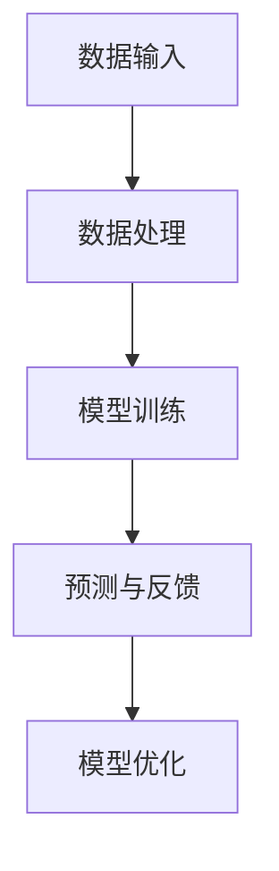
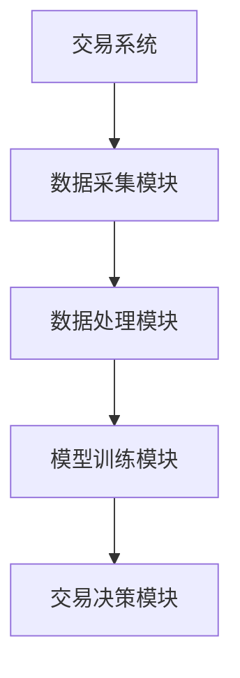
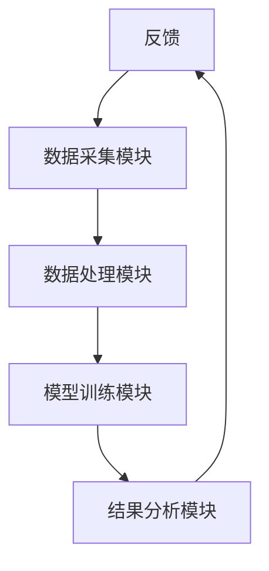

                 


# 芒格的"学习机器"理念：终身学习在投资中的重要性

> 关键词：芒格，学习机器，终身学习，投资，机器学习

> 摘要：本文深入探讨了芒格提出的“学习机器”理念，分析了终身学习在投资中的重要性。通过结合机器学习算法和系统架构设计，本文详细讲解了如何将学习机器应用于投资决策，并通过实际案例展示了其在股票价格预测中的应用。最后，本文总结了学习机器的优势与局限，并提出了最佳实践建议。

---

## 第一部分：芒格的“学习机器”理念概述

### 第1章：芒格的“学习机器”理念背景

#### 1.1 芒格的生平与投资哲学

芒格（Charlie Munger）是伯克希尔哈撒韦公司的副主席，以其独特的投资哲学闻名。他倡导投资者必须具备跨学科思维，并将“学习机器”理念融入其中。芒格认为，投资不仅仅是对市场的分析，更是对知识的持续积累和更新。

**关键概念：**
- **跨学科思维**：芒格强调投资者需要具备广泛的知识储备，包括心理学、经济学、物理学等领域。
- **学习机器**：一种能够不断吸收新知识、优化决策的系统。

#### 1.2 学习机器的核心概念

学习机器是一种能够通过数据输入、算法处理和反馈机制不断优化自身模型的系统。其核心特征包括：
- **自适应性**：能够根据新数据调整模型。
- **可扩展性**：适用于多种场景和数据类型。
- **持续优化**：通过反馈机制不断改进预测能力。

**对比分析：**
| 特性 | 学习机器 | 传统投资方法 |
|------|----------|---------------|
| 数据依赖性 | 高 | 低 |
| 自适应性 | 强 | 弱 |
| 知识更新 | 快速 | 缓慢 |

#### 1.3 终身学习的必要性

在投资领域，知识的快速变化要求投资者必须具备终身学习的能力。学习机器不仅是工具，更是一种思维方式。

---

### 第2章：学习机器的核心原理

#### 2.1 学习机器的基本原理

学习机器的工作流程可以分为以下几个步骤：
1. 数据输入：收集市场数据（如股票价格、财务指标）。
2. 数据处理：清洗和预处理数据。
3. 模型训练：使用算法训练模型。
4. 预测与反馈：模型生成预测结果并接受反馈。
5. 模型优化：根据反馈调整模型参数。

**Mermaid流程图：**


#### 2.2 学习机器的算法模型

**1. 基础学习算法**

- **决策树**：通过树状结构进行分类和预测。
- **线性回归**：用于预测连续变量（如股票价格）。

**2. 高级学习算法**

- **神经网络**：通过多层结构模拟人脑，适用于复杂数据。
- **随机森林**：基于决策树的集成方法，提高准确率。

**3. 算法对比：**

| 算法 | 优点 | 缺点 |
|------|------|------|
| 决策树 | 易解释 | 易过拟合 |
| 线性回归 | 简单 | 不适合非线性数据 |
| 神经网络 | 高精度 | 计算复杂 |

#### 2.3 数据的重要性

数据是学习机器的核心，其质量直接影响模型性能。高质量的数据包括：
- **准确性**：数据无误。
- **完整性**：数据无缺失。
- **相关性**：数据与目标变量相关。

---

## 第二部分：学习机器在投资中的应用

### 第3章：学习机器的投资模型

#### 3.1 投资中的数据驱动决策

数据驱动决策是学习机器的核心应用之一。通过分析历史数据，模型可以预测未来趋势。

**案例分析：**
假设我们使用线性回归模型预测股票价格，其公式为：
$$ y = a + bx + \epsilon $$
其中，$y$ 是股票价格，$x$ 是时间，$a$ 是截距，$b$ 是斜率，$\epsilon$ 是误差项。

#### 3.2 学习机器的投资策略

- **算法交易**：通过模型自动下单。
- **风险控制**：利用模型识别市场风险。

**系统架构图：**


---

## 第三部分：学习机器的系统架构设计

### 第4章：学习机器的系统架构

#### 4.1 系统功能设计

- **数据采集模块**：收集市场数据。
- **数据处理模块**：清洗和预处理数据。
- **模型训练模块**：训练机器学习模型。
- **结果分析模块**：分析模型输出并提供反馈。

**系统交互流程：**


---

## 第四部分：项目实战

### 第5章：股票价格预测的机器学习模型

#### 5.1 环境配置

安装必要的库：
```bash
pip install numpy pandas scikit-learn
```

#### 5.2 核心代码实现

```python
from sklearn.tree import DecisionTreeRegressor
from sklearn.model_selection import train_test_split
import pandas as pd

# 加载数据
data = pd.read_csv('stock_prices.csv')

# 特征与目标分离
X = data[['open', 'high', 'low', 'volume']]
y = data['close']

# 数据分割
X_train, X_test, y_train, y_test = train_test_split(X, y, test_size=0.2)

# 模型训练
model = DecisionTreeRegressor()
model.fit(X_train, y_train)

# 预测
predictions = model.predict(X_test)

# 计算准确率
from sklearn.metrics import r2_score
print(r2_score(y_test, predictions))
```

---

## 第五部分：总结与建议

### 6.1 总结

芒格的“学习机器”理念强调了终身学习在投资中的重要性。通过机器学习算法和系统架构设计，投资者可以更好地捕捉市场机会，优化投资决策。

### 6.2 最佳实践建议

- **持续学习**：保持对新知识的敏感性。
- **数据质量**：确保数据的准确性和完整性。
- **算法选择**：根据具体情况选择合适的算法。

---

作者：AI天才研究院 & 禅与计算机程序设计艺术

