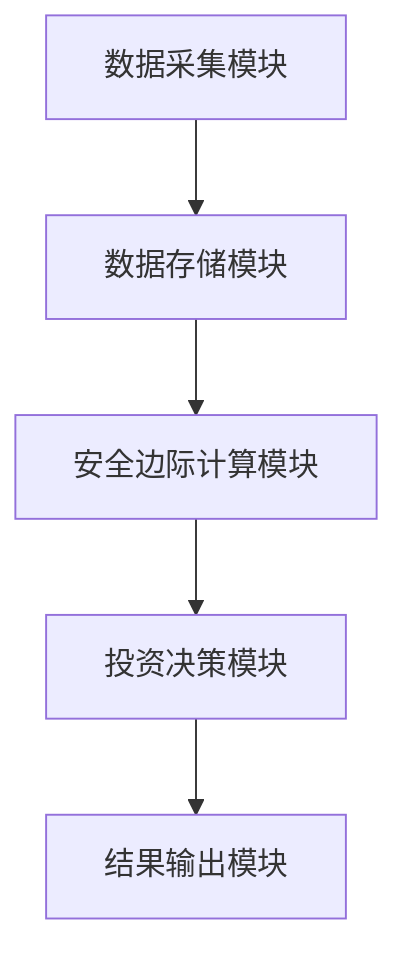
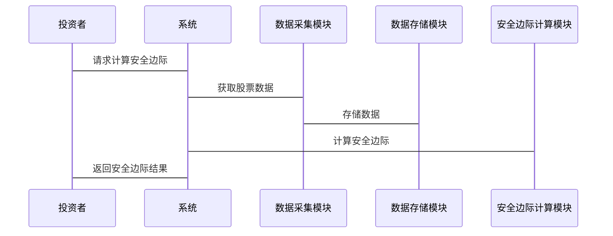

                 


# 芒格的"安全边际"理念在投资中的实践

## 关键词：
- 投资策略，安全边际，价值投资，芒格，风险管理

## 摘要：
本文系统地阐述了芒格"安全边际"理念在投资中的实践应用。通过分析安全边际的定义、数学模型、投资策略以及实际案例，本文详细探讨了如何在投资决策中应用安全边际理念以降低风险、提高收益。结合技术分析和系统设计，本文为投资者提供了一套基于安全边际的量化投资方法，帮助读者在复杂多变的市场环境中做出更明智的投资决策。

---

# 芒格的"安全边际"理念在投资中的实践

## 第1章：芒格"安全边际"理念的背景与基础

### 1.1 芒格投资哲学的核心思想
#### 1.1.1 芒格的背景与投资理念
巴菲特的导师查理·芒格（Charlie Munger）是价值投资理论的重要倡导者之一。芒格的投资哲学以“安全边际”为核心，强调在投资决策中注重风险控制和长期价值。他认为，投资者应该以合理的价格买入具有持续竞争优势的企业，避免过度依赖市场波动进行短期交易。

#### 1.1.2 "安全边际"的定义与核心概念
"安全边际"是指股票的市场价格与其内在价值之间的差异。具体来说，当市场价格低于内在价值时，投资该股票具有“安全边际”。安全边际的存在为投资者提供了保护，能够在市场波动中降低风险。

#### 1.1.3 安全边际在投资中的重要性
安全边际是价值投资的核心要素之一。它不仅帮助投资者识别低估资产，还能在市场恐慌时提供买入机会。通过安全边际，投资者可以避免盲目跟风，降低投资组合的整体风险。

### 1.2 "安全边际"理念的理论基础
#### 1.2.1 价值投资的基本原理
价值投资强调以低于内在价值的价格买入优质资产。芒格的安全边际理念进一步完善了这一理论，强调在买入时留有充分的安全空间。

#### 1.2.2 安全边际与价值投资的关系
安全边际是价值投资的重要补充。通过计算安全边际，投资者可以量化风险，并在市场波动中保持冷静。

#### 1.2.3 安全边际的历史演变
安全边际理念起源于格雷厄姆的价值投资理论，经过芒格的进一步发展，成为现代投资理论的重要组成部分。

### 1.3 "安全边际"理念的实践意义
#### 1.3.1 安全边际在投资决策中的作用
安全边际帮助投资者在市场狂热时保持理性，在市场恐慌时抓住机会。

#### 1.3.2 安全边际与风险控制的关系
通过安全边际，投资者可以量化风险，避免过度投资。

#### 1.3.3 安全边际在不同市场环境下的应用
在牛市中，安全边际提醒投资者警惕高估；在熊市中，安全边际指引投资者寻找低估机会。

---

## 第2章：安全边际的数学模型与计算方法

### 2.1 安全边际的计算公式
#### 2.1.1 安全边际率的定义
安全边际率 = （内在价值 - 市场价格）/ 市场价格

#### 2.1.2 安全边际的计算公式
$$\text{安全边际} = \text{内在价值} - \text{市场价格}$$

#### 2.1.3 安全边际的评估标准
一般来说，安全边际率大于10%时，投资具有较高的安全边际。

### 2.2 安全边际与投资决策的关系
#### 2.2.1 安全边际在投资决策中的应用
- 在买入决策中，安全边际率越高，投资的安全性越强。
- 在卖出决策中，当市场价格接近内在价值时，安全边际减小，投资者应考虑获利了结。

#### 2.2.2 安全边际与投资风险的量化
安全边际的量化帮助投资者在风险可控范围内进行投资决策。

#### 2.2.3 安全边际的动态调整
根据市场变化和企业基本面的变化，定期调整安全边际的计算。

### 2.3 安全边际的案例分析
#### 2.3.1 典型案例一：某公司股票的安全边际计算
假设某公司股票的内在价值为100元，市场价格为80元，则安全边际为20元，安全边际率为25%。

#### 2.3.2 典型案例二：市场波动对安全边际的影响
当市场价格波动时，安全边际会随之变化，投资者需要根据市场变化调整投资策略。

---

## 第3章：安全边际在投资策略中的应用

### 3.1 安全边际在股票投资中的应用
#### 3.1.1 股票估值的基本方法
- 市盈率法
- 市净率法
- 现金流折现法

#### 3.1.2 安全边际在股票估值中的应用
通过计算安全边际，投资者可以筛选出具有较高安全边际的股票进行投资。

#### 3.1.3 安全边际与股票选择的关系
安全边际是股票选择的重要标准之一，帮助投资者避免高估股票。

### 3.2 安全边际与投资组合管理
#### 3.2.1 投资组合中的安全边际评估
通过计算投资组合中每只股票的安全边际，投资者可以优化投资组合的风险收益比。

#### 3.2.2 安全边际在分散投资中的作用
分散投资可以降低单个股票的安全边际不足带来的风险。

#### 3.2.3 安全边际与风险调整收益的关系
通过安全边际的量化，投资者可以更好地衡量风险调整后的收益。

### 3.3 安全边际在市场周期中的应用
#### 3.3.1 不同市场周期中的安全边际策略
- 牛市：注重安全边际，避免过度投资。
- 熊市：寻找高安全边际的投资机会。

#### 3.3.2 安全边际在市场周期中的动态调整
根据市场周期变化，及时调整安全边际的计算和应用策略。

---

## 第4章：基于安全边际的投资系统设计

### 4.1 投资系统概述
#### 4.1.1 系统功能设计
- 数据采集：获取股票的市场数据和基本面数据。
- 安全边际计算：根据模型计算每只股票的安全边际。
- 投资决策：根据安全边际结果生成买入、卖出信号。

#### 4.1.2 系统架构设计


#### 4.1.3 系统接口设计
- 数据接口：与数据源对接，获取股票数据。
- 计算接口：调用安全边际计算函数。
- 决策接口：根据计算结果生成投资信号。

#### 4.1.4 系统交互流程


### 4.2 系统实现与优化
#### 4.2.1 系统核心实现
```python
def calculate_margin_of_safety(intrinsic_value, market_price):
    return intrinsic_value - market_price
```

#### 4.2.2 系统优化策略
- 数据优化：使用高效数据结构存储和处理数据。
- 算法优化：改进计算方法，提高计算效率。

#### 4.2.3 系统维护与更新
- 数据更新：及时更新股票数据。
- 算法优化：根据市场变化调整计算模型。

---

## 第5章：项目实战与经验总结

### 5.1 环境安装与配置
#### 5.1.1 系统环境
- 操作系统：Windows/Mac/Linux
- 开发工具：Python、Jupyter Notebook
- 数据源：Yahoo Finance API

#### 5.1.2 安装依赖
```bash
pip install pandas numpy matplotlib requests
```

### 5.2 核心代码实现
#### 5.2.1 数据采集模块
```python
import requests
import pandas as pd

def get_stock_data(symbol):
    url = f"https://query1.finance.yahoo.com/v7/finance/quote/{symbol}"
    response = requests.get(url)
    data = response.json()
    return pd.DataFrame(data['quote'])
```

#### 5.2.2 安全边际计算模块
```python
def calculate_margin_of_safety(intrinsic_value, market_price):
    return intrinsic_value - market_price
```

#### 5.2.3 投资决策模块
```python
def generate_signals(margin_of_safety):
    if margin_of_safety > 0.2:
        return "买入"
    elif margin_of_safety < 0:
        return "卖出"
    else:
        return "观望"
```

### 5.3 实际案例分析
#### 5.3.1 案例一：科技股投资
- 股票名称：AAPL
- 内在价值：$150
- 市场价格：$120
- 安全边际：$30（20%）

#### 5.3.2 案例二：周期股投资
- 股票名称：XOM
- 内在价值：$70
- 市场价格：$60
- 安全边际：$10（16.67%）

### 5.4 项目小结
通过项目实战，我们验证了安全边际理念在实际投资中的有效性。通过量化方法，投资者可以更好地控制风险，提高投资收益。

---

## 第6章：总结与展望

### 6.1 本章总结
芒格的安全边际理念为投资者提供了重要的风险管理工具。通过量化安全边际，投资者可以在复杂市场环境中做出更明智的投资决策。

### 6.2 投资策略的优化方向
- 结合机器学习优化安全边际计算。
- 引入更多因素（如宏观经济指标）进行综合评估。

### 6.3 未来展望
随着技术进步，安全边际理念将在更多领域得到应用，帮助投资者实现稳健收益。

---

## 作者：AI天才研究院/AI Genius Institute & 禅与计算机程序设计艺术 /Zen And The Art of Computer Programming

---

本文通过系统分析芒格的安全边际理念，结合数学模型和实际案例，为投资者提供了一套量化投资方法。希望本文能为投资者在复杂市场环境中做出更明智的投资决策提供有益的参考。

