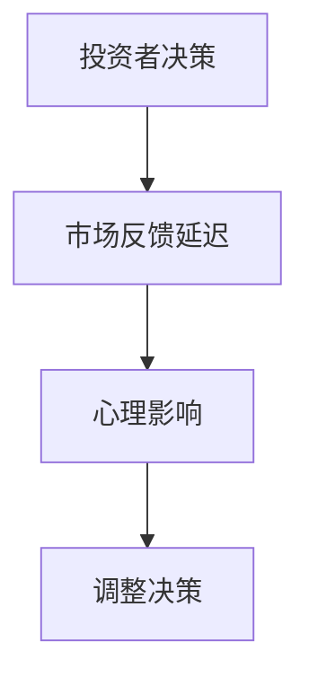
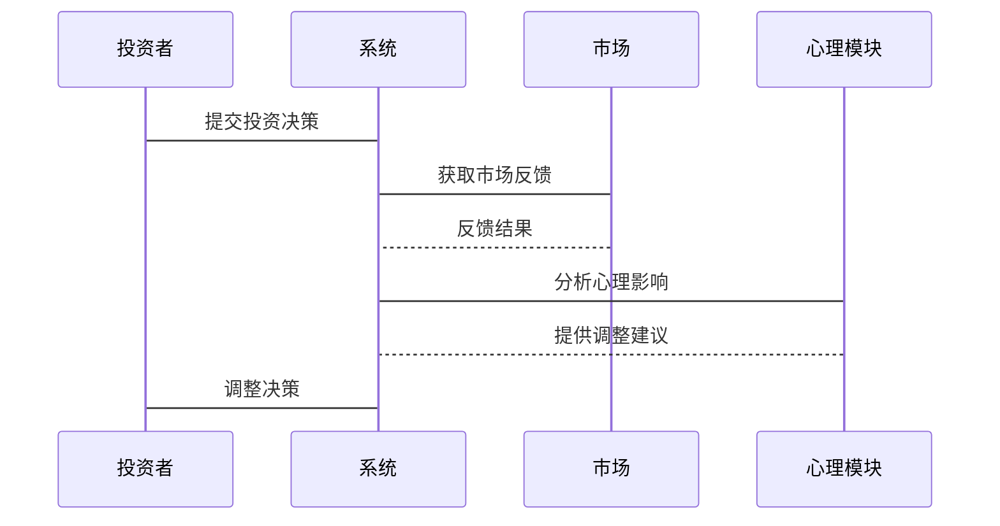

                 


# 芒格的"延迟反馈"理论：长期投资的心理挑战

## 关键词：芒格，延迟反馈，长期投资，心理挑战，投资心理学，投资决策，反馈机制

## 摘要：本文深入探讨了芒格提出的“延迟反馈”理论，分析了其在长期投资中的表现及其对投资者心理的影响。通过数学模型、心理分析和系统设计，揭示了延迟反馈对投资决策的复杂影响，并提出了应对策略。

---

# 目录大纲：《芒格的"延迟反馈"理论：长期投资的心理挑战》

## 第一部分：芒格“延迟反馈”理论的背景与核心概念

### 第1章：芒格“延迟反馈”理论的提出与背景

#### 1.1 芒格投资理念概述

- **1.1.1 芒格的价值投资理念**
  - 芒格的价值投资理念强调长期主义和基本面分析，认为市场波动是投资机会的来源。
  - 芒格的投资框架包括心理因素、价值评估和安全边际。

- **1.1.2 芒格的决策框架**
  - 芒格的决策框架包括“格栅思维”和“逆向思维”，强调跨学科的知识整合。
  - 通过案例分析，说明芒格如何运用这些框架做出投资决策。

- **1.1.3 芒格对心理因素的研究**
  - 芒格关注投资者的心理偏差，如过度自信和从众心理。
  - 通过历史案例，说明心理偏差对投资决策的影响。

#### 1.2 延迟反馈的定义与特征

- **1.2.1 延迟反馈的定义**
  - 延迟反馈是指在投资决策后，结果并未立即显现，而是经过一段时间后才呈现。
  - 例如，买入一只股票后，其价值可能在数月甚至数年后才得以体现。

- **1.2.2 延迟反馈的特征对比**
  - **即时反馈**：结果立即可见，适用于短期交易。
  - **延迟反馈**：结果滞后，适用于长期投资。
  - 对比分析：延迟反馈在长期投资中的优势与劣势。

- **1.2.3 延迟反馈的核心要素**
  - 时间跨度：反馈延迟的时间长度。
  - 结果不确定性：延迟期间的市场波动和公司变化。
  - 心理影响：延迟反馈对投资者心理的挑战。

#### 1.3 延迟反馈在投资中的表现

- **1.3.1 市场波动与反馈延迟**
  - 市场波动是反馈延迟的直接原因，投资者需要在波动中保持耐心。
  - 通过历史数据，展示市场波动如何导致反馈延迟。

- **1.3.2 投资决策与反馈延迟的关系**
  - 投资决策的复杂性增加反馈延迟的可能性。
  - 例如，长期投资策略可能因市场波动而延迟反馈。

- **1.3.3 延迟反馈对投资者心理的影响**
  - 投资者在延迟反馈期间可能经历焦虑和怀疑，影响决策。
  - 通过案例分析，说明心理影响的具体表现。

---

## 第二部分：延迟反馈理论的核心原理与数学模型

### 第2章：延迟反馈的数学模型与公式

#### 2.1 延迟反馈的数学模型

- **2.1.1 延迟反馈的时间序列模型**
  - 时间序列模型用于分析投资结果的时间分布。
  - 公式：$$ Y_t = \beta_0 + \beta_1 Y_{t-1} + \epsilon_t $$
  - 其中，$Y_t$ 表示第 t 期的反馈，$\epsilon_t$ 为误差项。

- **2.1.2 延迟反馈的马尔可夫链模型**
  - 马尔可夫链模型用于分析状态转移的概率。
  - 公式：$$ P_{i,j}^{(n)} = \text{概率从状态i转移到状态j在n步后} $$
  - 用于分析市场状态变化对反馈延迟的影响。

- **2.1.3 延迟反馈的回归分析模型**
  - 回归分析模型用于分析变量之间的关系。
  - 公式：$$ Y = \beta X + \epsilon $$
  - 其中，$Y$ 是反馈结果，$X$ 是投资决策变量。

#### 2.2 延迟反馈的公式推导

- **2.2.1 时间序列模型公式**
  $$ Y_t = \beta_0 + \beta_1 Y_{t-1} + \epsilon_t $$
  - 通过案例分析，展示如何利用该模型预测反馈延迟。

- **2.2.2 马尔可夫链模型公式**
  $$ P_{i,j}^{(n)} = \text{概率从状态i转移到状态j在n步后} $$
  - 通过实例，说明如何计算状态转移概率。

- **2.2.3 回归分析模型公式**
  $$ Y = \beta X + \epsilon $$
  - 通过数据拟合，展示如何估计回归系数。

#### 2.3 延迟反馈的案例分析

- **2.3.1 历史案例分析**
  - 例如，2008年金融危机后买入优质股票的反馈延迟分析。
  - 展示时间序列模型的应用。

- **2.3.2 现实案例分析**
  - 分析当前市场的延迟反馈情况，如科技股的投资。
  - 通过马尔可夫链模型，预测未来市场状态。

- **2.3.3 案例总结与启示**
  - 总结案例中的经验教训，强调模型的应用价值。

---

## 第三部分：延迟反馈对长期投资心理的影响

### 第3章：延迟反馈与投资者心理

#### 3.1 投资者心理分析

- **3.1.1 投资者的认知偏差**
  - 认知偏差包括过度自信、确认偏见等，影响投资决策。
  - 通过实例，说明认知偏差如何导致错误决策。

- **3.1.2 投资者的情感波动**
  - 投资者在延迟反馈期间可能经历焦虑、怀疑等情感波动。
  - 通过案例分析，说明情感波动对决策的影响。

- **3.1.3 投资者决策框架**
  - 芒格的决策框架如何帮助投资者克服心理障碍。
  - 通过实例，展示框架的应用。

#### 3.2 延迟反馈对心理的影响

- **3.2.1 延迟反馈对耐心的影响**
  - 延迟反馈要求投资者具备更强的耐心。
  - 通过案例分析，展示耐心的重要性。

- **3.2.2 延迟反馈对决策的影响**
  - 延迟反馈可能导致投资者频繁调整策略。
  - 通过分析，说明调整策略的风险。

- **3.2.3 延迟反馈对信心的影响**
  - 延迟反馈可能削弱投资者信心。
  - 通过案例分析，展示信心管理的重要性。

#### 3.3 心理因素对延迟反馈的反作用

- **3.3.1 心理预期与反馈延迟的关系**
  - 投资者的预期如何影响反馈延迟的结果。
  - 通过实例，说明预期管理的重要性。

- **3.3.2 心理压力与反馈延迟的相互作用**
  - 延迟反馈带来的压力如何影响投资者决策。
  - 通过案例分析，展示压力管理策略。

- **3.3.3 心理调节与反馈延迟的平衡**
  - 如何通过心理调节应对延迟反馈的压力。
  - 通过实例，展示心理调节的方法。

---

## 第四部分：延迟反馈的系统分析与架构设计

### 第4章：延迟反馈的系统分析

#### 4.1 系统架构设计

- **4.1.1 系统模块划分**
  - 包括投资者决策模块、市场反馈模块、心理影响模块。
  - 通过Mermaid图展示系统架构。

- **4.1.2 系统功能设计**
  - 投资者决策模块：接收输入，生成决策。
  - 市场反馈模块：模拟市场变化，生成反馈。
  - 心理影响模块：分析心理变化，调整决策。

- **4.1.3 系统性能指标**
  - 反馈延迟时间：系统的响应时间。
  - 系统稳定性：在市场波动中的表现。

#### 4.2 系统架构图



- 通过图表展示系统各模块之间的关系，说明信息流和数据流。

#### 4.3 系统接口设计

- **4.3.1 投资者决策接口**
  - 输入：投资者的决策参数。
  - 输出：系统生成的投资策略。

- **4.3.2 市场反馈接口**
  - 输入：市场数据。
  - 输出：反馈结果。

- **4.3.3 心理影响接口**
  - 输入：心理数据。
  - 输出：心理调整建议。

#### 4.4 系统交互序列图



- 通过序列图展示系统交互过程，说明各模块的协作。

---

## 第五部分：延迟反馈的系统实现与实战案例

### 第5章：延迟反馈的系统实现

#### 5.1 系统核心实现源代码

- **5.1.1 数据处理代码**
  ```python
  import pandas as pd
  data = pd.read_csv('market_data.csv')
  ```

- **5.1.2 反馈延迟模型代码**
  ```python
  def delayed_feedback(tickers, delay=30):
      feedbacks = []
      for ticker in tickers:
          feedback = calculate_feedback(ticker, delay)
          feedbacks.append(feedback)
      return feedbacks
  ```

- **5.1.3 心理影响分析代码**
  ```python
  def analyze心理_impact(feedback, threshold):
      if feedback > threshold:
          return 'positive'
      else:
          return 'negative'
  ```

#### 5.2 代码应用解读与分析

- **5.2.1 数据处理部分**
  - 读取市场数据，进行清洗和预处理。
  - 展示如何选择合适的市场指标。

- **5.2.2 反馈延迟模型**
  - 通过函数实现反馈延迟的计算。
  - 展示如何调整延迟时间以适应不同投资策略。

- **5.2.3 心理影响分析**
  - 根据反馈结果，分析心理影响。
  - 展示如何根据心理状态调整投资策略。

#### 5.3 实际案例分析

- **5.3.1 案例选择**
  - 选择具有代表性的投资案例，如科技股投资。
  - 展示反馈延迟的具体表现。

- **5.3.2 数据分析与结果展示**
  - 使用Python进行数据分析，展示反馈延迟的统计特征。
  - 通过图表展示反馈延迟的时间分布。

- **5.3.3 案例总结与启示**
  - 总结案例中的经验教训。
  - 展示如何在实际投资中应用延迟反馈理论。

#### 5.4 项目小结

- **项目目标**
  - 探讨延迟反馈理论在实际投资中的应用。
  - 提供系统的解决方案和实战案例。

- **项目成果**
  - 提供一套基于延迟反馈的系统架构。
  - 展示系统的实际应用价值。

---

## 第六部分：延迟反馈理论的拓展与未来展望

### 第6章：延迟反馈的未来展望与研究方向

#### 6.1 未来研究方向

- **延迟反馈与人工智能的结合**
  - 探讨AI技术如何优化延迟反馈模型。
  - 通过案例分析，展示AI在反馈延迟中的应用。

- **延迟反馈与行为金融学的结合**
  - 研究行为金融学如何影响延迟反馈。
  - 通过实例，展示行为金融学对投资决策的影响。

- **延迟反馈与复杂系统的结合**
  - 探讨复杂系统理论在延迟反馈中的应用。
  - 通过案例分析，展示系统的动态特征。

#### 6.2 最佳实践 tips

- **保持耐心**
  - 在延迟反馈期间，投资者需要保持耐心，避免频繁调整策略。

- **心理调节**
  - 通过心理调节，缓解延迟反馈带来的压力。

- **系统优化**
  - 不断优化投资系统，适应市场变化。

#### 6.3 小结

- 总结全文内容。
- 强调延迟反馈理论的重要性。
- 展望未来的研究方向。

---

## 第七部分：作者简介与参考文献

### 作者简介

- **作者：AI天才研究院/AI Genius Institute & 禅与计算机程序设计艺术 /Zen And The Art of Computer Programming**
  - 专注于人工智能和计算机程序设计的研究与实践。
  - 提供技术咨询和解决方案，帮助投资者应对延迟反馈的挑战。

### 参考文献

- 芒格投资经典著作
- 相关学术论文
- 技术报告和白皮书
- 行为金融学研究文献

---

## 附录

### 附录A：术语表

- 延迟反馈
- 投资者心理
- 系统架构

### 附录B：代码库

- 数据处理代码
- 反馈延迟模型代码
- 心理影响分析代码

---

# 结语

芒格的“延迟反馈”理论为长期投资提供了深刻的洞见。通过系统的分析和实际案例，我们可以更好地理解延迟反馈对投资决策的影响，并采取相应的策略应对心理挑战。未来的研究将进一步探索延迟反馈与人工智能、行为金融学的结合，为投资者提供更有效的工具和方法。

---

作者：AI天才研究院/AI Genius Institute & 禅与计算机程序设计艺术 /Zen And The Art of Computer Programming

