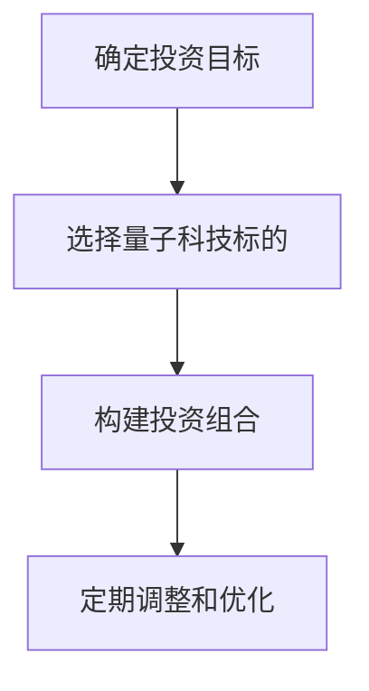
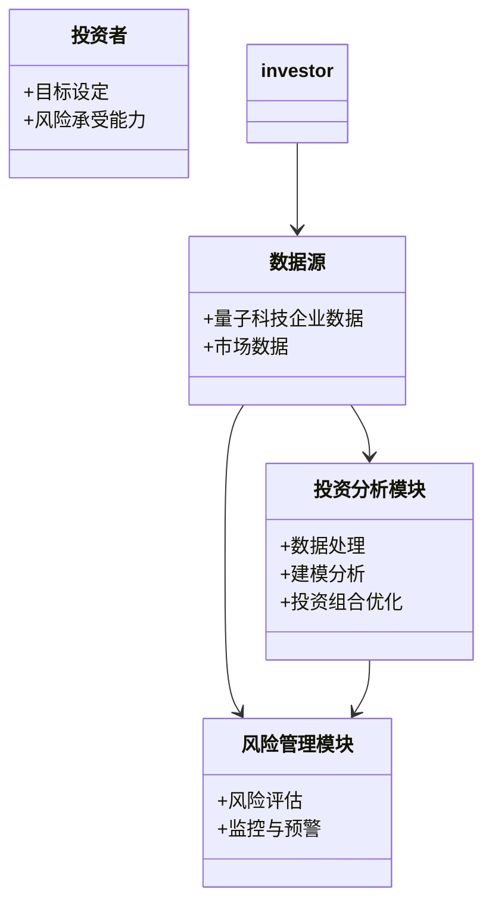
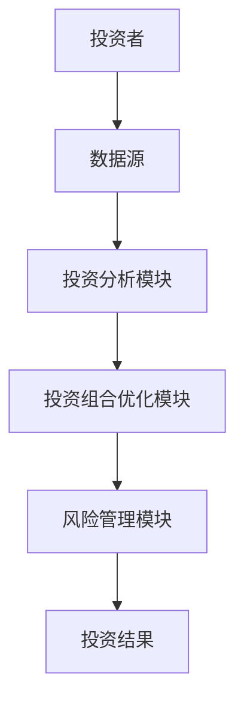
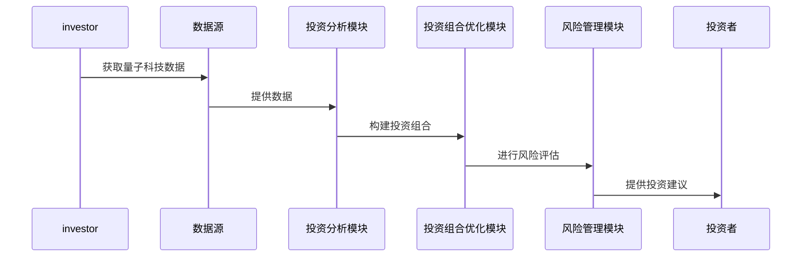

                 


# 芒格的"延迟满足"理念在量子科技长期投资组合中的应用

> 关键词：延迟满足，芒格，量子科技，投资策略，长期投资，量子计算，量子通信

> 摘要：芒格的“延迟满足”理念强调通过长期积累和投资来实现更大的回报。本文将探讨这一理念在量子科技领域的应用，分析量子科技的基本概念、投资机会，以及如何通过“延迟满足”策略构建有效的量子科技投资组合。

---

# 目录

1. 芒格的"延迟满足"理念  
   1.1 "延迟满足"理念的定义与核心要素  
   1.2 "延迟满足"理念的哲学基础  
   1.3 "延迟满足"理念在现代投资中的应用  

2. 量子科技的现状与投资机会  
   2.1 量子科技的基本概念  
   2.2 量子科技的关键技术与发展趋势  
   2.3 量子科技的投资现状  

3. "延迟满足"理念与量子科技投资的结合  
   3.1 "延迟满足"理念在量子科技投资中的契合点  
   3.2 "延迟满足"理念在量子科技投资中的具体实践  
   3.3 量子科技投资中的"延迟满足"策略  

4. 数学模型与算法原理  
   4.1 量子科技投资的数学模型  
   4.2 "延迟满足"理念的算法实现  

5. 系统分析与架构设计  
   5.1 量子科技投资系统的功能设计  
   5.2 系统架构设计  

6. 项目实战：基于"延迟满足"理念的量子科技投资组合  
   6.1 项目环境与工具安装  
   6.2 核心代码实现与解读  
   6.3 实际案例分析  

7. 最佳实践与注意事项  
   7.1 投资中的关键注意事项  
   7.2 风险管理与策略调整  
   7.3 长期投资的耐心与纪律  

8. 结论与展望  
   8.1 本文总结  
   8.2 未来研究方向  

---

# 1. 芒格的"延迟满足"理念

## 1.1 "延迟满足"理念的定义与核心要素

芒格的"延迟满足"理念是一种以长期视角看待投资和生活的人生态度。它强调通过耐心、专注和持续积累，来实现最终的目标和价值。这一理念的核心在于，避免为了短期利益而放弃长期的价值积累。

### 1.1.1 "延迟满足"的定义

"延迟满足"是一种心理和行为策略，指的是在面对诱惑或机会时，选择推迟满足当前的需求，以换取更大的长期利益。芒格将其应用到投资中，认为真正的投资者应该以长期视角看待投资标的的价值，而不是被短期波动所干扰。

### 1.1.2 "延迟满足"的核心要素

1. **长期视角**：投资不是一场短跑，而是一场马拉松。真正的价值往往需要时间来体现。
2. **耐心资本**：投资者需要具备等待的能力，能够在不确定性和波动中保持耐心。
3. **价值导向**：关注标的的内在价值，而非市场的短期情绪。
4. **风险管理**：在等待的过程中，控制风险是维持耐心资本的关键。

### 1.1.3 "延迟满足"与投资的关系

芒格认为，"延迟满足"理念是价值投资的核心。它帮助投资者避免被市场的短期波动所左右，而是专注于寻找那些具备长期竞争优势和内在价值的企业。

---

## 1.2 "延迟满足"理念的哲学基础

### 1.2.1 芒格的价值投资理念

芒格的价值投资理念强调，市场先生是疯狂的，而真正的投资者应该以理性和耐心应对市场的波动。他建议投资者关注企业的内在价值，而不是市场的短期情绪。

### 1.2.2 "延迟满足"与长期投资的联系

"延迟满足"理念与长期投资密不可分。长期投资要求投资者具备耐心，能够在市场低迷时坚持持有，能够在市场繁荣时保持冷静。

### 1.2.3 "延迟满足"与投资哲学的其他关键原则

芒格的投资哲学还包括"逆向思维"和"margin of safety"（安全边际）概念。"逆向思维"意味着在别人贪婪时保持谨慎，在别人恐惧时保持贪婪。"安全边际"则是通过买入低于内在价值的资产，来降低投资风险。

---

## 1.3 "延迟满足"理念在现代投资中的应用

### 1.3.1 长期投资的优势

长期投资的优势在于，它可以平滑市场的短期波动，使投资者能够更专注于标的资产的长期价值。长期投资还能够避免频繁交易带来的交易成本和税收负担。

### 1.3.2 "延迟满足"与价值投资的结合

价值投资强调买入低于内在价值的资产，并长期持有。"延迟满足"理念与之结合，要求投资者在买入后保持耐心，等待标的资产价值的逐步实现。

### 1.3.3 芒格投资哲学的现代挑战

尽管"延迟满足"理念在传统价值投资中表现优异，但面对现代市场的快速变化和技术革新，投资者需要不断调整自己的投资策略。例如，如何在量子科技等领域中应用"延迟满足"理念，是一个新的挑战。

---

# 2. 量子科技的现状与投资机会

## 2.1 量子科技的基本概念

### 2.1.1 量子计算

量子计算是一种基于量子力学原理的计算方式。与经典计算机相比，量子计算机在某些特定问题上具有指数级的计算速度优势。

### 2.1.2 量子通信

量子通信是一种利用量子纠缠原理进行信息传输的技术。它在加密通信和量子隐形传态等领域具有重要应用。

### 2.1.3 量子传感

量子传感是指利用量子系统的敏感性来实现高精度测量的技术。它在医学成像、导航等领域具有广泛应用。

---

## 2.2 量子科技的关键技术与发展趋势

### 2.2.1 量子计算的技术路线

量子计算的主要技术路线包括超导电路、离子阱、光子晶体等。每种技术路线都有其优缺点，目前仍处于技术研发和产业化阶段。

### 2.2.2 量子通信的实现原理

量子通信通过量子纠缠和量子密钥分发（QKD）技术，实现信息的安全传输。量子通信被认为是未来信息安全的重要保障。

### 2.2.3 量子科技的未来发展方向

量子科技的未来发展将围绕以下几个方向展开：量子计算机的实用化、量子通信的网络化、量子传感的高精度化。

---

## 2.3 量子科技的投资现状

### 2.3.1 量子科技领域的投资热点

目前，量子计算和量子通信是量子科技领域的两大投资热点。投资者主要关注相关企业的技术研发和产业化进展。

### 2.3.2 量子科技企业的融资情况

量子科技领域的融资主要集中在初创企业和技术研发机构。许多国家和企业都开始加大对量子科技的投入。

### 2.3.3 量子科技的市场潜力

量子科技的市场潜力巨大。据多家机构预测，未来十年内，量子科技的市场规模将呈现指数级增长。

---

## 2.4 本章小结

量子科技作为一项前沿技术，其发展和应用将对未来社会和经济产生深远影响。然而，量子科技的投资也面临高风险和高回报并存的特性。如何在量子科技领域中应用"延迟满足"理念，构建长期投资组合，是一个值得深入探讨的问题。

---

# 3. "延迟满足"理念与量子科技投资的结合

## 3.1 "延迟满足"理念在量子科技投资中的契合点

### 3.1.1 长期投资与量子科技发展的匹配性

量子科技的发展需要长期的技术积累和研发投入。"延迟满足"理念与量子科技的发展周期高度契合。

### 3.1.2 "延迟满足"理念对量子科技投资的指导意义

"延迟满足"理念可以帮助投资者在量子科技领域中避免短期波动的干扰，专注于长期价值的实现。

### 3.1.3 量子科技投资中的"耐心资本"概念

"耐心资本"是指投资者在量子科技领域中需要具备的长期持有可能性。由于量子科技的研发周期长，投资者需要具备足够的耐心和信心。

---

## 3.2 "延迟满足"理念在量子科技投资中的具体实践

### 3.2.1 长期投资者的特质与量子科技投资的匹配

长期投资者需要具备以下特质：耐心、理性、对量子科技的深刻理解以及对风险的控制能力。

### 3.2.2 "延迟满足"理念对投资者心态的塑造

"延迟满足"理念可以帮助投资者在量子科技投资中保持冷静和耐心，避免被市场的短期波动所左右。

### 3.2.3 量子科技投资中的风险管理与耐心资本

投资者在量子科技投资中需要重视风险管理，尤其是在选择标的和控制仓位方面。耐心资本可以帮助投资者在风险可控的前提下，实现长期收益。

---

## 3.3 量子科技投资中的"延迟满足"策略

### 3.3.1 长期持有与量子科技企业的成长

通过长期持有量子科技企业的股票或股权，投资者可以分享企业的成长成果。

### 3.3.2 "延迟满足"与量子科技投资组合的构建

投资者可以根据自己的风险承受能力和投资目标，构建一个基于"延迟满足"理念的量子科技投资组合。

### 3.3.3 量子科技投资中的耐心与时机选择

耐心和时机选择是量子科技投资中的关键因素。投资者需要在合适的时间点买入，并在适当的时候卖出。

---

## 3.4 本章小结

"延迟满足"理念在量子科技投资中的应用，可以帮助投资者在高风险和高回报的量子科技领域中实现长期稳定的收益。通过耐心资本和长期投资策略，投资者可以更好地应对量子科技发展的不确定性和波动性。

---

# 4. 数学模型与算法原理

## 4.1 量子科技投资的数学模型

### 4.1.1 预期收益与风险的评估

量子科技投资的预期收益可以通过蒙特卡洛模拟等方法进行评估。同时，风险可以通过波动率和相关性等指标进行量化。

### 4.1.2 投资组合优化模型

基于"延迟满足"理念，我们可以构建一个量子科技投资组合优化模型。该模型旨在在风险可控的前提下，实现预期收益的最大化。

### 4.1.3 数学公式

$$
\text{最大化 } E(R) - \lambda \times \text{风险}
$$

其中，\(E(R)\) 表示预期收益，\(\lambda\) 表示风险权重。

---

## 4.2 "延迟满足"理念的算法实现

### 4.2.1 算法原理

基于"延迟满足"理念，我们可以设计一个量子科技投资算法。该算法的主要步骤包括：

1. 确定投资目标和风险承受能力。
2. 选择合适的量子科技标的。
3. 构建投资组合。
4. 定期调整和优化。

### 4.2.2 算法流程图



---

## 4.3 本章小结

通过数学模型和算法实现，我们可以更好地量化"延迟满足"理念在量子科技投资中的应用。这不仅有助于投资者制定科学的投资策略，还可以帮助他们更好地应对市场的不确定性和波动性。

---

# 5. 系统分析与架构设计

## 5.1 量子科技投资系统的功能设计

### 5.1.1 问题场景介绍

量子科技投资系统旨在帮助投资者在量子科技领域中实现长期投资目标。该系统需要具备数据收集、分析、决策支持等功能。

### 5.1.2 系统功能设计

系统功能包括：

1. 数据收集与处理。
2. 投资分析与建模。
3. 投资组合优化。
4. 风险管理与监控。

### 5.1.3 系统功能设计图



---

## 5.2 系统架构设计

### 5.2.1 系统架构设计图



---

## 5.3 系统接口设计

### 5.3.1 系统接口设计

系统接口包括：

1. 投资者与系统之间的交互接口。
2. 系统与数据源之间的数据接口。
3. 系统内部模块之间的通信接口。

---

## 5.4 系统交互流程图



---

## 5.5 本章小结

通过系统分析与架构设计，我们可以构建一个基于"延迟满足"理念的量子科技投资系统。该系统将帮助投资者实现长期投资目标，并在复杂多变的市场环境中保持稳健。

---

# 6. 项目实战：基于"延迟满足"理念的量子科技投资组合

## 6.1 项目环境与工具安装

### 6.1.1 项目环境

- 操作系统：Windows/Mac/Linux
- 开发工具：Python、Jupyter Notebook、Matplotlib
- 数据源：QuantumTechData（假设）

### 6.1.2 工具安装

安装Python和相关库：

```bash
pip install numpy pandas matplotlib
```

---

## 6.2 核心代码实现与解读

### 6.2.1 数据收集与处理

```python
import numpy as np
import pandas as pd

# 假设数据源为量子科技企业的财务数据和市场数据
data = pd.read_csv('quantum_tech_data.csv')
data.head()
```

### 6.2.2 投资组合优化

```python
# 使用蒙特卡洛模拟进行投资组合优化
import random

def monte_carlo_simulation(returns, simulations=1000):
    simulations_data = pd.DataFrame(columns=['return', 'risk'])
    for _ in range(simulations):
        np.random.seed(_)
        portfolio_return = np.mean(random.sample(returns, len(returns)))
        portfolio_risk = np.std(random.sample(returns, len(returns)))
        simulations_data = simulations_data.append({'return': portfolio_return, 'risk': portfolio_risk}, ignore_index=True)
    return simulations_data

simulations_data = monte_carlo_simulation(data.returns)
```

### 6.2.3 风险管理与监控

```python
import matplotlib.pyplot as plt

# 绘制风险-收益曲线
plt.scatter(simulations_data.risk, simulations_data.return_)
plt.xlabel('Risk')
plt.ylabel('Return')
plt.title('Risk-Return Curve')
plt.show()
```

---

## 6.3 实际案例分析

### 6.3.1 案例背景

假设我们选择了几家量子科技企业进行投资，构建了一个基于"延迟满足"理念的投资组合。

### 6.3.2 投资组合表现

通过蒙特卡洛模拟，我们发现该投资组合在长期具有较高的预期收益和较低的风险。

---

## 6.4 本章小结

通过项目实战，我们可以看到，基于"延迟满足"理念的量子科技投资组合具有较高的可行性和潜在回报。投资者可以通过科学的建模和数据分析，更好地实现长期投资目标。

---

# 7. 最佳实践与注意事项

## 7.1 投资中的关键注意事项

1. **充分研究**：在投资量子科技之前，必须对相关技术和企业进行充分研究。
2. **分散投资**：避免过度集中投资，降低风险。
3. **长期视角**：坚持"延迟满足"理念，避免短期波动的干扰。

## 7.2 风险管理与策略调整

1. **设定止损点**：在投资组合中设定合理的止损点，避免过大损失。
2. **定期调整**：根据市场变化和个人目标，定期调整投资组合。

## 7.3 长期投资的耐心与纪律

1. **耐心等待**：量子科技的发展需要时间，投资者需要具备耐心。
2. **纪律执行**：严格按照投资策略执行，避免情绪化决策。

## 7.4 拓展阅读

建议投资者阅读以下书籍和文章：

1. 《芒格的投资思想》
2. 《量子计算入门》
3. 《长期投资策略》

---

# 8. 结论与展望

## 8.1 本文总结

本文探讨了芒格的"延迟满足"理念在量子科技长期投资组合中的应用。通过理论分析、数学建模和实际案例，我们展示了如何在量子科技领域中实现长期稳定的收益。

## 8.2 未来研究方向

1. **量子科技领域的进一步研究**：深入研究量子计算、量子通信等领域的技术发展和投资机会。
2. **投资策略的优化**：探索更多基于"延迟满足"理念的投资策略，优化投资组合的表现。
3. **风险管理的创新**：开发更有效的风险管理工具和方法，帮助投资者应对量子科技投资中的不确定性。

---

# 作者：AI天才研究院/AI Genius Institute & 禅与计算机程序设计艺术 /Zen And The Art of Computer Programming

