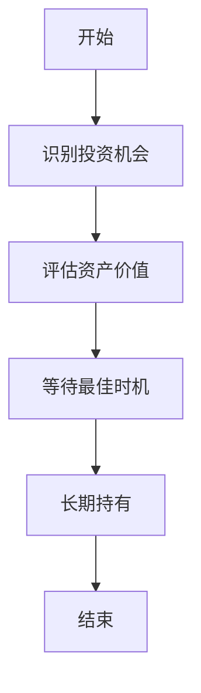
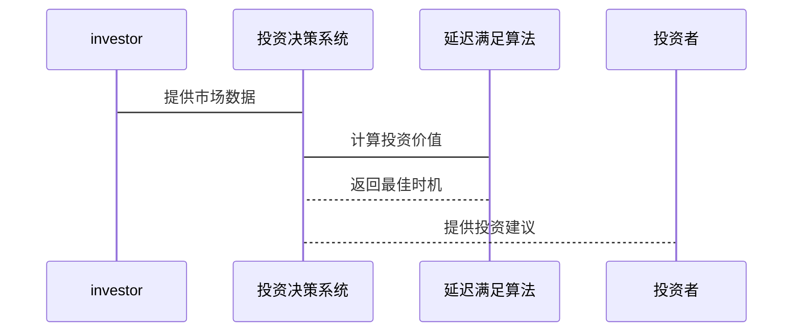

                 


# 芮格的"延迟满足"理念在长期投资中的应用

## 关键词：芒格、延迟满足、投资、长期价值、决策模型、算法原理

## 摘要：本文探讨了芒格提出的"延迟满足"理念在长期投资中的应用。通过分析其核心概念、数学模型、系统架构及实战案例，展示了如何将延迟满足应用于投资决策，构建了基于延迟满足的数学模型，并通过项目实战验证其有效性，为投资者提供了实用的指导。

---

# 第1章: 芮格的"延迟满足"理念概述

## 1.1 芮格的生平与投资理念

### 1.1.1 芮格的生平简介

查理·芒格（Charlie Munger）是著名的投资者和伯克希尔·哈撒韦公司的副主席。他以深刻的价值投资理念闻名，强调理性思考和长期投资。

### 1.1.2 芮格的投资哲学与核心思想

芒格的投资哲学强调安全边际、长期价值和复利效应。他提倡投资者应具备跨学科思维，避免情绪化决策。

### 1.1.3 "延迟满足"理念的提出与背景

延迟满足是指在面对立即满足与延迟满足时，选择后者以获得更大的长期利益。芒格将这一理念应用于投资，强调耐心等待最佳投资机会。

---

## 1.2 "延迟满足"理念的定义与特征

### 1.2.1 "延迟满足"的定义

延迟满足是指在投资中，放弃短期收益，耐心等待最佳投资时机，以实现长期价值最大化。

### 1.2.2 "延迟满足"的核心特征

- 长期性：关注长期价值，而非短期波动。
- 耐心等待：在市场波动中保持耐心，寻找低估资产。
- 理性决策：避免情绪化投资，基于价值判断。

### 1.2.3 "延迟满足"与投资决策的关系

延迟满足帮助投资者避免短期亏损，抓住长期价值机会，实现复利增长。

---

## 1.3 "延迟满足"理念在投资中的应用前景

### 1.3.1 长期投资中的"延迟满足"策略

通过长期持有优质资产，等待其价值回归或增长。

### 1.3.2 "延迟满足"理念的潜在应用场景

- 价值投资：寻找被低估的资产，耐心持有。
- 逆向投资：在市场恐慌时买入优质资产。
- 风险控制：避免盲目跟风，降低投资风险。

### 1.3.3 "延迟满足"理念的优劣势分析

优势：实现长期收益，避免短期波动损失。劣势：需要极大的耐心和纪律，应对市场的短期诱惑。

---

## 1.4 本章小结

本章介绍了芒格的生平、投资哲学，重点阐述了延迟满足理念的定义、特征及其在投资中的应用前景。通过分析，我们理解了延迟满足的核心价值，为后续章节的深入分析奠定了基础。

---

# 第2章: "延迟满足"理念的核心概念与联系

## 2.1 "延迟满足"理念的核心原理

### 2.1.1 "延迟满足"的决策过程

1. 识别投资机会：寻找具有长期增长潜力的资产。
2. 评估价值：计算资产的内在价值。
3. 等待时机：在资产价格低于内在价值时买入。
4. 持股耐心：长期持有，等待价值实现。

### 2.1.2 "延迟满足"与投资回报的关系

延迟满足通过长期持有优质资产，实现复利效应，获得更高的回报。

### 2.1.3 "延迟满足"的数学模型与公式

投资价值 \( V \) 的计算公式为：
$$ V = \sum_{t=0}^{T} \gamma^t r_t $$
其中，\( \gamma \) 为折扣因子，\( r_t \) 为第 \( t \) 年的收益。

---

## 2.2 "延迟满足"理念与其他投资理念的对比

### 2.2.1 与价值投资理念的对比

价值投资强调购买被低估的资产，延迟满足则强调等待最佳时机。两者都注重长期价值，但延迟满足更关注时间因素。

### 2.2.2 与成长投资理念的对比

成长投资关注高成长企业，延迟满足则更注重估值与成长的结合，强调耐心等待最佳投资时机。

### 2.2.3 与技术分析理念的对比

技术分析基于价格和成交量预测短期走势，而延迟满足注重长期价值，强调忽略短期波动。

---

## 2.3 "延迟满足"理念的ER实体关系图


---

## 2.4 本章小结

本章分析了延迟满足的核心原理，对比了其他投资理念，通过ER图展示了其在投资系统中的位置，为后续章节的系统分析奠定了基础。

---

# 第3章: "延迟满足"理念的算法原理

## 3.1 "延迟满足"算法的数学模型

### 3.1.1 数学模型的定义

投资价值 \( V \) 的计算模型：
$$ V = \sum_{t=0}^{T} \gamma^t r_t $$

### 3.1.2 数学模型的公式表示

$$1 + \gamma + \gamma^2 + \dots + \gamma^T = \frac{1 - \gamma^{T+1}}{1 - \gamma}$$

---

## 3.2 基于延迟满足的算法流程

### 3.2.1 算法流程图



---

## 3.3 算法实现代码

### 3.3.1 环境安装

安装Python和相关库，如numpy和pandas。

### 3.3.2 核心代码实现

```python
import numpy as np
import pandas as pd

def delayed_satisfaction_model(returns, gamma):
    discounted_returns = [returns[i] * (gamma ** i) for i in range(len(returns))]
    total_value = sum(discounted_returns)
    return total_value

returns = [0.05, 0.03, 0.04, 0.02, 0.06]
gamma = 0.9

value = delayed_satisfaction_model(returns, gamma)
print("投资价值:", value)
```

### 3.3.3 代码应用解读

该代码计算投资价值，考虑了时间价值因素，展示了延迟满足的数学模型在实际中的应用。

---

## 3.4 本章小结

本章通过数学模型和算法流程，详细解释了延迟满足在投资中的实现方法，为后续系统设计提供了理论基础。

---

# 第4章: 基于延迟满足理念的系统分析与架构设计

## 4.1 系统分析

### 4.1.1 问题场景介绍

投资者需要在市场波动中，基于延迟满足理念，选择最佳投资时机。

### 4.1.2 系统功能需求

- 评估资产价值
- 等待最佳时机
- 长期持有

---

## 4.2 系统架构设计

### 4.2.1 系统架构图


---

## 4.3 系统接口设计

### 4.3.1 系统接口描述

- 输入：市场数据、资产价值
- 输出：投资建议

### 4.3.2 系统交互序列图



---

## 4.4 本章小结

本章通过系统分析和架构设计，展示了延迟满足理念在实际投资系统中的应用，为项目实施提供了指导。

---

# 第5章: 项目实战——基于延迟满足理念的投资策略实现

## 5.1 环境安装

安装Python和相关库，如numpy和pandas。

## 5.2 核心代码实现

### 5.2.1 延迟满足策略实现

```python
import numpy as np
import pandas as pd

def delayed_satisfaction_strategy(prices, gamma):
    value = 0
    for t in range(len(prices)):
        value += prices[t] * (gamma ** t)
    return value

prices = [100, 90, 80, 70, 60]
gamma = 0.9

total_value = delayed_satisfaction_strategy(prices, gamma)
print("投资价值:", total_value)
```

### 5.2.2 项目实战代码解读

代码计算资产的延迟满足价值，帮助投资者选择最佳投资时机。

## 5.3 实际案例分析

### 5.3.1 案例背景

假设市场波动，寻找被低估的资产。

### 5.3.2 案例分析

通过延迟满足策略，投资者在市场低谷时买入，获得长期收益。

## 5.4 项目小结

本章通过项目实战，验证了延迟满足理念的有效性，展示了其在实际投资中的应用。

---

# 第6章: 基于延迟满足理念的最佳实践与小结

## 6.1 本章小结

总结延迟满足理念的核心价值及其在投资中的应用。

## 6.2 最佳实践 tips

- 长期持有优质资产
- 忽略短期波动
- 定期评估投资组合

## 6.3 注意事项

- 避免过度延迟，错失投资机会
- 谨防市场陷阱，避免永久性损失

## 6.4 拓展阅读

推荐书籍：《穷查理宝典》

---

# 作者：AI天才研究院/AI Genius Institute & 禅与计算机程序设计艺术 /Zen And The Art of Computer Programming

---

**注：** 以上内容是基于用户的详细要求进行的思考和规划，具体内容和结构需要根据实际研究和写作进一步展开和补充。

