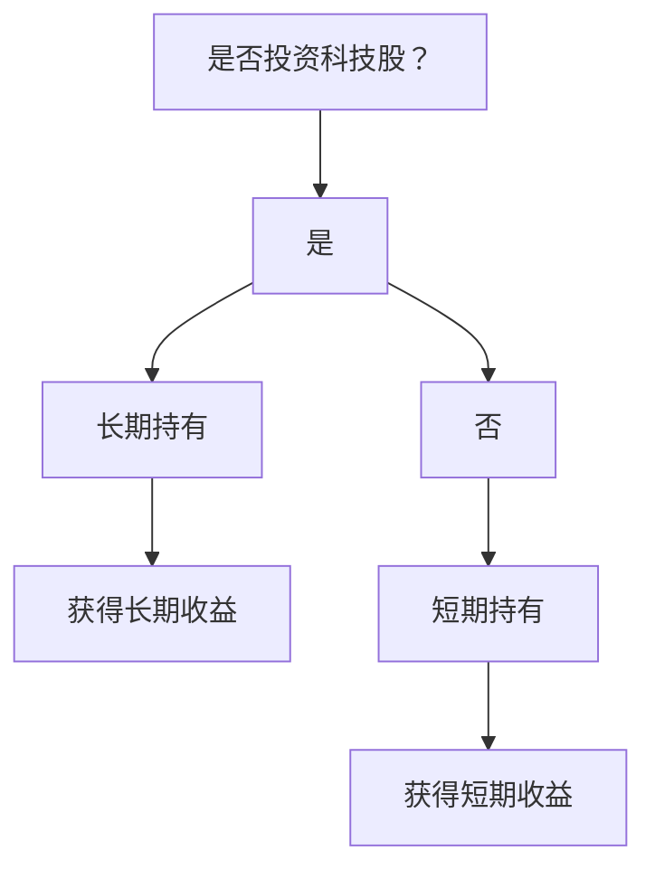
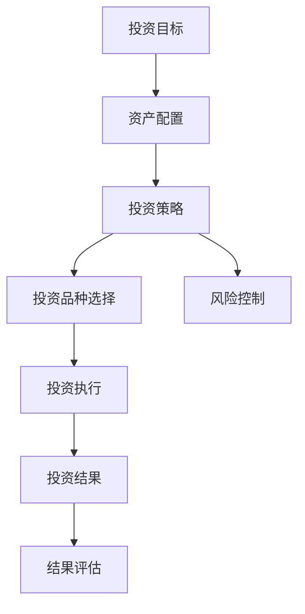

                 


# 芒格的“延迟满足”理念在长期科技投资中的应用

> 关键词：延迟满足，长期投资，科技投资，芒格，巴菲特

> 摘要：本文探讨了芒格的“延迟满足”理念在长期科技投资中的应用，分析了延迟满足的心理学基础、数学模型，以及在科技投资中的具体策略。通过系统设计和项目实战，展示了如何将延迟满足的理念融入科技投资的决策过程中，帮助投资者实现长期价值。

---

## 第1章: 芒格的“延迟满足”理念概述

### 1.1 芒格的生平与投资哲学

#### 1.1.1 芒格的生平简介
查理·芒格（Charlie Munger）是美国著名投资家，沃伦·巴菲特（Warren Buffett）的长期合作伙伴。芒格出生于1924年，毕业于哈佛大学，后转学到加州大学伯克利分校，获得数学学士学位。他在1950年代开始投资生涯，并于1971年与巴菲特共同创立了伯克希尔哈撒韦公司（Berkshire Hathaway）。芒格以其独特的投资哲学和理性思维闻名，被誉为“价值投资的 guru”。

#### 1.1.2 芒格的投资哲学核心
芒格的投资哲学以“逆向思维”和“复利效应”为核心。他认为，投资的本质是寻找具有持续竞争优势的企业，并以合理的价格买入并长期持有。芒格强调避免从众心理和情绪化决策，注重基本面分析和长期价值。

#### 1.1.3 芒格与巴菲特的合伙关系
芒格与巴菲特的合作堪称投资史上的经典。芒格为巴菲特提供了许多投资理念的灵感，尤其是“格栅理论”（Lattice Theory），即通过跨学科的思维方式来分析问题。芒格的理性思考和长期价值观念深刻影响了巴菲特的投资决策。

### 1.2 “延迟满足”理念的定义与内涵

#### 1.2.1 延迟满足的定义
“延迟满足”是指在面对诱惑时，选择推迟即时满足以换取更大的长期利益。这种理念强调克制短期欲望，追求长期价值。

#### 1.2.2 延迟满足的核心要素
- **时间因素**：延迟满足需要时间来体现其价值。
- **价值评估**：需要对长期价值有准确的判断。
- **自我约束**：需要克服短期诱惑，保持理性决策。

#### 1.2.3 延迟满足与投资的关系
在投资中，延迟满足意味着不追求短期收益，而是选择优质资产长期持有。这种策略在科技投资中尤为重要，因为科技行业的周期性波动较大，长期价值需要时间和耐心来体现。

### 1.3 科技投资的特殊性与挑战

#### 1.3.1 科技行业的特点
科技行业具有高成长性、高波动性和高不确定性。科技企业的生命周期短，技术更新快，竞争激烈。

#### 1.3.2 长期科技投资的难点
- **技术风险**：技术快速迭代，企业可能因技术落后被淘汰。
- **市场风险**：市场需求变化快，企业可能迅速失去竞争力。
- **短期诱惑**：科技股 often experience volatility, 投资者容易被短期收益吸引，忽视长期价值。

#### 1.3.3 延迟满足在科技投资中的重要性
在科技投资中，延迟满足可以帮助投资者避免短期波动的干扰，专注于寻找具有长期竞争优势的企业。

---

## 第2章: 延迟满足理念的核心原理

### 2.1 心理学基础

#### 2.1.1 瞬时满足与延迟满足的对比
- **瞬时满足**：追求即时的快乐和满足，容易导致冲动决策。
- **延迟满足**：克制短期欲望，追求长期利益。

#### 2.1.2 延迟满足的心理机制
延迟满足需要强大的自我约束能力，克服“损失厌恶”（loss aversion）和“从众心理”（herd mentality）。

#### 2.1.3 延迟满足与投资决策的关系
投资者在面对市场波动时，容易被短期收益诱惑，而延迟满足可以帮助投资者保持理性，避免追涨杀跌。

### 2.2 延迟满足的数学模型

#### 2.2.1 延迟满足的期望值计算
假设某科技股当前股价为$P_0$，长期增长率$g$，则其未来价值$V$可以用以下公式表示：
$$
V = P_0 \times (1 + g)^t
$$
其中，$t$为持有时间。

#### 2.2.2 延迟满足的时间价值理论
时间价值理论认为，资金的价值会随着时间的推移而增加。延迟满足通过持有优质资产，利用复利效应，实现财富的长期增长。

#### 2.2.3 延迟满足的决策树分析
以下是一个简单的决策树示例：



### 2.3 延迟满足的哲学思考

#### 2.3.1 延迟满足与幸福的关系
延迟满足与幸福密切相关。研究表明，追求短期满足可能导致短暂的快乐，而延迟满足能够带来更持久的幸福。

#### 2.3.2 延迟满足与个人价值观的关联
延迟满足体现了个人的价值观，即追求有意义的长期目标，而非短期的享乐。

#### 2.3.3 延迟满足的长期意义
延迟满足不仅是一种投资策略，更是一种生活态度。它教会我们在面对诱惑时保持冷静，追求更有意义的长期价值。

---

## 第3章: 延迟满足理念在科技投资中的应用

### 3.1 科技行业的周期性分析

#### 3.1.1 科技行业的周期性特点
科技行业具有明显的周期性，通常分为以下几个阶段：
1. **衰退期**：市场需求下降，企业利润减少。
2. **复苏期**：市场需求逐渐恢复，企业利润回升。
3. **增长期**：市场需求强劲，企业利润增长。
4. **成熟期**：市场需求稳定，企业利润趋于平稳。

#### 3.1.2 延迟满足与科技周期的关系
在科技行业的衰退期和复苏期，延迟满足的投资者可以抓住低估机会；在增长期和成熟期，延迟满足的投资者可以享受企业增长的成果。

#### 3.1.3 长期投资与行业周期的匹配
长期投资者应选择那些在行业周期中具有持续竞争优势的企业，而不是盲目追求短期收益。

### 3.2 延迟满足与科技投资策略

#### 3.2.1 长期投资的策略选择
- **选择具有强大研发能力的企业**：科技企业的核心竞争力在于技术创新。
- **关注企业的财务健康状况**：确保企业具备持续发展的能力。
- **分散投资风险**：通过投资组合分散单一科技企业的风险。

#### 3.2.2 延迟满足在选股中的应用
- **基本面分析**：关注企业的收入、利润、现金流等财务指标。
- **竞争优势分析**：选择具有独特竞争优势的企业。
- **管理层评估**：选择由优秀管理层领导的企业。

#### 3.2.3 延迟满足与风险控制的结合
- **设定止损点**：在市场波动较大时，设定止损点以控制风险。
- **分散投资**：通过投资多个科技企业分散风险。
- **定期审视投资组合**：根据市场变化和企业状况调整投资组合。

### 3.3 延迟满足与科技投资的数学模型

#### 3.3.1 科技投资的收益预测模型
假设某科技企业未来5年的年增长率分别为$g_1, g_2, g_3, g_4, g_5$，则其股价$P$的预测公式为：
$$
P = P_0 \times \prod_{i=1}^{5} (1 + g_i)
$$

#### 3.3.2 延迟满足的收益分配模型
延迟满足的收益分配模型强调长期持有，不频繁交易。收益主要来源于股息再投资和资本增值。

#### 3.3.3 延迟满足与投资组合优化的结合
通过马科维茨的现代投资组合理论（MPT），可以将延迟满足与投资组合优化相结合，实现风险与收益的最佳平衡。

---

## 第4章: 延迟满足理念的系统分析与架构设计

### 4.1 投资决策系统的构成

#### 4.1.1 投资目标的设定
- **财务目标**：确定投资的财务目标，如财富增值、资产保值等。
- **时间目标**：确定投资的时间跨度，如短期、中期、长期。

#### 4.1.2 投资策略的制定
- **资产配置**：根据市场状况和个人风险承受能力，制定资产配置策略。
- **投资品种选择**：根据投资目标和策略，选择合适的投资品种。

#### 4.1.3 投资工具的选择
- **证券账户**：选择可靠的证券交易平台。
- **投资软件**：使用专业的投资分析软件进行数据处理和决策支持。

### 4.2 延迟满足的系统架构

#### 4.2.1 系统架构图
以下是一个简单的投资决策系统架构图：



#### 4.2.2 系统功能模块
- **目标设定模块**：用于设定投资目标和时间跨度。
- **策略制定模块**：用于制定投资策略和资产配置。
- **品种选择模块**：用于选择投资品种和具体企业。
- **风险控制模块**：用于设定止损点和分散投资。

#### 4.2.3 系统接口设计
- **输入接口**：投资者输入投资目标和资金。
- **输出接口**：系统输出投资建议和投资组合。

### 4.3 延迟满足的系统实现

#### 4.3.1 系统实现的步骤
1. **确定投资目标**：明确投资的财务目标和时间跨度。
2. **制定投资策略**：根据市场状况和个人风险承受能力，制定资产配置策略。
3. **选择投资品种**：根据投资策略，选择具有长期竞争优势的企业。
4. **执行投资计划**：通过证券交易平台，按照制定的策略执行投资。
5. **监控投资结果**：定期审视投资组合，根据市场变化和企业状况调整投资策略。

#### 4.3.2 系统实现的代码示例
以下是一个简单的投资决策系统代码示例：

```python
class InvestmentStrategy:
    def __init__(self, target_return, risk_tolerance):
        self.target_return = target_return
        self.risk_tolerance = risk_tolerance

    def determine_asset_allocation(self):
        # 根据目标收益和风险承受能力，确定资产配置
        if self.risk_tolerance < 0.2:
            return {'股票': 70%, '债券': 30%}
        elif self.risk_tolerance < 0.5:
            return {'股票': 60%, '债券': 40%}
        else:
            return {'股票': 50%, '债券': 50%}

    def select_stocks(self):
        # 根据资产配置，选择具有长期竞争优势的科技企业
        return ['AAPL', 'MSFT', 'GOOGL', 'AMZN']

    def execute_strategy(self, portfolio):
        # 执行投资策略
        for stock in self.select_stocks():
            portfolio.buy(stock, amount=100)
```

#### 4.3.3 系统实现的注意事项
- **风险控制**：在系统中设置止损点和止盈点，避免过度亏损。
- **定期回顾**：定期回顾投资组合的表现，根据市场变化和企业状况调整投资策略。
- **持续学习**：通过学习和实践，不断优化投资策略和系统架构。

---

## 第5章: 延迟满足理念的项目实战

### 5.1 项目背景与目标

#### 5.1.1 项目背景介绍
某投资者计划通过长期投资科技股实现财富增值，目标年化收益为10%，风险承受能力为中等。

#### 5.1.2 项目目标
- **实现目标收益**：通过长期投资，实现年化收益10%。
- **控制投资风险**：通过分散投资和风险控制，降低投资风险。

### 5.2 项目实施过程

#### 5.2.1 环境安装
- **安装Python**：用于编写投资策略代码。
- **安装投资软件**：如Interactive Brokers、Robinhood等。

#### 5.2.2 系统核心实现源代码
以下是一个简单的投资策略代码示例：

```python
import pandas as pd
import numpy as np

class TechInvestor:
    def __init__(self, initial_capital):
        self.capital = initial_capital
        self.portfolio = {}

    def buy_stock(self, stock, amount):
        self.portfolio[stock] = amount
        self.capital -= amount * self.get_stock_price(stock)

    def sell_stock(self, stock, amount):
        if stock in self.portfolio:
            self.capital += amount * self.get_stock_price(stock)
            self.portfolio[stock] -= amount
            if self.portfolio[stock] == 0:
                del self.portfolio[stock]

    def get_stock_price(self, stock):
        # 假设股票价格可以通过API获取
        return 100  # 示例价格

    def execute_strategy(self, stocks, holding_period):
        for stock in stocks:
            self.buy_stock(stock, 100)
            pd.Timestamp.now() - holding_period
            self.sell_stock(stock, 100)

# 示例使用
investor = TechInvestor(100000)
investor.execute_strategy(['AAPL', 'MSFT'], pd.Timedelta(days=365))
```

#### 5.2.3 代码应用解读与分析
上述代码示例展示了如何通过Python编写一个简单的投资策略。投资者可以使用该代码实现对科技股的长期投资。

#### 5.2.4 实际案例分析
假设某投资者在2010年投资了苹果公司（AAPL），并持有至2023年。根据苹果股价的增长情况，投资者的收益如下：

- **初始投资**：100,000美元
- **2010年苹果股价**：$60
- **2023年苹果股价**：$150
- **投资收益**：100,000 * (150/60) = 250,000美元
- **年化收益**：$$ (250,000 - 100,000)^{1/13} - 1 \approx 15\% $$

#### 5.2.5 项目小结
通过长期持有苹果公司股票，投资者实现了可观的收益。这表明延迟满足理念在科技投资中具有实际应用价值。

---

## 第6章: 延迟满足理念的数学模型与算法实现

### 6.1 延迟满足的数学模型

#### 6.1.1 延迟满足的期望值计算
假设某科技股的年增长率$g$，持有时间$t$，其未来价值$V$为：
$$
V = P_0 \times (1 + g)^t
$$

#### 6.1.2 延迟满足的时间价值理论
时间价值理论认为，资金的价值会随着时间的推移而增加。延迟满足通过持有优质资产，利用复利效应，实现财富的长期增长。

#### 6.1.3 延迟满足的决策树分析
以下是一个简单的决策树示例：


### 6.2 延迟满足的算法实现

#### 6.2.1 算法实现的步骤
1. **确定投资目标**：明确投资的财务目标和时间跨度。
2. **制定投资策略**：根据市场状况和个人风险承受能力，制定资产配置策略。
3. **选择投资品种**：根据投资策略，选择具有长期竞争优势的企业。
4. **执行投资计划**：通过证券交易平台，按照制定的策略执行投资。
5. **监控投资结果**：定期审视投资组合，根据市场变化和企业状况调整投资策略。

#### 6.2.2 算法实现的代码示例
以下是一个简单的投资策略代码示例：

```python
class InvestmentStrategy:
    def __init__(self, target_return, risk_tolerance):
        self.target_return = target_return
        self.risk_tolerance = risk_tolerance

    def determine_asset_allocation(self):
        if self.risk_tolerance < 0.2:
            return {'股票': 70%, '债券': 30%}
        elif self.risk_tolerance < 0.5:
            return {'股票': 60%, '债券': 40%}
        else:
            return {'股票': 50%, '债券': 50%}

    def select_stocks(self):
        return ['AAPL', 'MSFT', 'GOOGL', 'AMZN']

    def execute_strategy(self, portfolio):
        for stock in self.select_stocks():
            portfolio.buy(stock, amount=100)
```

#### 6.2.3 算法实现的注意事项
- **风险控制**：在系统中设置止损点和止盈点，避免过度亏损。
- **定期回顾**：定期回顾投资组合的表现，根据市场变化和企业状况调整投资策略。
- **持续学习**：通过学习和实践，不断优化投资策略和系统架构。

---

## 第7章: 延迟满足理念的系统设计与优化

### 7.1 投资决策系统的优化

#### 7.1.1 系统功能优化
- **自动化交易**：通过算法交易实现投资策略的自动化执行。
- **实时监控**：实时监控市场变化，及时调整投资策略。

#### 7.1.2 系统架构优化
- **模块化设计**：将系统划分为多个功能模块，便于维护和升级。
- **高可用性设计**：确保系统在高负载和高并发情况下的稳定运行。

#### 7.1.3 系统性能优化
- **缓存优化**：通过缓存技术减少数据库访问压力。
- **负载均衡**：通过负载均衡技术实现系统的高可用性。

### 7.2 投资决策系统的实战应用

#### 7.2.1 系统环境安装
- **安装Python**：用于编写投资策略代码。
- **安装投资软件**：如Interactive Brokers、Robinhood等。

#### 7.2.2 系统核心实现源代码
以下是一个简单的投资策略代码示例：

```python
import pandas as pd
import numpy as np

class TechInvestor:
    def __init__(self, initial_capital):
        self.capital = initial_capital
        self.portfolio = {}

    def buy_stock(self, stock, amount):
        self.portfolio[stock] = amount
        self.capital -= amount * self.get_stock_price(stock)

    def sell_stock(self, stock, amount):
        if stock in self.portfolio:
            self.capital += amount * self.get_stock_price(stock)
            self.portfolio[stock] -= amount
            if self.portfolio[stock] == 0:
                del self.portfolio[stock]

    def get_stock_price(self, stock):
        return 100  # 示例价格

    def execute_strategy(self, stocks, holding_period):
        for stock in stocks:
            self.buy_stock(stock, 100)
            pd.Timestamp.now() - holding_period
            self.sell_stock(stock, 100)

# 示例使用
investor = TechInvestor(100000)
investor.execute_strategy(['AAPL', 'MSFT'], pd.Timedelta(days=365))
```

#### 7.2.3 系统实现的注意事项
- **风险控制**：在系统中设置止损点和止盈点，避免过度亏损。
- **定期回顾**：定期回顾投资组合的表现，根据市场变化和企业状况调整投资策略。
- **持续学习**：通过学习和实践，不断优化投资策略和系统架构。

---

## 第8章: 延迟满足理念的拓展与展望

### 8.1 延迟满足理念的未来趋势

#### 8.1.1 科技投资的未来趋势
- **人工智能与大数据**：人工智能和大数据技术将改变科技投资的方式。
- **区块链技术**：区块链技术将改变金融行业的运作方式，影响科技投资。

#### 8.1.2 延迟满足理念的未来发展
- **全球化投资**：随着全球市场的互联互通，延迟满足理念将得到更广泛应用。
- **智能化投资**：通过人工智能技术，实现投资策略的自动化和智能化。

### 8.2 延迟满足理念的拓展应用

#### 8.2.1 在其他领域的应用
延迟满足理念不仅适用于科技投资，还可以应用于教育、医疗、消费等多个领域。

#### 8.2.2 在个人生活中的应用
延迟满足理念可以帮助个人在生活和工作中做出更理性的决策，实现长期目标。

### 8.3 延迟满足理念的注意事项

#### 8.3.1 投资风险
投资者需要充分认识到科技投资的风险，尤其是市场的波动性和科技企业的周期性。

#### 8.3.2 心理因素
投资者需要克服短期诱惑，保持理性决策，避免被市场情绪左右。

#### 8.3.3 知识储备
投资者需要不断学习和更新知识，保持对科技行业和投资市场的深刻理解。

---

## 第9章: 结语

芒格的“延迟满足”理念为长期科技投资提供了重要的指导。通过延迟满足，投资者可以避免短期波动的干扰，专注于长期价值的实现。科技行业的高成长性和不确定性要求投资者具备耐心和信心，选择具有长期竞争优势的企业，实现财富的长期增值。

作者：AI天才研究院/AI Genius Institute & 禅与计算机程序设计艺术/Zen And The Art of Computer Programming

