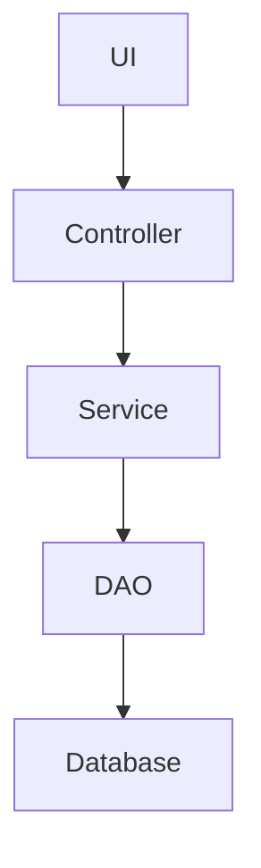
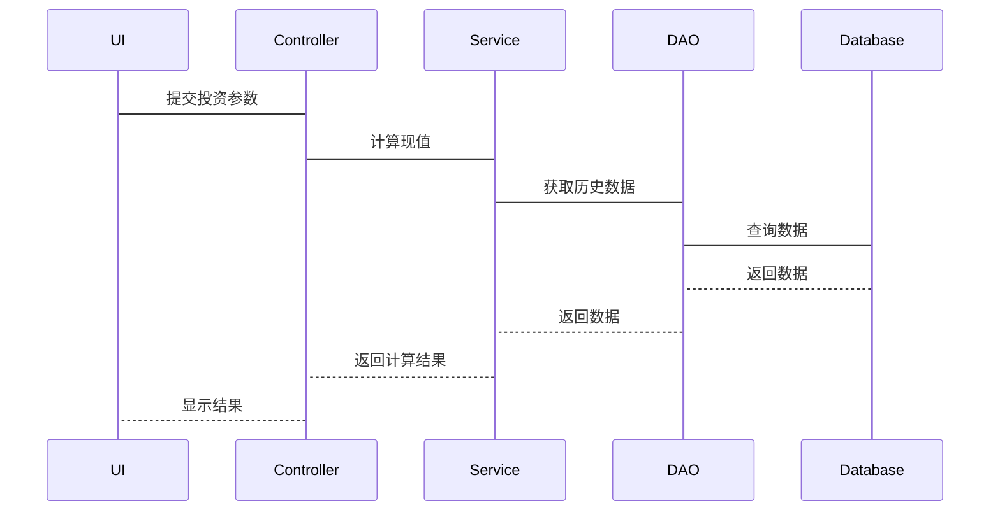

                 


# 芒格的"延迟满足"理念在长期科技投资组合中的应用

> 关键词：芒格，延迟满足，长期投资，科技投资，投资策略

> 摘要：本文深入探讨了芒格的“延迟满足”理念在长期科技投资组合中的应用，结合心理学、行为科学、数学模型和实际案例，详细分析了该理念的核心概念、算法实现、系统架构设计以及项目实战。通过本文，读者将全面理解如何在科技投资中应用“延迟满足”理念，构建稳健的长期投资组合。

---

# 第一部分: 芒格的"延迟满足"理念概述

## 第1章: 芒格的生平与投资理念

### 1.1 芒格的教育与职业背景

- **1.1.1 芒格的教育经历**
  - 1941年，芒格进入密歇根大学，主修法律。
  - 1947年，转学到加州大学洛杉矶分校（UCLA），获得法学学位。
  - 芒格的法学背景为他后来的投资理念奠定了基础，尤其是对“价值投资”的理解。

- **1.1.2 芒格的法律职业生涯**
  - 芒格毕业后成为一名律师，专注于公司法和税法。
  - 在法律职业生涯中，芒格培养了严谨的逻辑思维和分析能力。

- **1.1.3 芒格与巴菲特的相遇**
  - 1957年，芒格与巴菲特相遇，两人开始合作。
  - 芒格的“延迟满足”理念开始逐渐形成。

---

## 第1.2 芒格的投资哲学

### 1.2.1 芒格的价值投资理念

- 芒格的价值投资理念强调寻找具有持续竞争优势的企业。
- 他主张以合理的价格买入优秀的企业，而不是盲目追求市场的短期波动。

### 1.2.2 芒格的决策框架

- 芒格提出了“决策树”模型，用于分析投资决策的逻辑。
- 他强调在决策过程中要避免情绪化，注重事实和数据。

### 1.2.3 芒格的长期主义

- 芒格认为，投资的本质是寻找能够持续创造价值的企业。
- 他主张以长期视角看待投资，避免短期市场的波动干扰。

---

## 第1.3 "延迟满足"理念的定义

### 1.3.1 延迟满足的含义

- 延迟满足是指在投资决策中，优先考虑长期利益，而非短期收益。
- 这一理念强调在面对诱惑时，选择更优的未来结果，而非即时的满足。

### 1.3.2 延迟满足的特征

- **长期性**：关注企业的长期价值，而非短期收益。
- **纪律性**：在市场波动中保持冷静，避免冲动决策。
- **理性化**：以数据和事实为基础，而非情绪驱动。

### 1.3.3 延迟满足与其他投资理念的区别

| 理念 | 短期投资 | 价值投资 | 延迟满足 |
|------|----------|----------|----------|
| 核心 | 追逐短期收益 | 寻找低估资产 | 追求长期价值 |
| 方法 | 技术分析 | 财务分析 | 综合分析 |
| 风险 | 高波动性 | 中等波动性 | 低波动性 |

---

## 第1.4 科技投资的背景与趋势

### 1.4.1 科技行业的特点

- **高增长性**：科技行业具有较高的增长潜力。
- **高波动性**：科技行业的股价波动较大。
- **创新性**：科技行业以创新为核心驱动力。

### 1.4.2 科技投资的现状

- **科技股的高估值**：科技股往往以高市盈率 trading，反映了市场的高预期。
- **科技企业的高研发投入**：科技企业需要大量的研发投入，短期内可能难以盈利。
- **科技行业的周期性**：科技行业受市场周期影响较大。

### 1.4.3 科技投资的未来趋势

- **人工智能与大数据**：人工智能和大数据技术将推动科技行业的进一步发展。
- **绿色科技**：环保和可持续发展将成为科技投资的重要方向。
- **全球化的科技公司**：跨国科技公司将在全球市场中占据更重要的地位。

---

# 第二部分: 延迟满足理念的核心概念

## 第2章: 延迟满足的决策框架

### 2.1 延迟满足的决策模型

- **延迟满足模型**：通过数学模型分析投资的未来价值，评估延迟满足的可行性。
- **决策树分析**：利用决策树模型分析不同投资决策的可能结果。
- **贴现现金流模型**：通过贴现现金流模型评估企业的未来现金流，判断投资价值。

### 2.2 延迟满足的心理机制

- **心理学基础**：延迟满足与心理学中的“自我控制”密切相关。
- **行为科学视角**：行为科学揭示了人类在投资决策中的行为偏差。
- **延迟满足与自我控制**：延迟满足需要投资者具备强大的自我控制能力，避免短期诱惑。

---

## 2.3 延迟满足的数学模型

### 2.3.1 数学模型的构建

$$ V = \frac{C}{(1 + r)^n} $$

其中：
- \( V \) 表示投资的现值
- \( C \) 表示未来现金流
- \( r \) 表示贴现率
- \( n \) 表示时间跨度

### 2.3.2 模型的假设条件

- 投资者能够准确预测未来的现金流。
- 贴现率 \( r \) 是已知且稳定的。
- 投资的未来现金流是可预测的。

### 2.3.3 模型的验证与优化

- **验证**：通过历史数据验证模型的准确性。
- **优化**：根据实际情况调整贴现率和现金流预测。

---

## 第3章: 延迟满足与科技投资的结合

### 3.1 延迟满足在科技投资中的应用

- **案例分析**：以苹果公司为例，分析延迟满足理念如何应用于科技投资。
- **长期价值评估**：通过贴现现金流模型评估苹果公司的未来现金流。
- **投资策略**：制定基于延迟满足的科技投资策略。

### 3.2 科技投资的数学模型

$$ V = \sum_{t=1}^{n} \frac{C_t}{(1 + r)^t} $$

其中：
- \( C_t \) 表示第 \( t \) 年的现金流
- \( r \) 表示贴现率
- \( n \) 表示投资期限

---

## 第4章: 延迟满足理念的算法实现

### 4.1 算法原理

- **算法输入**：未来现金流 \( C_t \)，贴现率 \( r \)，投资期限 \( n \)。
- **算法输出**：投资的现值 \( V \)。

### 4.2 算法的Python实现

```python
def discounted_cash_flow(C, r, n):
    V = 0
    for t in range(1, n+1):
        V += C / (1 + r)**t
    return V

# 示例
C = 1000
r = 0.05
n = 10
print(discounted_cash_flow(C, r, n))
```

---

## 第5章: 系统分析与架构设计

### 5.1 问题场景介绍

- 投资者需要评估科技企业的长期价值。
- 投资者需要制定基于延迟满足的科技投资策略。

### 5.2 系统功能设计

- **用户输入**：输入未来现金流、贴现率和投资期限。
- **计算现值**：计算投资的现值。
- **结果输出**：输出投资的现值和投资建议。

### 5.3 系统架构设计



### 5.4 系统接口设计

- **API接口**：
  - 输入：现金流 \( C \)，贴现率 \( r \)，投资期限 \( n \)。
  - 输出：现值 \( V \)。

### 5.5 系统交互设计



---

## 第6章: 项目实战

### 6.1 环境安装

- **Python版本**：Python 3.8 或更高版本。
- **依赖库**：安装 `numpy` 和 `pandas`。

### 6.2 核心代码实现

```python
import numpy as np
import pandas as pd

def delayed_satisfaction_investment(C, r, n):
    df = pd.DataFrame({'Year': range(1, n+1), 'Cash Flow': [C] * n})
    df['Present Value'] = df['Cash Flow'] / (1 + r) ** df['Year']
    totalPV = df['Present Value'].sum()
    return totalPV

# 示例
C = 1000
r = 0.05
n = 10
print(delayed_satisfaction_investment(C, r, n))
```

---

## 第7章: 最佳实践与小结

### 7.1 最佳实践 tips

- **长期视角**：在科技投资中，始终以长期视角看待投资，避免短期波动的干扰。
- **数据驱动**：依赖数据和模型进行投资决策，而非情绪驱动。
- **持续学习**：保持对科技行业的关注，及时调整投资策略。

### 7.2 小结

- 通过本文的分析，读者可以全面理解芒格的“延迟满足”理念在科技投资中的应用。
- 通过数学模型和算法实现，读者可以掌握如何在实际投资中应用这一理念。

### 7.3 注意事项

- **市场风险**：科技行业具有较高的市场风险，投资者需谨慎评估。
- **模型假设**：模型的假设条件需要根据实际情况进行调整。
- **数据质量**：数据的准确性和完整性对投资决策至关重要。

### 7.4 拓展阅读

- 《Poor Charlie's Almanack》：芒格的经典著作，深入阐述了他的投资理念。
- 《The Intelligent Investor》：巴菲特的著作，进一步理解价值投资。

---

# 作者：AI天才研究院/AI Genius Institute & 禅与计算机程序设计艺术 /Zen And The Art of Computer Programming

