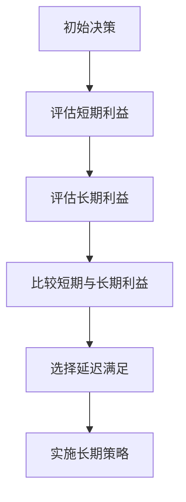
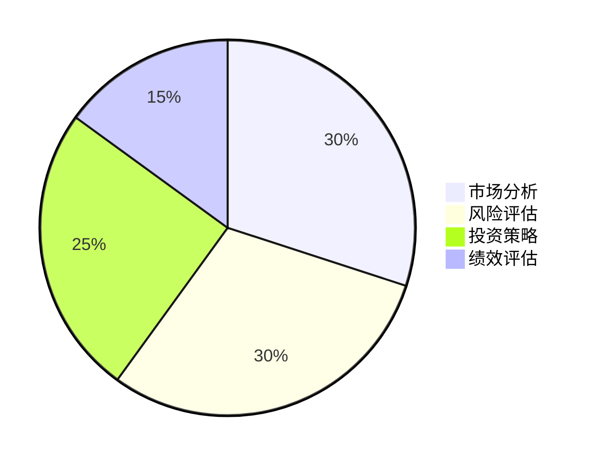

                 


# 芒格的"延迟满足"理念在风险投资中的应用

## 关键词：芒格，延迟满足，风险投资，价值投资，风险管理，长期思维

## 摘要：  
芒格的“延迟满足”理念强调在面对短期诱惑时，选择延迟满足以换取长期更大的回报。在风险投资中，这一理念通过价值投资、长期思维和风险管理，帮助投资者做出更理性的决策，避免短期波动的干扰，实现长期稳健的投资收益。本文将从理论到实践，详细探讨这一理念在风险投资中的应用，并结合算法和系统架构，提供可操作的指导。

---

## 第1章：引言

### 1.1 芒格的延迟满足理念概述

#### 1.1.1 芒格的生平与投资哲学  
查理·芒格是世界著名投资家巴菲特的合作伙伴，被誉为“投资界的哲学家”。他提出的“延迟满足”理念，强调在面对诱惑时，延迟满足当前欲望，以换取更大的长期利益。芒格的投资哲学注重长期价值，而非短期收益。

#### 1.1.2 延迟满足的定义与特征  
延迟满足是指在面对短期利益时，选择等待或放弃，以追求更大的长期利益。其核心特征包括：延迟性（时间上的延迟）、选择性（主动选择长期利益）和长期性（注重未来收益）。

#### 1.1.3 风险投资中的延迟满足  
风险投资通常伴随着高风险和高回报，投资者需要在不确定性中做出决策。延迟满足理念帮助投资者在高风险环境中保持理性，避免冲动决策，从而提高投资的成功率。

---

## 第2章：理论基础

### 2.1 延迟满足的心理学基础

#### 2.1.1 心理学中的延迟满足理论  
心理学研究表明，延迟满足与个体的自我控制能力密切相关。个体在面对诱惑时，选择延迟满足的能力与其未来的成功密切相关。

#### 2.1.2 投资中的心理偏差  
在投资中，常见的心理偏差包括贪婪和恐惧。延迟满足理念帮助投资者克服这些偏差，做出更理性的决策。

#### 2.1.3 延迟满足与自我控制的联系  
自我控制是延迟满足的核心，投资者需要通过自我控制来抵制短期诱惑，专注于长期目标。

### 2.2 延迟满足的经济学基础

#### 2.2.1 时间偏好理论  
经济学中的时间偏好理论指出，人们通常更偏好当前的收益，而非未来的收益。延迟满足理念与这一理论相反，强调未来收益的重要性。

#### 2.2.2 投资中的时间价值  
在投资中，时间价值是指资金在时间推移中的增长。延迟满足理念通过关注长期回报，充分利用了时间价值。

#### 2.2.3 延迟满足与风险投资的结合  
风险投资中的延迟满足意味着投资者需要接受短期不确定性，以换取长期的高回报。

---

## 第3章：延迟满足在风险投资中的核心概念

### 3.1 价值投资

#### 3.1.1 价值投资的定义  
价值投资是指寻找被市场低估的投资标的，长期持有，等待其价值回归。

#### 3.1.2 价值投资与延迟满足的关系  
价值投资强调长期持有，不被短期市场波动干扰，这与延迟满足理念高度契合。

#### 3.1.3 价值投资的实施步骤  
1. 寻找低估的投资标的。
2. 分析其内在价值。
3. 长期持有，等待价值回归。

### 3.2 长期思维

#### 3.2.1 长期思维的定义  
长期思维是指在投资决策中，关注长期目标，而非短期收益。

#### 3.2.2 长期思维的重要性  
在风险投资中，短期波动难以预测，而长期趋势更易于把握。长期思维帮助投资者在不确定性中保持稳定。

#### 3.2.3 长期思维的实践  
1. 设定长期投资目标。
2. 持续学习，更新投资策略。
3. 避免频繁交易，减少成本。

### 3.3 风险管理

#### 3.3.1 风险管理的定义  
风险管理是指在投资过程中，识别、评估和应对潜在风险，以降低损失。

#### 3.3.2 风险管理与延迟满足的关系  
延迟满足理念要求投资者在风险出现时，延迟采取行动，以便更好地评估和应对风险。

#### 3.3.3 风险管理的实施  
1. 建立风险评估机制。
2. 设定止损点。
3. 分散投资，降低风险。

---

## 第4章：延迟满足的算法与数学模型

### 4.1 延迟满足的决策流程

#### 4.1.1 决策流程图  
以下是一个基于延迟满足理念的决策流程图：



### 4.2 延迟满足的数学模型

#### 4.2.1 时间价值公式  
未来价值公式为：  
$$ FV = PV \times (1 + r)^t $$  
其中，PV为现值，r为利率，t为时间。

#### 4.2.2 投资回报模型  
投资回报模型：  
$$ ROI = \frac{FV - PV}{PV} $$  

#### 4.2.3 延迟满足的优化算法  
以下是一个优化算法的Python代码示例：

```python
def delayed_satisfaction_investment(start, rate, years):
    for year in range(years):
        start = start * (1 + rate)
    return start

# 示例
initial_investment = 10000
annual_rate = 0.07
investment_years = 5
final_value = delayed_satisfaction_investment(initial_investment, annual_rate, investment_years)
print(final_value)
```

---

## 第5章：延迟满足的系统架构

### 5.1 系统设计

#### 5.1.1 系统功能设计  
基于延迟满足理念的投资系统应包括：市场分析模块、风险评估模块、投资策略模块和绩效评估模块。

#### 5.1.2 系统架构图  
以下是一个系统架构图：



#### 5.1.3 系统接口设计  
系统接口包括：数据输入接口、策略执行接口和结果输出接口。

---

## 第6章：项目实战

### 6.1 环境安装

#### 6.1.1 系统环境  
需要安装Python、Jupyter Notebook和相关库（如pandas、numpy）。

### 6.2 核心代码实现

#### 6.2.1 投资策略代码  
```python
import pandas as pd
import numpy as np

def delayed_satisfaction_strategy(prices, initial_capital=10000):
    # 计算每日收益率
    returns = prices.pct_change()
    # 延迟满足策略：持有至目标价格
    positions = pd.Series(initial_capital / prices.iloc[0], index=prices.index)
    for i in range(1, len(prices)):
        if returns.iloc[i-1] > 0:
            positions.iloc[i] = positions.iloc[i-1] * (1 + returns.iloc[i-1])
    return positions

# 示例数据
prices = pd.DataFrame({
    'Price': [100, 110, 105, 120, 130]
})
# 应用策略
positions = delayed_satisfaction_strategy(prices)
print(positions)
```

### 6.3 案例分析

#### 6.3.1 投资案例  
假设某股票价格波动较大，通过延迟满足策略，投资者在价格低谷时买入，价格高点卖出，实现收益最大化。

---

## 第7章：总结与最佳实践

### 7.1 总结

#### 7.1.1 核心内容回顾  
芒格的延迟满足理念在风险投资中通过价值投资、长期思维和风险管理，帮助投资者实现长期收益。

#### 7.1.2 实践中的注意事项  
投资者需具备长期思维，避免短期波动干扰，同时加强风险管理，确保投资安全。

### 7.2 最佳实践

#### 7.2.1 投资策略建议  
1. 选择低估的投资标的。
2. 设定长期投资目标。
3. 分散投资，降低风险。

#### 7.2.2 学习与提升  
持续学习投资知识，更新投资策略，提升自身的投资能力。

---

## 作者：AI天才研究院 & 禅与计算机程序设计艺术

---

通过本文的详细阐述，芒格的延迟满足理念在风险投资中的应用已清晰展现。从理论到实践，从算法到系统架构，这一理念为投资者提供了坚实的理论基础和实践指导，帮助他们在风险投资中实现长期稳健的收益。

