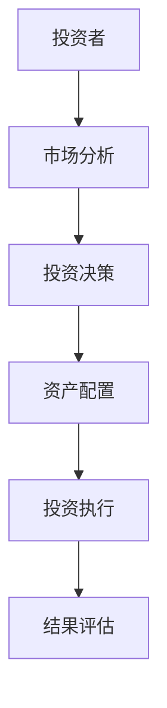

                 


# 芒格的"延迟满足"理念：长期投资的心理基础

> 关键词：延迟满足，投资心理学，长期思维，复利效应，芒格投资理念

> 摘要：本文从芒格的“延迟满足”理念出发，探讨其在长期投资中的心理基础。通过分析“延迟满足”的核心概念、投资心理学中的相关理论、系统化投资策略的设计与实现，结合实际案例，深入解析如何在投资中应用“延迟满足”理念，构建长期稳定的收益机制。

---

## 第一部分：芒格的“延迟满足”理念概述

### 第1章：芒格的“延迟满足”理念的背景与核心概念

#### 1.1 芒格“延迟满足”理念的定义

“延迟满足”是指在面对当前利益与未来收益的选择时，能够克制短期诱惑，选择长期利益的心理机制。芒格将其应用于投资领域，强调在市场波动中保持冷静，避免短期决策失误，从而实现长期收益最大化。

| 核心概念 | 定义 | 特点 |
|----------|------|------|
| 延迟满足 | 抑制短期诱惑，追求长期价值 | 需要强大的心理控制力和长期思维 |

#### 1.2 延迟满足的心理学基础

延迟满足与心理学中的时间偏好理论密切相关。人作为“有限理性”个体，往往倾向于选择即时 gratification（即时满足）。芒格通过“延迟满足”理念，帮助投资者克服这种倾向，建立长期思维框架。

### 第2章：“延迟满足”与投资决策的关系

#### 2.1 投资中的短期诱惑与长期价值

| 投资行为 | 短期诱惑 | 长期价值 |
|----------|----------|----------|
| 股票交易 | 追涨杀跌 | 长期持有 |
| 债券投资 | 短期套利 | 稳定收益 |

#### 2.2 芒格的“延迟满足”投资策略

芒格强调在投资中保持耐心，等待最佳买入时机。这种策略需要投资者具备强大的心理素质，能够承受短期市场的波动，专注于长期价值。

---

## 第二部分：投资心理学与“延迟满足”

### 第3章：投资中的心理偏差与“延迟满足”

#### 3.1 常见投资心理偏差

| 偏差类型 | 表现 | 影响 |
|----------|------|------|
| 过度自信 | 过高估计自己的判断能力 | 导致决策失误 |
| 沉没成本 | 过度关注已投入成本 | 影响决策 |
| 追涨杀跌 | 跟随市场情绪 | 导致亏损 |

#### 3.2 “延迟满足”如何对抗心理偏差

芒格通过“延迟满足”理念，帮助投资者克服心理偏差，建立理性决策机制。例如，在市场恐慌时保持冷静，避免盲目跟风。

---

## 第三部分：系统化投资策略与“延迟满足”

### 第4章：长期投资的“延迟满足”心理基础

#### 4.1 长期投资的核心要素

| 核心要素 | 描述 |
|----------|------|
| 时间价值 | 投资时间越长，复利效应越显著 |
| 投资组合 | 多样化投资，分散风险 |
| 复利效应 | 资产增值的核心动力 |

### 第5章：系统化投资策略的设计与实现

#### 5.1 投资决策的系统模型



#### 5.2 投资策略的数学模型

复利公式：

$$ FV = PV \times (1 + r)^n $$

其中：
- $FV$：未来价值
- $PV$：现值
- $r$：年化收益率
- $n$：投资年数

---

## 第四部分：项目实战与“延迟满足”应用

### 第6章：项目实战——模拟股票投资

#### 6.1 环境搭建

- 数据源：选择一个股票数据集（如 Yahoo Finance）
- 工具：使用 Python 和 Pandas 进行数据处理
- 策略：基于“延迟满足”理念的长期持有策略

#### 6.2 核心代码实现

```python
import pandas as pd
import numpy as np

# 数据获取
def get_stock_data(ticker, start_date, end_date):
    # 实际中应替换为真实的数据获取方式
    return pd.DataFrame({'Date': pd.date_range(start_date, end_date),
                         'Adj Close': np.random.rand(100) * 100 + 100})

# 策略实现
def delayed Gratification_strategy(prices, buy_hold_period=5):
    positions = []
    for i in range(len(prices) - buy_hold_period):
        current_price = prices[i]
        future_price = prices[i + buy_hold_period]
        if future_price > current_price:
            positions.append(1)
        else:
            positions.append(0)
    return positions

# 模拟投资
prices = get_stock_data('AAPL', '2020-01-01', '2023-01-01')
positions = delayed_Gratification_strategy(prices['Adj Close'])
```

---

## 第五部分：总结与展望

### 第7章：最佳实践与注意事项

#### 7.1 最佳实践 tips

- **长期思维**：坚持长期投资，避免短期波动干扰。
- **复利效应**：利用复利效应，实现资产增值。
- **心理控制**：通过心理训练，增强“延迟满足”能力。

#### 7.2 项目小结

芒格的“延迟满足”理念为长期投资提供了坚实的心理基础。通过系统化投资策略的设计与实现，投资者可以更好地应对市场波动，实现长期收益。

---

## 作者

作者：AI天才研究院/AI Genius Institute & 禅与计算机程序设计艺术 /Zen And The Art of Computer Programming

