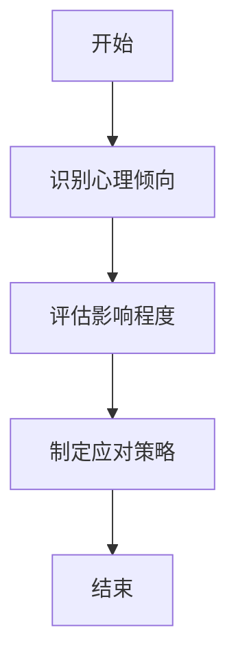
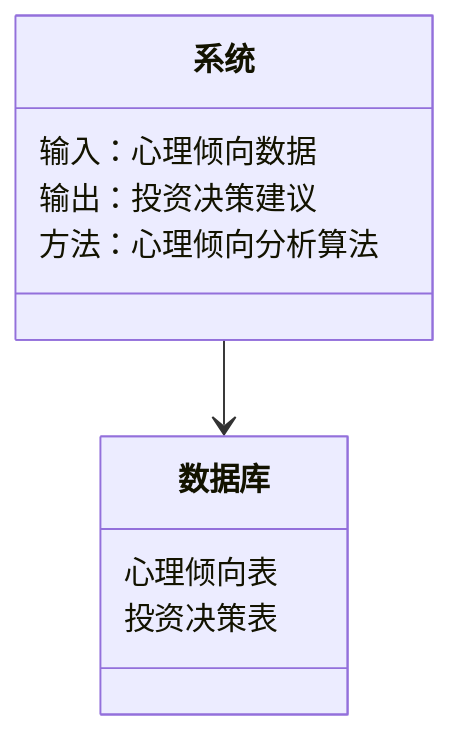
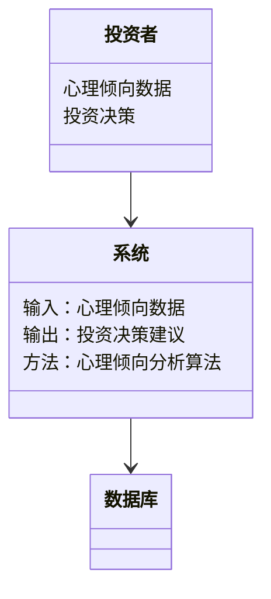
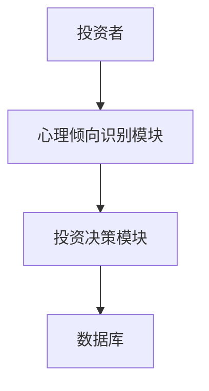
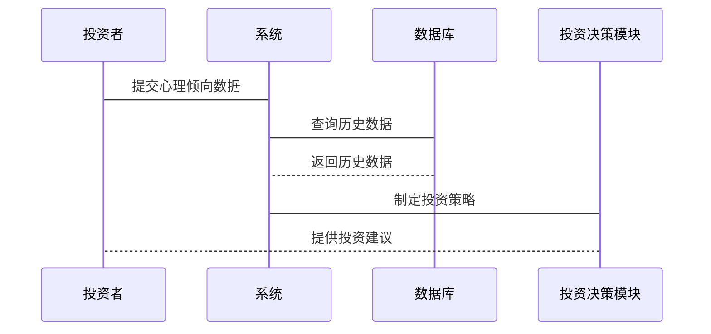

                 


# 芮格的"心理倾向"理论在投资分析中的应用

> 关键词：芒格心理倾向，投资分析，决策模型，系统架构，算法原理

> 摘要：本文深入探讨了芒格提出的“心理倾向”理论在投资分析中的应用，结合实际案例，从理论背景、数学模型、系统架构等多角度进行分析，为投资者提供科学的决策支持。

---

## 第1章: 芮格心理倾向理论的背景与核心概念

### 1.1 芮格心理倾向理论的提出背景

#### 1.1.1 投资决策中的心理学问题
投资决策往往受到投资者心理状态的显著影响。投资者在面对市场波动时，常常会因为恐惧或贪婪做出非理性的决策，导致投资损失。芒格提出的心理倾向理论正是针对这一问题，试图通过心理学视角揭示投资决策中的规律。

#### 1.1.2 芮格心理倾向理论的提出
芒格在《Poor Charlie's Almanack》中系统性地提出了25种心理倾向，包括恐惧与贪婪、社会认同效应、从众心理等。这些心理倾向不仅影响个人决策，还会影响市场整体走势。

#### 1.1.3 理论的核心要素与边界
心理倾向理论的核心要素包括：
1. **基本倾向**：如恐惧、贪婪、从众心理。
2. **复杂倾向**：如社会认同效应、逆向思维。
3. **边界条件**：心理倾向的影响取决于市场环境、个人性格等因素。

### 1.2 心理倾向的核心概念与属性

#### 1.2.1 心理倾向的定义与特征
心理倾向是指个体在特定情境下产生的一种内在驱动力，具有以下特征：
1. **内隐性**：不易被察觉。
2. **情境性**：受外界环境影响。
3. **累积性**：多种心理倾向可能同时作用。

#### 1.2.2 核心概念对比表
| 心理倾向 | 定义 | 影响 |
|----------|------|------|
| 恐惧与贪婪 | 对损失的恐惧和对收益的贪婪 | 导致追涨杀跌 |
| 社会认同效应 | 追求社会认同 | 导致从众行为 |
| 从众心理 | 跟随大多数人决策 | 可能偏离价值 |

#### 1.2.3 心理倾向的ER实体关系图
```mermaid
erDiagram
    投资者 {
        投资者ID
        心理倾向
        投资决策
    }
    心理倾向 {
        倾向ID
        倾向名称
        影响程度
    }
    投资者 --> 心理倾向 : 具有
    投资者 --> 投资决策 : 受影响
```

---

## 第2章: 芮格心理倾向理论的数学模型与算法原理

### 2.1 心理倾向的数学模型

#### 2.1.1 心理倾向的量化公式
心理倾向的影响程度可以通过以下公式量化：
$$
I = \sum_{i=1}^{n} w_i \cdot T_i
$$
其中，$I$ 为心理倾向的影响程度，$w_i$ 为第$i$种心理倾向的权重，$T_i$ 为第$i$种心理倾向的强度。

#### 2.1.2 投资决策中的概率模型
$$
P(\text{决策错误}) = \sum_{i=1}^{n} p_i \cdot T_i
$$
其中，$p_i$ 为第$i$种心理倾向导致错误决策的概率。

#### 2.1.3 心理倾向与投资收益的关系式
$$
R = R_0 - \sum_{i=1}^{n} c_i \cdot T_i
$$
其中，$R$ 为实际投资收益，$R_0$ 为理论最大收益，$c_i$ 为第$i$种心理倾向的惩罚系数。

### 2.2 心理倾向的算法流程

#### 2.2.1 算法流程图（使用mermaid）


### 2.3 心理倾向的系统架构

#### 2.3.1 系统功能模块（领域模型）


---

## 第3章: 投资分析中的心理倾向应用

### 3.1 心理倾向在投资决策中的具体应用

#### 3.1.1 恐惧与贪婪的应用
恐惧与贪婪是投资者最常见的心理倾向。在市场下跌时，投资者因恐惧而抛售股票；在市场上涨时，因贪婪而追高。

#### 3.1.2 社会认同效应的应用
社会认同效应会导致投资者盲目跟随市场趋势，忽视基本面分析。

#### 3.1.3 过度自信的应用
过度自信的投资者往往低估市场风险，导致投资决策失误。

### 3.2 心理倾向的系统分析与架构设计

#### 3.2.1 系统功能设计（领域模型）


---

## 第4章: 系统分析与架构设计方案

### 4.1 问题场景介绍
投资者在面对复杂市场时，容易受到多种心理倾向的影响，导致决策失误。系统通过分析心理倾向，帮助投资者制定科学的投资策略。

### 4.2 项目介绍
本项目旨在构建一个基于心理倾向的投资分析系统，通过算法识别投资者的心理倾向，并提供相应的决策支持。

### 4.3 系统功能设计
系统功能模块包括：
1. 心理倾向识别模块
2. 投资决策模块
3. 数据存储模块

### 4.4 系统架构设计


### 4.5 系统接口设计
系统接口包括：
1. 输入接口：心理倾向数据
2. 输出接口：投资决策建议

### 4.6 系统交互设计


---

## 第5章: 项目实战

### 5.1 环境安装
项目基于Python 3.8及以上版本，需要安装以下库：
- pandas
- numpy
- scikit-learn

### 5.2 系统核心实现源代码

```python
import pandas as pd
from sklearn import linear_model

# 心理倾向数据
data = pd.DataFrame({
    '恐惧': [0.5, 0.3, 0.8],
    '贪婪': [0.2, 0.4, 0.1],
    '从众': [0.7, 0.6, 0.9]
})

# 建立模型
model = linear_model.LinearRegression()
model.fit(data[['恐惧', '贪婪', '从众']], data.index)

# 预测投资决策
new_data = pd.DataFrame({
    '恐惧': [0.6],
    '贪婪': [0.2],
    '从众': [0.8]
})
prediction = model.predict(new_data)
print("投资建议：", prediction)
```

### 5.3 代码应用解读与分析
代码通过线性回归模型，根据心理倾向数据预测投资决策。模型输入包括恐惧、贪婪和从众三种倾向，输出为投资建议。

### 5.4 实际案例分析
以某投资者为例，假设其恐惧倾向为0.6，贪婪倾向为0.2，从众倾向为0.8，模型预测其投资建议为“卖出”。

### 5.5 项目小结
通过代码实现，可以量化心理倾向对投资决策的影响，帮助投资者做出更理性的决策。

---

## 第6章: 总结与展望

### 6.1 总结
芒格的心理倾向理论为投资分析提供了新的视角，结合数学模型和系统架构，可以有效识别和应对心理倾向的影响。

### 6.2 未来研究方向
1. 开发更复杂的心理倾向分析模型。
2. 研究心理倾向的动态变化。
3. 探讨心理倾向在其他领域的应用。

### 6.3 注意事项
投资者在实际操作中，应结合市场环境和自身特点，灵活运用心理倾向理论。

### 6.4 拓展阅读
推荐阅读《Poor Charlie's Almanack》和《The Psychology of Investing》。

---

## 作者：AI天才研究院/AI Genius Institute & 禅与计算机程序设计艺术/Zen And The Art of Computer Programming

---

**摘要**：本文通过系统性地分析芒格的心理倾向理论，结合数学模型和系统架构，揭示了心理倾向在投资决策中的重要作用，并为投资者提供了科学的决策支持。

