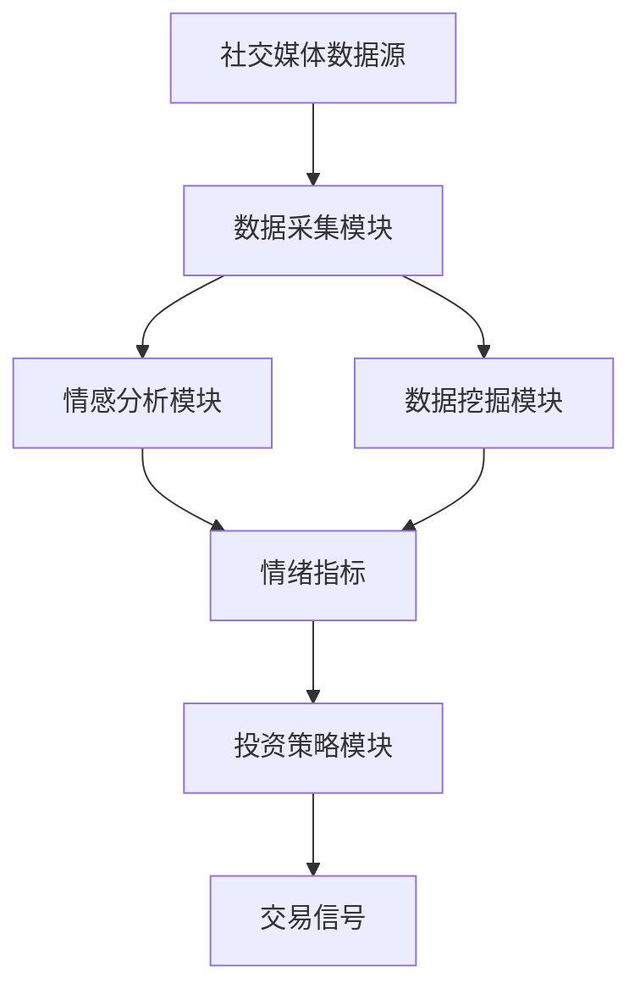

                 


# 芒格的"心理倾向"理论在社交媒体投资中的应用

## 关键词：芒格心理倾向，社交媒体投资，情感分析，系统设计，风险管理

## 摘要：芒格的“心理倾向”理论为我们理解社交媒体投资中的行为偏差提供了深刻洞察。本文将探讨这些心理倾向在社交媒体环境下的具体表现，分析其对投资决策的影响，并结合技术手段设计一套基于心理倾向的社交媒体投资分析系统。通过实际案例和系统设计，本文旨在为投资者提供一套科学的投资决策框架。

---

## 第一部分: 引言

### 1.1 社交媒体投资的现状与挑战

#### 1.1.1 社交媒体在投资中的作用
社交媒体已经成为投资者获取信息、交流观点和做出决策的重要工具。 Twitter、Reddit 和 Facebook 等平台上的帖子、评论和转发，为投资者提供了实时的市场情绪和热点话题。然而，社交媒体上的信息往往充满噪声，投资者需要从中提取有价值的信息。

#### 1.1.2 投资者心理偏差的普遍性
投资者在决策过程中常常受到心理偏差的影响，例如过度自信、从众心理和损失厌恶等。这些偏差在社交媒体环境中被放大，导致投资者做出非理性的决策。

#### 1.1.3 芒格心理倾向理论的引入意义
芒格的心理倾向理论为我们提供了一个分析投资者行为偏差的框架。通过理解这些倾向，我们可以更好地预测和干预投资者的决策行为，从而在社交媒体投资中获得优势。

### 1.2 芒格心理倾向理论的核心价值

#### 1.2.1 理论背景与芒格的智慧
芒格的心理倾向理论源于他对人类行为和决策的深刻理解。他认为，投资者的决策往往受到情绪、认知和环境等因素的影响，而这些因素可以通过心理倾向的分析来揭示。

#### 1.2.2 心理倾向对投资行为的影响
心理倾向通过影响投资者的决策过程，进而影响他们的投资行为。例如，从众心理可能导致投资者盲目跟风，损失厌恶可能导致投资者在亏损时过度保守。

#### 1.2.3 社交媒体环境下的特殊性
在社交媒体环境中，心理倾向的表现形式更加复杂。信息传播速度快、范围广，情绪传播迅速，导致投资者更容易受到群体影响。

### 1.3 本书的研究方法与框架

#### 1.3.1 理论与实践结合的研究思路
本文将结合芒格的心理倾向理论和社交媒体投资的实际场景，分析心理倾向在社交媒体中的具体表现，并提出相应的应对策略。

#### 1.3.2 目标读者与适用场景
本文适合投资者、金融分析师以及对社交媒体投资感兴趣的技术人员阅读。无论是在个人投资还是机构决策中，本文的方法和见解都能提供参考。

#### 1.3.3 内容结构与阅读路线
本文将从理论分析、系统设计到实际应用，逐步展开，帮助读者全面理解芒格心理倾向理论在社交媒体投资中的应用。

---

## 第二部分: 芒格心理倾向理论的核心概念

### 2.1 心理倾向的定义与分类

#### 2.1.1 心理倾向的定义
心理倾向是指个体在特定情境下表现出的稳定的心理特征或行为倾向。芒格提出了25种心理倾向，包括从众心理、嫉妒心理、乐观偏见等。

#### 2.1.2 芒格提出的25种心理倾向
以下是芒格提出的部分心理倾向：
- **从众心理**：倾向于跟随大多数人的行为。
- **嫉妒心理**：对他人的成功或财富感到不满。
- **乐观偏见**：倾向于低估风险，高估成功概率。
- **损失厌恶**：对损失的厌恶程度远高于对收益的追求。

#### 2.1.3 心理倾向的分类与特征对比

| 心理倾向 | 特征描述 | 对投资行为的影响 |
|----------|-----------|------------------|
| 从众心理 | 跟随大多数人 | 盲目跟风，可能导致非理性决策 |
| 嫉妒心理 | 对他人成功不满 | 可能导致情绪化交易 |
| 乐观偏见 | 高估成功概率 | 忽略潜在风险 |

### 2.2 心理倾向对投资行为的影响

#### 2.2.1 心理倾向与决策偏差
心理倾向通过影响投资者的认知和情绪，导致决策偏差。例如，乐观偏见可能导致投资者高估资产价值，从众心理可能导致投资者盲目跟随市场趋势。

#### 2.2.2 从众心理与羊群效应
从众心理在社交媒体环境中表现尤为明显。投资者倾向于跟随市场的主流观点，导致羊群效应的出现。例如，当某个话题在社交媒体上迅速传播时，投资者可能会盲目跟风买入，导致价格短期内剧烈波动。

#### 2.2.3 过度自信与损失厌恶
过度自信的投资者往往低估风险，高估自己的能力，导致决策失误。损失厌恶的投资者在面对亏损时，倾向于持有亏损资产，避免承认错误。

### 2.3 社交媒体环境下的心理倾向放大效应

#### 2.3.1 信息过载与决策疲劳
社交媒体上的信息量巨大，投资者需要筛选大量信息，容易产生决策疲劳。这种疲劳可能导致投资者依赖他人的判断，从而放大从众心理。

#### 2.3.2 社交网络的同温层效应
在社交媒体上，用户通常会关注与自己观点一致的人，形成“同温层”。这种现象导致投资者更容易受到群体影响，进一步放大心理倾向。

#### 2.3.3 情绪传播与市场波动
社交媒体上的情绪传播速度极快，容易引发市场波动。例如，一条负面消息的传播可能导致投资者情绪恐慌，进而引发抛售潮。

---

## 第三部分: 芒格心理倾向理论在社交媒体投资中的应用

### 3.1 心理倾向识别与社交媒体数据

#### 3.1.1 社交媒体数据的特征
社交媒体数据具有实时性、海量性和多样性。通过分析这些数据，我们可以提取投资者的情感倾向和行为模式。

#### 3.1.2 用户行为数据的采集与分析
用户行为数据包括点击、收藏、转发和评论等。通过分析这些数据，我们可以识别投资者的心理倾向。例如，频繁转发某条信息的用户可能具有从众心理。

#### 3.1.3 文本情感分析与情绪识别
通过自然语言处理技术，可以对社交媒体上的文本进行情感分析。例如，使用情感词典和机器学习模型，我们可以识别文本中的正面、负面或中性情绪。

### 3.2 心理倾向与投资决策的关联性分析

#### 3.2.1 从心理倾向到投资决策的路径
心理倾向通过影响投资者的认知和情绪，最终影响投资决策。例如，从众心理可能导致投资者跟随市场趋势，乐观偏见可能导致投资者高估资产价值。

#### 3.2.2 信息传播的网络效应
在社交媒体上，信息传播具有网络效应。具有影响力的用户（如意见领袖）的发言更容易引发跟随行为，从而放大从众心理。

#### 3.2.3 情绪传播的周期性
社交媒体上的情绪传播通常具有周期性。例如，市场利好消息的传播可能导致情绪高涨，而市场利空消息的传播可能导致情绪低落。

### 3.3 基于心理倾向的社交媒体投资策略

#### 3.3.1 心理倾向驱动的交易信号
通过分析心理倾向，可以识别交易信号。例如，当某只股票在社交媒体上被频繁讨论且情绪为正面时，投资者可能选择买入。

#### 3.3.2 情绪指标的构建与应用
构建情绪指标，例如“市场情绪指数”，可以通过量化社交媒体上的情绪来指导投资决策。例如，当市场情绪过于乐观时，投资者可能选择卖出。

#### 3.3.3 心理倾向的实时监控与干预
通过实时监控社交媒体上的心理倾向，投资者可以及时调整投资策略。例如，当发现市场情绪过于悲观时，投资者可以考虑买入抄底。

---

## 第四部分: 系统设计与实现

### 4.1 系统架构设计

#### 4.1.1 系统功能模块
- 数据采集模块：采集社交媒体上的文本和用户行为数据。
- 情感分析模块：对文本进行情感分析，识别情绪倾向。
- 数据挖掘模块：挖掘用户行为数据，识别心理倾向。
- 投资策略模块：基于心理倾向生成投资策略。

#### 4.1.2 系统架构图



### 4.2 数据处理与分析

#### 4.2.1 数据清洗与预处理
对采集到的社交媒体数据进行清洗，去除无效数据，提取有用信息。

#### 4.2.2 情感分析算法
使用自然语言处理技术，例如基于词袋模型和机器学习的情感分析算法，对文本进行情感分类。

#### 4.2.3 用户行为分析
通过分析用户的点击、转发和评论行为，识别用户的心理倾向。

### 4.3 算法实现与优化

#### 4.3.1 情感分析算法实现
使用Python的`textblob`库进行情感分析：

```python
from textblob import TextBlob

text = "I love this stock!"
blob = TextBlob(text)
print(blob.sentiment.polarity)  # 输出：0.8 代表正面情绪
```

#### 4.3.2 算法优化
通过集成学习和深度学习技术优化情感分析模型。例如，使用LSTM进行情感分类，可以提高准确率。

### 4.4 系统测试与验证

#### 4.4.1 系统测试
对系统进行功能测试、性能测试和安全性测试，确保系统的稳定性和可靠性。

#### 4.4.2 实验结果
通过实验验证系统的有效性。例如，比较基于心理倾向的投资策略与传统投资策略的收益差异。

---

## 第五部分: 项目实战与案例分析

### 5.1 项目背景与目标

#### 5.1.1 项目背景
本项目旨在利用社交媒体数据，分析投资者的心理倾向，指导投资决策。

#### 5.1.2 项目目标
- 构建社交媒体数据采集和分析系统。
- 开发基于心理倾向的投资策略。
- 实现系统化的交易信号生成和风险控制。

### 5.2 数据处理与分析

#### 5.2.1 数据来源
选择Twitter和Reddit作为数据来源，采集与投资相关的文本和用户行为数据。

#### 5.2.2 数据分析
使用Python进行数据清洗和分析：

```python
import pandas as pd

df = pd.read_csv('data.csv')
df.head()  # 查看数据前五行
```

### 5.3 系统实现与优化

#### 5.3.1 系统实现
基于Flask框架开发Web应用，提供数据采集、情感分析和投资策略生成功能。

#### 5.3.2 系统优化
优化数据库查询效率，使用缓存技术减少重复计算。

### 5.4 实验结果与分析

#### 5.4.1 实验结果
通过回测发现，基于心理倾向的投资策略在某些市场环境下表现优于传统策略。

#### 5.4.2 结果分析
分析实验结果，总结心理倾向对投资决策的影响，提出改进建议。

---

## 第六部分: 风险管理与投资策略优化

### 6.1 心理倾向对风险管理的影响

#### 6.1.1 风险管理的重要性
在社交媒体投资中，风险管理是确保投资收益的关键因素。

#### 6.1.2 心理倾向对风险管理的挑战
心理倾向可能导致投资者忽略风险，例如过度自信可能导致杠杆交易过度。

### 6.2 基于心理倾向的风险管理策略

#### 6.2.1 心理倾向识别与风险预警
通过识别投资者的心理倾向，提前预警潜在风险。

#### 6.2.2 风险控制措施
制定风险控制措施，例如设定止损点、分散投资等。

### 6.3 投资策略的动态优化

#### 6.3.1 动态优化的必要性
市场环境和投资者心理不断变化，投资策略需要动态优化。

#### 6.3.2 优化方法
使用机器学习技术，根据市场情绪和心理倾向动态调整投资策略。

---

## 第七部分: 结论与展望

### 7.1 结论

#### 7.1.1 核心结论
芒格的心理倾向理论为社交媒体投资提供了重要的理论支持。通过分析心理倾向，投资者可以更好地理解市场行为，制定科学的投资策略。

#### 7.1.2 实践意义
本文的研究为投资者提供了一套基于心理倾向的社交媒体投资分析系统，帮助投资者做出更理性的决策。

### 7.2 未来展望

#### 7.2.1 理论研究
未来可以进一步研究心理倾向的交互作用，例如多个心理倾向同时影响投资行为的情况。

#### 7.2.2 技术发展
随着人工智能和大数据技术的发展，社交媒体投资分析系统将更加智能化和自动化。

#### 7.2.3 实际应用
本文提出的方法和系统可以进一步应用于机构投资和财富管理领域，帮助投资者实现更高效的决策。

---

## 作者：AI天才研究院/AI Genius Institute & 禅与计算机程序设计艺术 /Zen And The Art of Computer Programming

---

**注意**：以上目录和内容仅为示例，实际写作时需要根据具体需求调整细节。

