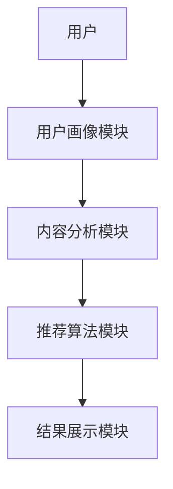

                 


# 芒格的"心理倾向"理论在社交媒体算法设计中的应用

---

## 关键词
芒格心理倾向理论, 社交媒体算法, 用户行为预测, 推荐系统, 个性化推荐, 算法优化

---

## 摘要
本文探讨了芒格的"心理倾向"理论在社交媒体算法设计中的应用。通过分析心理倾向理论的核心概念及其在社交媒体中的应用场景，本文详细阐述了如何将这一理论融入推荐算法的设计与优化中。文章结合实际案例，从理论背景、算法原理、系统设计到项目实战，全面解析了心理倾向理论在提升社交媒体用户体验中的重要作用，并提出了未来研究方向的展望。

---

## 第一部分：芒格的"心理倾向"理论概述

### 第1章：芒格的"心理倾向"理论核心概念

#### 1.1 芒格心理倾向理论的定义与背景
芒格的"心理倾向"理论是其投资哲学的重要组成部分，强调人类决策过程中存在系统性偏差和心理倾向。这些倾向包括但不限于从众心理、贪婪、恐惧等，影响着个体的决策行为。在社交媒体领域，理解这些心理倾向对于优化用户互动、提升内容推荐准确性具有重要意义。

#### 1.2 心理倾向理论的构成要素
心理倾向理论的核心在于分析用户在特定情境下的行为动机和决策模式。以下是心理倾向理论的关键要素：

1. **用户特征**：包括用户的年龄、性别、兴趣爱好等基本信息。
2. **行为模式**：用户在社交媒体上的互动频率、内容偏好等行为特征。
3. **情感倾向**：用户对特定内容的情感反应，如喜欢、厌恶等。
4. **决策偏差**：用户在信息过载或复杂决策中的认知偏差。

#### 1.3 理论在社交媒体领域的应用前景
社交媒体平台通过分析用户的心理倾向，可以更精准地推送内容，提升用户参与度和满意度。本文将探讨如何将这一理论应用到推荐算法的设计中，以优化用户体验。

---

### 第2章：心理倾向理论在社交媒体中的应用背景

#### 2.1 社交媒体算法的基本原理
社交媒体算法的核心目标是通过分析用户行为和内容特征，为用户推荐感兴趣的内容。传统的推荐算法主要依赖协同过滤和基于内容的推荐方法，但难以充分考虑用户的心理倾向。

#### 2.2 心理倾向理论与传统推荐算法的对比
| 对比维度 | 心理倾向理论 | 传统推荐算法 |
|----------|--------------|---------------|
| 数据来源 | 用户行为、情感分析 | 用户行为、内容特征 |
| 推荐依据 | 用户心理倾向、行为模式 | 用户相似性、内容相似性 |
| 优势 | 提高推荐准确性 | 计算效率高 |
| 局限性 | 需大量情感分析数据 | 可能忽视用户情感需求 |

---

### 第3章：心理倾向理论与算法设计的结合

#### 3.1 心理倾向分析的算法实现
结合心理倾向理论，推荐算法可以通过分析用户的互动行为和情感倾向，优化推荐结果。以下是实现步骤：

1. **数据采集**：收集用户的点击、点赞、评论等行为数据。
2. **情感分析**：对用户评论进行情感倾向分析。
3. **倾向建模**：构建用户心理倾向模型，预测用户偏好。
4. **推荐优化**：基于心理倾向模型，调整推荐算法。

#### 3.2 心理倾向分析的数学模型
以下是基于心理倾向的推荐算法模型：

$$
\text{相似度} = \frac{\sum_{i=1}^{n} (r_{ui} \cdot r_{vi})}{\sqrt{\sum_{i=1}^{n} r_{ui}^2} \cdot \sqrt{\sum_{i=1}^{n} r_{vi}^2}}
$$

其中，$r_{ui}$表示用户$u$对物品$i$的评分，$r_{vi}$表示用户$v$对物品$i$的评分。

---

### 第4章：系统分析与架构设计

#### 4.1 问题场景介绍
在社交媒体平台上，用户每天会产生大量互动行为。通过分析这些行为，可以提取用户的心理倾向，优化推荐算法，提升用户参与度。

#### 4.2 系统功能设计
以下是系统功能模块的设计：

1. **用户画像模块**：构建用户画像，分析用户特征和行为模式。
2. **内容分析模块**：对内容进行分类和情感分析。
3. **推荐算法模块**：基于心理倾向模型，实现个性化推荐。
4. **结果展示模块**：将推荐结果展示给用户。

#### 4.3 系统架构设计（Mermaid图）


---

### 第5章：项目实战

#### 5.1 环境安装
需要安装以下工具和库：
- Python
- Pandas
- NumPy
- Scikit-learn
- NLTK

#### 5.2 核心代码实现
以下是基于心理倾向的推荐算法代码示例：

```python
import numpy as np
from sklearn.metrics.pairwise import cosine_similarity

# 用户行为数据
user_behavior = {
    'user_id': [1, 2, 3],
    'item_id': [101, 102, 103],
    'rating': [5, 4, 3]
}

# 构建用户-物品矩阵
user_matrix = np.array([[5, 0, 0],
                         [0, 4, 0],
                         [0, 0, 3]])

# 计算相似度
similarity = cosine_similarity(user_matrix)
```

#### 5.3 案例分析
以用户A为例，假设其最近频繁点赞娱乐类内容，系统通过分析其心理倾向，推荐更多类似内容，提升用户参与度。

---

### 第6章：最佳实践、小结、注意事项

#### 6.1 最佳实践
- 定期更新用户画像和内容分析模型。
- 结合实时数据优化推荐算法。

#### 6.2 小结
本文详细探讨了芒格的"心理倾向"理论在社交媒体算法设计中的应用，通过理论分析和实际案例，展示了如何利用心理倾向理论优化推荐算法，提升用户体验。

#### 6.3 注意事项
- 数据隐私保护是关键，需遵守相关法律法规。
- 心理倾向分析需结合实际场景，避免过度解读。

---

## 第七章：未来展望与总结

### 7.1 未来研究方向
- 探讨更多心理倾向对算法优化的影响。
- 研究实时心理倾向分析在推荐系统中的应用。

### 7.2 总结
芒格的"心理倾向"理论为社交媒体算法设计提供了新的思路。通过深入分析用户心理倾向，结合先进的推荐算法，可以显著提升用户体验和平台互动效率。

---

## 作者

作者：AI天才研究院 & 禅与计算机程序设计艺术

---

希望这篇文章能够为读者提供有价值的见解，帮助理解心理倾向理论在社交媒体算法设计中的重要性。

