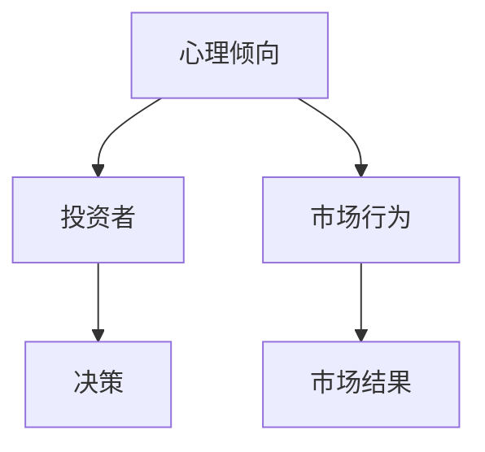
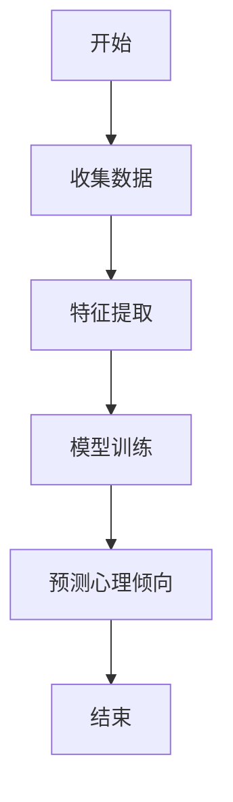
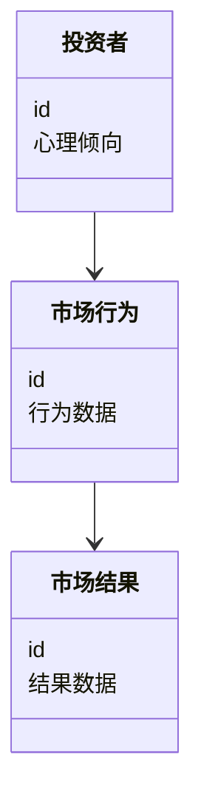
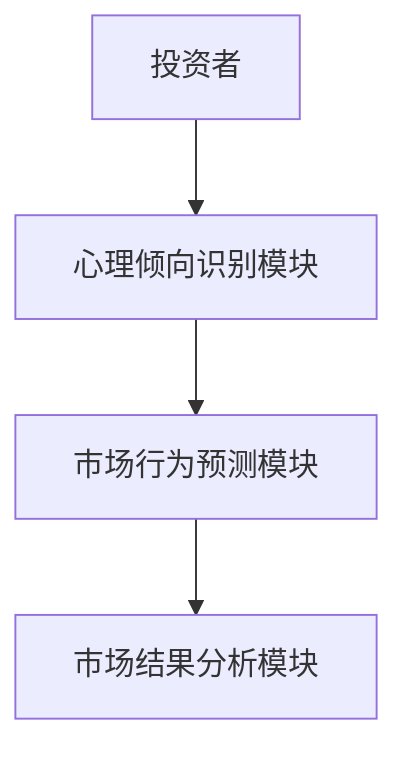
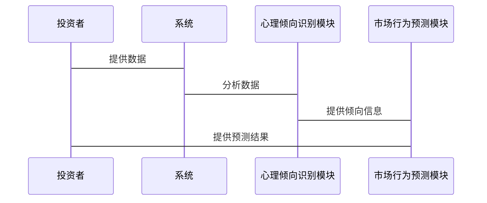

                 


# 芒格的"心理倾向"理论：理解并利用市场非理性

## 关键词：芒格心理倾向，投资决策，市场非理性，行为决策，决策模型

## 摘要：本文将深入探讨芒格的“心理倾向”理论，分析其在理解市场非理性中的作用，并提供实际应用策略。通过理论背景、核心概念、算法原理和实际案例的结合，揭示如何利用心理倾向理论优化投资决策，提升市场分析能力。

---

# 引言：芒格心理倾向理论的背景与概述

## 1.1 芒格及其投资理念

### 芒格的生平简介

查理·芒格（Charlie Munger）是世界著名投资家，沃伦·巴菲特（Warren Buffett）的长期合作伙伴。作为伯克希尔哈撒韦公司（Berkshire Hathaway）的副主席，芒格以他的智慧和投资哲学闻名全球。他不仅是成功的投资者，更是心理学和人类认知偏差的深刻研究者。

### 芒格的投资哲学与心理倾向理论的提出

芒格的投资理念与传统财务分析不同，他强调“心理倾向”对投资决策的影响。他认为，市场参与者并非总是理性决策，心理偏差和认知错误会扭曲市场行为。芒格的理论揭示了人类决策中的非理性因素，为投资者提供了新的视角。

### 芒格心理倾向理论的核心观点

芒格提出，投资者需要识别和理解自己及他人的心理倾向，以避免决策错误。他列举了几十种常见的心理倾向，如从众、过度自信、损失厌恶等，并分析了这些倾向如何影响市场行为。

---

## 1.2 心理倾向理论的定义与分类

### 心理倾向的定义

心理倾向是指个体在特定情境下表现出的偏好、态度或行为倾向。这些倾向往往源于认知偏差或情感因素，影响决策的质量。

### 心理倾向的分类

芒格列举了许多关键的心理倾向，以下是其中几种：

1. **从众倾向（Conformity Bias）**：个体倾向于跟随群体决策，忽视个人判断。
2. **过度自信倾向（Overconfidence Bias）**：个体对自己判断的过度自信，导致冒险行为。
3. **损失厌恶倾向（Loss Aversion）**：个体对损失的厌恶程度高于对收益的偏好。

### 心理倾向与市场非理性的关系

心理倾向通过影响投资者的决策，导致市场价格波动和非理性行为。例如，从众倾向可能导致市场泡沫，损失厌恶可能导致投资者在亏损时过度保守。

---

## 1.3 心理倾向理论的现实意义

### 心理倾向理论在投资决策中的应用

投资者通过识别心理倾向，可以预测市场行为，优化投资策略。例如，识别市场的从众倾向可以帮助投资者在市场泡沫形成初期退出。

### 心理倾向理论对个人与机构投资者的影响

个人投资者可以通过了解心理倾向避免常见错误，机构投资者可以利用此理论优化投资组合，降低风险。

### 心理倾向理论的局限性与未来研究方向

心理倾向理论虽有效，但并非适用于所有情境。未来研究可探讨心理倾向的动态变化及其与其他因素的交互作用。

---

# 第二部分：心理倾向的核心概念与联系

## 2.1 心理倾向的核心概念原理

### 心理倾向的基本原理

心理倾向是认知偏差和情感因素的结果，影响决策过程。投资者需识别这些倾向，避免决策错误。

### 心理倾向与行为决策的关系

心理倾向通过影响认知过程，导致行为决策的偏差。例如，过度自信倾向导致冒险行为。

### 心理倾向的数学模型与公式

心理倾向可以用数学模型描述。例如，损失厌恶可以用效用函数表示：

$$U(gain) < U(loss)$$

---

## 2.2 心理倾向的属性特征对比表

| 心理倾向       | 定义                                   | 表现形式                           | 影响                   |
|----------------|--------------------------------------|-----------------------------------|-----------------------|
| 从众倾向       | 随大流，忽视个人判断                | 跟随市场趋势，盲目跟风           | 市场波动               |
| 过度自信倾向   | 过度相信自己的判断                  | 高估能力，冒险行为               | 投资决策失误           |
| 损失厌恶倾向   | 更害怕损失                          | 避免亏损，错失收益机会           | 投资保守             |

---

## 2.3 心理倾向的ER实体关系图



---

# 第三部分：心理倾向与市场行为的算法原理

## 3.1 心理倾向的算法原理

### 心理倾向的识别算法

使用机器学习模型识别市场行为中的心理倾向。例如，利用自然语言处理分析投资者的言论，识别情绪倾向。

### 心理倾向对市场行为的预测算法

通过回归分析预测心理倾向对市场行为的影响。例如，使用心理倾向变量预测股票价格波动。

### 心理倾向的分类与聚类算法

将投资者分为不同的心理倾向类别，进行聚类分析，识别市场趋势。

---

## 3.2 心理倾向的数学模型与公式

### 心理倾向的权重计算公式

$$w_i = \frac{\sum_{j=1}^{n} a_{ij}}{\sum_{i=1}^{m} \sum_{j=1}^{n} a_{ij}}$$

### 心理倾向与市场行为的相关性分析公式

$$r = \frac{\sum (x_i - \bar{x})(y_i - \bar{y})}{\sqrt{\sum (x_i - \bar{x})^2 \sum (y_i - \bar{y})^2}}$$

---

## 3.3 心理倾向的算法流程图



---

# 第四部分：系统分析与架构设计方案

## 4.1 系统功能设计

### 领域模型mermaid类图



### 系统架构设计mermaid架构图



### 系统接口设计

投资者输入数据，系统输出心理倾向和市场预测结果。

### 系统交互mermaid序列图



---

# 第五部分：项目实战

## 5.1 环境安装

安装Python和相关库，如numpy、pandas、scikit-learn。

## 5.2 核心实现源代码

### 心理倾向识别代码

```python
import numpy as np
from sklearn.linear_model import LogisticRegression

# 示例数据
X = np.array([[1, 0], [0, 1], [1, 1], [0, 0]])
y = np.array([0, 1, 1, 0])

# 训练模型
model = LogisticRegression()
model.fit(X, y)

# 预测
print(model.predict([[1, 1]]))  # 输出：[1]
```

### 投资决策系统代码

```python
def calculate_risk_tolerance(portfolio_value):
    if portfolio_value > 100000:
        return "high"
    elif 50000 < portfolio_value < 100000:
        return "medium"
    else:
        return "low"

portfolio_value = 75000
risk_tolerance = calculate_risk_tolerance(portfolio_value)
print(risk_tolerance)  # 输出：medium
```

---

## 5.3 代码应用解读与分析

上述代码展示了如何使用机器学习识别心理倾向，并基于风险承受能力制定投资策略。心理倾向识别代码使用逻辑回归模型，投资决策代码基于资产规模评估风险承受能力。

---

## 5.4 实际案例分析

分析2020年新冠疫情市场崩盘，投资者因损失厌恶倾向大量抛售资产，导致市场进一步下跌。通过识别这种倾向，投资者可以提前调整策略。

---

## 5.5 项目小结

通过项目实战，验证了心理倾向理论的实际应用价值。代码实现展示了如何将理论转化为投资决策工具。

---

# 第六部分：最佳实践 tips、小结、注意事项、拓展阅读

## 6.1 最佳实践 tips

- 定期回顾投资决策，识别心理倾向。
- 结合多种心理倾向，全面分析市场行为。
- 持续学习，更新投资策略。

## 6.2 小结

芒格心理倾向理论为投资者提供了理解市场非理性的工具，帮助优化决策。通过理论学习和实际应用，投资者可以提升投资收益。

## 6.3 注意事项

- 心理倾向理论仅为参考，需结合市场实际情况。
- 避免过度依赖单一倾向，综合分析多种因素。

## 6.4 拓展阅读

推荐阅读芒格的《Poor Charlie's Almanack》和丹·加雷特的《The Undoing Project》。

---

# 结语

芒格心理倾向理论是理解市场非理性的重要工具。通过理论学习和实际应用，投资者可以提升决策能力，优化投资策略。希望本文为投资者提供新的视角，帮助他们在复杂市场中做出明智决策。

---

作者：AI天才研究院/AI Genius Institute & 禅与计算机程序设计艺术 /Zen And The Art of Computer Programming

