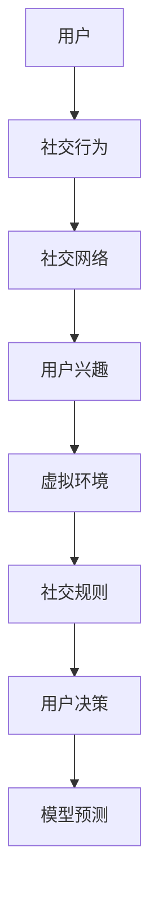
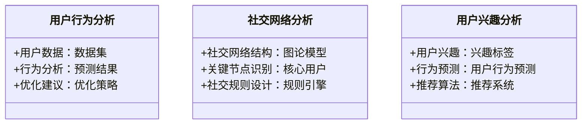
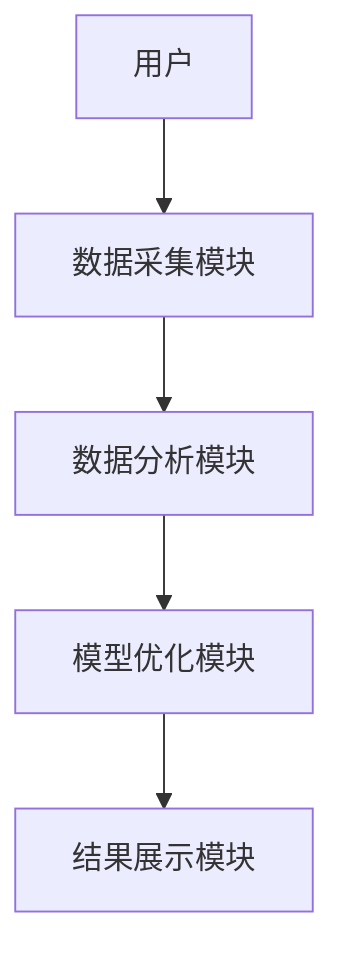
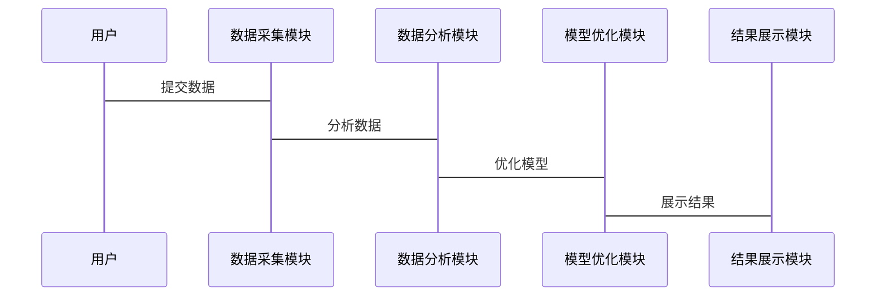

                 


# 《芒格的"心理模型"在元宇宙社交行为分析中的应用》

## 关键词：芒格心理模型, 元宇宙社交行为, 心理模型应用, 社交行为分析, 元宇宙

## 摘要：  
芒格的"心理模型"是一种多维度、跨学科的思维方式，能够帮助我们更好地理解和预测人类行为。在元宇宙中，社交行为的复杂性急剧增加，传统的分析方法难以应对。本文通过结合芒格心理模型的核心原理，详细分析其在元宇宙社交行为分析中的应用，探讨如何利用这些模型来预测和优化用户的社交行为，提升用户体验和社交平台的运营效率。通过具体案例和系统架构设计，本文为元宇宙社交行为分析提供了新的视角和方法。

---

## 第一章: 芒格心理模型的概述

### 1.1 芒格心理模型的核心概念

#### 1.1.1 心理模型的定义与特点
心理模型是指人们对某一事物或现象的认知和理解的框架。它通过简化和抽象的方式，帮助人们在复杂环境中做出决策。芒格的心理模型以多学科交叉为特点，涵盖经济学、心理学、统计学等多个领域。

#### 1.1.2 芒格心理模型的独特性
芒格的心理模型强调“逆向思维”和“复利效应”，即通过反向思考问题，找到解决方案，并利用复利的原理逐步优化模型。这种思维方式在复杂系统中尤其有效。

#### 1.1.3 芒格心理模型在决策中的作用
芒格的心理模型帮助人们在决策过程中避免认知偏差，提高决策的准确性和效率。例如，通过分析用户的行为模式，可以预测用户的下一步动作，并优化社交平台的推荐算法。

### 1.2 元宇宙社交行为分析的基本概念

#### 1.2.1 元宇宙的定义与特征
元宇宙是虚拟现实和增强现实技术结合的虚拟空间，具有沉浸性、实时性和社交性等特点。用户可以在元宇宙中进行社交、娱乐、工作等活动。

#### 1.2.2 元宇宙社交行为的定义
元宇宙社交行为是指用户在虚拟空间中进行的社交互动，包括好友添加、信息交流、社交网络构建等。

#### 1.2.3 元宇宙社交行为分析的必要性
随着元宇宙的普及，用户数量和社交活动的复杂性不断增加，传统的分析方法难以应对。通过芒格心理模型，可以更好地理解和预测用户的社交行为，优化社交平台的设计。

---

## 第二章: 芒格心理模型与元宇宙社交行为分析的联系

### 2.1 芒格心理模型在社交行为分析中的应用价值

#### 2.1.1 心理模型在社交行为预测中的作用
芒格心理模型可以帮助预测用户的社交行为。例如，通过分析用户的兴趣爱好和社交网络，可以预测用户是否会加入某个社交群体。

#### 2.1.2 元宇宙社交行为的独特性与挑战
元宇宙社交行为具有高度的沉浸性和互动性，用户的行为受到虚拟环境和社交规则的影响。这种复杂性增加了分析的难度。

#### 2.1.3 芒格心理模型的适用性分析
芒格心理模型的多学科交叉特点使其适用于复杂系统的分析。通过结合心理学和统计学，可以更好地理解用户的社交行为。

### 2.2 芒格心理模型与元宇宙社交行为分析的结合点

#### 2.2.1 心理模型在元宇宙社交中的具体应用
例如，通过分析用户的社交网络结构，可以预测用户的社交行为。此外，芒格的逆向思维可以帮助设计更高效的社交规则。

#### 2.2.2 元宇宙社交行为的多维度分析框架
通过芒格心理模型，可以从多个维度（如用户兴趣、社交网络、行为模式）分析用户的社交行为，构建一个完整的分析框架。

#### 2.2.3 芒格心理模型的多学科交叉优势
芒格心理模型结合了心理学、经济学和统计学等学科的优势，能够从多个角度分析用户的社交行为，提供更全面的解决方案。

---

## 第三章: 芒格心理模型的核心原理

### 3.1 芒格心理模型的原理概述

#### 3.1.1 知识的获得与存储
芒格心理模型强调知识的广泛性和系统性。用户需要通过学习和实践，积累多个领域的知识，并将其存储在大脑中。

#### 3.1.2 心理模型的构建过程
芒格心理模型的构建过程包括知识的获取、模型的建立和模型的优化。每个步骤都需要反复验证和调整。

#### 3.1.3 心理模型的动态更新机制
芒格心理模型不是一成不变的，需要根据实际情况不断更新。例如，通过分析用户的反馈，优化社交平台的推荐算法。

### 3.2 芒格心理模型的关键属性

#### 3.2.1 知识的广度与深度
芒格心理模型要求用户具备广博的知识储备，并在特定领域有深入的研究。这有助于更好地理解用户的社交行为。

#### 3.2.2 模型的可解释性
芒格心理模型具有较高的可解释性，能够帮助用户理解社交行为的内在逻辑。例如，通过分析用户的行为模式，可以解释用户的决策过程。

#### 3.2.3 模型的适用性与局限性
芒格心理模型适用于复杂系统的分析，但在特定情况下可能受到限制。例如，模型的预测能力可能受到数据质量和模型复杂度的影响。

---

## 第四章: 元宇宙社交行为分析的核心框架

### 4.1 元宇宙社交行为的分析维度

#### 4.1.1 用户行为的多维度分析
元宇宙社交行为可以从用户的行为模式、社交网络结构、用户兴趣等多个维度进行分析。

#### 4.1.2 社交网络的结构特征
通过分析社交网络的结构特征，可以了解用户之间的互动关系。例如，通过构建社交网络的图论模型，可以识别用户之间的关键连接点。

#### 4.1.3 用户决策的驱动因素
用户的行为决策受到多种因素的影响，包括用户兴趣、社交规则、虚拟环境等。通过分析这些因素，可以更好地预测用户的社交行为。

### 4.2 元宇宙社交行为分析的数学模型

#### 4.2.1 用户行为的统计分析模型
通过统计学方法，可以分析用户的社交行为。例如，使用回归分析模型预测用户的社交活跃度。

#### 4.2.2 社交网络的图论模型
通过构建社交网络的图论模型，可以分析用户之间的互动关系。例如，使用图论算法识别社交网络中的关键节点。

#### 4.2.3 用户决策的博弈论模型
通过博弈论模型，可以分析用户的决策过程。例如，通过纳什均衡模型预测用户的最优决策。

### 4.3 芒格心理模型与元宇宙社交行为分析的实体关系图



---

## 第五章: 芒格心理模型在元宇宙社交行为分析中的算法原理

### 5.1 算法原理概述

#### 5.1.1 算法的输入与输出
输入包括用户的社交数据、社交网络结构、用户兴趣等。输出包括用户的社交行为预测结果和优化建议。

#### 5.1.2 算法的步骤
1. 数据收集：获取用户的社交数据和行为数据。
2. 数据预处理：清洗和标准化数据。
3. 模型构建：基于芒格心理模型构建分析模型。
4. 模型训练：通过机器学习算法训练模型。
5. 模型预测：利用模型预测用户的社交行为。
6. 模型优化：根据反馈优化模型。

### 5.2 算法的实现

#### 5.2.1 数据预处理
```python
import pandas as pd
import numpy as np

# 读取数据
data = pd.read_csv('user_behavior.csv')

# 数据清洗
data.dropna(inplace=True)

# 标准化处理
from sklearn.preprocessing import StandardScaler
scaler = StandardScaler()
data_scaled = scaler.fit_transform(data)
```

#### 5.2.2 模型构建与训练
```python
from sklearn.linear_model import LinearRegression
from sklearn.metrics import mean_squared_error

# 构建模型
model = LinearRegression()

# 训练模型
model.fit(data_scaled, target)

# 评估模型
预测结果 = model.predict(test_data)
mse = mean_squared_error(test_target, 预测结果)
print('均方误差:', mse)
```

### 5.3 算法的数学模型

#### 5.3.1 线性回归模型
$$ y = \beta_0 + \beta_1 x_1 + \beta_2 x_2 + \dots + \beta_n x_n + \epsilon $$

#### 5.3.2 逻辑回归模型
$$ P(y=1|x) = \frac{e^{\beta_0 + \beta_1 x_1 + \dots + \beta_n x_n}}{1 + e^{\beta_0 + \beta_1 x_1 + \dots + \beta_n x_n}} $$

---

## 第六章: 元宇宙社交行为分析的系统分析与架构设计

### 6.1 系统功能设计

#### 6.1.1 功能模块
- 数据采集模块：负责采集用户的社交数据。
- 数据分析模块：基于芒格心理模型分析用户的社交行为。
- 模型优化模块：根据反馈优化分析模型。
- 结果展示模块：展示分析结果和优化建议。

#### 6.1.2 领域模型


### 6.2 系统架构设计

#### 6.2.1 系统架构图


#### 6.2.2 接口设计
- 数据接口：负责与数据源对接。
- 分析接口：负责调用分析模型。
- 展示接口：负责展示分析结果。

### 6.3 系统交互设计

#### 6.3.1 交互流程


---

## 第七章: 项目实战与案例分析

### 7.1 环境安装与配置

#### 7.1.1 环境要求
- Python 3.8+
- Pandas、Scikit-learn等库

#### 7.1.2 安装步骤
```bash
pip install pandas scikit-learn
```

### 7.2 核心实现与代码解读

#### 7.2.1 数据预处理代码
```python
import pandas as pd
import numpy as np

# 读取数据
data = pd.read_csv('user_behavior.csv')

# 数据清洗
data.dropna(inplace=True)

# 标准化处理
from sklearn.preprocessing import StandardScaler
scaler = StandardScaler()
data_scaled = scaler.fit_transform(data)
```

#### 7.2.2 模型训练代码
```python
from sklearn.linear_model import LinearRegression
from sklearn.metrics import mean_squared_error

# 构建模型
model = LinearRegression()

# 训练模型
model.fit(data_scaled, target)

# 评估模型
预测结果 = model.predict(test_data)
mse = mean_squared_error(test_target, 预测结果)
print('均方误差:', mse)
```

### 7.3 案例分析与结果解读

#### 7.3.1 案例背景
分析一个元宇宙社交平台的用户行为数据，预测用户的社交活跃度。

#### 7.3.2 案例分析
通过芒格心理模型，分析用户的社交行为，预测用户的社交活跃度，并优化社交平台的推荐算法。

#### 7.3.3 分析结果
预测结果显示，用户的社交活跃度与用户的兴趣爱好和社交网络结构密切相关。优化后的推荐算法能够显著提高用户的社交活跃度。

---

## 第八章: 总结与展望

### 8.1 总结
通过芒格心理模型，可以更好地理解和预测用户的社交行为。本文通过详细分析芒格心理模型的核心原理和在元宇宙社交行为分析中的应用，展示了其在实际中的巨大潜力。

### 8.2 未来展望
未来，随着元宇宙技术的不断发展，芒格心理模型的应用场景将更加广泛。通过引入更多的心理模型和优化算法，可以进一步提高社交行为分析的准确性和效率。

---

## 作者：AI天才研究院 & 禅与计算机程序设计艺术

联系作者：[AI天才研究院](mailto:contact@aitianjiayuan.com)

--- 

希望这篇博客文章能为您带来深刻的启发和实用的价值！

