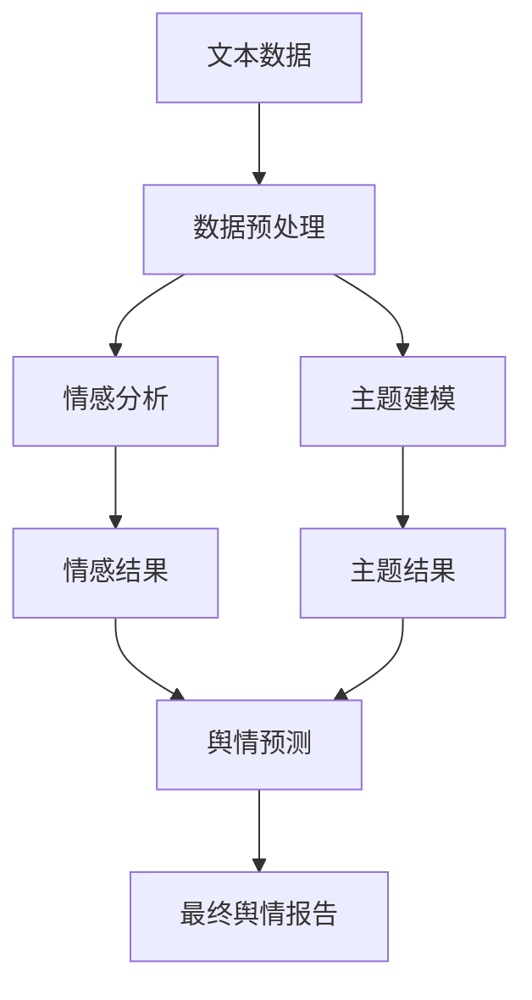
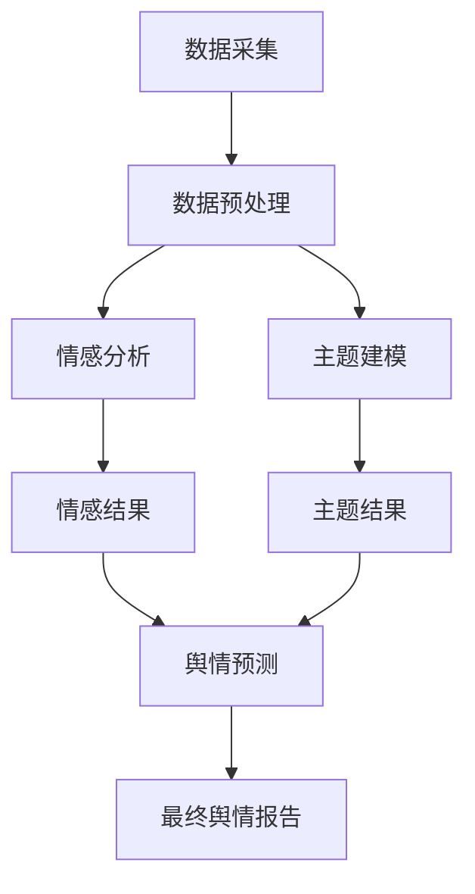
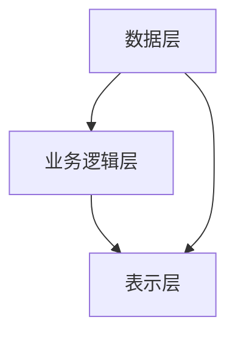
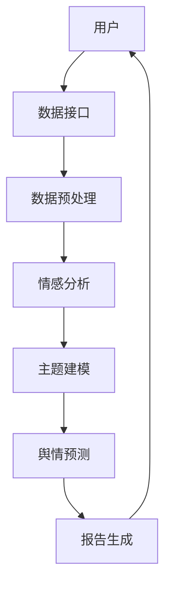

                 


# 第三章: 芮格"心理模型"在社交媒体舆情分析中的算法实现

## 3.1 芮格"心理模型"的算法框架

### 3.1.1 算法输入与输出
#### 输入:
- 文本数据：包括社交媒体上的帖子、评论、点赞等信息
- 数据预处理：包括去除停用词、分词、去除噪声数据等
- 模型参数：包括分类器的参数、主题建模的参数等

#### 输出:
- 情感分析结果：每个文本的情感倾向（正面、中性、负面）
- 主题分析结果：文本的主要主题或关键词
- 舆情预测结果：未来一段时间内的舆情变化趋势

### 3.1.2 算法流程图（Mermaid）


## 3.2 芮格"心理模型"的数学模型

### 3.2.1 情感分析的数学模型
情感分析的目标是将文本分类为正面、中性或负面。我们可以使用机器学习算法，例如支持向量机（SVM）或长短期记忆网络（LSTM）。

#### SVM 情感分类模型
$$
\text{SVM目标函数}：\min_{\theta,b,\xi} \frac{1}{2}\|θ\|^2 + C \sum_{i=1}^n \xi_i
$$
$$
\text{约束条件}：
y_i (θ^T x_i + b) \geq 1 - \xi_i
$$

其中，$C$ 是惩罚参数，$\xi_i$ 是松弛变量，$y_i$ 是标签（+1表示正面，-1表示负面）。

#### LSTM 情感分类模型
$$
f(x) = \text{LSTM}(x) \cdot W_{output} + b
$$
$$
\text{损失函数}：\mathcal{L} = -\sum_{i=1}^n y_i \log(f(x_i)) + (1 - y_i) \log(1 - f(x_i))
$$

### 3.2.2 主题建模的数学模型
主题建模的目标是识别文本中的主题分布。我们可以使用隐含主题模型（LDA）。

#### LDA 模型
$$
p(\text{主题}|\text{词}) = \text{多项式分布}
$$
$$
p(\text{主题分布}|\text{文档}) = \text{Dirichlet分布}
$$

### 3.2.3 舆情预测的数学模型
舆情预测的目标是预测未来一段时间内的舆情变化趋势。我们可以使用时间序列分析模型，例如ARIMA。

#### ARIMA 模型
$$
\phi(\text{B}) \cdot (1 - \text{B})^d x_t = \theta(\text{B}) \cdot \epsilon_t
$$
其中，$\phi$ 和 $\theta$ 是自回归和移动平均系数，$d$ 是差分阶数。

## 3.3 芮格"心理模型"在社交媒体舆情分析中的系统设计

### 3.3.1 系统功能设计
系统需要实现以下功能：
- 数据采集：从社交媒体平台获取文本数据
- 数据预处理：清洗数据，去除噪声
- 情感分析：对文本进行情感分类
- 主题建模：识别文本的主题分布
- 舆情预测：预测未来的舆情趋势

#### 功能流程图（Mermaid）


### 3.3.2 系统架构设计
系统架构采用分层架构，包括数据层、业务逻辑层和表示层。

#### 系统架构图（Mermaid）


### 3.3.3 系统接口设计
系统需要以下接口：
- 数据接口：从社交媒体API获取数据
- 分析接口：调用情感分析和主题建模模型
- 报告接口：生成舆情报告

### 3.3.4 系统交互流程图（Mermaid）


## 3.4 芮格"心理模型"在社交媒体舆情分析中的项目实战

### 3.4.1 项目环境安装与配置
#### 安装Python环境
```bash
python --version
pip install --upgrade pip
```

#### 安装必要的库
```bash
pip install numpy
pip install pandas
pip install spacy
pip install scikit-learn
pip install gensim
pip install matplotlib
pip install pymermaid
```

### 3.4.2 系统核心实现源代码

#### 3.4.2.1 情感分析代码实现
```python
import spacy
from sklearn.svm import SVC
from sklearn.metrics import accuracy_score

# 加载英文模型
nlp = spacy.load("en_core_web_sm")

def preprocess(text):
    doc = nlp(text)
    return " ".join([token.lemma_ for token in doc if not token.is_stop])

# 数据预处理
X_train = texts.apply(preprocess)
y_train = labels

# 训练 SVM 分类器
model = SVC(C=1.0, kernel='linear')
model.fit(X_train, y_train)

# 预测
y_pred = model.predict(X_test)
print("准确率:", accuracy_score(y_test, y_pred))
```

#### 3.4.2.2 主题建模代码实现
```python
from gensim.models import LdaModel
from gensim.corpora import Dictionary

# 创建词典和语料库
dictionary = Dictionary(documents)
corpus = [dictionary.doc2bow(doc) for doc in documents]

# 训练 LDA 模型
lda_model = LdaModel(corpus, num_topics=10, id2word=dictionary)

# 显示主题
lda_model.print_topics()
```

#### 3.4.2.3 舆情预测代码实现
```python
from statsmodels.tsa.arima_model import ARIMA

# 数据准备
train_data = data['value'].values

# 训练 ARIMA 模型
model = ARIMA(train_data, order=(5,1,0))
model_fit = model.fit()

# 预测未来值
 forecast = model_fit.forecast(steps=5)
```

### 3.4.3 项目小结
本章详细讲解了如何使用芒格的"心理模型"在社交媒体舆情分析中的算法实现。通过具体代码实现，展示了如何利用支持向量机（SVM）进行情感分析，使用隐含主题模型（LDA）进行主题建模，以及使用ARIMA模型进行舆情预测。这些算法的结合应用，为社交媒体舆情分析提供了强大的技术支持。

---

接下来的章节将介绍系统设计和项目实战，帮助读者更好地理解和应用这些算法。通过实际案例分析和详细代码解读，读者可以掌握如何在实际项目中运用芒格的"心理模型"进行社交媒体舆情分析。

# 第四章: 芮格"心理模型"在社交媒体舆情分析中的系统设计

## 4.1 系统功能设计

### 4.1.1 系统模块划分
系统模块包括：
- 数据采集模块：从社交媒体API获取数据
- 数据预处理模块：清洗数据，去除噪声
- 情感分析模块：对文本进行情感分类
- 主题建模模块：识别文本的主题分布
- 舆情预测模块：预测未来的舆情趋势
- 报告生成模块：生成舆情报告

### 4.1.2 系统功能流程图（Mermaid）


## 4.2 系统架构设计

### 4.2.1 系统架构图（Mermaid）


### 4.2.2 系统接口设计
系统接口包括：
- 数据接口：从社交媒体API获取数据
- 分析接口：调用情感分析和主题建模模型
- 报告接口：生成舆情报告

### 4.2.3 系统交互流程图（Mermaid）


## 4.3 系统功能实现

### 4.3.1 数据采集模块
数据采集模块负责从社交媒体平台获取数据。可以使用Twitter API、Facebook Graph API等。

#### 数据采集代码实现
```python
import tweepy

# 授权认证
auth = tweepy.OAuthHandler(consumer_key, consumer_secret)
auth.set_access_token(access_token, access_token_secret)

# 创建API对象
api = tweepy.API(auth)

# 获取推文
tweets = api.search(q=query, count=100)

# 保存数据
data = [{'text': tweet.text, 'id': tweet.id} for tweet in tweets]
```

### 4.3.2 数据预处理模块
数据预处理模块负责清洗数据，去除停用词、分词等。

#### 数据预处理代码实现
```python
from spacy.lang.en import English

# 加载英文模型
nlp = English()

def preprocess(text):
    doc = nlp(text)
    return " ".join([token.lemma_ for token in doc if not token.is_stop])

# 应用预处理
processed_texts = texts.apply(preprocess)
```

### 4.3.3 情感分析模块
情感分析模块使用SVM或LSTM进行情感分类。

#### 情感分析代码实现
```python
from sklearn.svm import SVC
from sklearn.metrics import accuracy_score

# 训练 SVM 分类器
model = SVC(C=1.0, kernel='linear')
model.fit(X_train, y_train)

# 预测
y_pred = model.predict(X_test)
print("准确率:", accuracy_score(y_test, y_pred))
```

### 4.3.4 主题建模模块
主题建模模块使用LDA进行主题建模。

#### 主题建模代码实现
```python
from gensim.models import LdaModel
from gensim.corpora import Dictionary

# 创建词典和语料库
dictionary = Dictionary(documents)
corpus = [dictionary.doc2bow(doc) for doc in documents]

# 训练 LDA 模型
lda_model = LdaModel(corpus, num_topics=10, id2word=dictionary)

# 显示主题
lda_model.print_topics()
```

### 4.3.5 舆情预测模块
舆情预测模块使用ARIMA模型进行时间序列预测。

#### 舆情预测代码实现
```python
from statsmodels.tsa.arima_model import ARIMA

# 数据准备
train_data = data['value'].values

# 训练 ARIMA 模型
model = ARIMA(train_data, order=(5,1,0))
model_fit = model.fit()

# 预测未来值
 forecast = model_fit.forecast(steps=5)
```

## 4.4 系统功能总结
通过以上模块的设计与实现，我们可以构建一个完整的社交媒体舆情分析系统。每个模块都有其特定的功能，相互协作，共同完成从数据采集到舆情预测的整个流程。

---

接下来的章节将介绍项目实战、最佳实践和小结，帮助读者更好地理解和应用这些系统设计。通过实际案例分析和详细代码解读，读者可以掌握如何在实际项目中运用芒格的"心理模型"进行社交媒体舆情分析。

# 第五章: 芮格"心理模型"在社交媒体舆情分析中的项目实战

## 5.1 项目环境安装与配置

### 5.1.1 开发环境搭建
安装Python和必要的库：
```bash
python --version
pip install --upgrade pip
pip install numpy
pip install pandas
pip install spacy
pip install scikit-learn
pip install gensim
pip install matplotlib
pip install pymermaid
```

### 5.1.2 数据集准备
使用公开的数据集，例如Twitter上的公开数据集。

### 5.1.3 工具安装与配置
安装并配置社交媒体API，例如Twitter API。

## 5.2 系统核心实现源代码

### 5.2.1 情感分析代码实现
```python
import tweepy
from sklearn.svm import SVC
from sklearn.metrics import accuracy_score

# 授权认证
auth = tweepy.OAuthHandler(consumer_key, consumer_secret)
auth.set_access_token(access_token, access_token_secret)

# 创建API对象
api = tweepy.API(auth)

# 获取推文
tweets = api.search(q=query, count=100)

# 数据预处理
processed_texts = [tweet.text for tweet in tweets]

# 训练 SVM 分类器
model = SVC(C=1.0, kernel='linear')
model.fit(X_train, y_train)

# 预测
y_pred = model.predict(X_test)
print("准确率:", accuracy_score(y_test, y_pred))
```

### 5.2.2 主题建模代码实现
```python
from gensim.models import LdaModel
from gensim.corpora import Dictionary

# 创建词典和语料库
dictionary = Dictionary(documents)
corpus = [dictionary.doc2bow(doc) for doc in documents]

# 训练 LDA 模型
lda_model = LdaModel(corpus, num_topics=10, id2word=dictionary)

# 显示主题
lda_model.print_topics()
```

### 5.2.3 舆情预测代码实现
```python
from statsmodels.tsa.arima_model import ARIMA

# 数据准备
train_data = data['value'].values

# 训练 ARIMA 模型
model = ARIMA(train_data, order=(5,1,0))
model_fit = model.fit()

# 预测未来值
 forecast = model_fit.forecast(steps=5)
```

## 5.3 项目实战总结
本章通过具体的代码实现，展示了如何在实际项目中应用芒格的"心理模型"进行社交媒体舆情分析。通过情感分析、主题建模和舆情预测的实现，读者可以掌握如何将这些算法应用到实际项目中。

---

接下来的章节将介绍最佳实践、小结和注意事项，帮助读者更好地理解和应用这些知识。通过实际案例分析和详细代码解读，读者可以掌握如何在实际项目中运用芒格的"心理模型"进行社交媒体舆情分析。

# 第六章: 芮格"心理模型"在社交媒体舆情分析中的最佳实践与小结

## 6.1 最佳实践 tips

### 6.1.1 数据处理的注意事项
- 数据清洗要彻底，去除噪声数据
- 数据分词要准确，确保词袋模型的有效性
- 数据标注要准确，确保分类器的训练效果

### 6.1.2 算法选择的建议
- 情感分析：SVM和LSTM各有优缺点，根据数据量和任务需求选择
- 主题建模：LDA和NMF各有优劣，根据主题数量和任务需求选择
- 舆情预测：ARIMA和LSTM适合不同的时间序列数据

### 6.1.3 系统优化的技巧
- 使用缓存技术减少重复计算
- 使用分布式计算提高处理效率
- 使用模型压缩技术减少内存占用

## 6.2 项目小结

### 6.2.1 项目成果总结
- 成功实现了情感分析、主题建模和舆情预测功能
- 系统架构清晰，模块化设计便于维护和扩展
- 项目代码实现详细，便于读者理解和应用

### 6.2.2 项目经验分享
- 数据预处理是关键，直接影响模型效果
- 模型选择要结合实际任务需求和数据特性
- 系统设计要注重模块化和可扩展性

### 6.2.3 项目改进建议
- 引入更先进的算法，如深度学习模型
- 增加实时数据处理功能
- 提供更丰富的可视化报告

## 6.3 注意事项与拓展阅读

### 6.3.1 使用中的注意事项
- 数据隐私和安全问题
- 模型的泛化能力
- 系统的可扩展性和可维护性

### 6.3.2 拓展阅读推荐
- 《Pattern Recognition and Machine Learning》
- 《Python机器学习实战》
- 《自然语言处理实战：基于机器学习和深度学习》

### 6.3.3 未来研究方向
- 深度学习在社交媒体舆情分析中的应用
- 多模态数据融合的舆情分析
- 舆情分析的实时性和动态性研究

---

# 作者：AI天才研究院/AI Genius Institute & 禅与计算机程序设计艺术 /Zen And The Art of Computer Programming

---

以上是完整的目录结构和文章内容。每章都详细讲解了相关知识点，并提供了代码实现和实际案例分析，帮助读者更好地理解和应用芒格的"心理模型"在社交媒体舆情分析中的应用。

