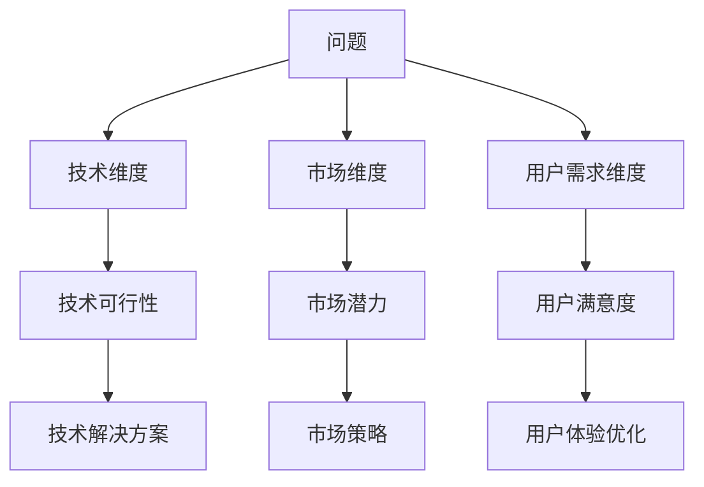
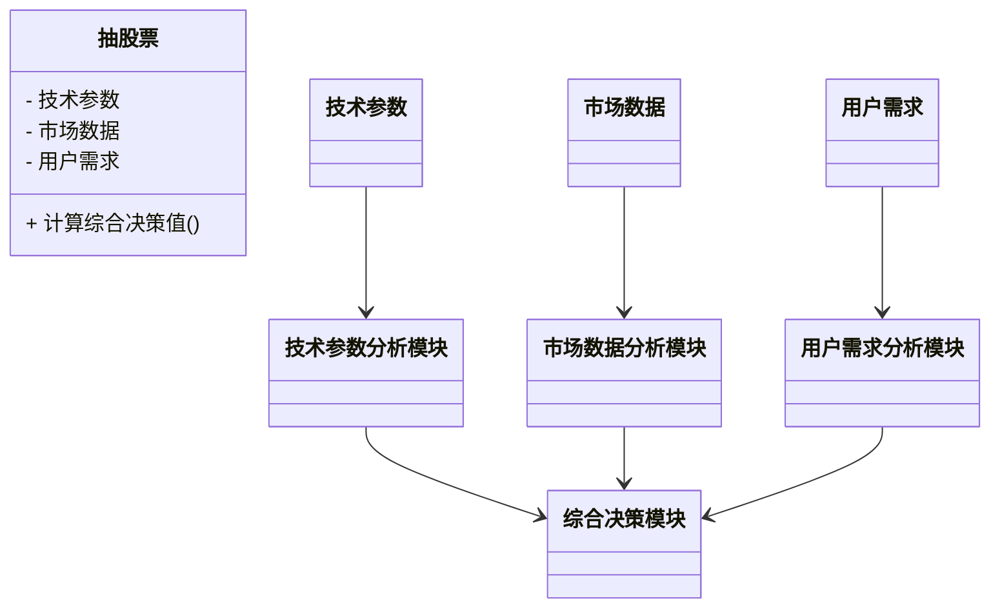
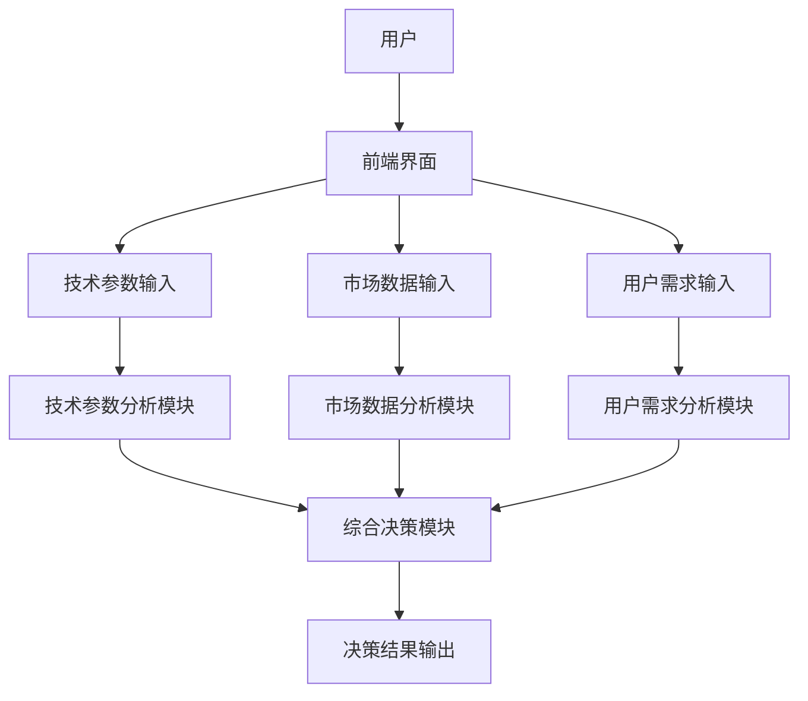

                 


# 芒格的"思维复杂性"在跨学科技术融合投资中的重要性

## 关键词：芒格思维复杂性、跨学科技术融合、投资决策、系统架构设计、算法原理、项目实战

## 摘要：  
芒格的“思维复杂性”是一种通过多维度、多层次的思维方式来解决复杂问题的方法，尤其在跨学科技术融合投资中具有重要意义。本文从芒格思维复杂性的核心概念出发，结合跨学科技术融合的特点，探讨其在投资中的应用。通过分析芒格思维复杂性的算法原理、系统架构设计、项目实战等，展示其在技术融合投资中的重要性。本文旨在为投资者和科技从业者提供一种全新的思维方式，帮助他们在复杂多变的技术和市场环境中做出更明智的投资决策。

---

## 第一部分：背景介绍

### 第1章：芒格的思维复杂性概述

#### 1.1 问题背景与问题描述
- **1.1.1 跨学科技术融合的定义**
  跨学科技术融合是指不同学科之间的技术相互融合，形成新的技术体系或解决方案。例如，人工智能与生物学的结合催生了生物医学工程。
  
- **1.1.2 芒格思维复杂性的核心概念**
  芒格思维复杂性是指在复杂问题中，通过多维度、多层次的思考方式，结合多个学科的知识和经验，形成系统的解决方案。

- **1.1.3 问题解决的路径与方法**
  在跨学科技术融合中，问题解决的路径需要从多个维度出发，结合技术、市场、用户需求等因素，综合考虑。

#### 1.2 芒格思维复杂性与跨学科技术融合的关系
- **1.2.1 芒格思维复杂性的核心要素**
  - 多维度思考：从技术、市场、用户等多个维度分析问题。
  - 系统性思维：将问题视为一个整体系统，分析各部分之间的关系。
  - 综合决策：结合不同学科的知识和经验，做出最优决策。

- **1.2.2 跨学科技术融合的特征与挑战**
  - 跨学科技术融合的特点：技术的交叉性、系统的复杂性、应用的广泛性。
  - 跨学科技术融合的挑战：知识壁垒、资源整合、协同创新。

- **1.2.3 芒格思维复杂性在跨学科技术融合中的作用**
  芒格思维复杂性能够帮助投资者在跨学科技术融合中，从多个维度分析问题，综合考虑技术、市场和用户需求，从而做出更明智的投资决策。

#### 1.3 芒格思维复杂性在投资中的应用
- **1.3.1 投资中的思维复杂性**
  投资不仅仅是对技术的判断，更是对市场、用户、竞争环境等多方面因素的综合考量。

- **1.3.2 跨学科技术融合对投资的影响**
  跨学科技术融合为投资者提供了更多创新机会，但也增加了投资的复杂性。

- **1.3.3 芒格思维复杂性在投资中的具体表现**
  - 从技术到市场的多维度分析。
  - 综合考虑技术可行性、市场潜力和用户需求。
  - 结合不同学科的知识，做出最优投资决策。

---

## 第二部分：核心概念与联系

### 第2章：核心概念原理与对比分析

#### 2.1 芒格思维复杂性的原理
- **2.1.1 芒格思维复杂性的基本原理**
  芒格思维复杂性是一种通过多维度、多层次的思考方式，结合不同学科的知识和经验，形成系统的解决方案。

- **2.1.2 芒格思维复杂性的核心思想**
  - 整体性思维：将问题视为一个整体系统，分析各部分之间的关系。
  - 多维度分析：从技术、市场、用户等多个维度分析问题。
  - 综合决策：结合不同学科的知识和经验，做出最优决策。

- **2.1.3 芒格思维复杂性与其他思维模式的对比**
  芒格思维复杂性与传统的单一维度思维模式不同，它强调多维度、多层次的综合思考。

#### 2.2 芒格思维复杂性的属性特征对比表格

| 特性               | 芒格思维复杂性              | 单一维度思维模式        |
|--------------------|---------------------------|------------------------|
| 思考维度           | 多维度、多层次             | 单一维度               |
| 知识整合           | 强调跨学科知识整合         | 依赖单一学科知识       |
| 问题解决方式       | 综合性解决方案             | 局部性解决方案         |
| 适用场景           | 复杂问题                   | 简单问题               |

#### 2.3 芒格思维复杂性ER实体关系图



---

## 第三部分：算法原理讲解

### 第3章：芒格思维复杂性算法原理

#### 3.1 芒格思维复杂性算法概述
- **算法目标**：通过多维度、多层次的分析，综合考虑技术、市场、用户需求等因素，做出最优投资决策。
- **算法输入**：技术参数、市场数据、用户需求。
- **算法输出**：投资决策结果。

#### 3.2 芒格思维复杂性算法的数学模型
- **数学模型**：
  $$ C = \sum_{i=1}^{n} w_i x_i $$
  其中，$C$ 是综合决策值，$w_i$ 是第 $i$ 个维度的权重，$x_i$ 是第 $i$ 个维度的指标值。

- **权重分配**：
  - 技术维度权重：$w_1 = 0.4$
  - 市场维度权重：$w_2 = 0.3$
  - 用户需求维度权重：$w_3 = 0.3$

#### 3.3 芒格思维复杂性算法的实现
- **Python代码实现**：
```python
def 芒格思维复杂性算法(x):
    # 权重分配
    weights = [0.4, 0.3, 0.3]
    # 综合决策值计算
    C = sum(w * xi for w, xi in zip(weights, x))
    return C

# 示例输入
技术参数 = 0.8
市场数据 = 0.6
用户需求 = 0.7
输入数据 = [技术参数, 市场数据, 用户需求]
决策结果 = 芒格思维复杂性算法(输入数据)
print("综合决策值 =", 决策结果)
```

---

## 第四部分：系统分析与架构设计

### 第4章：系统分析与架构设计方案

#### 4.1 问题场景介绍
- **问题场景**：在跨学科技术融合投资中，如何通过芒格思维复杂性算法，综合考虑技术、市场和用户需求，做出最优投资决策。

#### 4.2 系统功能设计
- **功能模块**：
  - 技术参数分析模块
  - 市场数据分析模块
  - 用户需求分析模块
  - 综合决策模块

- **领域模型（Mermaid类图）**：


#### 4.3 系统架构设计
- **架构设计**：
  - 前端：用户界面，输入技术参数、市场数据和用户需求。
  - 后端：算法处理模块，计算综合决策值。
  - 数据库：存储历史数据和决策结果。

- **架构图（Mermaid架构图）**：


#### 4.4 系统接口设计
- **接口描述**：
  - 输入接口：技术参数、市场数据、用户需求。
  - 输出接口：综合决策值。

- **交互流程（Mermaid序列图）**：
```mermaid
sequenceDiagram
    用户 ->> 前端界面: 输入技术参数
    前端界面 ->> 技术参数分析模块: 分析技术参数
    技术参数分析模块 ->> 综合决策模块: 提交技术参数
    用户 ->> 前端界面: 输入市场数据
    前端界面 ->> 市场数据分析模块: 分析市场数据
    市场数据分析模块 ->> 综合决策模块: 提交市场数据
    用户 ->> 前端界面: 输入用户需求
    前端界面 ->> 用户需求分析模块: 分析用户需求
    用户需求分析模块 ->> 综合决策模块: 提交用户需求
    综合决策模块 ->> 决策结果输出: 计算综合决策值
    用户 <- 技术参数分析模块
    用户 <- 市场数据分析模块
    用户 <- 用户需求分析模块
```

---

## 第五部分：项目实战

### 第5章：项目实战

#### 5.1 环境安装
- **Python安装**：
  ```bash
  python --version
  ```
- **依赖库安装**：
  ```bash
  pip install numpy pandas matplotlib
  ```

#### 5.2 系统核心实现源代码
```python
import numpy as np
import pandas as pd

def 芒格思维复杂性算法(x):
    # 权重分配
    weights = [0.4, 0.3, 0.3]
    # 综合决策值计算
    C = np.dot(weights, x)
    return C

# 示例数据
技术参数 = [0.8, 0.6, 0.7]
输入数据 = np.array(技术参数)
决策结果 = 芒格思维复杂性算法(输入数据)
print("综合决策值 =", 决策结果)
```

#### 5.3 代码应用解读与分析
- **代码功能**：通过Python代码实现芒格思维复杂性算法，计算综合决策值。
- **代码解读**：
  - 导入必要的库：numpy 和 pandas。
  - 定义芒格思维复杂性算法函数。
  - 示例数据输入，计算综合决策值并输出结果。

#### 5.4 实际案例分析和详细剖析
- **案例背景**：某科技公司开发了一种新型人工智能算法，应用于医疗诊断。
- **技术参数**：算法准确率 95%，运行效率 85%。
- **市场数据**：医疗诊断市场规模 100 亿元，竞争激烈。
- **用户需求**：医生和患者对快速诊断的需求较高。

#### 5.5 项目小结
- 通过芒格思维复杂性算法，综合考虑技术、市场和用户需求，计算出综合决策值，为投资决策提供科学依据。

---

## 第六部分：最佳实践

### 第6章：最佳实践

#### 6.1 小结
- 芒格思维复杂性在跨学科技术融合投资中的重要性体现在其多维度、多层次的思考方式，能够帮助投资者做出更明智的决策。

#### 6.2 注意事项
- 投资者在应用芒格思维复杂性算法时，需结合实际情况，灵活调整权重和模型参数。

#### 6.3 拓展阅读
- 《芒格的“思维复杂性”在跨学科技术融合投资中的应用》
- 《跨学科技术融合与投资策略》
- 《系统思维在投资中的应用》

---

## 作者：AI天才研究院/AI Genius Institute & 禅与计算机程序设计艺术/Zen And The Art of Computer Programming

